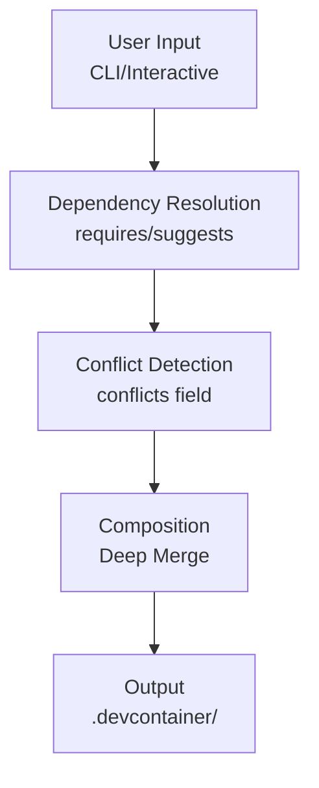

# Container Superposition Documentation

Complete documentation for the container-superposition devcontainer scaffolding system.

## Spec-First Development

Feature work is governed by specs committed under `docs/specs/`. Implementation
must not begin until the relevant spec is committed and reviewed.

## 📚 Documentation Index

### Getting Started

- **[Publishing Guide](publishing.md)** - How to publish to npm and make the tool publicly available
- **[Quick Reference](quick-reference.md)** - Quick lookup for templates, overlays, ports, and commands
- **[Examples](examples.md)** - Common usage patterns and real-world scenarios

### Architecture & Design

- **[Architecture](architecture.md)** - Design principles, composition algorithm, and deep merge logic
- **[Presets Architecture](presets-architecture.md)** - Meta-overlay design and preset system architecture
- **[Dependencies](dependencies.md)** - Service dependencies, startup order, and runServices configuration
- **[UX Design](ux.md)** - Visual design, CLI enhancements, and accessibility features

### User Guides

- **[Adopt Command](adopt.md)** - Migrate an existing `.devcontainer/` to the overlay-based workflow
- **[Hash Command](hash.md)** - Deterministic environment fingerprint for drift detection and reproducibility
- **[Presets Guide](presets.md)** - Using stack presets for common development scenarios
- **[Messaging Comparison](messaging-comparison.md)** - Choosing between RabbitMQ, Redpanda, and NATS
- **[Messaging Quick Start](messaging-quick-start.md)** - Getting started with messaging overlays
- **[Observability Workflow](observability-workflow.md)** - Setting up monitoring and tracing
- **[Workflows and Regeneration](workflows.md)** - Regeneration, backups, and manifest-based workflows
- **[Filesystem Contract](filesystem-contract.md)** - What the tool writes and what to edit
- **[Security Considerations](security.md)** - Development-only risks and best practices

### Development

- **[Creating Overlays](creating-overlays.md)** - Complete guide to creating new overlays
- **[Contributing](../CONTRIBUTING.md)** - Contribution guidelines and development workflow
- **[AGENTS.md](../AGENTS.md)** - Comprehensive guide for AI coding agents

## 🎯 Quick Start

### For Users

```bash
# Interactive mode (recommended)
npx container-superposition init

# Non-interactive mode
npx container-superposition init --stack compose --language nodejs --database postgres
```

### For Contributors

```bash
# Clone and setup
git clone https://github.com/veggerby/container-superposition.git
cd container-superposition
npm install

# Run in development mode
npm run init

# Build and test
npm run build
npm test
```

## 📖 Core Concepts

### Base Templates

Minimal starting points for devcontainer configurations:

- **plain** - Simple single-image devcontainer
- **compose** - Docker Compose-based for multi-service setups

Located in `templates/`

### Overlays

Composable capability modules organized by category:

**Languages & Frameworks:**

- dotnet, nodejs, python, mkdocs

**Databases:**

- postgres, redis

**Observability:**

- otel-collector, jaeger, prometheus, grafana, loki

**Cloud Tools:**

- aws-cli, azure-cli, kubectl-helm

**Dev Tools:**

- docker-in-docker, docker-sock, playwright, codex, git-helpers, pre-commit, commitlint, just, direnv, modern-cli-tools, ngrok

Located in `overlays/`

### Composition

The tool uses a deep merge strategy to combine:

1. Base template
2. Selected overlays (in category order)
3. User preferences (port offsets, custom paths)

Output: Standard `.devcontainer/` folder with editable JSON/YAML files

## 🔧 Architecture Overview



## 📁 Output Structure

After running the tool:

```txt
.devcontainer/
├── devcontainer.json              # Main configuration
├── docker-compose.yml             # Base compose file (if using compose)
├── .env.example                   # Environment variables
├── superposition.json             # Generation metadata
├── scripts/                       # Setup scripts
│   ├── setup-*.sh                 # Overlay-specific setup
│   └── ...
├── verify-*.sh                    # Service verification scripts
└── [overlay-specific files]       # Config files from overlays
```

## 🎨 Key Features

### Dependency Resolution

Overlays can declare relationships:

```yaml
- id: grafana
  requires: [prometheus] # Auto-added when grafana selected
  suggests: [loki, jaeger] # Recommended but optional
  conflicts: [] # Cannot be used together
```

### Conflict Detection

Prevents incompatible combinations:

```yaml
- id: docker-in-docker
  conflicts: [docker-sock] # Only one Docker access method allowed
```

### Port Management

Automatic port configuration with optional offset:

```bash
# Default ports
npm run init

# Add 100 to all ports (Grafana: 3000 → 3100)
npm run init -- --port-offset 100
```

### Environment Variables

Merged from all selected overlays into `.env.example`:

```bash
# PostgreSQL
POSTGRES_VERSION=16
POSTGRES_DB=devdb
POSTGRES_USER=postgres
POSTGRES_PASSWORD=postgres
POSTGRES_PORT=5432

# Redis
REDIS_VERSION=7
REDIS_PORT=6379
# REDIS_PASSWORD=your-secure-password
```

## 🧪 Testing

```bash
# Unit tests
npm test

# Watch mode
npm test:watch

# Smoke tests (actual devcontainer generation)
npm run test:smoke
```

## 📦 Package Structure

When published to npm, includes:

- ✅ Compiled JavaScript (`dist/`)
- ✅ All templates (`templates/`)
- ✅ All overlays (`overlays/`)
- ✅ All features (`features/`)
- ✅ Configuration metadata (`overlays/index.yml`)
- ✅ Type definitions and schema (`tool/schema/`)
- ✅ Documentation

**Package size**: Varies by release (use `npm pack --dry-run`)

## 🤝 Contributing

See [CONTRIBUTING.md](../CONTRIBUTING.md) for:

- Development setup
- Code style guidelines
- Pull request process
- Testing requirements

## 📄 License

MIT - See [LICENSE](../LICENSE)

## 🔗 Links

- **Repository**: <https://github.com/veggerby/container-superposition>
- **Issues**: <https://github.com/veggerby/container-superposition/issues>
- **npm Package**: <https://www.npmjs.com/package/container-superposition>

## 🆘 Support

- **GitHub Issues**: Bug reports and feature requests
- **Discussions**: Questions and community support
- **Pull Requests**: Code contributions welcome

---

**Philosophy**: Build a thin picker that outputs normal configurations, not a platform.

- Generates once, users edit forever
- No update or sync mechanisms
- No state tracking
- No proprietary formats

### Stateless

- Each invocation is independent
- Output is deterministic
- No configuration files

### Optional

- Templates work without the tool
- Manual copying is always an option
- Tool is convenience wrapper

## Technology

- **Node.js/TypeScript** - Cross-platform, type-safe
- **chalk** - Terminal colors
- **boxen** - Terminal boxes
- **ora** - Progress spinners
- **commander** - CLI parsing

## Extension

### Add an Overlay

1. Create `overlays/<name>/`
2. Add `devcontainer.patch.json`
3. Add `overlay.yml` manifest ([schema](../tool/schema/overlay-manifest.schema.json), [detailed guide](../.github/instructions/overlay-index.instructions.md))
4. Optional: Add `docker-compose.yml`
5. Optional: Add `README.md` documentation
6. Update questionnaire

See [Creating Overlays Guide](creating-overlays.md) for complete instructions.

### Add a Template

1. Create `templates/<name>/.devcontainer/`
2. Add complete devcontainer.json
3. Add scripts and files
4. Update types and questionnaire

## Maintenance

### Smoke Tests

```bash
npm test
```

### Build

```bash
npm run build
```

### Development

```bash
npm run init
```

Uses `tsx` for direct TypeScript execution without build step.
