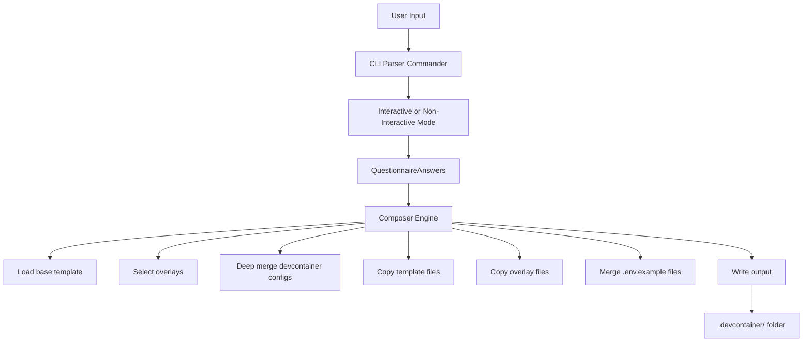

# Architecture

The init tool is a **thin "purpose picker"** that composes devcontainer configurations from base templates and overlays.

## Design Principles

### Generate Once, Edit Forever

The tool creates standard `.devcontainer/` folders that users own completely. There is no "sync" or "update" mechanism—once generated, the configuration is independent of the tool.

### Stateless Composition

No configuration tracking, version control, or state management. Each invocation is independent and produces deterministic output based on the provided options.

### Plain JSON Output

All output is standard `devcontainer.json` format compatible with VS Code Dev Containers and GitHub Codespaces. No proprietary schemas or custom DSLs.

### Optional Tooling

Templates in `templates/` work standalone. The init tool is a convenience wrapper, not a requirement.

## Directory Structure

```
tool/
├── docs/              # Architecture and design documentation
├── overlays/          # Composable feature add-ons
│   ├── Language/Framework
│   │   ├── dotnet/           # .NET overlay
│   │   ├── nodejs/           # Node.js overlay
│   │   ├── python/           # Python overlay
│   │   └── mkdocs/           # MkDocs overlay
│   ├── Databases
│   │   ├── postgres/         # PostgreSQL overlay
│   │   └── redis/            # Redis overlay
│   ├── Observability
│   │   ├── otel-collector/   # OpenTelemetry Collector
│   │   ├── jaeger/           # Distributed tracing
│   │   ├── prometheus/       # Metrics collection
│   │   ├── grafana/          # Visualization
│   │   └── loki/             # Log aggregation
│   ├── Development Tools
│   │   ├── playwright/       # Browser automation
│   │   ├── aws-cli/          # AWS tools
│   │   ├── azure-cli/        # Azure tools
│   │   └── kubectl-helm/     # Kubernetes tools
├── questionnaire/     # Composition logic
│   └── composer.ts    # Deep merge engine
└── schema/            # Type definitions
    ├── types.ts       # TypeScript interfaces
    └── config.schema.json  # JSON schema

scripts/
├── init.ts           # CLI entry point
├── test.sh           # Smoke tests
└── example.js        # Programmatic usage
```

## Composition Algorithm

### Input Processing

1. **Parse arguments** - Commander processes CLI flags or triggers interactive questionnaire
2. **Validate answers** - Ensure stack exists and options are compatible
3. **Select overlays** - Based on database, playwright, cloud tools choices

### Template Composition

1. **Load base template** from `templates/<stack>/.devcontainer/`
2. **Apply overlays** sequentially using deep merge
3. **Copy template files** (scripts, etc.) from base template
4. **Copy overlay files** (config files, docker-compose, etc.)
5. **Merge .env.example** files from all selected overlays
6. **Write merged configuration** to output path

### Deep Merge Logic

The composition system uses a deterministic merge strategy formally specified in [docs/merge-specification.md](merge-specification.md). All merge operations follow this specification to ensure predictable and repeatable composition.

**Key merge rules:**

- **Objects**: Deep merge recursively (source extends target)
- **Arrays**: Union with deduplication (no duplicates)
- **Primitives**: Last writer wins (source replaces target)
- **PATH variables**: Intelligent concatenation preserving order
- **Package lists**: Space-separated string deduplication
- **Docker Compose services**: Deep merge by service name
- **Service dependencies**: Filter out non-existent services

For complete details on merge behavior for each file type and field, see the [Merge Specification](merge-specification.md).

### File Handling per Overlay

Each overlay can contain multiple file types:

- **devcontainer.patch.json** - Merged into devcontainer.json (not copied)
- **.env.example** - Merged into combined .env.example (not copied separately)
- **docker-compose.yml** - Copied as `docker-compose.{overlay}.yml`
- **Other files/directories** - Copied as-is to output

This allows overlays to provide complete configurations with config files, scripts, and directories.

## Workflow



## Overlay System

Each overlay is a composable package that can include multiple files:

```
overlay-name/
├── devcontainer.patch.json   # Partial config to merge (required)
├── docker-compose.yml        # Service definition (optional)
├── .env.example              # Environment variables (optional)
└── [additional files/dirs]   # Config files, scripts, etc. (optional)
```

Overlays can add:

- Features
- Environment variables
- Port forwards
- Services (via Docker Compose)
- Package installations

## Technology Choices

### Node.js/TypeScript

- Cross-platform (Windows, Mac, Linux)
- Native JSON handling
- Easy npm/npx distribution
- Type safety during development

### CLI Libraries

- **chalk** - Terminal colors for better UX
- **boxen** - Visual hierarchy with borders
- **ora** - Progress feedback
- **commander** - Robust argument parsing

### No Framework

Deliberate choice to avoid:

- Complex build pipelines
- Runtime dependencies in output
- Learning curve for contributors
- Version coupling

## Extension Points

### Adding Overlays

1. Create `overlays/<name>/`
2. Add `overlay.yml` manifest
3. Add `devcontainer.patch.json`
4. Optional: Add `docker-compose.yml`
5. Update questionnaire in `scripts/init.ts`

### Adding Templates

1. Create `templates/<name>/.devcontainer/`
2. Add standard devcontainer.json
3. Add scripts and supporting files
4. Update types in `tool/schema/types.ts`
5. Add questionnaire option

## Constraints

### What We Don't Do

- ❌ No "update" command (would require state tracking)
- ❌ No custom DSL (just standard JSON)
- ❌ No required preprocessing (templates work directly)
- ❌ No version coupling (output is independent)
- ❌ No cloud services (purely local operation)

### Why These Constraints

These limitations keep the tool **humble** and prevent it from becoming a platform that users must learn, debug, and maintain. The tool is training wheels, not a framework.

## Success Metrics

The tool succeeds when:

1. Users create their first devcontainer easily
2. Users edit output directly without the tool
3. Users don't need the tool after initial setup
4. Templates work independently of the tool

## Trade-offs

### Advantages

- Low barrier to entry
- No vendor lock-in
- Composable and extensible
- Easy to understand
- Minimal maintenance burden

### Limitations

- No automatic updates of existing configs
- Limited validation of composed output
- Manual effort to keep overlays compatible
- No rollback mechanism

These limitations are **intentional** to prevent tool creep.
