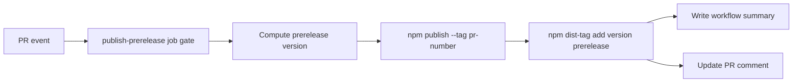

# Feature Specification: Publish Workflow Summaries and PR Comment Parity

**Spec ID**: `028-publish-summaries-and-pr-comments`
**Taxonomy**: `INFRA-BUILD`
**Created**: 2026-06-08
**Author**: PM Agent
**Status**: Final
**Input**: Preserve exact-version prerelease install guidance and PR-specific prerelease tags, while also moving a stable `prerelease` npm dist-tag to the newest current prerelease build so users can run `npx container-superposition@prerelease regen`.

## Problem Statement

Current publish automation exposes runnable npm / npx commands only in prerelease PR comments. Final release publishes do not surface the same commands in workflow-rendered output, so maintainers must infer what to run or inspect package docs.

Maintainers want publish runs themselves to render exact install / `npx` commands, they want PR comments when there is an associated PR, and they want a stable prerelease dist-tag that always points at the newest current prerelease build.

## Goals

- Render exact install and `npx` usage commands in GitHub Actions workflow output for successful final releases
- Render same kind of command summary in successful prerelease runs
- Preserve prerelease PR comment behavior for PR-triggered prerelease publishes
- Add final release PR comment behavior when a published release can be associated with a PR
- Preserve exact prerelease version publishing and existing PR-specific `pr-{number}` dist-tag behavior
- Also move/update a stable `prerelease` dist-tag to the newest successful prerelease publish
- Keep release trigger semantics unchanged
- Add workflow regression coverage for summary/comment steps and prerelease tag updates
- Add changelog entry under `Unreleased`

## Non-Goals

- Changing release or prerelease version formats
- Removing or renaming the existing PR-specific `pr-{number}` dist-tag behavior
- Changing final release `latest` dist-tag behavior
- Commenting on issues not tied to PRs
- Adding manual publish workflows
- Changing package runtime behavior

## Proposed Behavior

### Workflow run summaries

After successful npm publish:

- `publish` writes a Markdown summary to `$GITHUB_STEP_SUMMARY`
- `publish-prerelease` writes a Markdown summary to `$GITHUB_STEP_SUMMARY`

Summary content must include:

- published version
- `npm install` command using exact version
- `npx container-superposition@<version> regen` command

Prerelease summary may also include dist-tag guidance, but exact-version commands are required.

### Prerelease dist-tags

Each successful prerelease publish must continue to expose both of these install paths:

- the exact published prerelease version
- the PR-specific dist-tag `pr-{number}`

In addition, the workflow must move or create a shared `prerelease` dist-tag that points at the same newly published prerelease version.

Implementation requirement:

- publish the package with `npm publish --tag pr-{number}` so the existing PR-specific install path is still created during the primary publish step
- after that publish succeeds, run an explicit `npm dist-tag add container-superposition@<version> prerelease`

The new shared `prerelease` tag is a convenience pointer for "latest current prerelease" and does not replace the PR-specific tag.

This spec intentionally does **not** switch the primary publish tag from `pr-{number}` to `prerelease`, because that would make preservation of the existing PR-specific path depend on a second recovery step instead of the main publish path.

### PR comments

#### Prerelease job

Existing prerelease PR comment remains:

- heading remains `## 📦 Prerelease published to npm`
- existing bot comment is updated rather than duplicated
- comment continues to include install and `npx ... regen` commands

#### Final release job

After successful final release publish:

- workflow attempts to find PR associated with released commit/tag
- if associated PR found, create or update bot comment on that PR
- if no associated PR found, skip comment silently

Release PR comment should:

- use distinct heading, e.g. `## 🚀 Release published to npm`
- include published exact version
- include exact-version `npm install` and `npx ... regen` commands
- update existing matching bot comment rather than duplicate it

### Permissions

`publish` job may add comment-capable permission only as needed for release PR comments. Other permissions remain unchanged.

`publish-prerelease` must not broaden GitHub permissions beyond its current `contents: read`, `id-token: write`, and `pull-requests: write` set.

If `npm dist-tag add` cannot be executed through the repository's current npm trusted-publishing setup, implementation must escalate before merge rather than silently introducing a long-lived npm token or weakening the release trust boundary.

### Documentation

Update `docs/publishing.md` to state:

- successful publish runs render install / `npx` commands in workflow summary
- prerelease PRs still receive PR comments
- prerelease publishes keep the PR-specific `pr-{number}` dist-tag and also move the shared `prerelease` dist-tag
- `npx container-superposition@prerelease regen` targets the newest current prerelease build
- final release publishes comment on associated PR when one is found

## Technical Design

### Architecture Ownership

Owns new logic:

- `.github/workflows/publish.yml` owns publish ordering, npm publish/dist-tag behavior, summary rendering, associated-PR lookup, and PR comment side effects
- `tool/__tests__/publish-workflow.test.ts` owns static workflow regression checks for trigger shape, permissions, step ordering, and prerelease dist-tag handling
- `docs/publishing.md` owns maintainer-facing explanation of exact-version, `pr-{number}`, and shared `prerelease` install paths
- `CHANGELOG.md` owns the user-visible release automation note under `Unreleased`

Must not own new logic:

- CLI/runtime files under `scripts/`, `tool/commands/`, or `dist/`
- package runtime code or versioning semantics
- other GitHub workflows

### System Boundaries

- GitHub Actions owns orchestration and failure reporting
- npm owns package publication plus dist-tag mutation
- PR comments and `$GITHUB_STEP_SUMMARY` are downstream outputs of a fully successful publish path; they must not advertise `@prerelease` until the shared tag update succeeds
- the existing `pr-{number}` tag remains the per-PR identifier; `prerelease` is only the moving shared alias

### Canonical Data Flow

Detailed sequencing:

1. `publish-prerelease` computes `{base}-pr.{number}.{run_id}` exactly as today.
2. Workflow publishes that version with `--tag pr-{number}`.
3. Workflow then runs `npm dist-tag add container-superposition@<version> prerelease`.
4. Only after both npm operations succeed does the workflow write summary output and update the PR comment.
5. Final-release summary/comment flow remains separate and unchanged except for the already-added release PR comment capability.

### Dist-tag Strategy Decision

Recommended approach: keep `pr-{number}` on `npm publish`, then add `prerelease` with an explicit post-publish `npm dist-tag add`.

Why this is the preferred boundary-safe design:

- npm publish can assign only one initial dist-tag, so one of the two shared install paths must be secondary
- preserving `pr-{number}` in the main publish step keeps the longstanding per-PR contract on the critical path
- adding `prerelease` afterward makes the new shared alias an additive step instead of a replacement of existing behavior
- failure handling is clearer: if the dist-tag add fails, the workflow can fail with the exact published version still available and the original PR-specific tag still intact

Rejected direction:

- publishing with `--tag prerelease` and then restoring `pr-{number}` afterward is not acceptable because it temporarily or permanently breaks the older PR-specific path when the second step fails

### Failure Behavior

- If `npm publish` fails, job fails exactly as today; no summary or comment is written.
- If `npm publish` succeeds but `npm dist-tag add ... prerelease` fails, job must fail and must not write/update the success summary or PR comment.
- This failure mode is acceptable because the package version and `pr-{number}` tag still exist, while the failed run makes the stale shared `prerelease` pointer visible to maintainers.
- Do not add a best-effort `continue-on-error` path for the shared `prerelease` tag update.
- Do not add rollback automation that unpublishes the package; npm publish is intentionally treated as irreversible once successful.

### Implementation Slices

1. Keep the existing release summary step after successful final publish.
2. Keep the existing prerelease summary and prerelease PR comment behavior, but move them after the shared `prerelease` dist-tag step.
3. Update prerelease publish flow to run `npm publish --tag pr-{number}` first, then `npm dist-tag add ... prerelease`.
4. Keep the release PR comment step after final publish, using associated-PR lookup.
5. Extend static tests for summary/comment contracts, step ordering, permissions, and shared prerelease dist-tag handling.
6. Update docs and changelog.

### Risk Notes

- npm trusted publishing may allow `npm publish` but not `npm dist-tag add`; this is the main implementation unknown and requires early validation.
- If maintainers see a failed prerelease run after publish succeeded, they may need clear logs explaining that the exact version and `pr-{number}` tag still exist while `prerelease` did not advance.
- Summary/comment wording must avoid implying `@prerelease` is PR-specific; it is cross-PR and always moves to the newest successful prerelease.
- Static workflow tests can prove ordering and command shape, but they cannot prove registry-side permissions; manual validation in a safe prerelease path may still be needed.

### Test Plan

Automated regression coverage should verify at least:

- prerelease publish step still uses `--tag pr-{number}`
- a later step runs `npm dist-tag add container-superposition@<version> prerelease`
- shared `prerelease` tag step occurs after prerelease publish and before prerelease summary/comment steps
- `publish-prerelease` permissions are unchanged
- prerelease summary and/or comment text contains both the exact-version path and the stable `@prerelease` path
- release summary/comment steps remain in the final-release job only
- release job permissions remain `contents: write`, `id-token: write`, and `pull-requests: write`

Manual validation should cover one successful prerelease run and confirm:

- `npm view container-superposition@pr-<number> version` resolves to the new version
- `npm view container-superposition@prerelease version` resolves to that same new version
- workflow summary and PR comment show both discovery paths

## Acceptance Criteria

1. [x] `publish` writes rendered workflow summary containing exact-version `npm install` and `npx container-superposition@<version> regen`
2. [x] `publish-prerelease` writes rendered workflow summary containing exact-version `npm install` and `npx container-superposition@<version> regen`
3. [x] existing prerelease PR comment behavior remains in `publish-prerelease`
4. [x] `publish` attempts PR comment only after successful final publish
5. [x] final release PR comment is skipped without failure when no associated PR exists
6. [x] final release PR comment updates existing matching bot comment rather than duplicating it
7. [x] each successful prerelease publish preserves the existing exact published version and the existing PR-specific npm dist-tag `pr-{number}` by publishing with `npm publish --tag pr-{number}` before any shared-tag mutation
8. [x] each successful prerelease publish also moves or creates npm dist-tag `prerelease` pointing to that same just-published prerelease version via an explicit post-publish `npm dist-tag add container-superposition@<version> prerelease`
9. [x] the shared `prerelease` dist-tag step runs after prerelease publish succeeds and before any prerelease success summary or prerelease PR comment is written
10. [x] if shared-tag update fails after package publish succeeds, the workflow fails visibly and does not write or update the prerelease success summary or prerelease PR comment
11. [x] prerelease workflow summaries and PR comments clearly distinguish the exact version, the PR-specific `pr-{number}` path, and the moving shared `@prerelease` path, including discovery of `npx container-superposition@prerelease regen`
12. [x] workflow regression tests cover shared prerelease tag handling, unchanged permissions, and step ordering in addition to existing summary/comment step placement
13. [x] release summary/comment coverage remains scoped to the final-release job only
14. [x] implementation does not broaden `publish-prerelease` GitHub job permissions, and any npm credential change required for `npm dist-tag add` is explicitly escalated rather than silently added
15. [x] `docs/publishing.md` documents workflow summary + PR comment behavior plus the exact-version, `pr-{number}`, and shared `prerelease` prerelease install paths
16. [x] `CHANGELOG.md` includes `Unreleased` entry for the stable prerelease dist-tag behavior

## Architecture Decision Impact

Aligned with current ADRs/foundation. Change stays inside release automation, docs, changelog, and workflow tests. No ADR needed.

## Routing Decision

PM → Developer

## Assumptions

- Existing release summary/comment behavior described in this spec remains the intended baseline; this update only clarifies how prerelease publishing must preserve the current `pr-{number}` path while adding the shared `prerelease` alias.
- If npm trusted publishing does not authorize `npm dist-tag add`, implementation must stop at escalation rather than introduce a new long-lived credential.

## Open Questions

- None blocking spec handoff. Implementation must validate registry authorization for `npm dist-tag add` early in the change.

## Implementation Notes

- Updated `.github/workflows/publish.yml` so prerelease publish keeps `--tag pr-{number}`, then runs `npm dist-tag add container-superposition@<version> prerelease` before writing any prerelease success summary or PR comment.
- Expanded `tool/__tests__/publish-workflow.test.ts` to cover the new shared-tag step, step ordering, unchanged prerelease permissions, and wording separation for exact-version, `pr-{number}`, and `@prerelease` paths.
- Updated `docs/publishing.md` and `CHANGELOG.md` to document the shared prerelease tag and summary/comment behavior.
- Validation run: `npm run lint:fix`, `npm run lint`, `npm test`.
- Known gap: registry-side authorization for `npm dist-tag add` could not be exercised in this local environment, so a real prerelease workflow run is still required to confirm trusted publishing allows the tag mutation without extra credentials.
