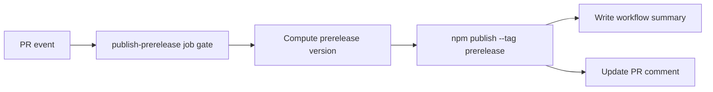

# Feature Specification: Publish Workflow Summaries and Shared Prerelease Tag Only

**Spec ID**: `028-publish-summaries-and-pr-comments`
**Taxonomy**: `INFRA-BUILD`
**Created**: 2026-06-08
**Author**: PM Agent
**Status**: Final
**Input**: Amend the existing publish spec so prerelease publishing uses only the shared npm dist-tag `prerelease` (plus the exact version), not the PR-specific `pr-{number}` dist-tag. This replaces the previous dual-tag design because prerelease publishing must remain compatible with OIDC-only trusted publishing.

## Problem Statement

Current publish automation was previously specified to preserve two mutable prerelease install paths:

- exact published prerelease version
- PR-specific npm dist-tag `pr-{number}`

That design also added a shared `prerelease` dist-tag after publish. In practice, the extra dist-tag mutation creates compatibility risk for OIDC-only trusted publishing, where maintainers want prerelease publishing to succeed without introducing long-lived npm credentials or registry-side fallback mechanisms.

Maintainers still need workflow summaries, PR comments, and a stable `@prerelease` install path. They no longer need the PR-specific mutable dist-tag if the exact prerelease version remains available.

## Goals

- Keep workflow summaries for successful prerelease and final release publishes.
- Keep prerelease PR comments for PR-triggered prerelease publishes.
- Keep final release PR comments when a published release can be associated with a PR.
- Preserve exact prerelease version publishing.
- Publish prereleases using only the shared npm dist-tag `prerelease`.
- Remove the requirement to create or preserve PR-specific npm dist-tag `pr-{number}`.
- Keep final release `latest` behavior unchanged.
- Keep prerelease publishing compatible with OIDC-only trusted publishing.
- Update workflow regression coverage and maintainer docs to reflect the single-tag design.

## Non-Goals

- Changing release or prerelease version formats.
- Changing final release `latest` dist-tag behavior.
- Adding manual publish workflows.
- Reintroducing any secondary npm credential just to mutate prerelease dist-tags.
- Preserving a mutable per-PR dist-tag alias.
- Changing package runtime behavior.

## Proposed Behavior

### Workflow run summaries

After successful npm publish:

- `publish` writes a Markdown summary to `$GITHUB_STEP_SUMMARY`.
- `publish-prerelease` writes a Markdown summary to `$GITHUB_STEP_SUMMARY`.

Summary content must include:

- published version
- `npm install` command using exact version
- `npx container-superposition@<version> regen` command

Prerelease summaries may also include the shared tag install path:

- `npm install -g container-superposition@prerelease`
- `npx container-superposition@prerelease regen`

### Prerelease publishing and dist-tags

Each successful prerelease publish must expose these install paths:

- the exact published prerelease version
- the shared dist-tag `prerelease`

Implementation requirement:

- publish the package with `npm publish --tag prerelease`
- do not run a follow-up `npm dist-tag add` step for prereleases
- do not create or preserve PR-specific dist-tag `pr-{number}` as part of prerelease publishing

The exact version is the per-run identifier. The shared `prerelease` tag is the moving alias for the newest successful prerelease.

### PR comments

#### Prerelease job

Existing prerelease PR comment remains with these updates:

- heading remains `## 📦 Prerelease published to npm`
- existing bot comment is updated rather than duplicated
- comment includes exact-version install and `npx ... regen` commands
- comment may also include `@prerelease` commands
- comment must not advertise `pr-{number}` install paths

#### Final release job

After successful final release publish:

- workflow attempts to find PR associated with released commit/tag
- if associated PR found, create or update bot comment on that PR
- if no associated PR found, skip comment silently

Release PR comment should:

- use distinct heading, e.g. `## 🚀 Release published to npm`
- include published exact version
- include exact-version `npm install` and `npx ... regen` commands
- update existing matching bot comment rather than duplicate it

### Permissions

`publish` job may add comment-capable permission only as needed for release PR comments. Other permissions remain unchanged.

`publish-prerelease` must not broaden GitHub permissions beyond its current `contents: read`, `id-token: write`, and `pull-requests: write` set.

Implementation must not require a long-lived npm token, extra secret, or non-OIDC fallback just to manage prerelease dist-tags.

### Documentation

Update `docs/publishing.md` to state:

- successful publish runs render install / `npx` commands in workflow summary
- prerelease PRs still receive PR comments
- prerelease publishes expose exact-version installs plus the shared `prerelease` tag
- `npx container-superposition@prerelease regen` targets the newest current prerelease build
- PR-specific `pr-{number}` dist-tag installs are no longer part of the supported prerelease workflow
- final release publishes comment on associated PR when one is found

## Technical Design

### Architecture Ownership

Owns new logic:

- `.github/workflows/publish.yml` owns publish ordering, npm publish behavior, summary rendering, associated-PR lookup, and PR comment side effects
- `tool/__tests__/publish-workflow.test.ts` owns static workflow regression checks for trigger shape, permissions, step ordering, and prerelease tag handling
- `docs/publishing.md` owns maintainer-facing explanation of exact-version and shared `prerelease` install paths
- `CHANGELOG.md` owns the user-visible release automation note under `Unreleased`

Must not own new logic:

- CLI/runtime files under `scripts/`, `tool/commands/`, or `dist/`
- package runtime code or versioning semantics
- other GitHub workflows

### System Boundaries

- GitHub Actions owns orchestration and failure reporting.
- npm owns package publication through the trusted publishing path.
- PR comments and `$GITHUB_STEP_SUMMARY` are downstream outputs of a fully successful publish path.
- Exact prerelease versions remain the immutable per-run reference.
- `prerelease` is the only mutable prerelease dist-tag.

### Canonical Data Flow

Detailed sequencing:

1. `publish-prerelease` computes `{base}-pr.{number}.{run_id}` exactly as today.
2. Workflow publishes that version with `--tag prerelease`.
3. After publish succeeds, the workflow writes summary output and updates the PR comment.
4. No secondary dist-tag mutation step runs.
5. Final-release summary/comment flow remains separate and unchanged.

### Dist-tag Strategy Decision

Recommended approach: publish prereleases directly with `--tag prerelease` and rely on the exact published version for per-run specificity.

Why this is the preferred design:

- OIDC-only trusted publishing compatibility is the primary requirement.
- npm publish can assign the needed shared tag in the primary publish step.
- removing post-publish tag mutation avoids a second registry capability requirement
- exact versions already provide a precise, non-moving reference for any single PR run
- failure handling becomes simpler because there is no second dist-tag mutation step to partially fail

Superseded direction:

- the prior dual-tag design (`npm publish --tag pr-{number}` followed by `npm dist-tag add ... prerelease`) is no longer acceptable because it depends on follow-up tag mutation that may not be supported in the OIDC-only path

### Failure Behavior

- If `npm publish` fails, job fails exactly as today; no summary or comment is written.
- There is no separate prerelease dist-tag mutation failure mode because no follow-up tag step runs.
- Do not add rollback automation that unpublishes the package; npm publish is intentionally treated as irreversible once successful.

### Implementation Slices

1. Keep the existing release summary step after successful final publish.
2. Keep the existing prerelease summary and prerelease PR comment behavior, but remove any dependency on PR-specific tag wording.
3. Update prerelease publish flow to use `npm publish --tag prerelease` with no follow-up `npm dist-tag add`.
4. Keep the release PR comment step after final publish, using associated-PR lookup.
5. Extend static tests for summary/comment contracts, permissions, and single-tag prerelease handling.
6. Update docs and changelog.

### Risk Notes

- The moving `@prerelease` alias is cross-PR, so users who need a stable per-PR reference must use the exact published version.
- Maintainers accustomed to `pr-{number}` may need explicit docs and comment wording updates.
- Static workflow tests can prove command shape and absence of the old tag mutation step, but registry-side trusted publishing still needs real workflow validation.

### Test Plan

Automated regression coverage should verify at least:

- prerelease publish step uses `--tag prerelease`
- workflow no longer runs `npm dist-tag add container-superposition@<version> prerelease`
- workflow no longer publishes with `--tag pr-{number}`
- `publish-prerelease` permissions are unchanged
- prerelease summary and/or comment text contains exact-version guidance and shared `@prerelease` guidance
- prerelease summary and/or comment text does not advertise `pr-{number}` install guidance
- release summary/comment steps remain in the final-release job only
- release job permissions remain `contents: write`, `id-token: write`, and `pull-requests: write`

Manual validation should cover one successful prerelease run and confirm:

- `npm view container-superposition@<exact-version> version` resolves to the new version
- `npm view container-superposition@prerelease version` resolves to that same new version
- workflow summary and PR comment show exact-version guidance and shared `@prerelease` guidance only

## Acceptance Criteria

- [x] AC-1: `publish` writes rendered workflow summary containing exact-version `npm install` and `npx container-superposition@<version> regen`.
- [x] AC-2: `publish-prerelease` writes rendered workflow summary containing exact-version `npm install` and `npx container-superposition@<version> regen`.
- [x] AC-3: Existing prerelease PR comment behavior remains in `publish-prerelease`, with updated wording that removes `pr-{number}` install guidance.
- [x] AC-4: `publish` attempts PR comment only after successful final publish.
- [x] AC-5: Final release PR comment is skipped without failure when no associated PR exists.
- [x] AC-6: Final release PR comment updates existing matching bot comment rather than duplicating it.
- [x] AC-7: Each successful prerelease publish preserves the exact published prerelease version and publishes the shared npm dist-tag `prerelease` in the primary publish step via `npm publish --tag prerelease`.
- [x] AC-8: Prerelease publishing no longer creates, preserves, or documents PR-specific npm dist-tag `pr-{number}` as a supported install path.
- [x] AC-9: Prerelease workflow summaries and PR comments clearly distinguish the exact version from the moving shared `@prerelease` path.
- [x] AC-10: Workflow regression tests cover single-tag prerelease handling, unchanged permissions, and removal of the prior dual-tag sequence.
- [x] AC-11: Implementation does not broaden `publish-prerelease` GitHub job permissions and does not require a long-lived npm credential or non-OIDC fallback for prerelease publishing.
- [x] AC-12: `docs/publishing.md` documents workflow summary + PR comment behavior plus the exact-version and shared `prerelease` prerelease install paths.
- [x] AC-13: `CHANGELOG.md` includes `Unreleased` entry for the prerelease dist-tag simplification.

## Architecture Decision Impact

Aligned with current ADRs/foundation. Change stays inside release automation, docs, changelog, and workflow tests. No ADR needed.

## Routing Decision

PM → Developer

## Assumptions

- Exact prerelease versions are sufficient as the stable per-run reference once the mutable PR-specific tag is removed.
- OIDC-only trusted publishing compatibility takes precedence over preserving the older `pr-{number}` convenience alias.

## Open Questions

- None blocking.
- Updated summary/comment wording now directs maintainers to use the exact version for a stable per-run install and `@prerelease` for the newest shared prerelease.

## Implementation Notes

- Updated `.github/workflows/publish.yml` so prerelease publishing now uses `npm publish --provenance --access public --tag prerelease`, removes the follow-up `npm dist-tag add` step, and updates prerelease summary/comment wording to advertise only exact-version and shared `@prerelease` install paths.
- Updated `tool/__tests__/publish-workflow.test.ts` to assert the single-tag prerelease publish command, removal of the dist-tag mutation step and `pr-{number}` guidance, unchanged prerelease permissions, and retained release summary/comment ownership.
- Updated `docs/publishing.md` and the existing `CHANGELOG.md` Unreleased entry to document the shared-tag-only prerelease workflow and exact-version guidance.
- Follow-up docs cleanup removed contradictory legacy beta/dist-tag promotion guidance, removed the stale "Automated Releases (Future Enhancement)" section, and marked manual publishing as an exception path that still uses the shared `prerelease` tag if needed.
- Validation run: `npm run lint:fix`, `npm run lint`, `npm test`.
- QA follow-up validation: `npm run lint:fix`, `npm run lint`.
- QA docs follow-up removed the stale `@next` prerelease example from `docs/publishing.md` so the later maintainer guidance now matches the exact-version plus shared `@prerelease` model.
- QA docs revalidation: `npm run lint:fix`, `npm run lint`.
- Known gap: trusted-publishing behavior still requires confirmation from a real GitHub prerelease workflow run against npm.
