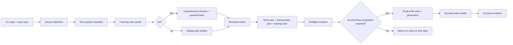

# Feature Specification: Init and Regen Guided Flows

**Spec ID**: `032-init-and-regen-guided-flows`
**Taxonomy**: `CLI-UX`
**Created**: 2026-06-24
**Author**: PM Agent
**Status**: Final
**Input**: Redesign `init` and `regen` for lower cognitive load, stronger pre-write confidence, faster repeat-use flow, and clearer product-model teaching.

---

## Request Classification

UX-forward rewrite. Not reverse-spec. This spec intentionally supersedes parts of current behavior and copy when current UX creates friction or teaches wrong model.

## Product Outcome

Make `init` feel like guided setup, not questionnaire maze. Make `regen` feel like safe replay, not opaque rewrite. Teach one product model fast:

- choose or confirm shared intent
- preview what tool will write
- write with confidence
- know exact next step

Success signals:

- first-run users reach first good setup with fewer wrong turns
- repeat users make small changes without re-learning command model
- users understand project file vs generated output vs local-only customization
- interactive and unattended runs both show enough pre-write confidence

## Improvement Target Over Current Product

This redesign is deliberate uplift, not documentation of current behavior.

Target outcomes over current product:

- replace implementation-led prompt sequencing with intent-led setup framing
- replace late, dense summaries with mandatory pre-write confidence review
- replace separate-feeling `init`/`regen` experiences with one shared setup/replay model
- replace scattered local-config caveats with one trust contract users can act on
- replace broad repeat-user walkthroughs with narrow-change fast paths

## Current UX To Intentionally Supersede

1. Prompt order optimizes for implementation inputs, not user intent.
2. `init` and `regen` feel like separate command families instead of one setup/replay model.
3. Summary comes too late and teaches too little about source, write scope, and manual follow-up.
4. Replay and override messaging is technically correct but cognitively dense.
5. Local-only safety warnings exist, but product model still leaks through scattered notices.
6. Current docs promise polish like low prompt counts and per-answer confirmation, but actual trust gap is bigger: users need better framing before writes, not more ornament.

## User Goals

### First-time user

- Start from recommended path fast.
- Avoid catalog overload.
- See what will be created before files change.
- Leave understanding how to make future changes.

### Returning user

- Reuse committed setup without re-answering broad questions.
- Make targeted changes fast.
- See whether run updates shared intent, local output, or both.

### Team maintainer

- Keep shared project state canonical.
- Keep local-only additions safe.
- Avoid accidental commits of local-only output or ignored files.

## Scope

### In scope

- `init` interactive flow and seeded replay flow
- `regen` preflight, confirmation, success guidance, and write framing
- project-file-first teaching inside command UX
- summary, warning, backup, and next-step contracts
- local-only config safety framing
- faster repeat-user branches inside current command family

### Out of scope

- new discovery command taxonomy
- doctor remediation behavior
- adopt/migrate conversion flows
- overlay composition internals beyond user-visible consequences

## Non-Goals

- Preserve current prompt order because code already does it
- Preserve manifest-first language in steady-state flows
- Add ornamental CLI chrome without reducing decision load
- Re-open ADR 001 project-file-first authority

## Design Principles

1. **Progressive disclosure first** — show posture and recommendation before details.
2. **Preview before mutation** — confidence must arrive before writes.
3. **Fast lane for repeat edits** — narrow changes skip broad walkthrough.
4. **Teach artifact model in-place** — project file, generated output, local-only config each get explicit role.
5. **One command family, two moments** — `init` chooses or edits intent; `regen` replays intent.
6. **Warnings must classify action** — blocked, protected, or manual follow-up.

## Canonical Interaction Model

### Shared mental model

- `init` = create or edit shared intent
- `regen` = replay shared intent into generated output
- `superposition.yml` / `.superposition.yml` = canonical shared project file
- `.devcontainer/` + `superposition.json` = generated output
- local-only config = personal enrichment, never equivalent to shared intent

### Run posture labels

Every run MUST identify itself with one of these posture labels before prompts or work:

- `New setup`
- `Update shared setup`
- `Replay shared setup`
- `Legacy compatibility replay`

### Confidence ladder

Every write path MUST move through same ladder:

1. frame run
2. narrow path
3. collect only needed inputs
4. preview write plan
5. write from explicit flow completion, not extra confirmation chrome
6. report exact outcome and next step

## Page Contract

### 1. Run framing screen

First visible output for both `init` and `regen` MUST contain six rows in fixed order:

1. `Mode`
2. `Source`
3. `Shared project file`
4. `Generated output`
5. `Local-only config`
6. `Recommended next action`

Rules:

- no spinner or questionnaire before this screen
- each row uses short status phrase, not paragraph
- if source is legacy manifest, framing MUST label compatibility status and point to `migrate`
- if project file exists, framing MUST say whether this run will update it or only replay it
- when mode is `Update shared setup`, generic six-row framing may collapse into more legible boxed summary that avoids repeating project-file source/path data
- update-mode framing MUST be followed immediately by `Current shared setup` snapshot before add/remove/edit actions are shown
- current snapshot MUST show enough visible state to answer `what am I changing?` without entering questionnaire flow
- empty categories and `No next step suggested` noise SHOULD be omitted in update mode

### 2. `init` lane chooser

Interactive `init` MUST show lane chooser before domain questions.

Layout:

- primary card: `Fast start` — recommended preset-led path, prompt estimate, example outcomes
- secondary card: `Custom build` — direct overlay composition, prompt estimate, best when no preset fits
- tertiary link-like option when project file exists: `Edit current setup` with targeted change shortcuts

Copy rules:

- `Fast start` default focus
- `Custom build` never hidden behind extra command or docs
- prompt estimate uses ranges like `~3 decisions`, not inflated counts

### 3. Repeat-user shortcut chooser

When project file exists, `init` MUST offer shortcuts before full review:

- `Add capability`
- `Remove capability`
- `Change runtime or editor`
- `Adjust parameters`
- `Review current setup`
- `Edit full setup`
- `Preview and write`

Rules:

- shortcuts appear before preset/custom lane if current setup exists
- each shortcut describes write scope in one line
- completing any non-terminal shortcut returns user to same main menu
- `Review current setup` shows summary of current shared intent, then returns to same main menu
- first presentation of shortcut menu MUST NOT duplicate same current-setup snapshot twice in immediate succession
- `Edit full setup` is explicit path into full questionnaire-style review seeded from current setup
- `Preview and write` is terminal action for shortcut lane and opens preflight immediately
- user can escape to full review anytime
- narrow shortcut must only ask questions needed for chosen change

### 4. Guided question flow

Question flow MUST follow intent-first order:

1. goal or starting point
2. base stack/runtime/editor choices
3. capability adds/removals
4. required parameters only
5. optional refinements only when relevant

Rules:

- hide downstream prompts until upstream choice makes them relevant
- optional detail groups collapsed by default behind explicit `Add more detail`
- for preset path, show preset name and current expansion summary at top of each step
- every step footer MUST show `Back`, `Skip optional`, `Preview current plan`

### 5. Mandatory preflight

Before any write, `init` and `regen` MUST show same six-section preflight in fixed order:

1. `Source`
2. `Intent`
3. `Will write`
4. `Will preserve`
5. `Manual follow-up`
6. `Backup plan`

Rules:

- preflight visible in interactive and non-interactive runs
- `Will write` must separate `shared project file` from `generated output`
- `Will preserve` must explicitly mention `custom/`, local-only config, and untouched files when present
- `Manual follow-up` must only include user actions, never mixed with auto-actions
- `Backup plan` must say `create`, `skip`, or `not needed`, plus reason
- if nothing will change, preflight MUST say `No material changes` and success path becomes no-op replay

### 6. Flow completion after preflight

Interactive runs MUST NOT show a second confirmation chooser after preflight.

Rules:

- interactive `init` writes when user intentionally reaches preflight from terminal flow completion (`Preview and write` from shortcut menu or end of full guided review)
- completing a main-menu task returns to same main menu, not to post-preflight confirmation chrome
- `Go back` is valid only inside real step history within a sub-flow; it MUST NOT be offered when it only re-shows a menu
- unattended mode may proceed automatically only after identical preflight printed
- abort remains standard terminal interrupt behavior, not dedicated post-preflight menu copy

### 7. Success screen

Success output MUST be short and action-first.

Sections in order:

1. `Changed`
2. `Preserved`
3. `Next step`
4. `Manual review`

Mode-specific rules:

- first-run `init`: next step likely open/generated workspace
- repeat `init`: next step likely `regen` only if generation intentionally deferred
- `regen`: next step likely review diff or run `doctor`
- if project file changed, success MUST remind user shared intent updated
- do not restate full config or long overlay inventory

## Interaction Rules

### Project-file teaching rules

- When project file exists, never imply manifest or generated output is primary authoring surface.
- When project file does not exist, `init` MUST explain it will create shared intent first.
- `regen` MUST never ask discovery questions in normal path.
- Legacy manifest replay path MUST be visibly marked compatibility-only.

### Local-only config trust contract

Local-only config messaging MUST appear once in framing or preflight, not scattered.

In update mode, compact disposition + applied-field summary may appear in boxed header instead of separate verbose trust block before menu.

It MUST state:

- file path discovered
- fields that will apply
- unsupported fields if any
- whether run is blocked
- whether Git ignore safety exists
- whether tracked-file cleanup remains manual

Allowed dispositions:

- `Applied safely`
- `Applied with manual follow-up`
- `Blocked`
- `Ignored by this run`

### Fast-path rules

- If command-line args fully specify narrow change, skip lane chooser and jump to preflight summary of resolved intent.
- If `--no-interactive` used with existing project file, output still MUST include framing and preflight.
- If only one preset clearly matches requested path, tool may recommend it first but must keep `Custom build` accessible.

### Error and empty-state rules

- missing project file on `regen` → explain `No shared setup to replay`, route to `init` or `migrate`
- conflicting source flags → show blocked state plus valid alternatives
- unsupported local-only fields → blocked before any write
- no material diff → success phrased as replay check, not regeneration success theater

## State Behavior

- selected lane persists through run unless user changes it
- repeat-user shortcut persists only for current run
- source detection results persist from framing into preflight without relabeling drift
- `Preview current plan` during question flow opens same preflight structure in preview mode, then returns to flow
- last-confirmed plan and final write summary must match field names exactly

## Terminology Rules

Use:

- `shared project file`
- `generated output`
- `local-only config`
- `preview before write`
- `manual follow-up`
- `compatibility manifest`

Do not use in steady-state project-file flows:

- `manifest replay` as default guidance
- `questionnaire` in primary user-facing copy
- `scaffold` when meaning is whole generated output unless already obvious from context

## Worked Examples

### First run, preset-led

- framing says `New setup`
- lane chooser defaults to `Fast start`
- user picks job-oriented preset
- optional details stay collapsed
- preflight shows project file creation plus generated output creation
- success says what written, next step to open workspace

### Repeat run, add one capability

- framing says `Update shared setup`
- shortcut chooser offers `Add capability`
- user picks one overlay/capability
- preview shows shared file update plus generated output changes
- success says capability added, preserved local additions unchanged

### Replay only

- framing says `Replay shared setup`
- no prompts
- preflight shows source project file, changed generated files, backup behavior
- confirm or unattended proceed
- success points to review or `doctor`

## QA Scenario Scripts

1. First-run interactive `init` with no project file: verify framing precedes lane choice, lane choice precedes questions, preflight precedes write.
2. Existing project file interactive `init`: verify shortcut chooser appears and `Add capability` path skips unrelated questions.
3. `regen` with project file and no local config: verify no questionnaire, same preflight sections, concise success.
4. `regen --from-manifest`: verify compatibility framing and migrate recommendation.
5. Local-only config with unsupported field: verify single blocked trust contract before write.
6. No-op replay: verify preflight and success both say no material changes.

## Acceptance Criteria

| #     | Criterion                                                                                                                                                                                                                                                                                                                                  |
| ----- | ------------------------------------------------------------------------------------------------------------------------------------------------------------------------------------------------------------------------------------------------------------------------------------------------------------------------------------------ |
| AC-1  | First visible output for `init` and `regen` is framing screen with rows in exact order: `Mode`, `Source`, `Shared project file`, `Generated output`, `Local-only config`, `Recommended next action`, shown before any prompt, questionnaire, or spinner.                                                                                   |
| AC-2  | Interactive `init` begins with existing-project shortcut chooser when shared project file exists; otherwise it begins with lane choice between `Fast start` and `Custom build`, with `Fast start` default-focused and `Custom build` still directly accessible.                                                                            |
| AC-3  | Existing-project shortcut chooser includes `Add capability`, `Remove capability`, `Change runtime or editor`, `Adjust parameters`, `Review current setup`, `Edit full setup`, and `Preview and write`; narrow-change paths ask only change-relevant questions before preview, and completed non-terminal actions return to same main menu. |
| AC-4  | Guided questions follow intent-first order: goal/start point, base stack/runtime/editor, capability adds-removals, required parameters, optional refinements; optional refinements remain hidden until explicitly requested.                                                                                                               |
| AC-5  | Every write-capable path, including non-interactive replay, prints preflight sections in exact order: `Source`, `Intent`, `Will write`, `Will preserve`, `Manual follow-up`, `Backup plan`; `Will write` separates shared project file from generated output.                                                                              |
| AC-6  | Interactive `init` shows no extra confirmation chooser after preflight; preflight is reached only from explicit terminal flow completion, while any `Back` behavior is limited to real in-flow step history rather than menu redisplay.                                                                                                    |
| AC-7  | Normal-case `regen` asks no discovery questions and still classifies write intent as replay, cleanup, update, or no material change before any file mutation.                                                                                                                                                                              |
| AC-8  | Local-only config appears in one consolidated trust contract that states discovered path, applied fields, unsupported fields if any, Git-ignore safety state, tracked-file cleanup responsibility, and final disposition (`Applied safely`, `Applied with manual follow-up`, `Blocked`, or `Ignored by this run`).                         |
| AC-9  | Success output follows exact order `Changed`, `Preserved`, `Next step`, `Manual review` and restates when shared intent changed versus when only generated output replayed.                                                                                                                                                                |
| AC-10 | Current prompt ordering, copy, and summary behavior are allowed to change materially when needed to reach lower cognitive load and higher pre-write confidence; current sequencing is not acceptance authority.                                                                                                                            |
| AC-11 | Automated coverage exists for framing-first entry, current-setup snapshot in update mode, repeat-user shortcut entry, return-to-main-menu behavior for non-terminal actions, preflight ordering, no-op replay messaging, and local-config trust dispositions.                                                                              |
| AC-12 | Docs, help text, and in-product wording align on one mental model: shared project file = canonical team intent, generated output = materialized files, local-only config = personal enrichment.                                                                                                                                            |

## Tradeoffs

- More up-front framing adds lines before action, but prevents wrong-path starts.
- Mandatory preflight adds one review step, but creates trust before writes without adding redundant confirmation chrome.
- Shortcut branches add UX complexity, but sharply cut repeat-user effort.
- Preset-led recommendation adds opinion, but lowers first-run search cost.

## Implementation Gap vs Current Product

Deliberate improvements still to build:

- `tool/commands/plan.ts` already supports strong planning logic, but current first-screen framing and change classification are below this spec's confidence-gate contract.
- `tool/cli/args.ts` help text still under-teaches shared project file vs generated output roles and must be raised to same product model.
- Current update-mode `init` experience can still hide too much current state; this spec requires visible current-setup snapshot before add/remove/edit actions.

## Technical Design

### Architecture Ownership

- `tool/cli/run.ts` keeps command orchestration, source discovery, and write sequencing for `init`/`regen`.
- New shared CLI UX layer should own framing, current-setup snapshot, preflight, success rendering, and posture/change classification.
- `tool/questionnaire/**` owns question collection only. It must not decide write copy, success copy, or replay posture labels.
- `tool/schema/project-config.ts` remains authority for project-file discovery, local-only config loading, supported-field validation, and materialization rules.
- `tool/questionnaire/composer.ts` remains write planner/executor for generated output. It must not print UX summaries directly.

### System Boundaries

- One normalized run model should feed both `init` and `regen`.
- Renderer consumes normalized model; renderer must not inspect filesystem directly.
- Local-only config trust contract reuses validation from project-config layer, then maps result into one consolidated UX block.
- Existing `utils/summary.ts` becomes legacy output path for old flows only; redesigned `init`/`regen` should use new success contract instead of extending summary blob further.

### Canonical Data Flow

### Interaction Policy Locks

- Posture labels come from shared classifier with exact enum: `New setup`, `Update shared setup`, `Replay shared setup`, `Legacy compatibility replay`.
- Non-interactive runs print same framing and preflight, then continue without new opt-in flag. Reason: preserve unattended replay path. Safety comes from mandatory preview, clear scope classification, and unchanged/no-op detection.
- Interactive init must not add post-preflight choice chrome. `Back` exists only within real sub-flow history, not as pseudo-navigation after preflight.
- Unsupported local-only config stays blocked before any write. Supported local-only config may enrich run, but trust contract prints once only.

### Implementation Slices

1. Add shared run-classification + artifact/trust-contract view-model layer.
2. Refactor `run.ts` to render framing first for both `init` and `regen` before questionnaire or spinner.
3. Add existing-project shortcut chooser and narrow question branches for `init`.
4. Replace current summary/backup messaging with mandatory preflight reached from explicit terminal actions, not extra confirmation gate.
5. Replace post-write summary with new success screen and align help/docs text.

### Risk Notes

- `run.ts` already mixes discovery, prompting, writing, and summary. Refactor risk high unless new view-model seam added first.
- Shortcut lanes can drift from full questionnaire rules. Mitigation: shortcut output must resolve through same normalized intent builder as full flow.
- Local config notices already scattered in `run.ts`. Must delete old duplicated warnings once trust-contract renderer lands.
- Spinner currently starts before final confidence step. Must move spinner after confirmation to satisfy framing/preflight-first contract.

### Test Plan

- Unit: posture classifier, write-scope classifier, backup-plan classifier, local-config disposition mapper.
- Integration: `init` first-run ordering, existing-project shortcut ordering, `regen` no-question path, no-op replay messaging.
- Interaction: confirmation default selection, `Preview current plan` round-trip, unsupported local config block.
- Regression: manifest compatibility replay framing, project-file update reminder, shared field labels stable between preflight and success.

## Architecture Decision Impact

aligned with current ADRs/foundation

Known repo gap: `docs/foundation.md` absent. ADR 001 remains authority.

## Open Questions

- None blocking draft. Exact prompt count remains UX tuning detail, not spec constraint.

## Routing Decision

**Architect → PM**

Reason: Technical design locked for shared run model, renderer boundary, non-interactive policy, and local-config ownership. Ready for developer implementation planning.

## Implementation Notes

Implemented shared run framing, preflight, local-config trust block, and success sections in `tool/cli/run.ts` via shared UX semantics/renderers. Added renderer-focused tests in `tool/__tests__/ux-renderers.test.ts`.

Follow-up fix pass: added init lane chooser, repeat-user shortcuts, and helper coverage in `tool/__tests__/qa-blockers.test.ts`. Removed duplicate late local-config safety messaging so trust contract stays consolidated in framing/preflight.

QA blocker fix: removed `printLocalConfigTrustNotice()` from normal `init`/`regen` execution, updated `tool/__tests__/local-config.test.ts` to assert single-placement trust messaging across combined stdout/stderr, and added CLI regression coverage in `tool/__tests__/qa-blockers.test.ts` for both `init` and `regen`. Validation: targeted Vitest, `npm run lint`, full `npm test`.

Interaction refinement: removed post-preflight `Write now` / `Go back` / `Abort` chooser from interactive flows, changed existing-setup shortcut lane so completed tasks return to main menu, and made `Preview and write` terminal action from that menu. Validation: targeted Vitest, `npm run lint`, full `npm test`.
