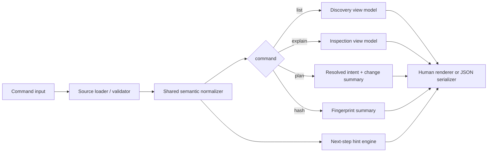

# Feature Specification: CLI Discovery, Preview, and Fingerprint Commands

**Spec ID**: `033-cli-discovery-preview-and-fingerprint`
**Taxonomy**: `CLI-UX`
**Created**: 2026-06-24
**Author**: PM Agent
**Status**: Draft
**Input**: Redesign read-only CLI surfaces so users discover faster, preview earlier, and learn product model without accidental writes.

---

## Request Classification

UX-forward rewrite. Not reverse-spec. Current command set stays, but current output and guidance may be intentionally replaced where it under-teaches, over-dumps detail, or routes users toward wrong next step.

## Product Outcome

Turn `list`, `explain`, `plan`, and `hash` into one learning ladder:

1. find good starting points
2. inspect impact
3. preview exact change
4. prove semantic equivalence

Success signals:

- first-run users discover viable options without docs dive
- power users use `plan` before writes by habit
- next-step hints always teach valid project-file-first workflow
- text and JSON outputs stay scriptable while human output becomes more decision-oriented

## Improvement Target Over Current Product

This redesign is deliberate uplift, not documentation of current output.

Target outcomes over current product:

- replace catalog-dump discovery with recommendation-led narrowing
- replace metadata-first inspection with fit-first inspection
- replace low-prominence previewing with explicit `plan`-first confidence habit
- replace opaque checksum output with explained semantic fingerprinting
- replace drifting hints with state-aware, project-file-first next-step routing

## Current UX To Intentionally Supersede

1. `list` behaves like raw catalog dump more than guided discovery surface.
2. `explain` shows facts but weakly teaches when item is good fit or risky fit.
3. `plan` exists, but product does not consistently present it as default confidence-building step before writes.
4. `plan --diff` and `hash` are powerful but feel expert-only and isolated.
5. Current hints sometimes point to invalid or stale follow-up commands.
6. Category and metadata rendering drift reduces trust in discovery output.

## User Goals

### First-time user

- Find likely starting point fast.
- Understand what overlay or preset adds before committing.
- Preview write impact without generating files.

### Returning user

- Compare intended change against current generated output.
- Understand dependency auto-adds and skips.
- Verify two configurations are semantically same.

### Automation user

- Keep JSON stable.
- Use hash and plan in scripts without prose pollution.

## Scope

### In scope

- `list`, `explain`, `plan`, `plan --diff`, `hash`
- shared labels, next-step hints, and preview framing
- browse, inspect, compare, and fingerprint UX

### Out of scope

- changing command taxonomy
- write-path behavior in `init` or `regen`
- doctor remediation flow
- adopt/migrate conversion flow

## Non-Goals

- Preserve current text layout because tests already snapshot it
- Teach raw catalog structure before user decision needs
- Use read-only commands as hidden write setup shortcuts

## Design Principles

1. **Discovery narrows choices**.
2. **Preview builds trust before write**.
3. **Inspection answers fit, not only metadata**.
4. **Fast path stays scriptable**.
5. **Next-step hints teach valid workflow**.
6. **Human output may become more opinionated than JSON**.

## Canonical Interaction Model

### Learning ladder

- `list` = find starting points
- `explain` = inspect one option
- `plan` = preview resolved outcome
- `hash` = compare semantic identity

### Shared frame

All human-readable command outputs MUST begin with compact frame containing:

1. `Mode`
2. `Source`
3. `What this helps you decide`

Rules:

- frame max 3 short rows
- no decorative prose before decision frame
- JSON mode excludes frame entirely

### Shared hint footer

All human-readable outputs MUST end with exactly one `Next step` section.

Rules:

- one recommended next command only
- hint depends on repo state and source type
- no invalid flags or stale manifest-first advice
- if no safe next command exists, footer says `No next step suggested`

## Command Contracts

### `list`

#### Purpose

Help user start. Not dump whole registry without guidance.

#### Default layout

Default `list` MUST render in three blocks:

1. `Recommended starts`
2. `Browse all overlays`
3. `How to inspect or preview next`

`Recommended starts` rules:

- show common preset-led starts first when available
- each row contains label, `Best for`, and one-line `Why start here`
- max 5 rows before `Browse all overlays`

`Browse all overlays` rules:

- group by live user-facing category names
- include all live categories, including `messaging`
- each item shows id, short description, fit tags if available
- no `[object Object]`, raw JSON fragments, or hidden categories

Filtered `list` rules:

- switch to comparison table/card layout
- keep compact context header like `Filtered by category: messaging`
- if zero results, show `No matches` plus at least two recovery suggestions

### `explain <id>`

#### Purpose

Answer `Why use this?`, `What changes?`, `What risk or tradeoff comes with it?`

#### Layout

Human-readable `explain` MUST use fixed section order:

1. `Best for`
2. `Adds`
3. `Depends on`
4. `Conflicts with`
5. `Preview notes`
6. `Files, services, and ports`
7. `Try this next`

Rules:

- `Best for` uses user-job phrasing, not only taxonomy
- `Adds` summarizes user-visible behavior first, low-level files second
- empty sections rendered as explicit `none`
- preset explanations may append `Choices you can make`
- file/service/port inventory stays skimmable and grouped, not implementation dump

### `plan`

#### Purpose

Become standard confidence gate before writes.

#### Default layout

Human-readable `plan` MUST use fixed section order:

1. `Resolved intent`
2. `What changes here`
3. `Why this plan looks this way`
4. `Detailed file impact` (collapsed/secondary in TUI, lower-priority in plain text)
5. `Next step`

`Resolved intent` MUST include:

- source of intent
- final resolved overlays/preset
- auto-added overlays
- skipped or conflicting overlays
- whether plan represents `first write`, `update`, `cleanup`, or `no material change`

`What changes here` MUST summarize:

- files to create/update/remove
- services/ports added or removed
- whether generated output differs from current workspace

`Why this plan looks this way` MUST surface dependency and conflict reasoning in user language before verbose raw explanation.

### `plan --diff`

Diff mode MUST keep same top summary, then classify file impact into exactly one headline state:

- `First write`
- `Update existing output`
- `Cleanup stale generated files`
- `No material change`

Rules:

- classification appears before any unified diff text
- if diff verbose enough to scroll, summary still fits within first screenful
- no diff-only mode may omit source and resolved intent summary

### `hash`

#### Purpose

Explain fingerprint meaning. Not opaque checksum only.

#### Layout

Human-readable `hash` MUST use fixed section order:

1. `Fingerprint`
2. `Computed from`
3. `Normalized dependencies`
4. `How to compare`
5. `Write location` when `--write`
6. `Next step`

Rules:

- `Fingerprint` shows short primary value first
- `Computed from` says manifest/project/CLI source clearly
- `Normalized dependencies` lists auto-added overlays that affect semantic identity
- `How to compare` explains equality semantics in one or two lines
- if writing file, output says exact path and whether file changed or stayed same

## Interaction Rules

### Progressive disclosure rules

- default `list` and `explain` prioritize recommendation and fit over exhaustive metadata
- `plan` prioritizes outcome summary over raw diff detail
- raw structured detail remains available in JSON or lower sections, not first screen
- verbose mode adds reasoning depth; it does not replace top summary

### Terminology rules

Use:

- `Recommended starts`
- `Best for`
- `What changes here`
- `Preview only`
- `Fingerprint`
- `shared project file`
- `generated output`

Avoid:

- stale category names
- `manifest` as steady-state primary artifact when project file exists
- metadata dumps without decision framing

### Empty and error states

- unknown overlay id in `explain` → show `Not found`, suggest `list` and nearest matches if available
- empty filter results in `list` → show recovery tips: remove filter, inspect categories, or browse defaults
- `plan` without usable source → explain missing input, route to `init` or add `--overlays`
- `hash` missing required source → explain exactly what input combo valid

### Next-step routing rules

- no project file yet → prefer preview-safe authoring path, usually `plan` or `init`
- project file exists and preview matches intent → prefer `regen`
- legacy manifest source in preview → prefer `migrate`
- drift or validation concerns → prefer `doctor`

## State Behavior

- command-specific filters and source labels must carry consistently from frame to summary to footer
- text and JSON views must represent same semantic states even if wording differs
- `plan` change classification must align with `--diff` and non-diff summaries
- `hash --write` must report whether write changed file contents or confirmed same fingerprint

## Worked Examples

### First discovery session

- `list` shows recommended starts first
- user chooses preset or overlay to inspect
- `explain` teaches fit and tradeoffs
- footer points to `plan`

### Change review session

- `plan` from project file opens with `update existing output`
- summary names auto-added dependency and stale file cleanup
- footer points to `regen`

### CI equivalence check

- `hash --json` stays scriptable
- human `hash` explains same semantic identity in audit logs

## QA Scenario Scripts

1. Default `list`: verify recommended starts, live categories including `messaging`, and skimmable grouped catalog.
2. Filtered `list` zero results: verify recovery suggestions and no silent empty table.
3. `explain` overlay and preset: verify fixed section order, explicit `none` states, fit-first copy.
4. `plan` from CLI or project file: verify first-screen summary includes source, resolved overlays, auto-adds/skips, change classification.
5. `plan --diff`: verify classification headline appears before diff text.
6. `hash --write`: verify source, normalized dependencies, meaning, and exact write location displayed.

## Acceptance Criteria

| # | Criterion |
| --- | --- |
| AC-1 | Every human-readable command output begins with compact frame in exact order `Mode`, `Source`, `What this helps you decide`; JSON output excludes this frame entirely. |
| AC-2 | Default `list` renders exact top-level blocks `Recommended starts`, `Browse all overlays`, and `How to inspect or preview next`, with at most 5 recommended rows before full catalog. |
| AC-3 | `list` shows all live user-facing categories, including `messaging`, with human-readable item rows and no raw object dumps, hidden categories, or stale category labels. |
| AC-4 | `explain <id>` renders exact section order `Best for`, `Adds`, `Depends on`, `Conflicts with`, `Preview notes`, `Files, services, and ports`, `Try this next`, with explicit `none` states for empty sections. |
| AC-5 | Human-readable `plan` renders exact section order `Resolved intent`, `What changes here`, `Why this plan looks this way`, `Detailed file impact`, `Next step`, and first screen includes source, resolved overlays or preset, auto-added overlays, skipped/conflicting overlays, and change classification. |
| AC-6 | `plan --diff` repeats same top summary and shows one headline classification from exact set `First write`, `Update existing output`, `Cleanup stale generated files`, `No material change` before any unified diff text. |
| AC-7 | Human-readable `hash` renders exact section order `Fingerprint`, `Computed from`, `Normalized dependencies`, `How to compare`, optional `Write location`, `Next step`, and reports whether `--write` changed file contents or confirmed same fingerprint. |
| AC-8 | Shared next-step footer appears exactly once per human-readable output, suggests only one valid next command, and never routes to unsupported flag combos or stale manifest-first steady-state workflows. |
| AC-9 | Product docs, help text, and command hints elevate `plan` as standard preview-before-write step; current low-prominence placement is not acceptance authority. |
| AC-10 | JSON output remains semantically aligned with text output, including source labeling, change classification, dependency normalization, and next-step state, even when text layout changes materially. |
| AC-11 | Automated coverage exists for guided `list`, category completeness, explain section ordering, plan summary classification, `plan --diff` headline placement, next-step validity, and hash explanation/write reporting. |
| AC-12 | Human-readable layouts may change materially when needed to improve discovery, teaching, and preview confidence; current table-first or metadata-first layouts are not acceptance authority. |

## Tradeoffs

- Guided `list` default adds opinion, but cuts first-run search cost.
- Fit-first `explain` adds authored copy, but improves selection quality.
- Heavier `plan` summary adds lines, but shifts trust earlier.
- Shared text/JSON semantic parity needs stronger view models, but reduces drift.

## Implementation Gap vs Current Product

Deliberate improvements still to build:

- `tool/commands/list.ts` still behaves like category dump/table output and lacks `Recommended starts`, richer grouped discovery, and complete fit-first teaching.
- `tool/commands/explain.ts` still leads with metadata instead of fixed fit-first sections like `Best for` and `Preview notes`.
- `tool/commands/plan.ts` already computes rich preview data, but current presentation under-emphasizes first-screen change classification and recommendation-led summary.
- `tool/cli/args.ts` help text still under-routes users toward discovery → preview → write workflow.

## Technical Design

### Architecture Ownership

- `tool/commands/list.ts`, `explain.ts`, `plan.ts`, and `hash.ts` keep command-specific input validation and source loading.
- New shared read-only UX layer should own compact frame, next-step footer, and command-neutral semantic sections.
- Overlay metadata, category labels, and fit/recommendation copy should be derived from one metadata adapter over `OverlaysConfig` plus preset definitions, not repeated inside each command.
- `plan` and `hash` should share one normalization primitive for source labeling, dependency expansion, compatibility filtering, and change/fingerprint semantics.

### System Boundaries

- Human-readable layout may change per command; semantic state must come from shared view models first.
- JSON output stays script contract. Human renderer consumes normalized state but must not be source of truth for JSON.
- `list` recommendation ranking belongs in discovery adapter, not in command footer logic.
- Next-step routing belongs in one hint engine that reads repo/source state and emits exactly one safe suggestion.

### Canonical Data Flow

### Interaction Policy Locks

- All human-readable read-only commands use one shared frame contract and one shared footer contract.
- `plan` becomes canonical preview semantic source; `hash` reuses same normalized overlays/source labels so equality meaning matches preview meaning.
- JSON should expose normalized semantic fields additively. Existing fields can remain during rollout, but text/JSON parity must key off normalized source/change-classification fields.
- Category completeness comes from live registry scan, not hardcoded category arrays in command-local formatting.

### Implementation Slices

1. Extract shared semantic normalizer for source labels, resolved overlays, compatibility skips, and next-step routing.
2. Rebuild `list` on discovery metadata adapter with recommendation block plus complete category rendering.
3. Rebuild `explain` around fit-first inspection sections.
4. Rebuild `plan` summary and `plan --diff` headline classification on normalized change model.
5. Rebuild `hash` on shared normalization primitive and add explanation/write reporting.
6. Align CLI help text and docs to discovery → preview → write ladder.

### Risk Notes

- Current command code mixes data derivation and string formatting. Without normalization seam, text/JSON drift will continue.
- Recommendation copy can become stale if stored in docs only. Must live near overlay/preset metadata adapter.
- `hash` and `plan` currently resolve dependencies separately. Leaving duplication risks semantic mismatch.
- Category names already drift (`messaging` gap). Must remove hardcoded category list from `list.ts`.

### Test Plan

- Unit: normalization parity between `plan` and `hash`; next-step hint validity; category aggregation including `messaging`.
- Integration: `list` recommended-start block, zero-result recovery, `explain` section ordering, `plan` first-screen summary, `plan --diff` headline-first behavior, `hash --write` reporting.
- JSON contract: source labels, normalized dependencies, change classification, and write-change reporting stable across text/JSON.
- Regression: unknown overlay errors still scriptable, no raw object dumps, no invalid next-step commands.

## Architecture Decision Impact

aligned with current ADRs/foundation

Known repo gap: `docs/foundation.md` absent. ADR 001 remains authority.

## Open Questions

- None blocking draft. Future consolidation of `plan` and `doctor` read-only reporting remains separate roadmap choice.

## Routing Decision

**Architect → PM**

Reason: Technical design locked for shared read-only semantic model, metadata ownership, next-step routing, and `plan`/`hash` parity. Ready for developer implementation planning.
