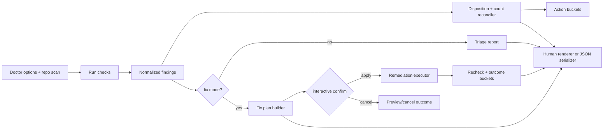

# Feature Specification: Doctor Diagnostics and Remediation UX

**Spec ID**: `034-doctor-diagnostics-and-remediation-ux`
**Taxonomy**: `CLI-UX`
**Created**: 2026-06-24
**Author**: PM Agent
**Status**: Draft
**Input**: Redesign `doctor` so diagnostics reduce triage effort, remediation builds trust before writes, and product model stays clear under failure.

---

## Request Classification

UX-forward rewrite. Not reverse-spec. Existing checks and fixes remain inputs, but report flow, write confidence, and recovery guidance should intentionally change where current behavior feels checker-centric instead of user-centric.

## Product Outcome

Make `doctor` feel like repo health assistant, not finding dump.

Success signals:

- users know within first screen whether repo is blocked, safe with warnings, or fixable now
- `--fix` feels reviewable and trustworthy before mutation
- manual work never gets buried under auto-fix noise
- repeat users can scan clean output fast while still trusting coverage happened

## Improvement Target Over Current Product

This redesign is deliberate uplift, not documentation of current report shape.

Target outcomes over current product:

- replace checker-centric reading order with action-centric triage
- replace weak fix-mode trust with mandatory remediation preview before writes
- replace mixed manual/auto-fix visual weight with explicit action buckets
- replace terse healthy output with short proof that coverage ran and nothing changed
- replace mode ambiguity with unmistakable diagnosis, preview-only, and apply-fix framing

## Current UX To Intentionally Supersede

1. Findings are grouped, but action priority still requires too much interpretation.
2. `--fix` and `--dry-run` are capable, but confidence-before-write contract is weaker than it should be.
3. Report structure centers check taxonomy more than user action ladder.
4. Manual-only findings can compete visually with auto-fixable issues.
5. Clean runs can feel terse in way that reduces trust coverage actually ran.

## User Goals

### Developer debugging setup

- See top blockers first.
- Know whether command can fix them.
- Know exact next command if command cannot fix them.

### Developer using remediation

- Review planned changes before write.
- Understand what will be fixed, skipped, or left manual.
- Trust command did not silently mutate unrelated files.

### CI / maintainer

- Get stable machine-readable status.
- Distinguish clean, warning, blocking, preview-only, and remediated outcomes.

## Scope

### In scope

- read-only `doctor`
- `doctor --fix`
- `doctor --fix --dry-run`
- first-screen triage, finding grouping, remediation preview, and final disposition
- project-file-first recovery guidance inside doctor output

### Out of scope

- new checker domains
- selective per-finding fix targeting
- interactive `init`/`regen` flow redesign
- adopt/migrate flows

## Non-Goals

- Preserve current section order because it mirrors implementation
- Preserve direct write-on-flag behavior if it weakens trust
- Hide complexity by collapsing meaningful manual work

## Design Principles

1. **Answer blocked status first**.
2. **Bucket by action, not subsystem**.
3. **Preview before mutate**.
4. **Manual work stays visible**.
5. **Clean runs prove coverage**.
6. **Mode copy must be unmistakable**.

## Canonical Interaction Model

### Doctor modes

Doctor has three user-visible modes only:

- `Diagnosis only`
- `Preview fix plan only`
- `Apply safe fixes`

Mode label MUST appear first line and MUST govern all copy below it.

### Disposition ladder

Every run MUST resolve to one top-level disposition:

- `Blocked`
- `Fixable now`
- `Manual follow-up only`
- `Healthy`

This disposition appears in first screen and final screen.

## Page Contract

### 1. Triage header

First visible output MUST contain five rows in fixed order:

1. `Mode`
2. `Disposition`
3. `Source inspected`
4. `Counts`
5. `Recommended next action`

`Counts` row MUST summarize:

- blocking issues
- safe auto-fixes available
- manual follow-up items
- passed checks

Rules:

- first screen fits in one terminal page for typical repos
- detailed checker names do not appear before triage buckets
- if source is legacy manifest, framing MUST say compatibility context explicitly

### 2. Action buckets

After triage header, human-readable output MUST present buckets in this order:

1. `Blocking issues`
2. `Safe auto-fixes available`
3. `Manual follow-up`
4. `Passed checks`

Rules:

- empty buckets omitted except `Passed checks` on healthy run
- each finding row shows short title, why it matters, and whether auto-fix exists
- fixable findings appear before manual-only findings inside mixed domains
- checker implementation taxonomy stays secondary metadata only

### 3. Finding row contract

Each finding row MUST contain, in one compact block:

- severity badge
- finding title
- user consequence
- action status: `auto-fix available`, `manual only`, `already healthy`
- optional `Learned from` source line for ambiguous config-origin cases

If details expand, order MUST be:

1. evidence
2. planned remediation or manual steps
3. affected files/artifacts

### 4. Remediation preview for `--fix` and `--fix --dry-run`

Before any mutation, fix modes MUST print `Fix plan` section with one row per remediation:

- finding name
- remediation action
- files/artifacts expected to change
- prerequisites or skip conditions
- safety class

Rules:

- preview printed in dry-run and live-fix modes
- dry-run headline MUST say `Preview fix plan only — no files changed`
- if nothing fixable, fix plan explicitly says so and routes to manual follow-up

### 5. Confirmation gate

Interactive `doctor --fix` MUST require explicit confirmation after fix plan.

Choices:

- `Apply fixes`
- `Cancel`

Rules:

- default focus `Cancel`
- if backup skipped or mutation broad, confirmation copy must restate risk plainly
- non-interactive mutation may proceed only after same fix plan printed first

### 6. Post-fix outcome screen

After remediation attempt, output MUST keep three buckets visible in fixed order:

1. `Fixed now`
2. `Skipped`
3. `Still requires manual action`

Rules:

- unresolved work can never be collapsed under success banner
- if fixes applied but blockers remain, final disposition remains `Blocked`
- if no files changed in dry-run, final screen repeats preview-only status

### 7. Healthy run screen

Healthy runs MUST remain short but confidence-building.

Required lines:

- source inspected
- checks run count
- no files changed
- next safe step

Optional cheerful phrasing allowed only after these facts.

## Interaction Rules

### Ordering rules

Detailed findings SHOULD be ordered by actionability:

1. environment blockers
2. canonical source / config integrity
3. generated-output drift
4. hygiene and advisory findings

Within each section:

- fixable first
- manual-only second
- passes last or summarized only

### Copy rules

Prefer:

- `Blocking issues`
- `Safe auto-fixes available`
- `Preview fix plan only`
- `Still requires manual action`
- `No files changed`

Avoid:

- ambiguous `warning` without consequence
- write-like success language in preview mode
- manifest-first steady-state guidance when project file exists

### Recovery guidance rules

When issues involve source authority or drift, guidance MUST route toward:

- shared project file review/update
- `regen` for regeneration from canonical intent
- `migrate` for legacy manifest bridge when relevant
- manual Git index cleanup only as explicit manual follow-up

### Empty and edge-state rules

- no project file and no manifest → `doctor` explains what source missing and points to `init`
- fix mode with only manual issues → no confirm gate, no fake fix plan, route to manual actions
- dry-run with zero planned fixes → explicitly state `Nothing to apply`
- failed remediation prerequisite → item moves to `Skipped` with reason

## State Behavior

- first-line mode label must match final-screen mode label exactly
- text and JSON outputs must encode same disposition states
- counts in triage header and outcome buckets must reconcile exactly
- preview plan item names must match post-fix result item names
- source inspected label persists through entire report

## Worked Examples

### Diagnose-only blocked repo

- first line `Diagnosis only`
- triage says `Blocked`
- `Blocking issues` appears first with consequence and manual/auto-fix status
- footer points to `doctor --fix` or `regen` depending issue class

### Dry-run remediation

- first line `Preview fix plan only`
- triage says `Fixable now`
- fix plan lists exact files/artifacts expected to change
- final state repeats `No files changed`

### Live fix with unresolved follow-up

- first line `Apply safe fixes`
- confirm gate before writes
- outcome buckets show `Fixed now`, `Skipped`, `Still requires manual action`
- final disposition may still be `Blocked`

## QA Scenario Scripts

1. Diagnose-only mixed repo: verify triage header precedes details and buckets appear in action order.
2. `doctor --fix --dry-run`: verify preview-only wording, fix plan rows, and no write-like success language.
3. Interactive `doctor --fix`: verify explicit confirmation after fix plan and before writes.
4. Remediation with partial success: verify `Fixed now`, `Skipped`, and `Still requires manual action` all visible.
5. Healthy repo: verify source, checks count, no-files-changed, and next step all shown.
6. Legacy-manifest-only repo: verify compatibility framing and migrate-oriented guidance.

## Acceptance Criteria

| # | Criterion |
| --- | --- |
| AC-1 | First visible doctor output is triage header with rows in exact order `Mode`, `Disposition`, `Source inspected`, `Counts`, `Recommended next action`, before any checker-detail sections. |
| AC-2 | `Counts` row always reports blocking issues, safe auto-fixes available, manual follow-up items, and passed checks, and these counts reconcile exactly with later buckets and final outcome buckets. |
| AC-3 | Human-readable findings render action buckets in exact order `Blocking issues`, `Safe auto-fixes available`, `Manual follow-up`, `Passed checks`, with empty buckets omitted except `Passed checks` on healthy run. |
| AC-4 | Diagnose-only, `--fix --dry-run`, and `--fix` live-apply modes use exact first-line labels `Diagnosis only`, `Preview fix plan only`, and `Apply safe fixes`, and final screens repeat matching mode labels. |
| AC-5 | Every fix-capable run prints `Fix plan` before any mutation, with one row per remediation naming finding, action, affected artifacts, prerequisites or skip conditions, and safety class. |
| AC-6 | Interactive `doctor --fix` offers exactly `Apply fixes` and `Cancel` after fix plan, with default focus `Cancel`; non-interactive mutation still prints identical fix plan before applying changes. |
| AC-7 | Post-fix output keeps exact bucket order `Fixed now`, `Skipped`, `Still requires manual action`; unresolved blockers remain visible and preserve top-level `Blocked` disposition when applicable. |
| AC-8 | Healthy runs state source inspected, checks run count, `No files changed`, and next safe step even when no issue buckets are rendered. |
| AC-9 | Dry-run output explicitly says `Preview fix plan only — no files changed`, shows planned auto-fixes separately from manual-only work, and never uses success language implying fixes were applied. |
| AC-10 | Recovery guidance for source authority, drift, or compatibility routes toward shared project file review, `regen`, `migrate`, or explicit manual Git cleanup, never stale manifest-first steady-state advice. |
| AC-11 | Automated coverage exists for triage ordering, count reconciliation, fix-plan preview, confirmation defaults, partial-success outcome buckets, healthy-run trust summary, and JSON/text disposition parity. |
| AC-12 | Current report structure may change materially when needed to improve triage speed, mutation trust, and workflow teaching; current checker-first grouping is not acceptance authority. |

## Tradeoffs

- Stronger preview and confirmation add step to fix mode, but materially improve safety perception.
- Triage buckets abstract checker taxonomy, but make action clearer.
- Cleaner healthy output must still prove coverage to avoid false reassurance.
- Unattended fix flows may need stricter copy or flags; speed tradeoff acceptable for trust gain.

## Implementation Gap vs Current Product

Deliberate improvements still to build:

- `tool/commands/doctor.ts` already has rich checker and remediation data, but current report contract does not yet deliver action-bucket triage, stronger mode framing, or mandatory fix-plan-first trust flow.
- Current outcome reporting does not yet consistently preserve `Fixed now` vs `Skipped` vs `Still requires manual action` bucket visibility.
- `tool/cli/args.ts` help text still under-teaches diagnosis-only vs preview-only vs apply-fix workflow.

## Technical Design

### Architecture Ownership

- Checker implementations in `tool/commands/doctor.ts` keep diagnostic evidence gathering and remediation execution.
- New doctor report-model layer should transform raw findings into triage buckets, disposition, counts, fix plan rows, and post-fix outcome buckets.
- Remediation registry remains safety/source authority for `fixEligibility`, `safetyClass`, prerequisites, and planned artifact changes.
- Shared artifact-summary helper should be reused with `plan`/`regen`/conversion commands so changed-file language stays consistent.

### System Boundaries

- Checkers should not decide final bucket placement by printing strings. They emit severity, fixability, evidence, and remediation keys only.
- Report-model layer owns ordering: environment blockers, source authority/config integrity, generated-output drift, hygiene/advisory.
- Human-readable output and JSON both serialize same normalized doctor state. Legacy checker-group arrays may remain temporarily for compatibility, but disposition/count/bucket truth must come from normalized state.
- Fix executor only runs actions marked safe for unattended execution after fix plan is printed.

### Canonical Data Flow

### Interaction Policy Locks

- Shared top-level disposition enum: `Blocked`, `Fixable now`, `Manual follow-up only`, `Healthy`.
- Unattended `doctor --fix` may proceed after identical fix plan is printed. No extra opt-in flag in this spec. Guardrail: only `safe-unattended` remediations auto-run; `requires-manual-action` always stays manual/skip.
- Interactive `doctor --fix` always confirms after fix plan with default `Cancel`.
- Dry-run and live-fix use same plan builder and item naming so preview rows reconcile exactly with outcomes.

### JSON Contract Direction

- Add normalized top-level fields for `mode`, `disposition`, `counts`, `actionBuckets`, `fixPlan`, and `outcomeBuckets`.
- Preserve existing detailed arrays during rollout where practical to avoid breaking current automation/tests.
- Exit disposition derives from normalized final state, not from text renderer branch logic.

### Implementation Slices

1. Extract normalized finding/report-model layer from current checker output.
2. Add triage header, action buckets, and healthy-run proof output in human renderer.
3. Add fix-plan builder and confirmation gate before any mutation.
4. Add post-fix outcome bucket renderer plus count reconciliation.
5. Extend JSON output with normalized fields and adapt tests/help text.

### Risk Notes

- `doctor.ts` already large and multi-purpose. Must isolate transformation layer before editing copy.
- Count reconciliation easy to break when one finding maps to multiple actions. Need stable finding IDs and remediation IDs.
- Mixed legacy/new JSON can drift unless one normalized source drives both.
- Remediation artifact summaries can become vague if executors do not report changed files consistently.

### Test Plan

- Unit: disposition calculation, bucket placement, count reconciliation, fix-plan item generation, safety-class gating.
- Integration: triage header ordering, dry-run wording, interactive confirm default, partial-success bucket rendering, healthy-run trust summary.
- JSON contract: parity between normalized text states and machine states, including fix outcomes and exit disposition.
- Regression: legacy manifest compatibility guidance, manual-only runs skip fake confirm, failed prerequisites move items to `Skipped`.

## Architecture Decision Impact

aligned with current ADRs/foundation

Known repo gap: `docs/foundation.md` absent. ADR 001 remains authority.

## Open Questions

- None blocking for redesign. Future stricter unattended-fix policy can be separate CLI hardening follow-up if trust data says needed.

## Routing Decision

**Architect → PM**

Reason: Technical design locked for doctor report-model ownership, unattended safety policy, normalized JSON contract, and shared artifact-summary boundary. Ready for developer implementation planning.
