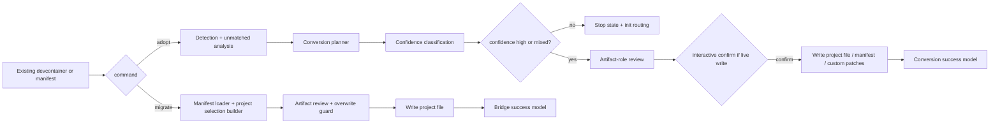

# Feature Specification: Adopt and Migrate Conversion Workflows

**Spec ID**: `035-adopt-and-migrate-conversion-workflows`
**Taxonomy**: `CLI-UX`
**Created**: 2026-06-24
**Author**: PM Agent
**Status**: Draft
**Input**: Redesign `adopt` and `migrate` so conversion feels trustworthy, teaches artifact roles clearly, and avoids surprise writes or false confidence.

---

## Request Classification

UX-forward rewrite. Not reverse-spec. Current conversion behavior is useful but artifact framing, confidence signaling, and write flow should intentionally change where current UX feels implementation-led instead of trust-led.

## Product Outcome

Make conversion commands answer three questions fast:

- Can tool map enough of my existing setup?
- What will stay managed vs preserved?
- What exactly will be written before anything changes?

Success signals:

- teams with existing hand-written devcontainers trust `adopt` analysis before write
- manifest-first repos understand `migrate` as low-risk bridge, not regeneration
- artifact roles become teachable in one pass: canonical, compatibility, preservation

## Improvement Target Over Current Product

This redesign is deliberate uplift, not documentation of current conversion output.

Target outcomes over current product:

- replace analysis-heavy but trust-light adoption with explicit confidence ladder and stop states
- replace artifact dumps with role-based review of canonical, compatibility, preservation, and generated artifacts
- replace weak pre-write review with mandatory artifact review before mutation
- replace utility-like migration messaging with bridge framing and replay handoff
- replace ambiguous success copy with explicit generated-output-changed versus unchanged teaching

## Current UX To Intentionally Supersede

1. `adopt` analysis is informative, but confidence level and conversion quality are not prominent enough.
2. Current artifact story still feels like implementation dump: project file, manifest, `custom/` patches, overwrite rules, backups.
3. Conversion write path needs stronger pre-write review and sharper low-confidence stop behavior.
4. `migrate` is strategically important but feels like technical utility instead of default bridge out of legacy workflow.
5. Current docs still foreground optional or deprecated flags in ways that dilute canonical model.

## User Goals

### Existing repo maintainer

- Know whether adoption is safe enough to try.
- See what will map cleanly and what will fall back to preservation.
- Avoid surprise overwrite of current artifacts.

### Manifest-first team

- Create canonical project file with minimal ceremony.
- Understand that generated output stays unchanged until replay.
- Get clear handoff to next command.

### Automation / reviewer

- Consume analysis as JSON.
- Audit artifact roles and write consequences.

## Scope

### In scope

- `adopt` analysis, dry-run, JSON, confirmation, write framing, overwrite/backup messaging
- `migrate` source discovery, overwrite guard, artifact framing, and next-step guidance
- artifact-role teaching inside both commands

### Out of scope

- redesign of overlay-detection heuristics
- new regeneration flow behavior
- doctor validation after conversion
- removal of compatibility manifest as product artifact without separate ADR follow-up

## Non-Goals

- Preserve current artifact narration because implementation already writes those files
- Let write mode proceed on weak confidence without stronger warning or stop
- Blur line between canonical project file and preservation patches

## Design Principles

1. **Conversion trust before convenience**.
2. **Show match quality, not only matched items**.
3. **Artifact roles must be explicit**.
4. **Low-confidence conversion stops early**.
5. **Migration feels like safe bridge, not scary rewrite**.
6. **Preview before any write**.

## Canonical Interaction Model

### Artifact role model

Commands MUST teach same three artifact roles everywhere:

- `Canonical shared intent` = repository project file
- `Compatibility artifact` = manifest kept for transition or compatibility
- `Preservation artifacts` = `custom/` patches or unmatched user customizations carried forward

Generated output is separate from all three and may remain unchanged until replay.

### Confidence ladder

`adopt` MUST classify analysis into one of:

- `High confidence`
- `Mixed confidence`
- `Low confidence`
- `No viable conversion`

Each class maps to recommendation:

- `safe to review`
- `review carefully`
- `use init instead`
- `use init instead`

## Page Contract

### `adopt` step 1: conversion confidence header

First visible output MUST contain six rows in fixed order:

1. `Mode`
2. `Source analyzed`
3. `Confidence`
4. `What will become managed`
5. `What will be preserved`
6. `Recommendation`

Rules:

- header appears before raw detection evidence
- counts may appear inside rows, not as separate dump
- if confidence low or no viable conversion, recommendation MUST stop write path by default

### `adopt` step 2: outcome-shape review

Human-readable analysis MUST present sections in fixed order:

1. `Will become managed overlays`
2. `Will be preserved in custom/`
3. `Will still need manual review`
4. `Artifacts that would be written`
5. `Why confidence is not higher` when not high confidence

Rules:

- managed section groups by user-visible capability where possible, not only detection source type
- preserved section explains preservation reason, not only file name
- manual review section distinguishes unknown, ambiguous, and unsupported cases
- explicit `none` states required

### `adopt` step 3: low-confidence stop state

When confidence is `Low confidence` or `No viable conversion`, default behavior MUST be stop after analysis.

Stop-state contract:

- no confirmation prompt
- no suggestion that write is normal next step
- recommended path = `init`
- optional force/override path, if retained, must be visibly exceptional and high-friction

### `adopt` step 4: mandatory artifact review before write

Before any write, `adopt` MUST show artifact-role table with columns:

- `Artifact`
- `Role`
- `Action`
- `Overwrite risk`
- `Backup`

Required rows when applicable:

- shared project file
- compatibility manifest
- preservation artifacts in `custom/`
- backup directory or backup skipped state

Rules:

- table appears in dry-run and live-write modes
- overwrite risk says `new`, `update`, `overwrite existing`, or `unchanged`
- backup cell says `create`, `skip`, or `not needed`, plus reason

### `adopt` step 5: confirmation gate

Interactive live write mode MUST require explicit confirmation after artifact review.

Choices:

- `Write conversion artifacts`
- `Cancel`

Rules:

- analysis-only and dry-run modes never ask for confirmation
- default focus `Cancel`
- if overwrite risk exists and backup skipped, confirmation copy must restate that plainly
- non-interactive live-write without clear approval must abort safely

### `adopt` step 6: success screen

Success output MUST use fixed sections in order:

1. `Written now`
2. `Preserved`
3. `Still needs review`
4. `Generated output status`
5. `Next step`

Rules:

- `Generated output status` must explicitly say whether output changed or stayed unchanged
- success may never imply fully validated conversion when preservation/manual review remain
- if compatibility manifest written, role stays secondary and transition-oriented

### `migrate` step 1: bridge header

First visible `migrate` output MUST contain five rows in fixed order:

1. `Mode`
2. `Legacy source found`
3. `Will write`
4. `Generated output`
5. `Recommended next action`

Rules:

- `Mode` label = `Legacy bridge`
- `Generated output` row MUST say `unchanged by this command`
- no regeneration-like success copy before write

### `migrate` step 2: write review

Before writing project file, `migrate` MUST show compact review:

- source manifest path
- target project file path
- overwrite guard state
- compatibility note: generated output stays same until `regen`

Interactive confirmation optional if command remains simple, but review screen mandatory.

### `migrate` step 3: bridge success

Success screen MUST say, in order:

1. project file created or updated
2. generated output unchanged
3. next command: `regen`
4. optional validation follow-up: `doctor`

## Interaction Rules

### Copy rules

Prefer:

- `Will become managed overlays`
- `Will be preserved`
- `Compatibility artifact`
- `Generated output unchanged`
- `Review before replay`

Avoid:

- implying one-to-one perfect conversion when preservation exists
- implying migration regenerated workspace
- foregrounding deprecated flags or legacy-first workflows

### Artifact teaching rules

- project file always presented as canonical shared intent
- compatibility manifest explicitly secondary when present
- preservation artifacts never described as equivalent to managed overlays
- conversion output must say what remains outside tool confidence envelope

### Empty and error states

- no manifest for `migrate` → explain missing legacy source and route to `init`
- existing project file without force → blocked with overwrite guidance
- `adopt` source directory missing → blocked before analysis with path correction hint
- `adopt` zero strong matches → stop state, route to `init`

## State Behavior

- confidence label persists from header to analysis summary to final decision screen
- artifact names and roles must match between preview and success output
- text and JSON analysis must align on managed/preserved/manual-review/confidence structure
- `migrate` must never relabel unchanged generated output as written output

## Worked Examples

### Strong adopt conversion

- header says `High confidence`
- outcome review shows most capabilities managed, small preserved patch set
- artifact review lists project file, compatibility manifest, `custom/`, backup plan
- success says generated output status and next step `regen`

### Weak adopt conversion

- header says `Low confidence`
- analysis explains ambiguous mapping and large manual review area
- run stops before confirmation
- next step says use `init`

### Simple migrate bridge

- bridge header says legacy source found and generated output unchanged
- write review shows target project file path
- success points straight to `regen`, optional `doctor` after replay

## QA Scenario Scripts

1. High-confidence `adopt --dry-run`: verify confidence header, outcome-shape sections, artifact-role review, and no confirmation.
2. Low-confidence `adopt`: verify stop-before-write behavior and `init` routing.
3. Interactive `adopt` with overwrite risk and no backup: verify explicit risk in artifact review and confirmation gate.
4. `adopt` success with preservation artifacts: verify generated output status and manual-review reminders.
5. `migrate` with discovered manifest: verify bridge framing and explicit `generated output unchanged` messaging.
6. `migrate` overwrite block: verify no write and clear force guidance.

## Acceptance Criteria

| # | Criterion |
| --- | --- |
| AC-1 | `adopt` first visible output is confidence header with rows in exact order `Mode`, `Source analyzed`, `Confidence`, `What will become managed`, `What will be preserved`, `Recommendation`, shown before raw detection evidence. |
| AC-2 | Human-readable `adopt` analysis renders exact section order `Will become managed overlays`, `Will be preserved in custom/`, `Will still need manual review`, `Artifacts that would be written`, and `Why confidence is not higher` when confidence is not high, with explicit `none` states where relevant. |
| AC-3 | `adopt` confidence classes map to recommendation states exactly as specified, and `Low confidence` / `No viable conversion` paths stop before confirmation or write by default and route users to `init`. |
| AC-4 | Any write-capable `adopt` mode prints artifact-role review before mutation, with columns `Artifact`, `Role`, `Action`, `Overwrite risk`, `Backup`, covering shared project file, compatibility manifest when applicable, preservation artifacts, and backup state. |
| AC-5 | Interactive live-write `adopt` offers exactly `Write conversion artifacts` and `Cancel` after artifact review, with default focus `Cancel`; analysis-only and dry-run modes never prompt for confirmation. |
| AC-6 | `adopt` success output follows exact order `Written now`, `Preserved`, `Still needs review`, `Generated output status`, `Next step`, and never implies fully validated conversion when preservation or manual review remains. |
| AC-7 | `migrate` first visible output is bridge header with rows in exact order `Mode`, `Legacy source found`, `Will write`, `Generated output`, `Recommended next action`, and `Generated output` explicitly says unchanged by this command. |
| AC-8 | `migrate` always shows write review before project-file mutation, including source manifest path, target project file path, overwrite guard state, and note that generated output stays unchanged until `regen`. |
| AC-9 | `migrate` success output states project file created or updated, generated output unchanged, `regen` as default next command, and optional `doctor` follow-up. |
| AC-10 | Both commands use project-file-first artifact language that keeps compatibility manifest secondary and preservation artifacts distinct from managed overlays, even if current docs or copy differ. |
| AC-11 | JSON output remains available for `adopt` analysis and semantically aligned with confidence, managed/preserved/manual-review, and artifact-write structures used in human-readable output. |
| AC-12 | Automated coverage exists for confidence-header visibility, low-confidence stop behavior, artifact-role review, overwrite guards, migrate bridge review, generated-output-unchanged messaging, and success follow-up guidance. |

## Tradeoffs

- Stronger confidence gating may stop some conversions earlier, but prevents false-success trust breaks.
- More artifact explanation adds output length, but reduces canonical-vs-compatibility confusion.
- Making `migrate` more prominent may de-emphasize familiar manifest habits; acceptable because product model already changed.
- Dual-artifact write story remains inherently complex while compatibility manifest stays standard output; copy must absorb that honestly.

## Implementation Gap vs Current Product

Deliberate improvements still to build:

- `tool/commands/adopt.ts` already performs deep analysis, but current UX under-surfaces confidence ladder, low-confidence stop behavior, and artifact-role review before write.
- `tool/commands/migrate.ts` still reads like utility output and does not yet teach bridge framing, generated-output-unchanged status, or review-before-write contract strongly enough.
- `tool/cli/args.ts` help text still under-teaches migration as bridge and adoption as confidence-rated conversion.

## Technical Design

### Architecture Ownership

- `tool/commands/adopt.ts` keeps detection, unmatched-item extraction, and conversion write execution.
- New conversion-planner layer should own confidence classification, managed/preserved/manual-review grouping, artifact-role review rows, and stop-state decisions.
- `tool/commands/migrate.ts` keeps manifest loading and project-file materialization, but should consume shared artifact-role and overwrite-guard helpers.
- Shared artifact metadata model should be reused by `adopt`, `migrate`, `regen`, and `doctor` for canonical/compatibility/preservation/generated artifact labels.

### System Boundaries

- Detection engine reports evidence only. Confidence class must not be inferred by renderer ad hoc.
- Confidence classification belongs in conversion planner, not presentation, because stop-state/write-eligibility depends on it.
- `--force` remains overwrite guard only. It must not silently become low-confidence bypass.
- This spec does not introduce low-confidence live-write override. Low-confidence and no-viable states stop after analysis and route to `init`.

### Canonical Data Flow

### Interaction Policy Locks

- `adopt` confidence enum: `High confidence`, `Mixed confidence`, `Low confidence`, `No viable conversion`.
- Recommendation mapping locked in planner: high→safe to review; mixed→review carefully; low/no-viable→use `init` instead.
- Low-confidence/default-stop behavior is hard stop in this spec. No confirmation prompt, no write path.
- `migrate` always prints review screen before write; generated output stays explicitly unchanged until later `regen`.
- `migrate` does not add interactive confirmation in this redesign to preserve scripting simplicity; overwrite guard remains explicit and blocking unless `--force`.

### Artifact Model

Each write-capable conversion command should emit shared artifact rows with:

- artifact path
- role: canonical / compatibility / preservation / generated / backup
- action: create / update / overwrite / unchanged / skip
- overwrite risk
- backup disposition and reason

This same artifact model should feed `regen` preflight and doctor remediation summaries later.

### JSON Contract Direction

- `adopt --json` should gain normalized `confidence`, `managed`, `preserved`, `manualReview`, and `artifactWrites` fields while retaining raw detections/unmatched evidence.
- `migrate` may stay text-first for now, but internal review model should still be structured so later JSON expansion is cheap.

### Implementation Slices

1. Add conversion planner and confidence classifier over current adopt analysis output.
2. Add adopt confidence header, outcome-shape sections, and low-confidence stop state.
3. Add shared artifact-role review table plus overwrite/backup summaries.
4. Add adopt success screen with explicit generated-output status.
5. Rebuild migrate framing/review/success on bridge model and shared artifact helpers.
6. Align CLI help/docs to bridge/conversion language.

### Risk Notes

- `adopt.ts` currently mixes analysis, printing, prompting, and writes. Must split planner from executor first.
- Confidence thresholds can feel arbitrary if not evidence-backed. Planner should expose reason strings and counts, not only label.
- Dual-artifact story remains cognitively heavy while compatibility manifest is standard output. Shared artifact roles reduce drift risk.
- Preventing low-confidence writes changes current power-user escape hatches. Safer default deliberate; document clearly.

### Test Plan

- Unit: confidence classification, recommendation mapping, artifact-row generation, overwrite-guard decisions.
- Integration: high-confidence dry-run review, low-confidence stop-without-confirm, overwrite-risk confirmation wording, migrate bridge review, success generated-output-unchanged messaging.
- JSON contract: adopt normalized fields align with raw detections and preserved/manual-review counts.
- Regression: `--force` only affects overwrite block, not confidence stop; project file remains canonical output; compatibility manifest stays secondary in copy.

## Architecture Decision Impact

aligned with current ADRs/foundation

Future change to stop writing compatibility manifest by default remains separate ADR/product decision.

Known repo gap: `docs/foundation.md` absent. ADR 001 remains authority.

## Open Questions

- Whether long-term `adopt` should make compatibility manifest optional remains open. Not blocker for current UX redesign because artifact role can already be made secondary and explicit.

## Routing Decision

**Architect → PM**

Reason: Technical design locked for conversion-planner ownership, low-confidence stop policy, shared artifact-role model, and migrate bridge behavior. Ready for developer implementation planning.
