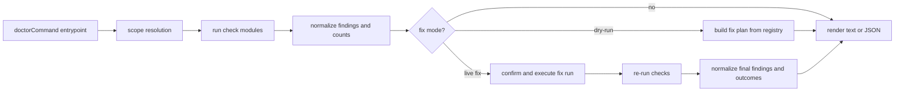
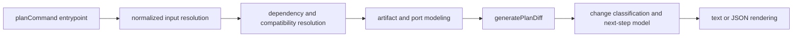

# Feature Specification: Doctor and Plan Command Modularization

**Spec ID**: `038-doctor-and-plan-command-modularization`
**Taxonomy**: `CLI-COMMAND`
**Created**: 2026-06-30
**Author**: PM Agent
**Status**: Final
**Input**: Modularize `tool/commands/doctor.ts` (~4313 lines) and `tool/commands/plan.ts` (~1371 lines) into maintainable command-specific module sets, while preserving current behavior and auditing whether any other command modules should receive the same treatment now.

---

## Request Classification

Technical, backend-heavy refactor. This is reverse-spec and behavior-preserving work, not a UX redesign.

The user-facing contracts already exist in live code, current tests, spec `033-cli-discovery-preview-and-fingerprint`, spec `034-doctor-diagnostics-and-remediation-ux`, and ADR `001`.

## Problem Statement

Two command modules remain materially monolithic even after `adopt` was modularized under spec `037`:

- `tool/commands/doctor.ts` is about **4313 lines** and currently mixes diagnostics, remediation registry definition, remediation execution, file mutation helpers, report normalization, JSON/text output shaping, interactive confirmation, and top-level CLI control flow in one file.
- `tool/commands/plan.ts` is about **1371 lines** and currently mixes dependency resolution, manifest loading, diff algorithms, planned-content reconstruction, file-impact analysis, watch-out classification, text rendering, and top-level CLI control flow in one file.

Observed repository evidence:

- `doctor.ts` currently contains roughly **40 named functions / exported render entrypoints / orchestration helpers** in one file.
- `plan.ts` currently contains roughly **12 named functions / exported helpers / orchestration helpers** in one file.
- `adopt.ts` has already been reduced to a thin command orchestrator backed by `tool/commands/adopt/{analysis,detection,presentation,synthesis,types,write}.ts`, which establishes a repo-local precedent for command modularization.
- Existing tests exercise both commands through broad top-level surfaces such as `tool/__tests__/commands.test.ts`, `tool/__tests__/ux-renderers.test.ts`, `tool/__tests__/qa-blockers.test.ts`, and `tool/__tests__/doctor-git-safety.test.ts`.

This creates four product/maintainability problems:

1. **Regression blast radius is too large** — routine fixes reopen unrelated logic in the same file.
2. **Ownership boundaries are unclear** — pure logic, filesystem/network checks, UX shaping, and mutation flows are interleaved.
3. **Targeted testing is harder than necessary** — many behaviors are protected only through large command-level tests.
4. **The repo now has inconsistent command architecture** — `adopt` is modularized, while `doctor` and `plan` still centralize most implementation details.

## Product Outcome

Make `doctor` and `plan` internally modular enough that maintainers can change, test, and reason about analysis, rendering, and side effects separately, while preserving current command behavior.

Success means:

- each command entrypoint becomes a thin orchestrator rather than the primary home for business logic
- pure logic can be tested without driving the entire CLI path
- write-side or environment-touching behavior is isolated from rendering and classification logic
- current CLI behavior, JSON semantics, and exit conditions remain materially unchanged
- maintainers gain a clear answer on whether any other command files require comparable modularization now

## Current Behavior To Preserve

### `doctor`

The refactor must preserve current `doctor` behavior established by live code, tests, spec `034`, and ADR `001`, including:

1. mode semantics for `Project diagnosis`, `Project fix preview`, `Project safe fixes`, and `Catalog validation`
2. current diagnostic domains, including environment, overlays, manifest, merge validation, port availability, project-file drift, parameters, dependencies, port cross-validation, `.env.example` drift, reproducibility, and Git-tracking safety
3. current remediation registry coverage and execution behavior for supported automatic fixes
4. current dry-run, interactive confirmation, live-fix, JSON, and diagnose-only flows
5. current verdict/count/action-bucket/report ordering defined by spec `034`
6. current project-file-first remediation authority required by ADR `001`
7. current exit-code behavior for diagnose-only, dry-run, manual-only, and unresolved-failure flows
8. exported surface currently used by tests and other repo code, especially `doctorCommand` and `renderDoctorReportModel`

### `plan`

The refactor must preserve current `plan` behavior established by live code, tests, spec `033`, and ADR `001`, including:

1. CLI input modes for overlay-list and manifest-driven planning
2. dependency resolution, auto-added overlays, stack compatibility filtering, and conflict detection behavior
3. file-impact prediction and `generatePlanDiff(...)` semantics
4. current diff classification behavior, including `First write`, `Change intent and regenerate`, `Replay canonical intent`, `Cleanup stale generated files`, and `No material change`
5. current JSON output semantics and current human-readable section order defined by spec `033`
6. current handling of repo project-file presence, generated-output presence, and next-step routing
7. exported surface currently used by tests and other repo code, especially `planCommand` and `generatePlanDiff`

## Scope

### In scope

- Refactoring `tool/commands/doctor.ts` into smaller ownership units.
- Refactoring `tool/commands/plan.ts` into smaller ownership units.
- Defining required behavior-preserving seams for each command.
- Preserving current CLI wiring and any exported helpers relied on by tests.
- Adding or updating automated coverage where extraction makes narrower tests appropriate.
- Auditing the rest of `tool/commands/*.ts` and explicitly answering whether any other command modules should join this modularization effort now.

### Out of scope

- Changing `doctor` or `plan` flags, CLI purpose, or primary UX contracts.
- Adding new diagnostics, remediations, or preview capabilities.
- Rewriting the `doctor` or `plan` copy beyond preservation needs.
- Reopening source-of-truth authority decisions already governed by ADR `001`.
- Refactoring `list`, `explain`, `hash`, or `migrate` into full module trees in this spec.
- Forcing a shared cross-command framework unless a narrow shared helper clearly reduces duplication without coupling unrelated command lifecycles.

## Non-Goals

- Reduce line count as a goal by itself.
- Re-spec UX already covered by specs `033` and `034`.
- Rewrite tests only to match a new internal structure when behavior has not changed.
- Bundle unrelated cleanup of all command files just because `doctor` and `plan` are large.

## Architect Reconciliation Summary

This draft is implementation-ready because the architect concerns are now resolved into explicit refactor constraints rather than left implicit in code review.

Required interpretation for implementation:

- `tool/commands/doctor.ts` and `tool/commands/plan.ts` stay as the stable command entrypoints and re-export surfaces, but become thin orchestrators rather than mixed-ownership implementation files.
- Each command must compute or consume one normalized command-local model so text rendering, JSON output, fix previews, live-fix outcomes, and change classifications do not drift across duplicated recomputation paths.
- Extraction should prefer command-specific modules first. Shared utilities are allowed only when they are narrow, pure, and already proven by at least two real consumers.
- Implementation may choose exact filenames, but ownership boundaries, export stability, data-flow invariants, and validation expectations in this spec are mandatory.
- The command-audit conclusion is part of scope control: `doctor` and `plan` are the only same-treatment modularization candidates now.

## Refactor Outcome Contract

### `doctor` target boundary

Implementation may choose exact filenames, but the resulting design must clearly separate these concern groups:

1. **Input and scope resolution**
    - option validation
    - working directory / output path / manifest path resolution
    - selected-overlay scope resolution
    - mode/scope determination

2. **Diagnostic checkers**
    - environment/tooling checks
    - overlay validation
    - manifest/merge/port/drift/parameter/dependency checks
    - reproducibility and Git-tracking safety checks

3. **Finding normalization and report modeling**
    - check-result to finding conversion
    - disposition/counts/action-bucket calculation
    - remediation ordering and outcome summaries

4. **Remediation registry and execution**
    - remediation metadata
    - individual fix executors
    - fix-run orchestration and re-check behavior

5. **Presentation and command orchestration**
    - human-readable report rendering
    - JSON shaping from shared normalized state
    - confirmation gating
    - exit-code dispatch

The `doctor` entrypoint should remain the canonical orchestration surface, but not the main implementation home for all five concern groups.

### `plan` target boundary

Implementation may choose exact filenames, but the resulting design must clearly separate these concern groups:

1. **Input resolution and validation**
    - overlay-list vs manifest input resolution
    - manifest loading/validation
    - overlay existence validation
    - stack and port-offset validation

2. **Overlay resolution semantics**
    - dependency expansion
    - compatibility filtering
    - conflict detection
    - verbose explanation models

3. **Planned artifact and impact modeling**
    - file list derivation
    - port mapping derivation
    - planned devcontainer reconstruction
    - diff generation and change classification

4. **Presentation and normalized output models**
    - current-setup summary
    - planned-changes/watch-outs assembly
    - text rendering and JSON-ready model shaping
    - next-step derivation inputs

5. **Command orchestration**
    - CLI option branching
    - diff/non-diff dispatch
    - final console output and exit behavior

The `plan` entrypoint should remain the canonical orchestration surface, but not the main implementation home for all five concern groups.

## Recommended Module Layout

This spec does not require exact filenames, but recommends following the successful `adopt` pattern with command-specific sibling directories.

### Recommended `doctor` layout

- `tool/commands/doctor.ts`
    - thin CLI entrypoint and stable export surface
- `tool/commands/doctor/types.ts`
    - shared types and normalized command-local models
- `tool/commands/doctor/scope.ts`
    - working-dir, output-path, manifest-path, overlay-scope, and mode resolution
- `tool/commands/doctor/checks.ts`
    - high-level aggregation of all checks
- `tool/commands/doctor/checks/*` or equivalent grouped modules
    - environment, overlays, manifest, parameters, dependencies, reproducibility, git-safety, etc.
- `tool/commands/doctor/findings.ts`
    - report-to-finding conversion, ordering, disposition, counts, summaries
- `tool/commands/doctor/fixes.ts`
    - remediation registry and execution dispatcher
- `tool/commands/doctor/fixes/*` or equivalent grouped modules
    - manifest migration, regeneration, parameters, dependency, env example, reproducibility, node, gitignore
- `tool/commands/doctor/presentation.ts`
    - report-model construction, text rendering inputs, JSON shaping helpers

Recommended rule: checkers stay mostly pure except where environment/filesystem/process access is inherent; rendering code must not own remediation decisions; remediation code must not own verdict framing.

### Recommended `plan` layout

- `tool/commands/plan.ts`
    - thin CLI entrypoint and stable export surface
- `tool/commands/plan/types.ts`
    - shared types and normalized command-local models
- `tool/commands/plan/input.ts`
    - CLI/manifest input parsing, deduping, and validation
- `tool/commands/plan/resolution.ts`
    - dependency expansion, compatibility filtering, conflicts, verbose explanation modeling
- `tool/commands/plan/diff.ts`
    - line diff helpers, unified diff formatting, file-impact comparison
- `tool/commands/plan/artifacts.ts`
    - planned content reconstruction, file list derivation, port mapping derivation
- `tool/commands/plan/presentation.ts`
    - current-setup/planned-changes/watch-outs summaries, text rendering inputs, normalized JSON model shaping

Recommended rule: keep generic algorithmic helpers near `plan` first; do not prematurely promote them to shared utilities unless another stable consumer appears.

## Explicit Audit: Are Other Commands Candidates Now?

### Command inventory by current line count

| Command      | Approx. lines | Current status                                   | Candidate now?              | Decision                                                                 |
| ------------ | ------------: | ------------------------------------------------ | --------------------------- | ------------------------------------------------------------------------ |
| `doctor.ts`  |          4313 | Monolithic                                       | Yes                         | In scope for this spec                                                   |
| `plan.ts`    |          1371 | Monolithic                                       | Yes                         | In scope for this spec                                                   |
| `adopt.ts`   |           262 | Already thin orchestrator with extracted modules | No                          | Already addressed by spec `037`                                          |
| `hash.ts`    |           256 | Small command with some duplicated helper logic  | Not for full modularization | Revisit only if `plan` extraction creates an obvious shared utility seam |
| `list.ts`    |           227 | Small, cohesive                                  | No                          | Keep as-is                                                               |
| `explain.ts` |           222 | Small, cohesive                                  | No                          | Keep as-is                                                               |
| `migrate.ts` |           142 | Small, mostly orchestration                      | No                          | Keep as-is                                                               |

### Audit conclusion

**Conclusion: no other command should join this modularization spec now.**

- `doctor` and `plan` are the only remaining commands whose size and mixed responsibilities justify full command-level modularization.
- `hash` has limited duplicated logic with `plan` (`resolveDependencies`, manifest discovery), but its current size does not justify turning it into a parallel module tree. If `plan` extraction reveals a stable, low-coupling shared helper, that helper may be extracted as part of implementation, but **`hash` itself is not a same-treatment refactor candidate now**.
- `list`, `explain`, and `migrate` are small enough that forced modularization would add indirection without meaningful maintainability gain.
- `adopt` remains out of scope because spec `037` already completed the modularization pass for that command.

## Technical Design

### Architecture Ownership

#### `doctor`

- `tool/commands/doctor.ts`
    - owns CLI lifecycle only: option exclusivity checks, mode selection, high-level branching for diagnose vs dry-run vs live-fix, console/exit dispatch, and stable re-exports
- `tool/commands/doctor/scope.ts`
    - owns working directory, manifest path, output path, selected-overlay resolution, and scope-label derivation
- `tool/commands/doctor/checks/**`
    - own evidence gathering only
    - should return command-local check models; they must not decide verdict text, bucket placement, or process exits
- `tool/commands/doctor/findings.ts`
    - owns check-to-finding normalization, ordering, count strips, disposition, and fix-plan inputs
- `tool/commands/doctor/fixes/**`
    - own remediation registry metadata plus fix execution primitives
    - must not render output or recompute verdict framing
- `tool/commands/doctor/presentation.ts`
    - owns `renderDoctorReportModel(...)`, JSON-ready model shaping, and post-fix section assembly from normalized state only

Recommended checker grouping for `doctor`:

- `checks/environment.ts`
- `checks/overlays.ts`
- `checks/manifest.ts`
- `checks/merge.ts`
- `checks/ports.ts`
- `checks/drift.ts`
- `checks/parameters.ts`
- `checks/dependencies.ts`
- `checks/reproducibility.ts`
- `checks/git-safety.ts`
- one small `checks/index.ts` aggregator only if it stays orchestration-only

Recommended fix grouping for `doctor`:

- `fixes/registry.ts`
- `fixes/manifest.ts`
- `fixes/regeneration.ts`
- `fixes/parameters.ts`
- `fixes/dependencies.ts`
- `fixes/node.ts`
- `fixes/gitignore.ts`
- optional `fixes/run.ts` for multi-fix orchestration and re-check sequencing

#### `plan`

- `tool/commands/plan.ts`
    - owns CLI lifecycle only: input-mode branch, diff/non-diff dispatch, final exit behavior, and stable re-exports
- `tool/commands/plan/input.ts`
    - owns CLI/manifest validation, deduping, manifest parse errors, and normalized input model creation
- `tool/commands/plan/resolution.ts`
    - owns dependency expansion, stack compatibility filtering, conflict detection, and verbose explanation models
- `tool/commands/plan/artifacts.ts`
    - owns file list derivation, port mapping derivation, and planned devcontainer reconstruction
- `tool/commands/plan/diff.ts`
    - owns line diff helpers, unified diff formatting, and `generatePlanDiff(...)`
- `tool/commands/plan/presentation.ts`
    - owns change classification inputs, summary/watch-out assembly, text rendering, and JSON-ready normalized output

### System Boundaries

- `doctor` checkers may touch filesystem, subprocesses, network sockets, YAML/JSON parsing, and schema helpers, but they should return plain data structures and no console output.
- `doctor` fix executors may mutate project files or generated output per ADR `001`, but Git-index mutation must remain manual guidance only.
- `doctor` presentation must consume normalized findings/fix-run state rather than re-reading files or re-running checks.
- `plan` must compute one canonical normalized plan model, then derive both text and JSON output from that same model.
- `plan` diff generation must stay downstream of artifact modeling; presentation must not recompute file or overlay changes independently.
- Shared helper extraction across commands is allowed only for narrow pure utilities with at least two real consumers and no command-lifecycle knowledge.

### Canonical Data Flow

#### `doctor`

Invariant: the same normalized finding model must feed diagnose-only output, dry-run fix preview, live-fix preview, post-fix report, and JSON payloads.

#### `plan`

Invariant: `generatePlanDiff(...)`, change classification, watch-outs, and JSON/text summaries must all read from the same resolved overlay/artifact model.

### Export Stability

Keep these import surfaces stable at current entry paths during and after extraction:

- `tool/commands/doctor.ts`
    - `doctorCommand`
    - `renderDoctorReportModel`
- `tool/commands/plan.ts`
    - `planCommand`
    - `generatePlanDiff`
    - `PlanDiffResult`

If implementation moves any of these functions internally, `doctor.ts` and `plan.ts` should re-export them explicitly so CLI wiring and tests under `tool/__tests__/commands.test.ts`, `tool/__tests__/qa-blockers.test.ts`, and `tool/__tests__/ux-renderers.test.ts` do not need import-path churn.

### Recommended Implementation Sequence

1. **Define types and seams first**
    - add command-local `types.ts` files
    - move shared interfaces and normalized models before moving behavior
2. **Extract pure/pure-ish modules before IO-heavy runners**
    - `plan`: `diff.ts`, `resolution.ts`, `artifacts.ts`, then `presentation.ts`
    - `doctor`: `findings.ts`, `presentation.ts`, then checker/fix modules
3. **Extract `doctor` checks in vertical slices**
    - start with low-coupling groups (`environment`, `overlays`, `manifest`, `merge`, `ports`)
    - then move project-file-aware groups (`drift`, `parameters`, `dependencies`, `env-example`, `reproducibility`, `git-safety`)
4. **Extract `doctor` fix execution last**
    - keep fix-plan semantics stable while moving registry and executor functions
    - preserve the current re-check-after-fix behavior as one orchestration slice
5. **Thin entrypoints only after parity is proven**
    - `doctor.ts` and `plan.ts` should become readable orchestration files, not intermediate dumping grounds

### Risk Notes

- `doctor` currently interleaves checks, remediation metadata, file mutation, re-check orchestration, and presentation in one module; preview/live-fix drift is the highest-risk seam.
- `plan` currently keeps dependency expansion, planned artifact modeling, diff logic, and text/JSON shaping close together; splitting these across multiple recomputation paths would create classification drift, especially around `Replay canonical intent`.
- `hash.ts` duplicates `resolveDependencies(...)` and manifest discovery in ~256 lines, but that is a helper-sharing signal, not command-tree-refactor evidence. Prefer to finish `plan` extraction first, then decide whether a tiny shared pure helper is justified.

### Test Plan

Keep command-level regression tests and add narrower module tests where extraction creates durable seams.

#### Preserve current top-level coverage

- `tool/__tests__/commands.test.ts`
    - `planCommand(...)`, `generatePlanDiff(...)`, `doctorCommand(...)`
- `tool/__tests__/ux-renderers.test.ts`
    - plan summary ordering, replay headline placement, doctor report rendering
- `tool/__tests__/qa-blockers.test.ts`
    - `renderDoctorReportModel(...)` and doctor gating behavior
- `tool/__tests__/doctor-git-safety.test.ts`
    - git safety findings and fix constraints

#### Add focused module coverage

Recommended new tests:

- `tool/__tests__/plan-resolution.test.ts`
    - dependency expansion order/parity
    - compatibility filtering
    - conflict modeling and verbose explanation reasons
- `tool/__tests__/plan-diff.test.ts`
    - unified diff helpers
    - created/modified/overwritten/removed classification
    - `generatePlanDiff(...)` edge cases without full command setup
- `tool/__tests__/plan-presentation.test.ts`
    - `Replay canonical intent` vs `Change intent and regenerate`
    - watch-out assembly and JSON/text parity from one normalized model
- `tool/__tests__/doctor-findings.test.ts`
    - check-to-finding conversion, ordering, disposition, count-strip parity
- `tool/__tests__/doctor-fixes.test.ts`
    - registry lookup, fix-plan assembly, executor outcome mapping, re-check summary handling
- targeted checker tests under either grouped files or existing suites
    - especially `parameters`, `dependencies`, `reproducibility`, and `git-safety`, which carry most domain nuance

#### Validation commands

Minimum implementation validation:

- `npm run lint`
- targeted Vitest runs for added `doctor` / `plan` module tests plus existing command-level suites
- `npm test` before merge if the refactor touches execution ordering broadly or if targeted coverage does not convincingly prove parity

## Constraints

- Keep ESM import rules from `AGENTS.md` (`.js` extensions in imports).
- Do not edit `dist/`.
- Preserve project-file-first behavior and remediation authority required by ADR `001`.
- Preserve all existing command-level exported entry surfaces relied on by tests.
- Avoid introducing cyclic dependencies between command modules and schema/questionnaire/UX layers.
- Prefer command-specific modules first over premature cross-command abstraction.

## Acceptance Criteria

| #     | Criterion                                                                                                                                                                                                                                                         |
| ----- | ----------------------------------------------------------------------------------------------------------------------------------------------------------------------------------------------------------------------------------------------------------------- |
| AC-1  | `tool/commands/doctor.ts` is no longer the monolithic home for scope resolution, checks, findings, remediations, presentation, and orchestration; those concern groups are split into modular units with explicit boundaries.                                     |
| AC-2  | `tool/commands/plan.ts` is no longer the monolithic home for input resolution, dependency/conflict logic, diff generation, artifact-impact modeling, presentation, and orchestration; those concern groups are split into modular units with explicit boundaries. |
| AC-3  | `doctor` behavior remains materially unchanged across diagnose-only, `--fix --dry-run`, interactive `--fix`, JSON, project-scoped, and catalog-validation flows, including current verdict framing, bucket ordering, remediation behavior, and exit conditions.   |
| AC-4  | `plan` behavior remains materially unchanged across overlay-list, manifest-driven, diff, non-diff, text, and JSON flows, including dependency resolution, compatibility filtering, conflict handling, change classification, and exit conditions.                 |
| AC-5  | `doctorCommand`, `renderDoctorReportModel`, `planCommand`, and `generatePlanDiff` remain available at their current command entry paths with equivalent behavior, either directly or via explicit re-exports.                                                     |
| AC-6  | JSON output for both commands remains semantically aligned with current behavior; modularization does not create separate recomputation paths that drift from human-readable output.                                                                              |
| AC-7  | Extracted pure or mostly pure modules gain focused automated coverage where it materially reduces reliance on only large command-level tests, while retaining top-level regression tests for command behavior.                                                    |
| AC-8  | Implementation validation includes `npm run lint` plus targeted doctor/plan test coverage; if targeted coverage is insufficiently isolated, `npm test` is required before merge.                                                                                  |
| AC-9  | No other command is fully modularized in this change unless it is a narrow helper extraction directly supporting `doctor` or `plan`; `list`, `explain`, `hash`, `migrate`, and `adopt` remain out of scope as command-tree refactors.                             |
| AC-10 | The implementation documents, in code structure and tests, whether any helper duplication shared with `hash` should remain local to `plan` or move into a narrow shared utility without changing `hash`’s command contract.                                       |

## Validation Expectations

Minimum implementation validation for handoff:

- targeted tests covering extracted `doctor` and `plan` modules
- existing command-level tests that protect `doctor` and `plan` behavior
- `npm run lint`
- `npm test` if targeted command/module execution is not sufficient to prove parity

Validation should explicitly cover:

### `doctor`

- scope/mode resolution parity
- diagnostic finding parity across major check groups
- remediation ordering and fix-run outcome parity
- dry-run vs live-fix preview parity
- text/JSON/report-model parity
- exit-code parity for blocked, fixable, manual-only, and healthy cases

### `plan`

- dependency resolution parity
- compatibility filtering and conflict detection parity
- `generatePlanDiff(...)` parity
- change classification parity, especially `Replay canonical intent`
- current-setup/planned-changes/watch-outs parity
- text/JSON parity and exit-code parity

## Risks and Unknowns

### Main risks

- `doctor` has especially high drift risk because diagnostics, fix execution, and presentation are tightly interwoven in one file today.
- `plan` has drift risk where diff modeling, file synthesis, and summary rendering might recompute from slightly different inputs after extraction.
- Over-sharing helpers between `plan` and `hash` too early could create cross-command coupling without enough proof of long-term reuse.

### Known repo gaps

- `docs/foundation.md` is absent, so ADR `001` remains the relevant architecture authority.
- Repo contains an empty `docs/specs/037-doctor-command-modularization/` directory, which is workflow hygiene noise but does not block this draft.

## Architecture Decision Impact

Aligned with current ADR authority.

This refactor preserves ADR `001` by keeping project-file-first replay/remediation authority unchanged. No ADR amendment is required for this behavior-preserving modularization work.

## Open Questions

- None blocking for PM. The recommended direction is command-specific extraction first, with any cross-command helper sharing kept narrow and evidence-driven.

## Routing Decision

**PM → Developer**

Next role: Developer.

Reason: architect guidance is now reconciled into explicit module boundaries, export-stability rules, normalized data-flow constraints, audit scope limits, and validation expectations. Product scope, UX preservation, and technical direction are concrete enough for implementation without additional UX or architecture discovery.

## Implementation Notes

- Extracted `tool/commands/doctor.ts` into command-specific modules under `tool/commands/doctor/` for checks, findings, fixes, presentation, scope resolution, and shared command-local types while keeping `doctorCommand` and `renderDoctorReportModel` stable at the command entry path.
- Extracted `tool/commands/plan.ts` into command-specific modules under `tool/commands/plan/` for input resolution, overlay resolution, planned artifact helpers, diff generation, presentation, and shared command-local types while keeping `planCommand`, `generatePlanDiff`, and `PlanDiffResult` stable at the command entry path.
- Added focused module tests for plan resolution helpers, diff helpers, doctor finding normalization, and doctor fix planning/outcome summaries to reduce reliance on only command-level regression coverage.
- Confirmed the audit conclusion in implementation: `doctor` and `plan` were the only command-tree modularization candidates addressed now; no other command was converted beyond keeping `hash` helper duplication local until a second stable consumer justifies shared extraction.
- Validation run: `npm run lint`, targeted Vitest runs for doctor/plan-related suites and focused module tests, and `npm test`.

**QA Status**: Passed

## QA Feedback

Resolved. `tool/commands/doctor.ts` and `tool/commands/plan.ts` now act as thin orchestrators over command-local modules, stable entry-path exports (`doctorCommand`, `renderDoctorReportModel`, `planCommand`, `generatePlanDiff`) are preserved, focused module tests back the extracted pure seams, and command-level regression suites still cover doctor/plan UX, JSON, diff, and fix flows. The candidate-audit conclusion is supported by repo evidence: `hash.ts`, `list.ts`, `explain.ts`, and `migrate.ts` remain comparatively small/cohesive, while `hash` helper duplication still stays local rather than forcing a broader command-tree refactor.
