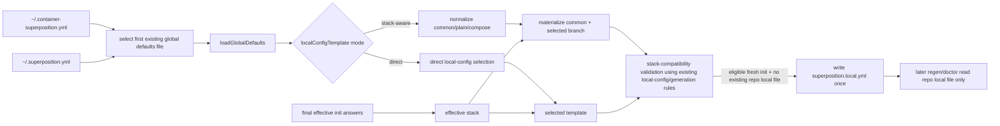

# User-Scoped Global Defaults with Stack-Aware Local Templates

**Spec**: `042-global-default-configuration`
**Status**: Final
**Created**: 2026-07-15
**Priority**: P2
**Product Approval**: approved
**Architecture Review**: approved
**UX Review**: not-needed

## Description

Extend the existing init-only user-scoped global defaults feature so `localConfigTemplate` can materialize different repository-local defaults for `stack: plain` vs `stack: compose`, while still supporting shared defaults such as shell aliases. This slice also changes global-default filename policy so docs and examples treat `~/.superposition.yml` as the primary user-facing filename, while runtime discovery still prefers the more specific legacy `~/.container-superposition.yml` when both files exist. This must continue to cover compose-specific local defaults such as persistent bash history without turning the home-directory file into a replay authority.

## Evidence

- `docs/foundation.md` — repo-owned project and local config remain the only canonical replay/runtime inputs.
- `docs/adr/adr001-project-file-first-replay-and-regeneration.md` — hidden home-directory state must not affect replay determinism.
- `docs/specs/022-local-superposition-config/spec.md` — local config is repository-root only and owns local `env`, `mounts`, `shell`, `customizations`, `portOffset`, and `ports`.
- `docs/specs/019-project-mounts/spec.md` — mount routing is stack-aware and target semantics differ between `devcontainerMount` and `composeVolume`.
- `docs/specs/024-project-ports/spec.md` and `docs/specs/025-variable-expansion-consolidation/spec.md` — plain vs compose variable handling differs; compose preserves `${VAR}` expressions verbatim while plain may resolve some expressions at generation time.
- `docs/specs/041-local-port-conflict-overrides/spec.md` — stack-aware local behavior should stay owned by the existing local-config and stack model rather than inventing a second semantics layer.
- `tool/schema/project-config.ts` — current implementation supports only a single non-stack-aware `localConfigTemplate: LocalProjectConfigSelection`.
- `docs/superposition-yml.md` — current docs already position `shell` as the correct surface for aliases/snippets and `mounts` as the correct surface for stack-aware mount routing.

## Problem Statement

The current global defaults slice can scaffold one `superposition.local.yml` template, but it cannot express that some local defaults are common across all stacks while others differ by stack. In practice:

- plain and compose may need different mount targets for the same intent,
- compose defaults may need `${HOME}` or similar expressions preserved for compose/runtime resolution rather than normalized through a plain-stack mental model,
- users want common local shell aliases across repos, and
- compose users want an easy way to default persistent bash history setup without hand-copying a local config recipe into every new repo.

Without stack-aware templating, users either keep one lowest-common-denominator template, manually edit each new repo after `init`, or push personal shell/history choices into shared config.

## User Goals / Jobs To Be Done

- Reuse one personal global defaults file across both plain and compose repos.
- Share common local conveniences like shell aliases across all new repos.
- Apply compose-only local defaults, including persistent bash history setup, only when the chosen stack is compose.
- Preserve existing init-only scope so replay commands still ignore the home-directory file.

## Success Signals

- A user can define `common` local defaults plus stack-specific local defaults in one global file.
- Eligible fresh `init` writes a repo-root `superposition.local.yml` that matches the selected stack without manual edits.
- Compose users can default a persistent bash history pattern via the existing local-config field surface.
- Docs consistently present `~/.superposition.yml` as the primary global-defaults filename.
- Existing global defaults files that use the legacy single-template shape continue to work unchanged, including precedence when both filenames exist.

## Goals

- Make `~/.superposition.yml` the documented primary init-only global-defaults filename.
- Keep `~/.container-superposition.yml` supported as a legacy/specific init-only global-defaults filename.
- Prefer `~/.container-superposition.yml` over `~/.superposition.yml` when both exist.
- Extend `localConfigTemplate` to support stack-aware materialization for `plain` and `compose`.
- Support stack-independent local defaults such as common shell aliases.
- Make compose-specific persistent bash history defaults expressible through `localConfigTemplate` using existing local-config fields.
- Preserve current local-config and stack semantics; do not invent separate global-template-only routing rules.

## Non-Goals

- Changing `regen`, `doctor`, `plan`, `adopt`, `migrate`, `list`, `hash`, or replay-style `init` behavior.
- Adding any third global-default discovery location beyond `~/.container-superposition.yml` and `~/.superposition.yml`.
- Adding a second local runtime merge layer outside repo root.
- Introducing a new first-class `history` schema field in this slice.
- Resolving or expanding `${HOME}`, `${localEnv:HOME}`, or compose `${VAR}` expressions while reading the global defaults file.
- Overwriting or merging into an existing repo `superposition.local.yml`.

## Authority and References

This spec must align with:

- `docs/foundation.md`
- `docs/adr/adr001-project-file-first-replay-and-regeneration.md`
- `docs/specs/018-init-project-file/spec.md`
- `docs/specs/019-project-mounts/spec.md`
- `docs/specs/022-local-superposition-config/spec.md`
- `docs/specs/024-project-ports/spec.md`
- `docs/specs/025-variable-expansion-consolidation/spec.md`
- `docs/specs/041-local-port-conflict-overrides/spec.md`
- `docs/superposition-yml.md`
- CLI help/examples that mention `--ignore-global-defaults`

## Design

### Observed Behavior

Current behavior supports:

- `initDefaults` for a narrow shared-project bootstrap surface,
- one optional `localConfigTemplate` using the same shape as `superposition.local.yml`, and
- materialization only during eligible fresh `init` when the repo does not already have local config.

Current behavior does not support selecting different template content based on the effective stack chosen during `init`.

### Product / Behavior

#### Global file location and command scope

The init-only command scope stays the same, but filename discovery changes.

- supported discovery candidates are `~/.container-superposition.yml` and `~/.superposition.yml`
- documentation, examples, and user guidance must present `~/.superposition.yml` as the primary filename to create
- runtime discovery order for eligible `init` is:
    1. load `~/.container-superposition.yml` when it exists
    2. otherwise load `~/.superposition.yml` when it exists
    3. otherwise behave as though no global defaults file exists
- if both files exist, `~/.container-superposition.yml` wins entirely for that run; `~/.superposition.yml` is ignored
- warning/messaging contract for eligible `init`:
    - no warning is required when exactly one supported file exists; using either filename alone remains valid backward-compatible behavior
    - when both files exist, emit one concise non-fatal notice that `~/.container-superposition.yml` took precedence and `~/.superposition.yml` was ignored for that run
    - validation, conflict, and parse errors must reference the selected file path only so users know which file to edit
    - `--ignore-global-defaults` suppresses discovery, loading, validation, and precedence messaging for both supported filenames
- supported command scope remains eligible clean `init` only
- `--ignore-global-defaults` remains the one-run escape hatch
- replay and non-`init` commands continue to ignore both files entirely

#### `initDefaults`

No scope expansion in this slice. `initDefaults` remains unchanged.

#### `localConfigTemplate` shape

`localConfigTemplate` becomes a backward-compatible union with two allowed forms.

**Legacy single-template form** (still supported):

```yaml
localConfigTemplate:
    shell:
        aliases:
            ll: ls -alF
```

This is treated exactly as today's behavior.

**New stack-aware form**:

```yaml
localConfigTemplate:
    common:
        shell:
            aliases:
                ll: ls -alF
                gs: git status --short

    plain:
        mounts:
            - source: ${HOME}/.pi
              destination: /home/vscode/.pi
              type: bind
              target: devcontainerMount

    compose:
        mounts:
            - source: superposition-bash-history
              destination: /commandhistory
              type: volume
              target: composeVolume
        shell:
            snippets:
                - '[ -n "$BASH_VERSION" ] && export HISTFILE=/commandhistory/.bash_history'
                - '[ -n "$BASH_VERSION" ] && export PROMPT_COMMAND="${PROMPT_COMMAND:+$PROMPT_COMMAND; }history -a"'
```

Rules:

1. `localConfigTemplate` may be either:
    - a direct local-config template using the existing local-config field surface, or
    - a stack-aware object containing only `common`, `plain`, and/or `compose`.
2. Mixing direct local-config keys with `common` / `plain` / `compose` in the same `localConfigTemplate` is invalid.
3. `common`, `plain`, and `compose` each reuse the existing local-config field surface:
    - `env`
    - `mounts`
    - `shell`
    - `customizations`
    - `portOffset`
    - `ports`
4. Nested `$schema` keys remain unsupported inside `localConfigTemplate`, including inside `common`, `plain`, or `compose`.
5. If the effective merged template normalizes to an empty object, no repo-root `superposition.local.yml` is created.

#### Stack selection for template materialization

When eligible `init` completes successfully, the tool must determine the effective stack from the final init answers already chosen for that run.

- If effective `stack` is `plain`, materialize `common + plain`.
- If effective `stack` is `compose`, materialize `common + compose`.
- If the legacy direct form is used, materialize that direct form with no stack branching.

This decision happens only once, during `init` scaffold-time write of repo-root `superposition.local.yml`.

#### Merge semantics inside stack-aware templates

The effective scaffolded local config is produced by merging the selected stack branch onto `common` using the same semantics already approved for repository-root local config behavior wherever possible:

- `env`: deep merge by variable name; selected stack branch wins on conflicts.
- `mounts`: append `common` mounts first, then selected stack mounts.
- `shell.aliases`: merge by alias name; selected stack branch wins on conflicts.
- `shell.snippets`: append `common` snippets first, then selected stack snippets.
- `customizations`: deep merge; selected stack branch wins on scalar/object conflicts.
- `portOffset`: selected stack branch overrides `common` when defined.
- `ports`: selected stack branch replaces `common` when defined, including `ports: []`.

No new template-only merge rules may diverge from local-config authority without a future spec.

#### Variable and mount-target expectations

`localConfigTemplate` remains a **scaffold source**, not a resolver.

Therefore:

- the tool must not expand `${HOME}`, `${localEnv:HOME}`, `${VAR}`, or `${VAR:-default}` while reading or materializing the template,
- authored mount values and shell snippets are copied into repo-root `superposition.local.yml` structurally unchanged except for normal YAML serialization, and
- stack-specific template branches exist so users can choose the correct target kind and literal expression for the selected stack.

Examples:

- plain-stack defaults can use `target: devcontainerMount`
- compose-stack defaults can use `target: composeVolume`
- compose-stack defaults may intentionally preserve `${HOME}` or compose-style `${VAR}` expressions for later compose/runtime resolution

#### Common shell aliases and compose bash history defaults

This slice explicitly supports two important uses of stack-aware local templates:

1. **Common aliases/snippets across all stacks** via `localConfigTemplate.common.shell`.
2. **Compose-only persistent bash history defaults** via `localConfigTemplate.compose` using existing local-config fields.

Minimum supported compose bash-history outcome:

- a compose-appropriate persistent mount is scaffolded into repo-root local config, and
- guarded shell initialization needed to persist `.bash_history` is scaffolded through `shell.snippets`, or an implementation-equivalent productized output that still uses only the approved local-config runtime surfaces.

This slice does **not** require a new first-class history key. The product may later add one in a separate spec if the generic mount+shell approach proves insufficient.

#### Backward compatibility

- Existing global defaults files with legacy `localConfigTemplate` continue to work unchanged.
- Existing users may keep `~/.container-superposition.yml`; moving to `~/.superposition.yml` is optional.
- Existing repos with an already-present `superposition.local.yml` remain untouched.
- Existing non-stack-aware validation and init-only scope remain unchanged unless explicitly extended above.

## Technical Design

### Architecture Ownership

- `tool/schema/project-config.ts` owns global-defaults schema parsing, supported global-filename constants, mixed-shape rejection, branch normalization, and stack-aware branch structure validation once a candidate file has been selected.
- `tool/cli/run.ts` owns command-scope gating, candidate-file discovery/preference application, choosing the final effective `init` stack, precedence notice emission when both files exist, materializing `common + selected branch`, stack-selected compatibility validation-before-write, and one-time scaffold write of repo-root `superposition.local.yml`.
- Existing local-config runtime ownership remains unchanged after scaffold: later `regen` / `doctor` flows read only repo-root `superposition.local.yml`.
- `tool/questionnaire/composer.ts` must not discover or branch on the home-directory file; it continues consuming already-materialized local config using existing stack/runtime rules.

### System Boundaries

- The selected home-directory file remains bootstrap-only and must not become replay, manifest, or runtime authority.
- Stack-aware branching must not introduce a second mount-routing or variable-resolution model; it only selects which existing local-config payload gets scaffolded.
- The loader/materializer must treat authored strings as opaque user intent: no `${HOME}` expansion, no `${VAR}` interpolation, no `~` expansion, and no path normalization relative to the user home directory.
- The implementation must not silently rewrite mount targets across stacks. `auto` and `devcontainerMount` stay stack-agnostic; `composeVolume` stays compose-only per spec `019`.
- Filename precedence is a discovery concern only; it must not change schema shape, local-config semantics, or replay authority.

### Canonical Data Flow



### Discovery Precedence and Operator Messaging

- Candidate discovery must be deterministic and side-effect free: probe `~/.container-superposition.yml` first, then `~/.superposition.yml`, and stop at the first existing file unless `--ignore-global-defaults` is active.
- The discovery result should carry enough metadata for orchestration/tests to know:
    - selected path, if any
    - whether the other supported filename also existed and was ignored
    - whether a precedence notice should be rendered
- When both files exist, the notice should be informational rather than a warning-level failure because the behavior is intentional backward-compatible precedence, not an invalid state.
- Error/help text must stay aligned with dual-path support:
    - the `--ignore-global-defaults` flag description should mention both supported filenames
    - conflict and validation failures should recommend editing the selected file or rerunning with `--ignore-global-defaults`
    - docs/help examples should encourage consolidating on `~/.superposition.yml` for new setups without telling legacy users their existing file is broken
- No precedence notice should appear on replay-style `init`, `regen`, `doctor`, or `plan` because those commands never enter global-default discovery.

### Safe Config Shape and Branching Semantics

- Shape discrimination is key-based:
    - if any of `common`, `plain`, or `compose` is present, treat `localConfigTemplate` as stack-aware,
    - otherwise treat it as the legacy direct local-config template.
- Stack-aware form may contain only `common`, `plain`, and `compose`; any sibling direct local-config key is a hard validation error.
- Each branch payload is parsed with the same local-config field validators as repo-root local config, with nested `$schema` forbidden.
- Structural validation applies to every branch at load time during global-default parsing/normalization.
- Stack-dependent compatibility validation applies only to the final selected payload for the current `init` run, immediately before any repo writes. This prevents a compose-only branch from failing a plain-stack init merely because it contains valid `composeVolume` defaults that are not being materialized.
- An empty direct template or an empty materialized `common + branch` result is a valid no-op and must not create repo-root `superposition.local.yml`.

### Schema and Documentation Implications

- Dual-path discovery is not a schema-version change by itself; `superposition.global.schema.json` continues validating the same document shape regardless of filename.
- Schema comments/examples and end-user docs must describe `~/.superposition.yml` as the preferred file to author, while explicitly documenting that `~/.container-superposition.yml` remains supported and wins when both exist.
- Any generated or static help text that previously named only `~/.container-superposition.yml` must be updated to mention both supported filenames so CLI UX does not contradict docs.
- Backward compatibility depends on keeping legacy filename support in runtime even after docs switch to the new primary name; implementation must not introduce migration-only guidance that implies the old path stopped working.

### Mount Target and Variable Resolution Expectations

- `common` is for stack-safe intent only. If a mount should exist for both stacks, prefer `target: auto` or `target: devcontainerMount` so it remains valid on both `plain` and `compose`.
- `composeVolume` should live only in `compose` branches unless the author intentionally wants selected plain-stack runs to fail with the existing compose-only target error.
- Selected plain-stack payloads must surface the same existing compatibility error as repo-root local config if they contain `composeVolume`; this failure must happen before project-file, manifest, local-template, or generated-output writes.
- `${HOME}`, `${localEnv:HOME}`, `${VAR}`, `${VAR:-default}`, `${containerEnv:KEY}`, and similar expressions must survive materialization verbatim apart from normal YAML formatting.

### Shell Defaults and Persistent Bash History Design

- Common shell aliases belong in `localConfigTemplate.common.shell.aliases` so users can define them once and get the same repo-root local defaults on both stacks.
- Compose-only persistent bash history remains an approved composition of existing surfaces:
    - a compose-targeted persistent mount, typically a named volume,
    - bash-guarded `shell.snippets` that set `HISTFILE` and append history safely.
- Example snippets must remain shell-guarded because shell init is sourced by both bash and zsh; this slice must not assume bash is always the active interactive shell.
- This spec still does not introduce a first-class history field or shell-profile abstraction.

### Precedence and Scaffolding Rules

- `initDefaults` precedence remains unchanged: explicit CLI inputs and interactive selections for the current run win over home-directory defaults.
- Global-default filename precedence is fixed: `~/.container-superposition.yml` is selected before `~/.superposition.yml`, and the non-selected file does not participate in that run.
- `localConfigTemplate` has no merge relationship with an existing repo `superposition.local.yml`; file existence wins and suppresses scaffold writes entirely.
- In stack-aware form, precedence is `common` then selected stack branch, using the merge semantics already defined in this spec.
- The selected branch is determined from the final effective `init` stack after CLI defaults, interactive answers, and any seeded defaults are resolved.
- After scaffold, only the repo-root local file participates in later commands; the home-directory file has no continuing runtime or replay authority for that repository.

### Implementation Slices

1. Extend global-default types/schema and add normalization helpers for direct vs stack-aware `localConfigTemplate`.
2. Add candidate-file discovery order plus selected-stack materialization in `tool/cli/run.ts`, with compatibility validation before any init write side effects.
3. Wire eligible `init` scaffold logic to serialize only the materialized selection when no repo local file exists.
4. Expand docs/tests for filename precedence, branch semantics, mount-target safety, variable pass-through, and compose bash-history examples.

## Constraints

- Repo project file remains canonical shared replay input.
- Repo local file remains canonical local runtime input.
- Home-directory defaults remain bootstrap-only and non-canonical.
- Stack-aware template behavior must not introduce a second stack model separate from specs 019, 024, 025, and 041.
- Invalid global defaults must still fail eligible `init` before any repo write side effects.

## Preferences / Tradeoffs

- Prefer a minimal backward-compatible shape extension over a new spec ID or a second global template file.
- Prefer using existing local-config fields (`mounts`, `shell`) for compose bash-history defaults over adding a new first-class field in this slice.
- Prefer preserving authored variable expressions verbatim over attempting stack-specific interpolation during `init`.

## Risks

- Allowing both legacy and stack-aware shapes can create confusing mixed-shape configs unless validation is strict and discriminator rules are documented clearly.
- Dual-path filename support can create operator confusion if precedence is silent; the notice/help copy must make it obvious which file was used when both exist.
- Stack-aware scaffolding could accidentally validate the wrong branch against the active stack, causing false failures for valid compose-only defaults during plain-stack init.
- Selected-branch `composeVolume` errors must be surfaced before any repo write side effects or the feature would weaken init safety guarantees.
- Users may expect branch merging to behave differently for `ports`; docs and tests must make replacement semantics explicit.
- Compose bash-history snippets are shell-sensitive; examples and docs must keep bash-only behavior guarded because shell init is sourced by both bash and zsh.
- Over-eager path or environment expansion during scaffold would silently corrupt user-authored `${HOME}` / `${VAR}` expressions and violate existing stack semantics.

## Test Plan

### Unit tests

- candidate-file discovery prefers `~/.container-superposition.yml` over `~/.superposition.yml` when both exist
- candidate-file discovery falls back to `~/.superposition.yml` when the legacy-specific filename is absent
- candidate-file discovery metadata reports when a second supported file existed but was ignored for precedence
- selected-file validation/error surfaces reference only the chosen file path
- global loader accepts legacy direct `localConfigTemplate` unchanged
- global loader accepts stack-aware `localConfigTemplate.common/plain/compose`
- loader uses branch-key discrimination correctly for direct vs stack-aware forms, including `{}` no-op handling
- loader rejects mixed-shape templates that combine direct local-config keys with `common` / `plain` / `compose`
- loader rejects unsupported branch keys or nested `$schema`
- stack-aware materialization merges `common + plain` and `common + compose` with the declared semantics
- materialization validates only the selected branch for stack-dependent compatibility while still structurally validating all branches
- selected plain-stack materialization carrying `composeVolume` returns the same existing compose-only target failure used by repo-root local config
- materialization preserves `${HOME}`, `${localEnv:HOME}`, `${VAR}`, and `${VAR:-default}` verbatim
- common aliases merge predictably and stack branch aliases override by alias name
- compose branch can serialize a named-volume mount plus guarded shell snippets for bash history defaults
- empty direct or materialized templates normalize to no scaffold write

### Integration / command tests

- eligible fresh `init` with only `~/.superposition.yml` present uses that file and writes repo-root `superposition.local.yml` from the selected template
- eligible fresh `init` with both global filenames present uses `~/.container-superposition.yml`, ignores `~/.superposition.yml`, and emits one informational precedence notice
- eligible fresh `init` with effective `stack: plain` writes repo-root `superposition.local.yml` from `common + plain`
- eligible fresh `init` with effective `stack: compose` writes repo-root `superposition.local.yml` from `common + compose`
- compose-only branch content does not block plain-stack init when the plain-selected payload is valid
- legacy single-template global defaults continue to scaffold the same local config as before
- existing repo-root `superposition.local.yml` is never overwritten or merged
- selected-branch compatibility failures (for example `composeVolume` on plain) fail before project-file, manifest, local-template, or generated-output writes
- invalid stack-aware global defaults fail before project-file, manifest, local-template, or generated-output writes
- `init --ignore-global-defaults`, replay-style `init`, `regen`, `doctor`, and `plan` continue to bypass the global file and do not emit precedence messaging
- CLI help / docs surfaces that describe `--ignore-global-defaults` mention both supported filenames
- manifest-only / non-scaffold paths never materialize or write the global local template

## Acceptance Criteria

- [x] Given only `~/.superposition.yml` exists and it uses the legacy direct `localConfigTemplate` shape, when eligible fresh `init` runs, then repo-root `superposition.local.yml` is scaffolded exactly as in the current shipped feature.
- [x] Given both `~/.container-superposition.yml` and `~/.superposition.yml` exist with different valid `localConfigTemplate` content, when eligible fresh `init` runs, then runtime loads `~/.container-superposition.yml`, ignores `~/.superposition.yml` for that run, scaffolds output from the legacy-specific file, and emits one informational notice explaining that precedence.
- [x] Given `localConfigTemplate.common.shell.aliases` defines shared aliases and `localConfigTemplate.plain.mounts` defines plain-only mounts, when eligible fresh `init` finishes with effective `stack: plain`, then the written repo-root `superposition.local.yml` contains the common aliases plus the plain-only mounts and excludes compose-only entries.
- [x] Given `localConfigTemplate.compose` contains valid compose-only defaults such as `target: composeVolume`, when eligible fresh `init` finishes with effective `stack: plain` and the selected `common + plain` payload is otherwise valid, then the command succeeds without evaluating compose-only branch content as a plain-stack error.
- [x] Given `localConfigTemplate.common.shell.aliases` defines shared aliases and `localConfigTemplate.compose.mounts` / `shell.snippets` define compose-only defaults, when eligible fresh `init` finishes with effective `stack: compose`, then the written repo-root `superposition.local.yml` contains the common aliases plus the compose-only defaults and excludes plain-only entries.
- [x] Given a stack-aware compose branch contains mount or shell values with `${HOME}` or other variable expressions, when eligible fresh `init` writes repo-root `superposition.local.yml`, then those expressions are preserved verbatim rather than expanded by the global defaults loader.
- [x] Given a compose branch defaults persistent bash history using a volume mount plus guarded shell snippet(s), when eligible fresh `init` finishes with effective `stack: compose`, then the written repo-root `superposition.local.yml` contains a compose-appropriate persistent history setup, or an implementation-equivalent productized form using only approved local-config runtime surfaces.
- [x] Given `localConfigTemplate` mixes direct local-config keys with `common`, `plain`, or `compose`, when eligible fresh `init` loads global defaults, then the command fails before any repo write side effects with a path-specific validation error.
- [x] Given the final selected local template for a plain-stack init contains `target: composeVolume`, when eligible fresh `init` validates the materialized template, then the command fails before any repo write side effects with the existing compose-only target compatibility error.
- [x] Given repo-root `superposition.local.yml` already exists, when eligible fresh `init` runs with any valid stack-aware global template, then the tool does not overwrite or merge that file.
- [x] Given user-facing setup docs, examples, or CLI help describe global defaults or `--ignore-global-defaults`, when they reference the primary filename to create, then they use `~/.superposition.yml`, mention that `~/.container-superposition.yml` remains a supported legacy/specific fallback, and describe that the legacy/specific file wins when both exist.
- [x] Given `init --ignore-global-defaults`, replay-style `init`, `regen`, `doctor`, or `plan`, when either supported global defaults file contains valid or invalid stack-aware local templates, then those commands continue to ignore the home-directory file.
- [x] All new or changed behavior is covered by automated tests at the appropriate level.

## Out of Scope

- First-class history/profile schema beyond existing `mounts` and `shell` surfaces.
- XDG or any additional multi-path global config discovery beyond the two supported filenames.
- Stack-aware branching inside `initDefaults`.
- Runtime conditional local-config behavior after the file has been scaffolded into the repo.

## Assumptions

- The minimal correct path is to extend spec `042` rather than create a second spec, because the requested behavior is a narrow enhancement of the existing global-defaults feature.
- Common shell aliases belong in local config, not shared project config, when they are personal preferences.

## Open Questions

- None.

## Architecture Decision Impact

aligned with current ADRs/foundation

This extension stays within ADR `001` because the home-directory file still acts only as init-time authoring input. No ADR amendment is required.

## Routing Decision

**PM → Developer**

Scope, compatibility rules, stack-selection behavior, validation boundaries, and test expectations are explicit enough for implementation without a separate architecture or UX handoff.

## Implementation Notes

- Added dual-file home-directory discovery with deterministic precedence: `~/.container-superposition.yml` is probed first, `~/.superposition.yml` is the documented primary fallback, and eligible fresh `init` now emits one informational notice when the legacy-specific file wins over the preferred file.
- Preserved init-only scope and `--ignore-global-defaults` bypass behavior while keeping direct and stack-aware `localConfigTemplate` support intact.
- Updated docs, CLI help text, generated global schema description, changelog, and workflow status/index entries to reflect the preferred filename plus legacy precedence behavior.
- Added/updated automated coverage in `tool/__tests__/global-defaults.test.ts` for discovery precedence, preferred-file fallback, precedence notice emission, and ignore bypass behavior.
- Validation run:
    - `npm run schema:generate`
    - `npm run lint:fix`
    - `npm test -- tool/__tests__/global-defaults.test.ts`
    - `npm run lint`
    - `npm test`
    - `npm run build`
    - `npm run init -- regen`
    - `npm run init -- doctor`
