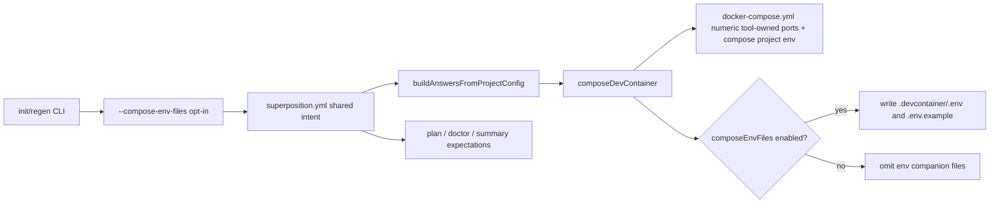

# Deterministic Compose Port Rendering and Optional Env File Emission

**Spec**: `044-deterministic-compose-port-rendering-and-optional-env-files`
**Status**: Final
**Created**: 2026-07-16
**Priority**: P1
**Product Approval**: approved
**Architecture Review**: approved
**UX Review**: not-needed

## Description

Make generated compose output deterministic by default for tool-owned port bindings, keep `.devcontainer/.env` plus `.devcontainer/.env.example` opt-in only, and support compose-targeted project `env:` entries without requiring those files.

## Evidence

- `docs/foundation.md` — generated output must stay deterministic for the same project inputs.
- `docs/specs/009-project-env/spec.md` — defines project-level `env:` semantics that this spec refines for compose output.
- `docs/specs/010-compose-env-materialization/spec.md` — current approved compose behavior materializes project env into `.devcontainer/.env`; this draft narrows and partially supersedes that rule.
- `docs/specs/024-project-ports/spec.md` — user-authored first-class compose `ports` must remain verbatim.
- `tool/questionnaire/composer.ts` — current behavior still throws when compose-targeted project `env:` is used without env-file emission.
- `tool/__tests__/project-env.test.ts` and `tool/__tests__/composition.test.ts` — current regression coverage locks in the fail-fast behavior that this draft reverses.
- `README.md`, `docs/superposition-yml.md`, `docs/README.md`, `docs/filesystem-contract.md`, `scripts/generate-schema.ts` — user-facing wording is partially aligned for opt-in env files but still inconsistent about compose env handling and emitted artifacts.

## Problem Statement

The current spec and implementation correctly make `.devcontainer/.env` and `.devcontainer/.env.example` opt-in, but they still treat compose-targeted project `env:` as unsupported unless env files are enabled. That is narrower than intended behavior. Users want default compose generation to succeed, render deterministic tool-owned ports numerically, and inline compose project `env:` into generated `docker-compose.yml` even when env artifacts are disabled.

## User Goals / Jobs To Be Done

- Inspect generated compose files and see the actual host ports that will be used.
- Regenerate a compose project without always carrying env companion files.
- Declare compose-targeted project `env:` values and have generation succeed by default.
- Still opt into `.devcontainer/.env` and `.devcontainer/.env.example` when a team wants those extra artifacts.

## Success Signals

- Default compose generation no longer emits `${...}` host-port expressions for tool-owned offsettable service bindings.
- Default compose generation omits `.devcontainer/.env` and `.devcontainer/.env.example`.
- Default compose generation succeeds when compose-targeted project `env:` is present and writes the expected environment entries into `docker-compose.yml`.
- `composeEnvFiles` changes only env artifact emission expectations, not whether compose project `env:` is supported.

## Confidence

- Overall confidence: medium
- Confidence notes: user intent is now explicit; main remaining work is aligning current implementation, tests, and stale docs/spec text.

## Goals

- Hard-render tool-owned compose host ports using the effective `portOffset` in generated compose output.
- Make `.devcontainer/.env` and `.devcontainer/.env.example` opt-in rather than default output.
- Inline compose-targeted project `env:` entries into generated `docker-compose.yml` by default.
- Define explicit compose `env:` resolution behavior for literals, `${NAME:-default}`, and unresolved `${NAME}` values.
- Keep deterministic replay, doctor behavior, and docs/schema wording aligned with the chosen default.

## Non-Goals

- Redesigning overlay parameter declarations or overlay `.env.example` authoring.
- Changing plain-stack env behavior.
- Silently changing the meaning of first-class project `ports` declared in `superposition.yml`.
- Defining a new local-config surface for this feature.
- Reworking broader secret-management policy beyond the compose rendering contract described here.

## Authority and References

This spec must align with:

- `docs/foundation.md`
- `docs/adr/adr001-project-file-first-replay-and-regeneration.md`
- `docs/specs/009-project-env/spec.md`
- `docs/specs/010-compose-env-materialization/spec.md`
- `docs/specs/015-doctor-env-example-drift/spec.md`
- `docs/specs/024-project-ports/spec.md`
- `docs/specs/025-variable-expansion-consolidation/spec.md`
- `docs/specs/032-init-and-regen-guided-flows/spec.md`
- `docs/superposition-yml.md`

## Technical Design

### Architecture Ownership

- `tool/cli/args.ts` and `tool/cli/run.ts` own the user-facing opt-in flag and the write-through flow that persists shared generation intent.
- `tool/schema/types.ts`, `tool/schema/project-config.ts`, `scripts/generate-schema.ts`, and `docs/superposition-yml.md` own the shared project-file field that records whether compose env artifacts are part of the intended generated output.
- `tool/questionnaire/composer.ts` owns deterministic compose port rendering, compose project `env:` rendering, and conditional env-artifact emission.
- `tool/commands/plan/**`, `tool/commands/doctor/**`, `tool/utils/summary.ts`, and related UX helpers must consume the same persisted intent and must not infer env-file expectations from incidental overlay contents alone.
- User-authored first-class project `ports` remain owned by spec `024` behavior and must not be reinterpreted by the deterministic tool-owned port renderer.

### System Boundaries

1. **Tool-owned compose port bindings**
    - Applies only to port bindings introduced by base templates and overlays that the composer merges and offsets.
    - The composer must render the final numeric host port directly into `docker-compose.yml` before write.
    - Existing host-port conflict auto-resolution remains in scope after numeric rendering; the written compose file, port docs, and summary must all reflect the same final post-conflict host port.

2. **User-authored project `ports`**
    - `superposition.yml -> ports` stays verbatim on `stack: compose` per spec `024`.
    - No new offsetting, substitution, or normalization is allowed for those bindings in this feature.

3. **Compose project `env:` rendering**
    - Compose-targeted project `env:` entries must be supported whether `composeEnvFiles` is enabled or disabled.
    - Generated `docker-compose.yml` is the canonical default output for these entries; env-file emission must not be a prerequisite for support.
    - `composeEnvFiles` must not switch compose project `env:` between “supported” and “unsupported” modes.

4. **Compose env artifacts**
    - `.devcontainer/.env` and `.devcontainer/.env.example` remain conditional generated artifacts, not default artifacts.
    - Overlay `.env.example` source files remain valid catalog inputs; the change is only whether the composer emits merged output files.

### Canonical Data Flow

### Architecture Decisions

#### 1. Persist env-file opt-in in shared project config

A per-invocation-only flag would violate the current project-file-first replay contract because the same `superposition.yml` could not deterministically reproduce the same generated artifact set.

Decision:

- keep a shared top-level boolean field named `composeEnvFiles` in `ProjectConfigSelection` and the generated schema/docs
- keep an affirmative CLI flag `--compose-env-files` on `init` and `regen`
- on `init`, the flag sets `composeEnvFiles: true` in the authored project file
- on `regen`, the flag is a write-through shared-intent change: update the discovered project file to `composeEnvFiles: true` before replay, then regenerate
- absence of the field means default-off (`false`)
- no separate negative flag is required in this feature because default-off is already represented by omitting the field; turning it back off is a normal project-file edit or future explicit UX

This keeps replay deterministic from the canonical shared project file rather than from hidden local state or compatibility-manifest-only metadata.

#### 2. Render compose project `env:` directly into generated compose output by default

Decision:

- compose-targeted project `env:` values must render into generated `docker-compose.yml` regardless of `composeEnvFiles`
- literals embed directly as concrete compose environment values
- `${NAME:-default}` resolves against the repository root `.env` first and otherwise embeds the inline default value
- `${NAME}` resolves against the repository root `.env` when present; if unresolved, preserve `${NAME}` in generated compose output so Docker Compose shell/runtime fallback remains available
- this rendering rule is independent from optional `.devcontainer/.env` and `.devcontainer/.env.example` emission
- no fail-fast path is allowed solely because `composeEnvFiles` is false

This matches intended compose behavior: env artifacts are optional convenience outputs, not a support gate for compose project `env:`.

#### 3. Doctor and fix behavior key off persisted intent, not file presence

Decision:

- default-off projects treat missing `.devcontainer/.env` and `.env.example` as expected, not drift
- `checkParameters()` and `checkEnvExampleDrift()` become conditional on `composeEnvFiles: true` when their only missing-artifact evidence is the omitted env files
- `doctor --fix` must not implicitly enable env-file generation; it regenerates according to persisted shared intent
- env-example regeneration remediations remain available only when `composeEnvFiles: true`; otherwise those findings are suppressed or downgraded to a pass/skip message rather than producing a fix plan

### Implementation Slices

1. **Shared intent and CLI plumbing**
    - Keep `composeEnvFiles?: boolean` in shared config types, parser/serializer, generated schema, manifest receipt, and authoring docs.
    - Thread the value through `buildAnswersFromProjectConfig()` / `buildProjectConfigSelectionFromAnswers()` into `QuestionnaireAnswers`.
    - Keep `--compose-env-files` on `init` and `regen` and persist it before generation.

2. **Deterministic tool-owned compose port rendering**
    - In `mergeDockerComposeFiles()`, replace tool-owned `${VAR:-default}` host-port expressions with final numeric host ports derived from the effective default plus `portOffset`.
    - Preserve service/container ports, ordering, and conflict-resolution behavior.
    - Keep project `ports` injection verbatim and outside this renderer.

3. **Compose project env rendering plus conditional env artifacts**
    - Remove the compose-env fail-fast path when `composeEnvFiles` is false.
    - Render compose-targeted project `env:` entries directly into generated `docker-compose.yml` using the resolution rules above.
    - Keep `.devcontainer/.env` and `.devcontainer/.env.example` behind `composeEnvFiles`.
    - Ensure optional env-file emission does not become a prerequisite for compose project `env:` support.

4. **Plan, doctor, summary, and docs alignment**
    - `plan` file prediction uses persisted intent, not overlay `.env.example` presence by itself.
    - `doctor` reproducibility and env-related checks derive expected artifacts from `composeEnvFiles`.
    - Summary/README/help text only mentions copying `.env.example` when env-file emission is enabled.
    - Update affected docs/spec references (`010`, `015`, authoring docs, README/changelog) to describe default-off env artifacts and default-on compose `env:` rendering.

## Constraints

- Deterministic replay remains a foundation requirement.
- Shared project config remains the canonical durable input; no hidden local state or manifest-only replay switches.
- Tool-owned compose defaults and user-authored project `ports` must stay conceptually separate.
- `composeEnvFiles` controls env-artifact emission only; it must not gate compose project `env:` support.

## Preferences / Tradeoffs

- Prefer rendering final numeric host ports in generated compose YAML over relying on runtime env indirection for tool-owned defaults.
- Prefer direct compose rendering for project `env:` over failing generation when env artifacts are disabled.
- Prefer one explicit opt-in CLI flag that persists shared intent over a transient one-run toggle.
- Accept that teams who place sensitive values in compose-targeted project `env:` are choosing a generated-YAML output that may be committed; opt-in env artifacts remain available but do not change the default compose rendering contract.

## Risk Notes

- This draft intentionally conflicts with spec `010`'s compose-stack secret-handling rationale; related spec and docs alignment is required so the repository has one authoritative product contract.
- Current tests explicitly assert the old fail-fast behavior and must be updated.
- Plan/doctor/remediation logic currently uses file-presence heuristics for `.env.example`; those heuristics must be replaced with intent-aware checks to avoid false drift.
- User-facing docs and schema/help text still contain stale statements implying `.env.example` is always generated or that compose env relies on env files.

## Architecture Decision Impact

- aligned with current ADRs/foundation
- follow-up alignment required for related specs and docs, especially `010` and `015`

## Implementation / Intent Mismatches

- Spec `010` currently treats `.devcontainer/.env` and `.devcontainer/.env.example` as the primary compose env bridge; this draft supersedes that behavior for compose-stack project `env:` rendering.
- Spec `015` currently treats `.env.example` drift as generally meaningful for compose projects; after this change it is meaningful only when env-file emission is part of shared intent.
- Current implementation and regression tests still enforce the removed fail-fast path for compose-targeted project `env:` when `composeEnvFiles` is false.

## Acceptance Criteria

- [x] Given a compose project with tool-owned overlay/service port bindings and `portOffset: 100`, when default generation runs, then generated `docker-compose.yml` contains final numeric host-port bindings using the effective offset and does not emit `${...}` host-port expressions for those tool-owned bindings.
- [x] Given default compose generation with overlays that currently contribute `.env.example` content, when `init` or `regen` runs without the opt-in flag, then `.devcontainer/.env` and `.devcontainer/.env.example` are not written and user-facing output does not instruct the user to copy them.
- [x] Given a compose project with `env: {API_KEY: abc123}` targeted to compose, when default generation runs with `composeEnvFiles` omitted or false, then generation succeeds and generated `docker-compose.yml` contains `API_KEY: abc123` without requiring `.devcontainer/.env`.
- [x] Given a compose project with `env: {NAME: ${NAME:-default}}` targeted to compose, when a repository root `.env` contains `NAME=prod`, then generated `docker-compose.yml` contains `NAME: prod`; and when the root `.env` does not define `NAME`, then generated `docker-compose.yml` contains `NAME: default`.
- [x] Given a compose project with `env: {NAME: ${NAME}}` targeted to compose and no repository root `.env` entry for `NAME`, when generation runs, then generated `docker-compose.yml` preserves `${NAME}` for Docker Compose shell/runtime fallback instead of failing.
- [x] Given the explicit env-file opt-in flag, when `init` or `regen` runs for a compose project, then `.devcontainer/.env` and `.devcontainer/.env.example` are generated only as optional artifacts and compose project `env:` support still works without depending on them.
- [x] Given a compose project that declares first-class project `ports`, when this feature ships, then spec `024` verbatim user-authored compose port behavior remains unchanged unless a follow-up approved spec explicitly broadens scope.
- [x] Given a project generated in default-off mode, when `doctor` or planning surfaces run, then they do not report missing `.devcontainer/.env` or `.devcontainer/.env.example` as problems solely because those files were intentionally omitted by default.
- [x] Automated tests cover the updated compose env success path, value-resolution cases, unresolved-variable preservation, opt-in env-file emission, and deterministic compose port rendering.
- [x] Documentation and schema/help text are updated so they no longer contradict the shipped compose env and env-artifact behavior.

## Out of Scope

- Reworking overlay docs or schema to remove `.env.example` from overlay source assets.
- Any persistence surface beyond the shared `composeEnvFiles` field.
- Any broader reconsideration of secrets policy beyond what this rendering change forces.

## Assumptions

- The feature request targets tool-owned compose defaults first, especially offset-derived service port bindings.
- Overlay `.env.example` content remains catalog-owned source material even when merged env-file emission is disabled by default.
- Compose-targeted project `env:` is allowed to render into generated compose YAML as part of the intended product contract for this spec.

## Test Plan

- **Composer regression tests**
    - tool-owned compose bindings with and without `portOffset` write final numeric host ports
    - project `ports` on `stack: compose` remain verbatim
    - host-port conflict auto-resolution still updates the final written numeric port and dependent summaries
- **Compose env rendering tests**
    - default compose generation succeeds for compose-targeted project `env:` when `composeEnvFiles` is omitted or false
    - literal values embed directly in generated `docker-compose.yml`
    - `${NAME:-default}` resolves from root `.env` first, else uses the inline default
    - unresolved `${NAME}` is preserved in generated compose output rather than failing
- **Env artifact mode tests**
    - default compose generation omits `.env` and `.env.example`
    - `composeEnvFiles: true` plus `--compose-env-files` regenerate both files when requested
    - optional env-file emission does not become a prerequisite for compose project `env:` support
- **CLI/project-file tests**
    - `init --compose-env-files` writes `composeEnvFiles: true`
    - `regen --compose-env-files` updates persisted shared intent before replay
    - schema/docs serialization round-trip preserves omission as default-off and `true` as opt-in
- **Plan/doctor tests**
    - plan predicted files differ correctly between default-off and opt-in modes
    - doctor does not flag intentionally omitted env files in default-off mode
    - doctor `--fix` regenerates env files only for opt-in projects
    - reproducibility checks compare against the correct expected artifact set in both modes
- **Docs/help tests**
    - summary/help/README guidance mentions `.env.example` copy steps only when env files are enabled
    - stale docs/schema/help text no longer imply `.env.example` is always generated or that compose env fails without env files

## Definition of Done

> Filled in progressively by each role. QA sets `Status: Final` only after verifying all gates.
> Full standards in `docs/definition-of-done.md`.

### Code

- [ ] No lint errors
- [ ] No type errors
- [ ] No debug or uncommitted temporary code
- [ ] Follows project conventions

### Tests

- [ ] Unit tests cover new pure logic
- [ ] Integration tests cover system boundaries
- [ ] All tests pass
- [ ] No unjustified skipped tests
- [ ] Failure and edge cases covered

### Documentation

- [ ] Public interfaces documented
- [ ] All new documentation in Markdown
- [ ] All diagrams in Mermaid
- [ ] README updated if behavior or setup changed
- [ ] Architecture docs updated if ownership or boundaries changed

### Changelog

- [ ] `CHANGELOG.md` updated under `[Unreleased]` for user-visible changes

### Workflow artifacts

- [ ] Acceptance criteria checked off (met only — unmet left unchecked with explanation)
- [ ] `## Implementation Notes` written
- [ ] Spec status and index synchronized
- [ ] QA feedback rows marked `Done` where applicable

### Architecture

- [ ] No ADR or foundation rules silently violated
- [ ] ADR created or amended if a standing decision was made or changed

### QA verification

- [ ] All above gates verified independently
- [ ] Acceptance criteria classified: MET / CLAIMED BUT FAILED / OPEN / UNCHECKED
- [ ] No regressions introduced
- [ ] Spec set to `Final`

## Routing Decision

**PM → Developer**

Product scope and behavior are now explicit enough for implementation. No new UX or ADR work is required before development, but implementation must update related docs/spec text so compose env support, env-artifact opt-in, and deterministic compose port rendering all describe the same contract.

## Implementation Notes

- Removed the default-off compose-env failure path from `tool/questionnaire/composer.ts`.
- Compose-targeted project `env:` now renders directly into generated `docker-compose.yml` using root `.env` resolution for `${NAME}` / `${NAME:-default}` and preserving unresolved `${NAME}`.
- Kept `.devcontainer/.env` and `.devcontainer/.env.example` behind `composeEnvFiles: true`; default generation still omits them.
- Updated compose env regression tests to cover default-off success, default resolution, unresolved preservation, and opt-in env artifact behavior.
- Aligned `docs/superposition-yml.md`, `docs/filesystem-contract.md`, and related specs `010` / `015` with the default-off env-artifact contract.
- Validation run: targeted `vitest` for project env, composition, summary, readme generation, and doctor command coverage; final `task validate` passed.
