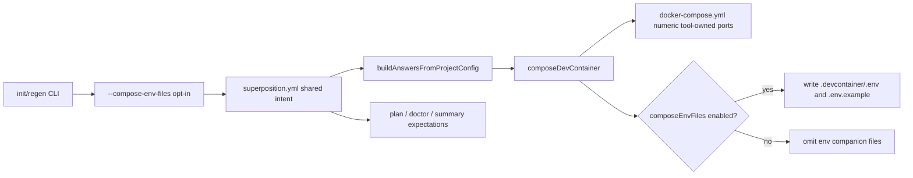

# Deterministic Compose Port Rendering and Optional Env File Emission

**Spec**: `044-deterministic-compose-port-rendering-and-optional-env-files`
**Status**: Final
**Created**: 2026-07-16
**Priority**: P1
**Product Approval**: approved
**Architecture Review**: approved
**UX Review**: not-needed

## Description

Make generated compose output deterministic by default for tool-owned port bindings, and stop generating `.devcontainer/.env` plus `.devcontainer/.env.example` unless the user explicitly opts in with a CLI flag.

## Evidence

- `docs/foundation.md` — generated output must stay deterministic for the same project inputs.
- `docs/specs/009-project-env/spec.md` — current compose env bridge expects `.devcontainer/.env` to exist for compose-targeted project env values.
- `docs/specs/010-compose-env-materialization/spec.md` — current approved behavior explicitly materializes compose env values into `.devcontainer/.env` and writes `.env.example` content.
- `docs/specs/024-project-ports/spec.md` — user-authored first-class compose `ports` are currently written verbatim and must not be silently conflated with tool-owned overlay/service defaults.
- `tool/questionnaire/composer.ts` — `mergeEnvExamples()` always writes `.env.example` and writes `.env` whenever `portOffset` is set; later generation steps also regenerate `.env` after parameter substitution.
- `tool/utils/summary.ts` — current next steps always instruct users to copy `.devcontainer/.env.example` to `.devcontainer/.env`.
- `tool/commands/plan/artifacts.ts` — plan currently predicts `.env.example` creation whenever selected overlays contain one.
- `tool/commands/doctor/checks.ts` — doctor currently treats `.env.example` as an expected compose-side artifact in several checks.

## Problem Statement

Generated compose files still depend on emitted env companion files for tool-owned defaults such as offset port bindings. That produces non-deterministic-looking output like `${FUSEKI_PORT:-3030}:3030`, requires extra generated files to realize the actual host port, and makes the default generated artifact set larger than users want. The requested behavior is a smaller default output contract: hard-render deterministic compose host ports directly into generated files, and emit `.devcontainer/.env` / `.devcontainer/.env.example` only when a user explicitly asks for them.

## User Goals / Jobs To Be Done

- Inspect generated compose files and see the actual host ports that will be used.
- Regenerate a compose project without always carrying env companion files.
- Still opt into `.devcontainer/.env` and `.devcontainer/.env.example` when a team wants template-style env files.

## Success Signals

- Default compose generation no longer emits `${...}` host-port expressions for tool-owned offsettable service bindings.
- Default compose generation omits `.devcontainer/.env` and `.devcontainer/.env.example`.
- An explicit CLI option restores env-file generation for teams that want the current template workflow.

## Confidence

- Overall confidence: medium
- Confidence notes: current port/env behavior is clear from specs and code; main remaining implementation risk is migrating doctor/plan/docs from file-presence heuristics to persisted intent.

## Goals

- Hard-render tool-owned compose host ports using the effective `portOffset` in generated compose output.
- Make `.devcontainer/.env` and `.devcontainer/.env.example` opt-in rather than default output.
- Preserve a CLI-accessible path for users who still want env companion files.
- Keep deterministic replay and doctor behavior aligned with the chosen default.

## Non-Goals

- Redesigning overlay parameter declarations or overlay `.env.example` authoring.
- Changing plain-stack env behavior.
- Silently changing the meaning of first-class project `ports` declared in `superposition.yml`.
- Defining a new local-config surface for this feature.

## Authority and References

This spec must align with:

- `docs/foundation.md`
- `docs/adr/adr001-project-file-first-replay-and-regeneration.md`
- `docs/specs/009-project-env/spec.md`
- `docs/specs/010-compose-env-materialization/spec.md`
- `docs/specs/015-doctor-env-example-drift/spec.md`
- `docs/specs/024-project-ports/spec.md`
- `docs/specs/025-variable-expansion-consolidation/spec.md`
- `docs/specs/032-init-and-regen-guided-flows/spec.md`
- `docs/superposition-yml.md`

## Technical Design

### Architecture Ownership

- `tool/cli/args.ts` and `tool/cli/run.ts` own the user-facing opt-in flag and the write-through flow that persists shared generation intent.
- `tool/schema/types.ts`, `tool/schema/project-config.ts`, `scripts/generate-schema.ts`, and `docs/superposition-yml.md` own the new shared project-file field that records whether compose env artifacts are part of the intended generated output.
- `tool/questionnaire/composer.ts` owns deterministic compose port rendering, conditional env-file emission, and pre-write validation when compose env materialization would otherwise be required.
- `tool/commands/plan/**`, `tool/commands/doctor/**`, `tool/utils/summary.ts`, and related UX helpers must consume the same persisted intent and must not infer env-file expectations from incidental overlay contents alone.
- User-authored first-class project `ports` remain owned by spec `024` behavior and must not be reinterpreted by the deterministic tool-owned port renderer.

### System Boundaries

1. **Tool-owned compose port bindings**
    - Applies only to port bindings introduced by base templates and overlays that the composer merges and offsets.
    - The composer must render the final numeric host port directly into `docker-compose.yml` before write.
    - Existing host-port conflict auto-resolution remains in scope after numeric rendering; the written compose file, port docs, and summary must all reflect the same final post-conflict host port.

2. **User-authored project `ports`**
    - `superposition.yml -> ports` stays verbatim on `stack: compose` per spec `024`.
    - No new offsetting, substitution, or normalization is allowed for those bindings in this feature.

3. **Compose env artifacts**
    - `.devcontainer/.env` and `.devcontainer/.env.example` become conditional generated artifacts, not default artifacts.
    - Overlay `.env.example` source files remain valid catalog inputs; the change is only whether the composer emits merged output files.

### Canonical Data Flow

### Architecture Decisions

#### 1. Persist env-file opt-in in shared project config

A per-invocation-only flag would violate the current project-file-first replay contract because the same `superposition.yml` could not deterministically reproduce the same generated artifact set.

Decision:

- add a shared top-level boolean field named `composeEnvFiles` to `ProjectConfigSelection` and the generated schema/docs
- add an affirmative CLI flag `--compose-env-files` on `init` and `regen`
- on `init`, the flag sets `composeEnvFiles: true` in the authored project file
- on `regen`, the flag is a write-through shared-intent change: update the discovered project file to `composeEnvFiles: true` before replay, then regenerate
- absence of the field means default-off (`false`)
- no separate negative flag is required in this feature because default-off is already represented by omitting the field; turning it back off is a normal project-file edit or future explicit UX

This keeps replay deterministic from the canonical shared project file rather than from hidden local state or compatibility-manifest-only metadata.

#### 2. Fail fast when compose project env would require `.devcontainer/.env`

Decision:

- hard-render only tool-owned host-port bindings in compose output
- do **not** hard-render compose-targeted project `env:` values into `docker-compose.yml` in default-off mode
- when `composeEnvFiles` is false and generation includes any `project env` entry whose resolved target is `composeEnv`, fail before write with a clear message that `--compose-env-files` (or `composeEnvFiles: true`) is required
- overlay parameter substitution that already resolves into generated files at compose-write time remains allowed; only flows that depend on `.devcontainer/.env` stay blocked

This is the smallest safe design because it preserves spec `010`'s secret-handling rationale instead of silently embedding values into committed compose YAML.

#### 3. Doctor and fix behavior key off persisted intent, not file presence

Decision:

- default-off projects treat missing `.devcontainer/.env` and `.env.example` as expected, not drift
- `checkParameters()` and `checkEnvExampleDrift()` become conditional on `composeEnvFiles: true` when their only missing-artifact evidence is the omitted env files
- `doctor --fix` must not implicitly enable env-file generation; it regenerates according to persisted shared intent
- env-example regeneration remediations remain available only when `composeEnvFiles: true`; otherwise those findings are suppressed or downgraded to a pass/skip message rather than producing a fix plan

### Implementation Slices

1. **Shared intent and CLI plumbing**
    - Add `composeEnvFiles?: boolean` to shared config types, parser/serializer, generated schema, manifest receipt, and authoring docs.
    - Thread the value through `buildAnswersFromProjectConfig()` / `buildProjectConfigSelectionFromAnswers()` into `QuestionnaireAnswers`.
    - Add `--compose-env-files` to `init` and `regen` and persist it before generation.

2. **Deterministic tool-owned compose port rendering**
    - In `mergeDockerComposeFiles()`, replace tool-owned `${VAR:-default}` host-port expressions with final numeric host ports derived from the effective default plus `portOffset`.
    - Preserve service/container ports, ordering, and conflict-resolution behavior.
    - Keep project `ports` injection verbatim and outside this renderer.

3. **Conditional env artifact emission and validation**
    - Guard `mergeEnvExamples()` and `materializeComposeProjectEnvFile()` behind `composeEnvFiles`.
    - Remove the port-offset-only `.env` copy path when env files are disabled.
    - Add pre-write validation for compose-targeted project env in default-off mode.

4. **Plan, doctor, summary, and docs alignment**
    - `plan` file prediction uses persisted intent, not overlay `.env.example` presence by itself.
    - `doctor` reproducibility and env-related checks derive expected artifacts from `composeEnvFiles`.
    - Summary/README/help text only mentions copying `.env.example` when env-file emission is enabled.
    - Update affected docs/spec references (`009`, `010`, `015`, authoring docs, README/changelog) to describe default-off behavior.

## Constraints

- Deterministic replay remains a foundation requirement.
- Shared project config remains the canonical durable input; no hidden local state or manifest-only replay switches.
- Tool-owned compose defaults and user-authored project `ports` must stay conceptually separate.
- Default behavior should minimize generated files without embedding compose secrets into committed YAML.

## Preferences / Tradeoffs

- Prefer rendering final numeric host ports in generated compose YAML over relying on runtime env indirection for tool-owned defaults.
- Prefer one explicit opt-in CLI flag that persists shared intent over a transient one-run toggle.
- Prefer fail-fast behavior over silently dropping compose env data or silently embedding secrets.

## Risk Notes

- Existing compose projects that rely on `env.target=composeEnv` will need a one-time shared config migration to `composeEnvFiles: true` before they can continue regenerating without errors.
- Plan/doctor/remediation logic currently uses file-presence heuristics for `.env.example`; those heuristics must be replaced with intent-aware checks to avoid false drift.
- Port docs and summaries currently read `.env.example` for connection-string hints; default-off mode must not regress those surfaces into misleading or empty output without fallback wording.

## Architecture Decision Impact

- aligned with current ADRs/foundation

## Implementation / Intent Mismatches

- Spec `010` currently treats `.devcontainer/.env` and `.devcontainer/.env.example` as default compose outputs; this spec narrows that default and makes those files conditional on `composeEnvFiles: true`.
- Spec `015` currently treats `.env.example` drift as generally meaningful for compose projects; after this change it is meaningful only when env-file emission is part of shared intent.

## Acceptance Criteria

- [x] Given a compose project with tool-owned overlay/service port bindings and `portOffset: 100`, when default generation runs, then generated `docker-compose.yml` contains final numeric host-port bindings using the effective offset and does not emit `${...}` host-port expressions for those tool-owned bindings.
- [x] Given default compose generation with overlays that currently contribute `.env.example` content, when `init` or `regen` runs without the opt-in flag, then `.devcontainer/.env` and `.devcontainer/.env.example` are not written and user-facing output does not instruct the user to copy them.
- [x] Given the explicit env-file opt-in flag, when `init` or `regen` runs for a compose project, then `.devcontainer/.env` and `.devcontainer/.env.example` are generated in a way that remains compatible with current overlay/template workflows.
- [x] Given a compose project that declares first-class project `ports`, when this feature ships, then spec `024` verbatim user-authored compose port behavior remains unchanged unless a follow-up approved spec explicitly broadens scope.
- [x] Given a project generated in default-off mode, when `doctor` or planning surfaces run, then they do not report missing `.devcontainer/.env` or `.devcontainer/.env.example` as problems solely because those files were intentionally omitted by default.
- [x] All new or changed behavior is covered by automated tests at the appropriate level.
- [x] Documentation and workflow artifacts are updated to match the implemented or reviewed state.

## Out of Scope

- Reworking overlay docs or schema to remove `.env.example` from overlay source assets.
- Any persistence surface beyond the new shared `composeEnvFiles` field.
- Any broader reconsideration of secrets policy beyond what this default change forces.

## Assumptions

- The feature request targets tool-owned compose defaults first, especially offset-derived service port bindings.
- Overlay `.env.example` content remains catalog-owned source material even when merged env-file emission is disabled by default.
- Existing compose projects that need generated env artifacts can accept a one-time shared project-file migration to persist `composeEnvFiles: true`.

## Test Plan

- **Composer regression tests**
    - tool-owned compose bindings with and without `portOffset` write final numeric host ports
    - project `ports` on `stack: compose` remain verbatim
    - host-port conflict auto-resolution still updates the final written numeric port and dependent summaries
- **Env artifact mode tests**
    - default compose generation omits `.env` and `.env.example`
    - `composeEnvFiles: true` plus `--compose-env-files` regenerate both files compatibly with current overlay/template flows
    - compose projects with `env.target=composeEnv` fail in default-off mode with actionable guidance
- **CLI/project-file tests**
    - `init --compose-env-files` writes `composeEnvFiles: true`
    - `regen --compose-env-files` updates persisted shared intent before replay
    - schema/docs serialization round-trip preserves omission as default-off and `true` as opt-in
- **Plan/doctor tests**
    - plan predicted files differ correctly between default-off and opt-in modes
    - doctor does not flag intentionally omitted env files in default-off mode
    - doctor `--fix` regenerates env files only for opt-in projects
    - reproducibility checks compare against the correct expected artifact set in both modes
- **Docs/help tests**
    - summary/help/README guidance mentions `.env.example` copy steps only when env files are enabled

## Definition of Done

> Filled in progressively by each role. QA sets `Status: Final` only after verifying all gates.
> Full standards in `docs/definition-of-done.md`.

### Code

- [ ] No lint errors
- [ ] No type errors
- [ ] No debug or uncommitted temporary code
- [ ] Follows project conventions

### Tests

- [ ] Unit tests cover new pure logic
- [ ] Integration tests cover system boundaries
- [ ] All tests pass
- [ ] No unjustified skipped tests
- [ ] Failure and edge cases covered

### Documentation

- [ ] Public interfaces documented
- [ ] All new documentation in Markdown
- [ ] All diagrams in Mermaid
- [ ] README updated if behavior or setup changed
- [ ] Architecture docs updated if ownership or boundaries changed

### Changelog

- [ ] `CHANGELOG.md` updated under `[Unreleased]` for user-visible changes

### Workflow artifacts

- [x] Acceptance criteria checked off (met only — unmet left unchecked with explanation)
- [x] `## Implementation Notes` written
- [x] Spec status and index synchronized
- [ ] QA feedback rows marked `Done` where applicable

### Architecture

- [ ] No ADR or foundation rules silently violated
- [ ] ADR created or amended if a standing decision was made or changed

### QA verification

- [ ] All above gates verified independently
- [ ] Acceptance criteria classified: MET / CLAIMED BUT FAILED / OPEN / UNCHECKED
- [ ] No regressions introduced
- [ ] Spec set to `Final`

## Routing Decision

**PM → Developer**

Product scope, UX impact, and technical path are sufficiently resolved for implementation. No additional UX or ADR work is required before development; implementation should preserve the project-file-first contract, keep user-authored `ports` verbatim, and treat `.devcontainer/.env` plus `.devcontainer/.env.example` as opt-in artifacts only.

## Implementation Notes

Implemented with the smallest safe change set across CLI parsing, project-config/schema plumbing, compose generation, doctor/plan/help surfaces, and user-visible docs.

- Added shared `composeEnvFiles` intent, persisted via `--compose-env-files` and `composeEnvFiles: true`.
- Hard-rendered final numeric host ports for tool-owned compose port bindings before write while preserving user-authored project `ports` verbatim.
- Default compose generation now omits `.devcontainer/.env` and `.devcontainer/.env.example`; compose-targeted project `env` now fails fast unless env-file intent is enabled.
- Updated plan, doctor, summaries, target help, README/docs, and schema output to reflect that `.devcontainer/.env` and `.devcontainer/.env.example` are opt-in artifacts only.
- Added and updated automated coverage for compose env opt-in mode, deterministic compose port rendering, CLI/project-config persistence, README/summary behavior, doctor drift behavior, and local/global workflow regressions.

Validation run:

- `npm run schema:generate`
- `npm run lint:fix`
- `npm run lint`
- `npm test -- --run tool/__tests__/project-env.test.ts tool/__tests__/project-ports.test.ts tool/__tests__/readme-generation.test.ts tool/__tests__/composition.test.ts tool/__tests__/overlay-imports.test.ts tool/__tests__/custom-patches.test.ts tool/__tests__/commands.test.ts tool/__tests__/summary.test.ts`
- `npm test -- --run tool/__tests__/global-defaults.test.ts tool/__tests__/local-config.test.ts`
- `npm test`
- `npm run build`
- `npm run init -- regen`
- `npm run init -- doctor`
