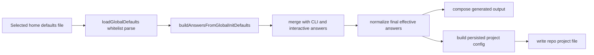

# Expand User-Scoped Global Init Defaults Surface

**Spec**: `049-global-init-defaults-surface`
**Status**: Final
**Created**: 2026-07-17
**Priority**: P1
**Product Approval**: approved
**Architecture Review**: approved
**UX Review**: not-needed

## Description

Clarify that `devcontainerGitignore` is already supported in `~/.superposition.yml` under `initDefaults`, then minimally expand the same bootstrap-only surface to cover a few additional init fields that are safe to prefill without turning the home-directory file into replay authority.

## Evidence

- `docs/foundation.md` — repo project file remains canonical replay authority; home-directory defaults must stay bootstrap-only.
- `docs/adr/adr001-project-file-first-replay-and-regeneration.md` — hidden home-directory state must not affect replay/remediation flows.
- `docs/specs/042-global-default-configuration/spec.md` — current global-defaults feature is init-only and explicitly kept `initDefaults` narrow.
- `tool/schema/project-config.ts` — `GlobalInitDefaultsSelection` currently allows only `baseImage`, `editor`, `target`, `outputPath`, `minimal`, `devcontainerGitignore`, and `overlays`.
- `tool/schema/project-config.ts` — `buildAnswersFromGlobalInitDefaults()` applies only those fields during eligible `init`.
- `tool/__tests__/global-defaults.test.ts` — current coverage proves `initDefaults.devcontainerGitignore` already works for eligible clean `init` and is ignored by replay/non-init flows.
- `docs/superposition-yml.md` — current docs already document `initDefaults.devcontainerGitignore` and the bootstrap-only scope.

## Problem Statement

The requested `devcontainerGitignore` support in `~/.superposition.yml` is already implemented, but the request exposed a real product gap: the current global bootstrap surface is inconsistent and narrower than the shared project-file authoring surface.

Today:

- `devcontainerGitignore` **is already supported** in `initDefaults`.
- `localConfigTemplate` **does not** support `devcontainerGitignore`, by design, because it scaffolds only `superposition.local.yml` fields.
- several adjacent init-time project fields are still unavailable from global defaults, including:
    - `stack`
    - `composeEnvFiles`
    - `customImage` (which makes `baseImage: custom` incomplete in global defaults)

This creates three issues:

1. user expectation mismatch (`devcontainerGitignore` support already exists, but that is not obvious),
2. an actual capability gap for other safe init defaults, and
3. an asymmetry where global defaults can request `baseImage: custom` but cannot supply the required `customImage`.

## User Goals / Jobs To Be Done

- Keep personal init preferences in `~/.superposition.yml`.
- Reuse safe shared-project defaults across new repositories.
- Default `devcontainerGitignore` without re-entering it on each fresh init.
- Default compose env-file behavior and preferred stack when those are personal bootstrap preferences.
- Use `baseImage: custom` from global defaults without being forced into a follow-up prompt or failure because `customImage` cannot also be seeded.

## Success Signals

- Docs and tests make it explicit that `initDefaults.devcontainerGitignore` already works.
- Eligible fresh `init` can also seed `stack`, `composeEnvFiles`, and `customImage` from the home-directory file.
- Replay commands still ignore home-directory defaults entirely.
- No new repo-identity or replay-authority semantics are introduced.

## Confidence

- Overall confidence: high
- Confidence notes: current support and constraints are directly evidenced in code, tests, schema, docs, and spec `042`; proposed additions are product decisions, not inferred existing behavior.

## Goals

- Preserve existing `initDefaults.devcontainerGitignore` behavior and document it clearly.
- Expand `initDefaults` minimally to include `stack`, `composeEnvFiles`, and `customImage`.
- Keep global defaults bootstrap-only for eligible `init`.
- Keep `localConfigTemplate` limited to local-config fields rather than shared project-file fields.

## Non-Goals

- Turning `~/.superposition.yml` into replay or remediation authority.
- Allowing global defaults to mutate runtime behavior after project creation.
- Moving `devcontainerGitignore` into `localConfigTemplate`.
- Broadly mirroring every `superposition.yml` field into global defaults.
- Adding repo-identity or high-risk shared fields such as `containerName`, `composeNetworkName`, `portOffset`, `preset`, `presetChoices`, or overlay `parameters` to this slice.

## Authority and References

This spec must align with:

- `docs/foundation.md`
- `docs/adr/adr001-project-file-first-replay-and-regeneration.md`
- `docs/specs/018-init-project-file/spec.md`
- `docs/specs/022-local-superposition-config/spec.md`
- `docs/specs/042-global-default-configuration/spec.md`
- `docs/superposition-yml.md`

## Design

### Observed Behavior

Current global defaults behavior is:

- file discovery: `~/.container-superposition.yml` first, then `~/.superposition.yml`
- command scope: eligible fresh `init` only
- supported top-level keys: `$schema`, `initDefaults`, `localConfigTemplate`
- supported `initDefaults` keys only:
    - `baseImage`
    - `editor`
    - `target`
    - `outputPath`
    - `minimal`
    - `devcontainerGitignore`
    - `overlays`
- supported `localConfigTemplate` payloads only:
    - local `env`
    - local `mounts`
    - local `shell`
    - local `customizations`
    - local `portOffset`
    - local `ports`
    - optional stack-aware `common` / `plain` / `compose` branches

### Implementation / Intent Mismatches

- `devcontainerGitignore` is already supported, so the user-requested item is not a missing runtime capability.
- `baseImage: custom` is partially supported in global defaults but not fully expressible because `customImage` is unavailable.
- `composeEnvFiles` is a shared project-file field and CLI init flag, but cannot currently be defaulted from the global bootstrap file.
- `stack` is the most fundamental init choice but cannot currently be defaulted from the global bootstrap file.

### Product / Behavior

#### Architect decisions for this slice

- `initDefaults.customImage` is a conditional seed, not an independent authority. If the final effective `baseImage` is not `custom`, the run should ignore `customImage` rather than fail.
- `initDefaults.stack` counts as sufficient persisted input for `init --no-interactive`.
- `composeEnvFiles` is compose-only persisted intent. If the final effective stack is `plain`, normalize `composeEnvFiles` away before persisting the project file.
- Boundary is confirmed: this slice stays limited to clarifying existing `initDefaults.devcontainerGitignore` plus adding `stack`, `composeEnvFiles`, and `customImage`.

#### Existing behavior to preserve

- `initDefaults.devcontainerGitignore` remains valid and unchanged.
- Home-directory defaults continue to apply only to eligible fresh `init`.
- `regen`, `doctor`, `plan`, `init --from-project`, and `init --from-manifest` continue to ignore home-directory defaults.
- `localConfigTemplate` remains scoped to repository-local `superposition.local.yml` scaffolding only.

#### New minimal scope

Expand `initDefaults` to additionally allow:

- `stack`
- `composeEnvFiles`
- `customImage`

Resulting `initDefaults` surface becomes:

- `stack`
- `baseImage`
- `customImage`
- `editor`
- `target`
- `outputPath`
- `minimal`
- `composeEnvFiles`
- `devcontainerGitignore`
- `overlays`

#### Validation expectations

- `customImage` is valid only when the final effective base image is `custom`.
- If `baseImage: custom` is seeded from global defaults, `customImage` may also be seeded from the same file.
- CLI inputs and interactive selections still override global defaults for the current run.
- New fields must follow the same compatibility rules they already follow when coming from CLI answers or project config.

#### Explicit exclusions for this slice

Do **not** add the following to global defaults in this slice:

- `containerName`
- `composeNetworkName`
- `portOffset`
- `preset`
- `presetChoices`
- `parameters`
- shared `env`, `mounts`, `shell`, `customizations`, or `ports` outside the existing `localConfigTemplate`

Rationale: those fields are either repo-identity, project-archetype, conflict-prone across repos, or too close to turning a user-scoped file into shared project-authoring authority beyond a minimal bootstrap role.

## Constraints

- Repository project file remains the only canonical replay authority.
- Home-directory defaults remain ignored outside eligible `init`.
- `localConfigTemplate` must not become a back door for shared project-file fields.
- The product must keep a clear distinction between shared project defaults and local scaffold defaults.

## Preferences / Tradeoffs

- Prefer clarifying an already-supported behavior over re-implementing it in a second place.
- Prefer a short explicit whitelist expansion over a generic "any project field is allowed" rule.
- Prefer excluding repo-identity and parameterized/secrets-prone fields until separately justified.

## Risks

- Adding too many project fields would blur bootstrap defaults with shared project authority.
- Allowing repo-identity fields in a user-scoped home file could create accidental cross-repo collisions.
- Allowing overlay parameters in home defaults could encourage committing user-specific or secret values into shared repo config.

## Acceptance Criteria

- [x] Given `~/.superposition.yml` or `~/.container-superposition.yml` sets `initDefaults.devcontainerGitignore`, when eligible fresh `init` runs without a current-run override, then the generated repo project file still persists `devcontainerGitignore` exactly as it does today, and docs/help/spec references describe it as an `initDefaults` key rather than a `localConfigTemplate` key.
- [x] Given global defaults set `initDefaults.stack`, when eligible fresh `init` runs without a current-run stack override, then that value seeds the run and counts as persisted input for `init --no-interactive`.
- [x] Given global defaults set `initDefaults.composeEnvFiles`, when eligible fresh `init` runs without a current-run override and the final effective stack is `compose`, then the resulting repo project file persists `composeEnvFiles` with unchanged compose env-file behavior.
- [x] Given global defaults set `initDefaults.composeEnvFiles`, when eligible fresh `init` finishes with final effective `stack: plain`, then the run succeeds and the persisted repo project file omits `composeEnvFiles`.
- [x] Given global defaults set `initDefaults.baseImage: custom` and `initDefaults.customImage`, when eligible fresh `init` runs without a current-run override that changes away from custom, then the run completes without extra prompt friction and the resulting repo project file persists a valid custom-image selection.
- [x] Given global defaults set `initDefaults.customImage`, when eligible fresh `init` finishes with final effective `baseImage` other than `custom`, then the run succeeds and the persisted repo project file omits `customImage`.
- [x] Given global defaults contain valid or invalid values for these supported keys, when `regen`, `doctor`, `plan`, `init --from-project`, or `init --from-manifest` runs, then those commands continue to ignore the home-directory defaults entirely.
- [x] Given `localConfigTemplate` contains `devcontainerGitignore` or other shared project-file keys, when eligible fresh `init` loads the global defaults file, then validation still rejects that shape before repo write side effects.
- [x] Schema, docs, and CLI help/error text where relevant reflect the exact supported `initDefaults` whitelist: `stack`, `baseImage`, `customImage`, `editor`, `target`, `outputPath`, `minimal`, `composeEnvFiles`, `devcontainerGitignore`, and `overlays`.
- [x] Automated tests cover whitelist parsing, precedence, `--no-interactive` persisted-input gating for `stack`, custom-only normalization, compose-only normalization, and replay-command bypass behavior.

## Out of Scope

- Generic support for every `superposition.yml` field in `initDefaults`.
- Auto-merging or reconciling home defaults into existing repository project files.
- Any change to discovery order, precedence, or `--ignore-global-defaults` semantics.
- Any change to local-config runtime ownership.

## Assumptions

- The minimal correct workflow action is a new follow-on spec rather than editing final spec `042`, because this request extends the approved bootstrap surface instead of correcting implementation drift inside that shipped scope.
- The requested `devcontainerGitignore` item is primarily a clarification need, not an implementation gap.

## Technical Design

### Architecture Ownership

- `tool/schema/project-config.ts` owns the `initDefaults` whitelist expansion, parsing, answer seeding, and final project-file normalization rules for `stack`, `composeEnvFiles`, and `customImage`.
- `tool/cli/run.ts` remains the scope gate: only eligible fresh `init` may load and apply home-directory defaults.
- `tool/questionnaire/questionnaire.ts` keeps prompt ownership and may consume seeded defaults, but must not gain global-default file discovery logic.
- `tool/questionnaire/composer.ts` continues to consume only final merged answers; it must not branch on whether a value came from global defaults.
- `localConfigTemplate` ownership does not change.

### System Boundaries

- Home-directory defaults stay bootstrap-only and never become replay or remediation authority.
- The implementation remains a fixed whitelist expansion, not a generic allowance of project-file fields.
- Final-answer normalization belongs at the shared answer/project-selection boundary so interactive and non-interactive flows stay aligned.
- Excluded repo-identity and archetype-shaping fields remain out of scope.

### Canonical Data Flow

### Behavior Rules

1. Extend `GlobalInitDefaultsSelection` and the `loadGlobalDefaults()` whitelist to allow only `stack`, `composeEnvFiles`, and `customImage` in addition to the already-supported keys.
2. `buildAnswersFromGlobalInitDefaults()` should seed those three values into init answers with unchanged precedence: current-run CLI inputs and interactive selections still win.
3. `customImage` must behave as a dependent field. Before generation/persistence, drop it whenever the final effective `baseImage` is not `custom`.
4. `composeEnvFiles` must behave as a compose-only persisted field. Before project-file persistence, drop it whenever the final effective `stack` is not `compose`.
5. `init --no-interactive` should treat non-empty persisted `initDefaults` containing `stack` the same way it already treats other persisted bootstrap inputs.
6. Replay-style commands (`regen`, `doctor`, `plan`, `init --from-project`, `init --from-manifest`) must keep ignoring valid and invalid home-directory defaults entirely.

### Implementation Slices

1. Expand `initDefaults` types/parser/schema for `stack`, `composeEnvFiles`, and `customImage`.
2. Extend answer seeding and add final-answer normalization for custom-only and compose-only fields.
3. Update docs/help/schema text to clarify that `devcontainerGitignore` already belongs under `initDefaults` and that the whitelist now includes the three new fields.
4. Add regression coverage for precedence, `--no-interactive`, normalization, and replay bypass behavior.

### Risk Notes

- Hard-failing on stale `customImage` after a later `baseImage` override would make bootstrap defaults brittle and violate the current-run override model.
- Persisting `composeEnvFiles: true` into plain-stack project files would create noisy no-op state in the canonical repo config.
- Broadening past the explicit whitelist would weaken the ADR/foundation boundary between personal bootstrap input and shared project authority.
- If normalization is implemented only in one prompt path, interactive and non-interactive behavior could diverge.

### Test Plan

#### Unit tests

- `loadGlobalDefaults()` accepts `initDefaults.stack`, `initDefaults.composeEnvFiles`, and `initDefaults.customImage`
- unsupported `initDefaults` keys remain rejected
- `buildAnswersFromGlobalInitDefaults()` seeds the three new fields
- final-answer normalization drops `customImage` when effective `baseImage !== custom`
- final-answer normalization drops `composeEnvFiles` when effective `stack !== compose`
- `initDefaults.stack` satisfies the `--no-interactive` persisted-input gate

#### Integration / command tests

- eligible fresh `init --no-interactive` succeeds when global defaults provide `stack` plus enough other defaults/CLI input for a complete run
- eligible fresh `init` with global `baseImage: custom` plus `customImage` persists a valid custom-image project config without extra prompt friction
- eligible fresh `init` that seeds `customImage` from global defaults but finishes with non-custom `baseImage` succeeds and writes no `customImage` to the project file
- eligible fresh `init` with global `composeEnvFiles: true` and final `stack: plain` writes no `composeEnvFiles` field to the project file
- eligible fresh `init` with global `composeEnvFiles: true` and final `stack: compose` persists the field and keeps current compose env-file generation behavior
- replay/non-init commands still ignore valid and invalid home-directory defaults

## Architecture Decision Impact

aligned with current ADRs/foundation

This design keeps the home-directory file bootstrap-only, preserves repo project files as canonical authority, and uses a narrow whitelist expansion rather than a broader config-authoring surface.

## Open Questions

- None for architecture.

## Routing Decision

**PM → Developer**

Product scope, acceptance criteria, architect constraints, and validation expectations are implementation-ready. No additional UX or ADR work is required before development.

## PM Brief for Developer and QA

### Developer handoff

Implement a narrow `initDefaults` whitelist expansion only. Preserve the existing bootstrap-only contract, keep current-run CLI/interactive overrides winning over home-directory defaults, and apply architect-approved normalization before persistence:

- ignore `customImage` unless the final effective `baseImage` is `custom`
- omit `composeEnvFiles` unless the final effective `stack` is `compose`
- treat seeded `stack` as persisted input for `init --no-interactive`
- keep `devcontainerGitignore` behavior unchanged and document that it already existed

Primary implementation surfaces are the global-defaults schema/types, init-answer seeding, final-answer normalization, and user-facing docs/help text that describe supported global defaults.

### QA focus

Verify both the added fields and the preserved boundary:

- positive path for `stack`, `composeEnvFiles`, and `customImage`
- normalization-away behavior for `customImage` on non-custom base images and `composeEnvFiles` on plain stack
- unchanged support for `devcontainerGitignore`
- `localConfigTemplate` still rejecting shared project-file keys
- replay/non-init commands still bypassing home-directory defaults

### Non-goals for implementation and QA

- no expansion beyond `stack`, `composeEnvFiles`, and `customImage`
- no change to discovery order, precedence, or `--ignore-global-defaults`
- no move of `devcontainerGitignore` into `localConfigTemplate`
- no addition of repo-identity, preset, parameter, or broader shared project-file fields to global defaults
- no change to replay/remediation authority

## Definition of Done

> Filled in progressively by each role. QA sets `Status: Final` only after verifying all gates.
> Full standards in `docs/definition-of-done.md`.

### Code

- [ ] No lint errors
- [ ] No type errors
- [ ] No debug or uncommitted temporary code
- [ ] Follows project conventions

### Tests

- [ ] Unit tests cover new pure logic
- [ ] Integration tests cover system boundaries
- [ ] All tests pass
- [ ] No unjustified skipped tests
- [ ] Failure and edge cases covered

### Documentation

- [ ] Public interfaces documented
- [ ] All new documentation in Markdown
- [ ] All diagrams in Mermaid
- [ ] README updated if behavior or setup changed
- [ ] Architecture docs updated if ownership or boundaries changed

### Changelog

- [ ] `CHANGELOG.md` updated under `[Unreleased]` for user-visible changes

### Workflow artifacts

- [ ] Acceptance criteria checked off (met only — unmet left unchecked with explanation)
- [ ] `## Implementation Notes` written
- [ ] Spec status and index synchronized
- [ ] QA feedback rows marked `Done` where applicable

### Architecture

- [ ] No ADR or foundation rules silently violated
- [ ] ADR created or amended if a standing decision was made or changed

### QA verification

- [ ] All above gates verified independently
- [ ] Acceptance criteria classified: MET / CLAIMED BUT FAILED / OPEN / UNCHECKED
- [ ] No regressions introduced
- [ ] Spec set to `Final`

## Implementation Notes

- Expanded the global `initDefaults` whitelist, parser, answer seeding, and generated global schema to support `stack`, `customImage`, and `composeEnvFiles` while preserving existing `devcontainerGitignore` behavior.
- Added persistence normalization so project-file writes omit `customImage` unless the final effective `baseImage` is `custom`, and omit `composeEnvFiles` unless the final effective `stack` is `compose`.
- Updated `docs/superposition-yml.md` to clarify that `devcontainerGitignore` already belongs under `initDefaults`, document the expanded whitelist, and restate that `localConfigTemplate` still rejects shared project-file fields.
- Added regression coverage in `tool/__tests__/global-defaults.test.ts` for whitelist parsing/seeding, `init --no-interactive` gating via global `stack`, compose-only persistence, custom-image persistence/normalization, and existing replay bypass behavior.
- Validation run:
    - `npm test -- tool/__tests__/global-defaults.test.ts`
    - `npm run schema:generate`
    - `task validate`
    - `task validate:generated`
- QA follow-up fix: updated `package.json` so `npm run schema:generate` also Prettier-formats `tool/schema/superposition.global.schema.json`, then regenerated the schema and re-ran validation so the generated global schema and touched workflow docs stay lint-clean.
- QA follow-up validation: re-ran the previously failing targeted test files, then `task validate` and `task validate:generated`; all passed cleanly on this branch with no additional code changes required beyond the existing spec 049 branch work.
