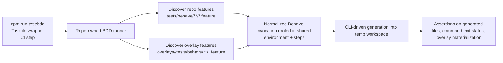

# Behave BDD Coverage and Overlay Feature Discovery

**Spec**: `053-behave-bdd-overlay-discovery`
**Status**: Final
**Created**: 2026-07-22
**Priority**: P1
**Product Approval**: approved
**Architecture Review**: approved
**UX Review**: not-needed

> P0 = unusable without; P1 = core value, ship v1; P2 = post-launch; P3 = backlog

## Description

Add a repo-owned Behave BDD workflow for container-superposition so behavior-level scenarios can cover both core tool flows and overlay-specific expectations. Each overlay must be able to contribute its own `.feature` files through a fixed overlay-local path that the BDD runner discovers automatically. The same change must update contributor prompts, skills, agents, and overlay-authoring docs so overlay authors know when and how to add and run these scenarios.

## Evidence

- `package.json` — current automated coverage is Vitest (`npm test`), one GHCR integration suite (`npm run test:integration`), and a shell smoke test (`npm run test:smoke`); there is no BDD runner.
- `scripts/test.sh` — current smoke coverage is shell-based and repo-global, not overlay-contributed.
- `.github/workflows/validate-overlays.yml` — CI currently runs lint, build, doctor, Vitest, and shell smoke tests, but no behavior-level suite that overlays can extend themselves.
- `docs/creating-overlays.md` — overlay testing guidance is manual generation/build verification only and does not define an overlay-owned automated acceptance-scenario path.
- `CONTRIBUTING.md` — contributor testing guidance lists unit, smoke, doctor, and interactive/non-interactive checks, but no BDD workflow.
- `.pi/skills/overlay-development/SKILL.md` — overlay contributor workflow requires lint/test/docs/schema/regen/doctor but does not mention behavior-level feature scenarios.
- `.pi/agents/overlay-writer.md`, `.pi/agents/overlay-reviewer.md`, and `.pi/prompts/overlay-write-loop.md` — project-local overlay prompts/agents currently instruct contributors to write, review, and validate overlays without any Behave acceptance-test step.

## Problem Statement

The repository has solid unit and command-level coverage, but it lacks a shared behavior-driven test layer that can express end-to-end expectations in contributor-friendly feature files.

That gap matters in two places:

1. **Core tool behavior** — shell smoke tests are coarse and not written in a reusable behavior language.
2. **Overlay behavior** — overlay authors cannot attach overlay-owned acceptance scenarios to their overlay directory and have them discovered automatically by the repo test workflow.

As a result, overlay validation stays split across Vitest, shell scripts, and manual checks, while project-local prompts and docs do not teach a repeatable behavior-level test workflow.

## User Goals / Jobs To Be Done

- As a maintainer, I want a repo-owned Behave suite for core container-superposition workflows so behavior regressions are expressed in readable scenarios.
- As an overlay contributor, I want to place overlay-specific `.feature` files next to my overlay and have the suite discover them automatically.
- As an overlay reviewer, I want prompts, skills, and docs to tell contributors when BDD coverage is expected and how it fits with existing validation.
- As a CI owner, I want overlay-affecting changes to run the full BDD suite without any manual test registration step.

## Success Signals

- The repository exposes one documented Behave entrypoint for local and CI use.
- Core tool workflows gain readable behavior scenarios in addition to existing lower-level tests.
- Overlay authors can add overlay-local `.feature` files without editing a central test manifest.
- Contributor guidance consistently explains when to add BDD coverage and when to run it.

## Confidence

- Overall confidence: high
- Confidence notes: the current testing and contributor-guidance gaps are directly evidenced by the repo surfaces above; the request defines the desired behavior clearly enough to draft without further discovery.

## User Stories

**US-1** As a maintainer, I want core tool workflows covered by Behave so behavior expectations are readable and regression-friendly.

**US-2** As an overlay contributor, I want each overlay to own optional feature scenarios that the repo test runner auto-discovers.

**US-3** As a reviewer, I want overlay prompts, skills, and docs to require BDD coverage when overlay behavior changes warrant it.

## Goals

- Add a repo-owned Behave BDD workflow for core container-superposition behavior.
- Define one canonical overlay-local path where overlays can contribute `.feature` files that are discovered automatically.
- Keep step execution centralized enough that overlay contributors write scenarios against a shared test vocabulary instead of inventing ad hoc runners.
- Update contributor prompts, skills, agents, and overlay-authoring docs to teach the new workflow.
- Align local validation and CI so overlay-relevant changes execute the Behave suite predictably.

## Non-Goals

- Replacing Vitest unit and command suites.
- Requiring every overlay to add feature files immediately.
- Creating per-overlay bespoke test runners or central manual registration lists.
- Broad redesign of non-overlay contributor workflows beyond the test-routing updates needed for this feature.
- Introducing a new ADR unless implementation discovers an authority conflict.

## Authority and References

This spec must align with:

- `docs/foundation.md`
- `docs/adr/adr001-project-file-first-replay-and-regeneration.md`
- `AGENTS.md`
- `docs/definition-of-done.md`
- `docs/specs/039-project-local-contributor-skills-initiative/spec.md`
- `docs/specs/045-root-taskfile-and-mandatory-contributor-validation/spec.md`

## Design

### Product / Behavior

Implementation must add a repository-owned Behave workflow with these visible behaviors:

1. **One canonical Behave entrypoint**
    - The repo must expose a documented local command for the full Behave suite, expected as `npm run test:bdd` with a matching Taskfile wrapper.
    - The command must run from repository root without requiring contributors to rely on globally installed Behave tooling.

2. **Core suite plus overlay-contributed discovery**
    - The full Behave run must execute:
        - repository-level container-superposition feature scenarios, and
        - overlay-contributed feature scenarios discovered automatically from a fixed overlay-local path.
    - The initial overlay-local discovery contract must be filesystem-based, not registry-based.
    - Overlays with no BDD scenarios must remain valid and require no placeholder files.

3. **Overlay-local path contract**
    - Each overlay may contribute `.feature` files under `overlays/<id>/tests/behave/**/*.feature`.
    - Supporting non-code test data for those scenarios may live under the same overlay-local `tests/behave/` subtree.
    - Initial scope does **not** require per-overlay step-definition modules; overlay scenarios must run against the repository-owned shared Behave environment and step library. If a new shared step is needed, it should be added to the central test harness in the same change as the overlay scenario.

4. **Shared scenario vocabulary**
    - The Behave harness must provide shared steps for the recurring workflow the repo needs to test: generating output from repo-owned inputs, inspecting generated files, checking command outcomes, and verifying overlay-specific materialization expectations.
    - Feature authors should be able to express overlay expectations declaratively without writing a new runner or duplicating shell scripts.

5. **Validation and CI routing**
    - CI for overlay-affecting changes must execute the full Behave suite in addition to the existing validation layers that remain in scope.
    - Local contributor guidance must define:
        - the focused workflow for iterating on changed Behave scenarios during development, and
        - the full pre-handoff workflow that includes the Behave suite when overlay behavior or generated-output behavior is affected.

6. **Contributor workflow updates**
    - Overlay-focused prompts, skills, and agents must explain when BDD coverage is expected, where overlay feature files live, and which validation command(s) to run before handoff.
    - Overlay contributor docs must teach the same path and avoid leaving Behave as hidden infrastructure knowledge.

### Required repo surfaces

Implementation is expected to touch at least these areas:

- test harness and shared steps for Behave (new repo-owned test area)
- `package.json` and `Taskfile.yml` command surfaces
- CI workflow(s) that validate overlay-affecting changes
- contributor authority and overlay docs (`AGENTS.md`, `docs/definition-of-done.md`, `CONTRIBUTING.md`, `docs/creating-overlays.md`, and `.github/instructions/overlay-authoring.instructions.md`)
- project-local overlay workflow assets (`.pi/skills/overlay-development/SKILL.md`, `.pi/agents/overlay-writer.md`, `.pi/agents/overlay-reviewer.md`, `.pi/prompts/overlay-write-loop.md`, and `.pi/README.md` if inventory text changes)

### Technical Notes

- Behave dependency installation and invocation must be repo-owned and reproducible in CI and the devcontainer workflow; contributors must not be told to install ad hoc global tooling.
- Existing Vitest coverage remains the main pure-logic and command-regression layer; Behave adds behavior-level coverage rather than replacing it.
- Existing smoke coverage may remain or be reduced only if Behave replaces it with equal-or-better covered scenarios in the same change.
- Failure output should make it obvious whether a failing scenario came from a repo-level feature or an overlay-local feature file.

## Technical Design

### Architecture Ownership

- **BDD runtime bootstrap and feature discovery** belong in a repo-owned test harness layer (for example `tests/behave/` plus a thin runner script under `scripts/` or equivalent test entrypoint code).
- **Shared scenario vocabulary** belongs in one central Behave environment/step library owned by the repository, not inside individual overlays.
- **Overlay-owned responsibility** stops at `.feature` files and supporting fixture data under `overlays/<id>/tests/behave/`; overlays do not own Python step modules in this first slice.
- **Command surfaces** belong in `package.json` and `Taskfile.yml`; those files expose the runner but do not reimplement discovery logic.
- **CI routing** belongs in `.github/workflows/validate-overlays.yml`; workflow path filters must pick up changes to the BDD harness and its invocation surfaces, not just overlay source files.
- **Contributor guidance propagation** belongs in `AGENTS.md`, docs, `.github/instructions/**`, and the project-local `.pi/` assets; those surfaces must repeat one canonical workflow instead of inventing variants.

### System Boundaries

- Keep Vitest as the owner of TypeScript/unit/command regression tests.
- Keep Behave as the owner of behavior-level acceptance scenarios that exercise generation and output expectations end to end.
- Do not introduce overlay-specific executable test code loading from `overlays/**`.
- Do not move generation/composition authority out of the existing CLI/tool modules; Behave steps should call the existing CLI entrypoints or equivalent repo-owned command surfaces rather than duplicating composition logic.

### Canonical Data Flow

### Runner and Discovery Contract

1. Add one repo-owned BDD harness root that contains:
    - shared Behave configuration/environment,
    - shared step definitions,
    - repo-level feature scenarios, and
    - any reusable fixture helpers.
2. Add a thin repo-owned discovery wrapper in front of Behave. Its responsibilities should stay narrow:
    - discover repo features and overlay-local features by convention,
    - ignore overlays with no matching files,
    - fail clearly when a discovered feature path is malformed or when the Behave invocation fails, and
    - pass through optional contributor-supplied target arguments for focused local iteration.
3. The discovery wrapper should normalize disparate feature locations into a single Behave run rooted in the shared repo harness so central steps apply uniformly to repo and overlay scenarios.
4. Failure output must preserve actionable relative source paths, preferably retaining the `overlays/<id>/tests/behave/...` suffix for overlay scenarios so reviewers can identify the owning overlay immediately.

### Runtime Provisioning

- The Behave runtime must be versioned in-repo (for example via a dedicated requirements file or equivalent repo-owned lockable Python dependency declaration) and bootstrapped by the repo command surface.
- The recommended repository devcontainer currently provisions Node-centric tooling only, so implementation must also ensure the BDD runtime is available in the standard maintainer workflow. The minimum safe path is to provision Python through repo-owned configuration rather than asking contributors to install it manually.
- Any new path-sensitive bootstrap logic must preserve source-vs-compiled execution rules from `AGENTS.md`; keep path resolution explicit if the runner is implemented in TypeScript/Node.

### CLI and Taskfile Integration

- `package.json` should expose `npm run test:bdd` as the canonical full-suite entrypoint.
- The same npm entrypoint should support focused local iteration by forwarding additional arguments to the wrapper/Behave invocation, so contributors can run a single repo feature or one overlay-local feature file without a second custom script contract.
- `Taskfile.yml` should add a matching thin wrapper such as `task test:bdd`.
- The broader generated-output validation flow should include the BDD suite whenever overlay behavior or generated-output behavior is in scope. If implementation reuses `task validate:generated` for this purpose, keep that composition explicit and update its regression tests accordingly.

### CI Pickup Conventions

`validate-overlays.yml` should treat the Behave suite as part of overlay-affecting validation and pick up changes from at least these surfaces:

- `overlays/**`
- repo-owned BDD harness files (for example `tests/behave/**` and any runner/bootstrap files)
- invocation surfaces such as `package.json`, `Taskfile.yml`, and workflow files
- any repo-owned provisioning files required to make the BDD runtime available in CI/devcontainer flows

The CI job should execute `npm run test:bdd` as a first-class step alongside the existing lint/build/doctor/Vitest coverage that remains in scope.

### Contributor Guidance Propagation

All contributor-facing surfaces named in this spec should align on the same four messages:

1. overlay-local feature files live under `overlays/<id>/tests/behave/**/*.feature`
2. shared steps stay central and new reusable steps are added in the repo harness
3. `npm run test:bdd` / `task test:bdd` is the focused BDD entrypoint during iteration
4. the full pre-handoff workflow for overlay/generated-output changes includes the Behave suite in addition to existing validation and regeneration checks

### Implementation Slices

1. **Harness slice**
    - add repo-owned Behave bootstrap, shared environment, shared steps, and a first repo-level scenario
2. **Discovery slice**
    - add automatic overlay feature discovery and one overlay-local proof scenario
3. **Command/CI slice**
    - wire `package.json`, `Taskfile.yml`, and `validate-overlays.yml` to the canonical BDD entrypoint
4. **Contributor-workflow slice**
    - update authority docs, overlay docs, instructions, prompts, skills, and agents to teach the new contract consistently

### Risk Notes

- **Devcontainer drift risk**: if the repository's own devcontainer cannot run the BDD suite, the documented contributor workflow becomes self-contradictory.
- **Discovery ambiguity risk**: if the wrapper supports multiple overlay feature roots or overlay-owned steps now, future maintenance cost and review ambiguity increase immediately.
- **Path observability risk**: if failures only show temporary staged paths or generic Behave output, overlay reviewers will struggle to map failures back to the owning overlay.
- **Runtime duplication risk**: if CI, npm scripts, and Taskfile each bootstrap Behave differently, version drift will follow.

### Test Plan

- **Vitest regression coverage**
    - add or extend tests that assert the Taskfile/npm/workflow surfaces expose the new BDD command and compose it into the intended validation flow
    - add focused tests for any TypeScript/Node discovery wrapper logic: repo feature discovery, overlay feature discovery, empty-overlay tolerance, and path-filtered invocation
    - add workflow/config regression tests for CI path triggers and the presence of the `npm run test:bdd` step where applicable
- **BDD acceptance coverage**
    - add at least one repo-level scenario covering a core generation workflow
    - add at least one overlay-local scenario stored under a real overlay path to prove automatic discovery works end to end
    - cover failure-oriented assertions through shared steps where practical (missing file, unexpected output, non-zero command)
- **Validation commands**
    - targeted development: `npm run test:bdd -- <feature-or-subpath>` or equivalent forwarded-argument form
    - final overlay/generated-output validation: `task validate:generated` plus any explicit BDD wrapper if it is not composed into that task

### Architecture Decision Impact

- aligned with current ADRs/foundation

## Constraints

- Preserve project-file-first and generated-artifact boundaries while exercising generation behavior.
- Keep overlay feature discovery automatic and convention-based.
- Do not require central registration when adding a new overlay `.feature` file.
- Keep the first slice centered on `.feature` discovery plus shared steps; do not sprawl into a generic plugin system for arbitrary overlay-local test code.

## Preferences / Tradeoffs

- Prefer a fixed, explicit overlay-local directory over multiple discovery conventions.
- Prefer central shared steps over overlay-owned step modules for the first delivered slice.
- Prefer adding the Behave suite alongside current tests rather than replacing multiple existing layers at once.
- Prefer contributor commands that distinguish quick iteration from full pre-handoff validation.

## Risks

- If the Behave workflow depends on host-global tooling, contributors and CI will drift.
- If overlay scenarios require custom step code in every overlay, the harness will fragment quickly.
- If docs and `.pi` workflow assets are not updated in the same change, contributors will continue skipping the new coverage.
- If the full BDD suite is added without a documented focused workflow, overlay contributors may avoid running it during iteration.

## Acceptance Criteria

- [x] **AC-1 Command surfaces**: `package.json` exposes `npm run test:bdd` as the canonical full-suite entrypoint, `Taskfile.yml` exposes a matching thin wrapper (`task test:bdd` or equivalent), and both route to the same repo-owned discovery runner rather than duplicating discovery logic.
- [x] **AC-2 Focused iteration support**: contributors can forward an additional feature path or subpath through the canonical npm entrypoint for targeted local iteration without needing a second bespoke script contract.
- [x] **AC-3 Discovery contract**: one repo-owned BDD harness discovers repo features plus overlay features under `overlays/<id>/tests/behave/**/*.feature` automatically, requires no central registration file, and tolerates overlays with no BDD files.
- [x] **AC-4 Shared-step ownership boundary**: all executable Behave environment/step code remains repo-owned and shared; overlays may add `.feature` files and supporting test data only, and the first delivered slice does not load overlay-owned step-definition modules.
- [x] **AC-5 Runtime provisioning**: the Behave runtime is versioned and bootstrapped through repo-owned configuration so CI and the standard repository/devcontainer workflow can run `npm run test:bdd` without contributors installing global Behave tooling manually.
- [x] **AC-6 Proof scenarios**: the delivered suite includes at least one repo-level scenario covering a core generation workflow and at least one overlay-local scenario under a real overlay path proving end-to-end automatic discovery.
- [x] **AC-7 Failure observability**: malformed or failing discovered scenarios produce actionable failures that preserve relative source ownership clearly enough for reviewers to identify whether the failing feature came from the repo harness or `overlays/<id>/tests/behave/...`.
- [x] **AC-8 CI and validation routing**: `.github/workflows/validate-overlays.yml` treats the Behave suite as part of overlay-affecting validation, includes path-trigger pickup for overlay files plus repo-owned BDD harness/invocation/provisioning surfaces, and executes `npm run test:bdd` alongside existing required validation layers that remain in scope.
- [x] **AC-9 Pre-handoff workflow composition**: contributor-facing validation guidance clearly distinguishes focused BDD iteration (`npm run test:bdd` / `task test:bdd`) from the full overlay/generated-output pre-handoff workflow, and the implemented command/task composition makes it explicit whether `task validate:generated` includes the BDD suite or requires an additional documented BDD step.
- [x] **AC-10 Contributor docs and workflow assets**: `AGENTS.md`, `docs/definition-of-done.md`, `CONTRIBUTING.md`, `docs/creating-overlays.md`, `.github/instructions/overlay-authoring.instructions.md`, `.pi/skills/overlay-development/SKILL.md`, `.pi/agents/overlay-writer.md`, `.pi/agents/overlay-reviewer.md`, `.pi/prompts/overlay-write-loop.md`, and `.pi/README.md` (if inventory text changes) are updated to align on the same workflow: overlay feature-file location, shared-step ownership, focused BDD command, and pre-handoff validation expectations.
- [x] **AC-11 Regression coverage**: lower-level Vitest coverage remains in place, and automated regression coverage is added or updated for any discovery-wrapper logic, command/task wiring, and CI/workflow trigger expectations introduced by this feature.
- [x] **AC-12 Workflow artifacts**: documentation and workflow artifacts reflect the implemented state, including `docs/specs/README.md` and `docs/specs/taxonomy.md` when required by the changed files; any smoke-test reduction is only allowed when the same change documents equivalent-or-better behavior coverage.

## Out of Scope

- Backfilling Behave scenarios for every existing overlay in one pass.
- A general plugin architecture for arbitrary overlay-local Python step code.
- Changes to end-user CLI behavior unrelated to test execution or contributor validation routing.

## Assumptions

- A fixed overlay-local path is sufficient for the first delivered slice; overlays do not need multiple supported feature-file locations.
- Central shared Behave steps are enough for the initial overlay scenarios requested here.
- The repo's contributor workflow can absorb one additional test command as long as docs and task routing stay explicit.

## Open Questions

- None blocking.

## Definition of Done

> Filled in progressively by each role. QA sets `Status: Final` only after verifying all gates.
> Full standards in `docs/definition-of-done.md`.

### Code

- [x] No lint errors
- [x] No type errors
- [x] No debug or uncommitted temporary code
- [x] Follows project conventions

### Tests

- [x] Unit tests cover new pure logic
- [x] Integration tests cover system boundaries
- [x] All tests pass
- [x] No unjustified skipped tests
- [x] Failure and edge cases covered

### Documentation

- [x] Public interfaces documented
- [x] All new documentation in Markdown
- [x] All diagrams in Mermaid
- [x] README updated if behavior or setup changed
- [x] Architecture docs updated if ownership or boundaries changed

### Changelog

- [x] `CHANGELOG.md` updated under `[Unreleased]` for user-visible changes

### Workflow artifacts

- [x] Acceptance criteria checked off (met only — unmet left unchecked with explanation)
- [x] `## Implementation Notes` written
- [x] Spec status and index synchronized
- [x] QA feedback rows marked `Done` where applicable

### Architecture

- [x] No ADR or foundation rules silently violated
- [x] ADR created or amended if a standing decision was made or changed

### QA verification

- [x] All above gates verified independently
- [x] Acceptance criteria classified: MET / CLAIMED BUT FAILED / OPEN / UNCHECKED
- [x] No regressions introduced
- [x] Spec set to `Final`

## Implementation Notes <!-- developer-owned when implemented -->

Implemented a repo-owned Behave harness under `tests/behave/` with a thin TypeScript discovery/bootstrap runner in `scripts/test-bdd.ts` and shared runner utilities in `tool/testing/bdd.ts`. The wrapper discovers repo features plus `overlays/<id>/tests/behave/**/*.feature`, stages them into one shared Behave root, rewrites failing feature paths back to repo-owned locations, and forwards focused path arguments from `npm run test:bdd -- <feature-or-subpath>`.

Added proof scenarios for a repo-level Node.js regen flow and an overlay-local Task overlay flow, plus Vitest regression coverage for discovery, task wiring, and CI workflow wiring.

QA follow-up fix: the staged Behave suite now copies shared repo fixtures plus each selected overlay's non-code `tests/behave/` support subtree, and the shared Behave environment/steps resolve workspace fixtures from overlay-local support data first with shared-fixture fallback. The Task overlay proof scenario now uses an overlay-owned fixture under `overlays/task/tests/behave/fixtures/` so the contract is exercised end to end.

Updated `package.json`, `Taskfile.yml`, `validate-overlays.yml`, root devcontainer source (`superposition.yml` → regenerated `.devcontainer/`), contributor docs, and project-local `.pi/` overlay workflow assets so the documented contract matches the implemented BDD workflow. `task validate:generated` now includes the Behave suite for overlay/generated-output handoff validation.

Validation run:

- `npm test -- tool/__tests__/bdd-runner.test.ts tool/__tests__/bdd-workflow.test.ts tool/__tests__/taskfile.test.ts`
- `npm run test:bdd -- overlays/task/tests/behave/task-overlay.feature`
- `task test:bdd`
- `task validate`
