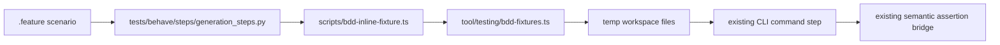

# Behave BDD Coverage, Overlay Discovery, Semantic Assertions, and Inline Workspace Fixtures

**Spec**: `053-behave-bdd-overlay-discovery`
**Status**: Final
**Created**: 2026-07-22
**Priority**: P1
**Product Approval**: approved
**Architecture Review**: approved
**UX Review**: not-needed

> P0 = unusable without; P1 = core value, ship v1; P2 = post-launch; P3 = backlog

## Description

Preserve the existing repo-owned Behave runner, overlay feature discovery contract, and semantic assertion vocabulary from spec 053, while extending the harness so feature authors can define a workspace fixture inline inside a `.feature` file. Inline fixtures must stay file-first: feature authors materialize `superposition.yml`, `.superposition.yml`, `.env`, JSON config, and similar small text files inline, instead of creating manifest-level shorthand fields for project intent. This adds a small scenario-local authoring mode without forcing every setup through an external fixture directory.

## Evidence

- `tests/behave/steps/generation_steps.py` — the only workspace-setup step today is `Given a workspace fixture "..."`, which copies a named directory into a temp workspace.
- `tests/behave/steps/generation_steps.py::_find_workspace_fixture` — fixture lookup searches only `tests/behave/fixtures/` and `overlays/<id>/tests/behave/fixtures/`; there is no inline authoring path.
- `tests/behave/environment.py` — staged Behave support roots are organized around copied repo fixture directories, reinforcing the external-fixture-only model.
- `tests/behave/features/core-generation.feature` and `overlays/task/tests/behave/task-overlay.feature` — all current scenarios depend on named external fixtures.
- `tests/behave/fixtures/plain-nodejs/superposition.yml`, `tests/behave/fixtures/compose-postgres/superposition.yml`, and `overlays/task/tests/behave/fixtures/task-overlay-local/superposition.yml` — current fixtures prove that scenario setup is presently expressed through checked-in directories/files, even for very small one-file workspaces.

## Problem Statement

The current Behave slice proves discovery and semantic assertions, but it still makes every scenario depend on an external fixture directory. That is unnecessarily heavy for small or highly scenario-specific setups.

Today, a feature author who wants to test a small variation in project intent must first create or edit a checked-in fixture tree, even when the scenario only needs a tiny `superposition.yml` plus one supporting file. This creates friction for:

- scenario-local setups that are easier to understand inline,
- targeted edge cases around `stack`, `overlays`, `env`, `mounts`, or similar project-intent fields,
- review of BDD scenarios where the setup is split across the feature file and a separate fixture directory.

The harness needs a second authoring mode: inline fixtures for local clarity, while preserving reusable external fixtures for shared or larger setups.

## User Goals / Jobs To Be Done

- As a feature author, I want to define a small workspace fixture inline in the `.feature` file so the scenario remains self-contained.
- As a maintainer, I want inline fixtures to cover the same effective setup surface as current external fixtures by letting scenarios author the same small project files inline, especially `superposition.yml` content such as `stack`, `overlays`, `env`, and `mounts`.
- As a reviewer, I want it to be clear when a scenario should stay inline versus when a reusable external fixture is the better fit.
- As a contributor, I want existing overlay discovery and semantic assertion steps to keep working unchanged for external fixtures.

## Success Signals

- Feature authors can create a valid temporary workspace from inline fixture content without adding a fixture directory for every small scenario.
- Inline fixtures can express the project-intent fields needed by current BDD scenarios by authoring `superposition.yml` or `.superposition.yml` inline, including `stack`, `overlays`, `env`, `mounts`, and related project-file surface.
- External fixture directories remain supported and are still the preferred reuse mechanism for larger or shared setups.
- Repo-owned and/or overlay-local Behave scenarios demonstrate inline fixture usage alongside retained external fixture usage.

## Confidence

- Overall confidence: high
- Confidence notes: the current external-only fixture constraint is directly evidenced in the shared step file and current feature files; the requested addition is narrow enough to specify without extra discovery.

## User Stories

**US-1** As a feature author, I want to define a small workspace fixture inline so my scenario setup stays in one place.

**US-2** As a maintainer, I want inline fixture authoring to support the same effective project-intent surface as current file-based fixtures.

**US-3** As a reviewer, I want a clear coexistence rule between inline fixtures and reusable external fixtures.

**US-4** As a contributor, I want the existing semantic assertion steps and overlay discovery workflow preserved while fixture authoring becomes more flexible.

## Goals

- Preserve the existing repo-owned Behave runner, shared-step ownership, focused-path selection, and overlay feature discovery.
- Preserve the existing semantic assertion scope from spec 053 for JSON, YAML/Compose, and script semantics.
- Add inline workspace fixture authoring directly in `.feature` files.
- Ensure inline fixture authoring can materialize the same effective setup surface currently required for BDD scenarios by writing the same small repo files external fixtures would provide, especially `superposition.yml` content such as `stack`, `overlays`, `env`, `mounts`, and similar project intent.
- Keep reusable external fixture directories as a first-class, documented option.
- Make the coexistence rule between inline and external fixtures explicit and minimal.

## Non-Goals

- Removing or deprecating external fixture directories.
- Introducing overlay-owned executable step code.
- Designing a fixture inheritance, fixture patching, or fixture-composition system in this slice.
- Supporting binary assets or arbitrary file metadata beyond what current BDD scenarios need.
- Introducing manifest-level shorthand fields such as top-level `stack`, `overlays`, `env`, `mounts`, or `outputPath` outside authored file content.
- Replacing the existing `npm run test:bdd` / `task test:bdd` workflow.

## Authority and References

This spec must align with:

- `docs/foundation.md`
- `docs/adr/adr001-project-file-first-replay-and-regeneration.md`
- `AGENTS.md`
- `docs/definition-of-done.md`
- `docs/specs/039-project-local-contributor-skills-initiative/spec.md`
- `docs/specs/045-root-taskfile-and-mandatory-contributor-validation/spec.md`

## Design

### Observed Behavior

- The harness can already discover repo-level and overlay-level `.feature` files.
- The harness can already perform semantic assertions over generated JSON, YAML/Compose, and scripts.
- Workspace preparation is still external-directory-only.
- Current fixtures are small enough that some scenarios would be clearer if their setup lived inline.

### Product / Behavior

Implementation must preserve the current runner/discovery/assertion contract and add these visible behaviors:

1. **Two supported fixture authoring modes**
    - Existing named external fixtures remain supported through `Given a workspace fixture "..."`.
    - A new inline authoring step must let a scenario define its temp workspace directly in the `.feature` file.
    - Both modes must produce the same kind of temporary workspace for subsequent CLI and assertion steps.

2. **Inline fixture manifest shape**
    - The minimal delivered authoring contract is one multiline doc-string step:
        - `Given an inline workspace fixture:`
    - The doc string must be parsed as YAML so feature authors can express structured data readably.
    - The top-level inline fixture manifest must include a `files` map keyed by workspace-relative path.
    - Each file entry must support one of these content forms:
        - `text` — raw text content
        - `yaml` — structured YAML content serialized to the target file
        - `json` — structured JSON content serialized to the target file
    - Parent directories must be created automatically from the provided relative paths.

3. **Same effective setup surface as external fixtures**
    - Inline fixtures must be capable of expressing the same project-intent inputs the current BDD scenarios need from external fixtures.
    - At minimum, feature authors must be able to author `superposition.yml` or `.superposition.yml` inline with any currently supported project-intent fields, including `stack`, `overlays`, `env`, `mounts`, `outputPath`, and similar fields already accepted by the tool.
    - Those fields are authored inside the inline file content itself, not as additional top-level fixture-manifest fields.
    - Inline fixtures must also be able to author additional supporting text/config files needed by scenarios, such as `.env`, JSON config files, or other small repo inputs.

4. **Minimal coexistence rule with reusable external fixtures**
    - External fixtures remain the preferred mechanism when the same workspace is reused across multiple scenarios or when the fixture contains enough files that inline authoring would harm readability.
    - Inline fixtures are the preferred mechanism for small, scenario-local setups where colocating setup with assertions improves clarity.
    - This slice does **not** add hybrid composition such as “start from named fixture X, then patch inline.” Authors choose either a named external fixture or a fully inline fixture per scenario.

5. **Preservation of existing assertions and workflow**
    - Existing JSON/YAML/Compose/script assertion steps remain valid for scenarios created from either fixture mode.
    - Existing `npm run test:bdd`, `task test:bdd`, feature discovery, and focused-path selection remain unchanged.
    - Overlay-local `.feature` files must be able to use inline fixtures without gaining overlay-owned step code.

6. **Actionable authoring failures**
    - If an inline fixture manifest is malformed, uses an unsupported file-content form, omits `files`, or attempts to write outside the temp workspace, the failure must clearly identify the scenario input problem.
    - Failure messages must cite the invalid fixture path or manifest field so authors can fix the `.feature` file directly.

7. **Proof scenarios and guidance**
    - The Behave suite must include proof that inline fixtures work for at least one repo-owned scenario and remain available to overlay-local scenarios.
    - Contributor guidance for Behave authoring must explain when to choose inline fixtures versus reusable external fixtures.

### Authoring Contract Example

```gherkin
Scenario: Regen from an inline plain-node fixture
  Given an inline workspace fixture:
    """
    files:
      superposition.yml:
        yaml:
          stack: plain
          overlays:
            - nodejs
          env:
            APP_ENV: test
          mounts:
            - source=${localWorkspaceFolder}/.cache,target=/workspace/.cache,type=bind
          outputPath: ./.devcontainer
      .env:
        text: |
          APP_ENV=test
    """
  When I run the CLI command
    """
    regen
    """
  Then the command exits successfully
```

The example is illustrative of the contract shape, not a requirement to migrate every existing scenario.

### Technical Notes

- Reuse YAML doc-string parsing for inline fixture manifests so feature files stay readable.
- Treat inline fixture paths as workspace-relative only; absolute paths and parent traversal outside the temp workspace are invalid.
- Serialize `yaml` entries deterministically enough for repo-owned tests to remain stable.
- Keep the first slice focused on small text-based fixture files; no binary encoding contract is needed.
- Reuse the existing semantic assertion vocabulary unchanged wherever possible.

## Technical Design

### Architecture Ownership

- **Runner and discovery ownership** stays in `scripts/test-bdd.ts`, `tool/testing/bdd.ts`, and the repo-owned `tests/behave/` harness.
- **Inline fixture contract ownership** belongs in a repo-owned TypeScript helper under `tool/testing/`, with a tiny Node bridge under `scripts/` if Python needs to invoke it.
- **Python shared steps** remain thin orchestration: collect the doc string, create the temp workspace, call the repo-owned helper, and surface failures.
- **Overlay-owned responsibility** remains limited to `.feature` files and optional checked-in fixture directories under `overlays/<id>/tests/behave/`.

This keeps fixture semantics in the same repo-owned layer as the existing assertion bridge and avoids introducing Python-only parsing rules or overlay-owned executable behavior.

### System Boundaries

- Keep Behave responsible for scenario wording and workspace lifecycle.
- Keep repo-owned TypeScript responsible for YAML parsing, manifest validation, path-safety checks, and file serialization.
- Keep project intent expressed as authored project files inside the temporary workspace; the inline manifest itself is only a file-materialization envelope.
- Do not move generation logic into fixture helpers; helpers only write scenario input files for the existing CLI flow.
- Do not add executable test logic under `overlays/**`.

### Shared Step Vocabulary

Fixture setup vocabulary after this slice should be:

1. **External reusable fixture**
    - `Given a workspace fixture "..."`
2. **Inline scenario-local fixture**
    - `Given an inline workspace fixture:`
3. **Retained assertion vocabulary**
    - keep the existing structured JSON/YAML/Compose/script assertions from spec 053
    - keep raw `should contain` only as fallback for genuinely unstructured text

A scenario chooses exactly one setup mode in this slice.

### Helper Architecture

Use the smallest addition that preserves repo-owned parsing semantics and reuses the existing Node-side YAML dependency.



- Extend `tests/behave/steps/generation_steps.py`; do not add a second fixture system.
- Add one minimal TypeScript module for inline fixture parsing/materialization.
- Mirror the existing `scripts/bdd-assert.ts` pattern: Python calls a narrow Node bridge, and Vitest covers the pure TypeScript logic directly.
- Reuse `js-yaml`; do not add Python YAML dependencies for this slice.

### Canonical Data Flow

1. Behave enters a scenario.
2. The scenario chooses either `Given a workspace fixture "..."` or `Given an inline workspace fixture:`.
3. The shared step creates a fresh temp workspace directory.
4. External mode copies an existing fixture directory exactly as today.
5. Inline mode sends `{ workspaceRoot, manifestText }` to the repo-owned fixture helper.
6. The helper parses YAML, validates the manifest, materializes declared files into the temp workspace, and returns success or an actionable failure.
7. Existing CLI command and assertion steps run unchanged against that workspace.

### Inline Authoring Contract

The inline manifest remains intentionally narrow:

- Top level: exactly one supported field, `files`.
- `files`: map of workspace-relative file paths to file-entry declarations.
- File entry: exactly one supported content field, `text`, `yaml`, or `json`.

Project intent fields such as `stack`, `overlays`, `env`, `mounts`, and `outputPath` are **not** additional inline-manifest fields. They remain content authored inside `files.superposition.yml.yaml`, `files..superposition.yml.yaml`, or another project file path. This preserves the project-file-first boundary from ADR 001 and avoids creating a parallel test-only project-intent grammar.

### Materialization Rules

- `files` is required and must be a non-empty mapping.
- Each file key must be a relative workspace path.
- Reject absolute paths, empty paths, `.` / `..` segments, and any normalized path that escapes `workspaceRoot`.
- Create parent directories automatically before writing files.
- `text` writes the provided string verbatim.
- `yaml` serializes structured data through `js-yaml` using one deterministic repo-owned option set.
- `json` serializes structured data through `JSON.stringify(..., null, 2)` plus a trailing newline.
- Reject top-level keys other than `files` and reject file-entry keys other than the single selected content form.

The materializer should treat `.env`, JSON config, Compose YAML, and `superposition.yml` exactly as ordinary authored files. Support for `stack`/`overlays` parity comes from being able to inline the same project file content that an external fixture directory would have checked in.

### Failure Contract

Inline fixture authoring failures should identify:

- the scenario fixture mode (`inline workspace fixture`)
- the invalid manifest field or relative file path
- the reason the manifest is invalid
- the expected contract when useful

Example shape:

- `Inline workspace fixture is missing required top-level field "files".`
- `Inline workspace fixture field "stack" is not supported; author project intent inside files.superposition.yml.yaml.`
- `Inline workspace fixture file path "../outside.yml" escapes the temporary workspace.`
- `Inline workspace fixture file "superposition.yml" must declare exactly one of: text, yaml, json.`

### Coexistence Rules

- External fixtures stay first-class and should remain the default for shared, bulky, or multi-scenario workspaces.
- Inline fixtures are for small, scenario-local setups where colocating setup with assertions improves reviewability.
- This slice does not support `named fixture + inline patch` composition.
- Overlay-local features may use either mode, but they continue to use the same repo-owned shared steps.

### Implementation Slices

1. **Inline fixture helper**
    - add `tool/testing/bdd-fixtures.ts` pure parsing/materialization logic
    - add a narrow `scripts/bdd-inline-fixture.ts` bridge only if needed for Python invocation
2. **Shared-step integration**
    - add `Given an inline workspace fixture:` to `tests/behave/steps/generation_steps.py`
    - preserve `Given a workspace fixture "..."` unchanged
3. **Proof coverage**
    - add at least one repo-owned inline-fixture scenario under `tests/behave/features/`
    - add or update one overlay-local scenario under `overlays/<id>/tests/behave/` that uses the inline step
    - retain at least one external-fixture scenario as a coexistence regression
4. **Guidance refresh**
    - update `docs/creating-overlays.md` with inline-vs-external fixture guidance and the shared-step boundary reminder

### Risk Notes

- Putting YAML parsing only in Python would add a second semantics stack and weaker Vitest coverage.
- Allowing manifest-level project-intent fields would violate project-file-first boundaries and create a test-only configuration dialect.
- Permitting hybrid fixture composition in this slice would expand surface area far beyond the minimum safe change.

### Test Plan

- **Vitest / lower-level coverage**
    - cover valid manifest parsing for `text`, `yaml`, and `json`
    - cover rejection of missing `files`, unsupported top-level keys, malformed file entries, and workspace-escape attempts
    - cover deterministic serialization expectations for structured file output
- **BDD acceptance coverage**
    - add one repo-owned inline-fixture scenario that authors `superposition.yml` inline and then exercises existing semantic assertions
    - retain an external-fixture scenario in `tests/behave/features/` to prove coexistence
    - add or update one overlay-local feature that uses the inline step, proving overlay discovery plus shared-step reuse still work together
- **Workflow validation**
    - iterate with `npm run test:bdd -- <focused-path>` or `task test:bdd`
    - run `task validate` as the required completion gate
    - run broader generated-output validation only if the final implementation also changes generated-output-bearing surfaces that trigger it

### Architecture Decision Impact

- aligned with current ADRs/foundation

## Routing Decision

- **Next route**: PM → Developer
- **Why**: the new scope is narrow, the coexistence rule is explicit, the authoring contract is defined, and no additional UX or ADR work is needed before implementation.
- **Architecture decision impact**: aligned with current ADRs/foundation; no ADR amendment required for this slice.

## Implementation Handoff

Implementation should stay minimal:

1. Add one repo-owned inline fixture parser/materializer in TypeScript, plus only the narrowest Node bridge needed for Python to invoke it.
2. Keep Python Behave steps thin: create the temp workspace, pass `{ workspaceRoot, manifestText }`, and surface actionable failures.
3. Preserve the existing named-fixture step unchanged.
4. Prove coexistence with one repo-owned inline scenario, one retained reusable external-fixture scenario, and one overlay-local inline scenario using shared repo-owned steps.
5. Update guidance so contributors know when to keep setup inline versus when to promote it to `tests/behave/fixtures/` or `overlays/<id>/tests/behave/fixtures/`.

## Constraints

- Preserve the existing runner, discovery path, focused-path selection, and shared-step ownership boundaries.
- Preserve the current semantic assertion scope and vocabulary from spec 053.
- Keep inline fixture authoring minimal: one manifest step, small text-based file surface, no hybrid fixture composition.
- Preserve project-file-first and generated-artifact boundaries while exercising generation behavior.

## Preferences / Tradeoffs

- Prefer inline fixtures for small, scenario-local setups.
- Prefer reusable external fixtures for shared or bulky setups.
- Prefer one simple manifest contract over many file-authoring micro-steps.
- Prefer reuse of existing YAML/JSON tooling over adding a parallel parsing stack.

## Risks

- Over-scoping the inline fixture grammar could make feature files harder to read than external fixtures.
- Under-specifying coexistence could create inconsistent fixture authoring patterns across repo and overlay scenarios.
- If proof scenarios do not cover inline fixtures, the step may drift or regress unnoticed.

## Implementation / Intent Mismatches

- The current implementation satisfies discovery and semantic assertions from the earlier spec slice.
- The current implementation does **not** satisfy this updated requirement because workspace fixtures can only be sourced from external fixture directories.

## Acceptance Criteria

- [x] **AC-1 Workflow contract preserved**: `npm run test:bdd`, `task test:bdd`, repo-owned shared steps, focused-path forwarding, and automatic overlay discovery under `overlays/<id>/tests/behave/**/*.feature` remain the canonical workflow and ownership boundary.
- [x] **AC-2 External fixture compatibility preserved**: the existing `Given a workspace fixture "..."` step continues to work unchanged for shared and overlay-local fixture directories.
- [x] **AC-3 Inline fixture step added**: feature authors can define a temporary workspace with `Given an inline workspace fixture:` using a YAML doc string manifest.
- [x] **AC-4 Inline manifest contract is narrow and file-first**: `Given an inline workspace fixture:` accepts one YAML doc string whose top level contains only `files`; `files` is a non-empty map keyed by workspace-relative paths; each file entry declares exactly one of `text`, `yaml`, or `json`.
- [x] **AC-5 Project intent stays inside authored files**: inline fixtures can materialize `superposition.yml` or `.superposition.yml` with the project-intent fields needed by BDD scenarios, including `stack`, `overlays`, `env`, `mounts`, `outputPath`, and similar existing fields, plus additional small supporting files such as `.env` or JSON config files; manifest-level shorthand fields such as top-level `stack`, `overlays`, `env`, `mounts`, or `outputPath` are rejected.
- [x] **AC-6 Safe materialization and actionable failures**: inline fixture paths cannot escape the temp workspace; parent directories are created automatically; malformed manifests, unsupported keys, and invalid file entries fail fast with messages that identify the offending field or path and explain the expected contract.
- [x] **AC-7 Coexistence rule documented**: contributor guidance clearly states that inline fixtures are for small scenario-local setups, external fixture directories remain the reusable/shared option, and hybrid “named fixture plus inline patch” behavior is out of scope for this slice.
- [x] **AC-8 Semantic assertions preserved across fixture modes**: the existing structured JSON/YAML/Compose/script assertion vocabulary continues to work for scenarios authored with either external or inline fixtures.
- [x] **AC-9 Repo-owned proof coverage**: `tests/behave/features/` includes at least one inline-fixture scenario that authors project-file content inline and exercises existing generation plus semantic assertions, and at least one external-fixture scenario remains to prove coexistence.
- [x] **AC-10 Overlay-local proof coverage**: overlay-local feature discovery still proves shared-step reuse, including at least one overlay-local `.feature` scenario that uses the inline fixture step without adding overlay-owned executable steps.
- [x] **AC-11 Lower-level regression coverage**: focused lower-level tests cover inline fixture manifest validation, rejection of unsupported top-level keys and workspace-escape paths, and deterministic YAML/JSON serialization/materialization behavior introduced by this slice.
- [x] **AC-12 Workflow synchronization**: `docs/specs/053-behave-bdd-overlay-discovery/spec.md`, `docs/specs/README.md`, `docs/specs/taxonomy.md`, and any touched Behave authoring guidance stay synchronized with this updated Draft scope and status ownership rules.

## Out of Scope

- Fixture inheritance or patching.
- Binary fixture authoring.
- Overlay-local executable step implementations.
- Replacing the existing Behave runner or assertion bridge.

## Assumptions

- A single YAML doc-string manifest is sufficient for the inline fixture authoring needs in this slice.
- Current BDD scenarios only need text-based fixture files.
- Existing semantic assertions already cover the generated-output validation needed after the workspace is created.

## Open Questions

- None blocking.

## Definition of Done

> Filled in progressively by each role. QA sets `Status: Final` only after verifying all gates.
> Full standards in `docs/definition-of-done.md`.

### Code

- [x] No lint errors
- [x] No type errors
- [x] No debug or uncommitted temporary code
- [x] Follows project conventions

### Tests

- [x] Unit tests cover new pure logic
- [x] Integration tests cover system boundaries
- [x] All tests pass
- [x] No unjustified skipped tests
- [x] Failure and edge cases covered

### Documentation

- [x] Public interfaces documented
- [x] All new documentation in Markdown
- [x] All diagrams in Mermaid
- [ ] README updated if behavior or setup changed
- [x] Architecture docs updated if ownership or boundaries changed

### Changelog

- [x] `CHANGELOG.md` updated under `[Unreleased]` for user-visible changes

### Workflow artifacts

- [x] Acceptance criteria checked off (met only — unmet left unchecked with explanation)
- [x] `## Implementation Notes` written
- [x] Spec status and index synchronized
- [x] QA feedback rows marked `Done` where applicable

### Architecture

- [x] No ADR or foundation rules silently violated
- [x] ADR created or amended if a standing decision was made or changed

### QA verification

- [x] All above gates verified independently
- [x] Acceptance criteria classified: MET / CLAIMED BUT FAILED / OPEN / UNCHECKED
- [x] No regressions introduced
- [x] Spec set to `Final`

## Implementation Notes <!-- developer-owned when implemented -->

Implemented the inline workspace-fixture slice with the smallest repo-owned addition set:

- Added `tool/testing/bdd-fixtures.ts` as the TypeScript-owned inline manifest parser/materializer with YAML parsing, top-level/file-entry validation, path-safety checks, and deterministic YAML/JSON serialization.
- Added `scripts/bdd-inline-fixture.ts` as the narrow Node bridge so shared Python Behave steps keep orchestration-only responsibility.
- Extended `tests/behave/steps/generation_steps.py` with `Given an inline workspace fixture` while preserving the existing named external fixture step unchanged.
- Added repo-owned and overlay-local inline proof scenarios in `tests/behave/features/core-generation.feature` and `overlays/task/tests/behave/task-overlay.feature`, while retaining external fixture coverage for coexistence.
- Added lower-level regression coverage in `tool/__tests__/bdd-fixtures.test.ts` for valid materialization, unsupported top-level shorthand rejection, workspace-path rejection, invalid file-entry rejection, and deterministic YAML/JSON output.
- Updated `docs/creating-overlays.md` and `CHANGELOG.md` to align contributor guidance and user-visible behavior.

Validation run:

- `npm test -- tool/__tests__/bdd-fixtures.test.ts tool/__tests__/bdd-runner.test.ts tool/__tests__/bdd-assertions.test.ts`
- `npm run test:bdd -- tests/behave/features/core-generation.feature overlays/task/tests/behave/task-overlay.feature`
- `task validate`
