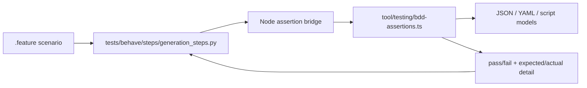

# Behave BDD Coverage, Overlay Discovery, and Semantic Assertions

**Spec**: `053-behave-bdd-overlay-discovery`
**Status**: Final
**Created**: 2026-07-22
**Priority**: P1
**Product Approval**: approved
**Architecture Review**: approved
**UX Review**: not-needed

> P0 = unusable without; P1 = core value, ship v1; P2 = post-launch; P3 = backlog

## Description

Keep the existing repo-owned Behave workflow and overlay feature discovery contract, but raise the shared Behave vocabulary from basic file/substring checks to structured, semantic assertions over generated outputs. The harness must support exact contracts for generated JSON, YAML/Compose, scripts, PATH/export behavior, extension/config variables, and similar repo-generated artifacts without forcing feature authors to rely on arbitrary substring matching.

## Evidence

- `tests/behave/steps/generation_steps.py` — the current shared vocabulary exposes file existence, raw `should contain` substring checks, and one simple JSON property equality step; it cannot express exact arrays, nested indexed paths, parsed YAML, or shell export/PATH semantics.
- `tests/behave/features/core-generation.feature` — the core repo scenario currently validates generated `devcontainer.json` with a substring match against raw JSON text.
- `overlays/task/tests/behave/task-overlay.feature` — the only overlay-local proof scenario uses one exact JSON property assertion but does not exercise array contracts, compose YAML, or script semantics.
- `docs/creating-overlays.md`, `.pi/skills/overlay-development/SKILL.md`, `.pi/agents/overlay-writer.md`, `.pi/agents/overlay-reviewer.md`, and `.pi/prompts/overlay-write-loop.md` — contributor guidance already routes authors to shared Behave steps, so the shared vocabulary must become strong enough to cover real generated-output contracts declaratively.

## Problem Statement

The initial Behave slice solved runner ownership and overlay-local discovery, but its assertion vocabulary is still too weak for the generated outputs this repository cares about.

Today, feature authors can reliably assert only:

- a file exists,
- a raw file contains a substring, or
- a simple dot-path JSON property stringifies to an expected scalar.

That leaves important generated-output contracts under-specified or awkward to test, including:

- exact JSON arrays and nested structures,
- Docker Compose YAML services, environment values, port mappings, and network naming,
- generated shell scripts and their export/PATH behavior,
- exact VS Code extension IDs and config variables,
- other structured repo-generated files where substring checks are brittle or too permissive.

Without richer shared steps, the Behave suite risks becoming a readability layer over weak assertions instead of a durable regression layer for generated-output behavior.

## User Goals / Jobs To Be Done

- As a maintainer, I want Behave scenarios to verify exact generated-output contracts so regressions are caught precisely.
- As an overlay contributor, I want to express structured expectations declaratively through shared steps instead of inventing brittle substring assertions.
- As a reviewer, I want repo-level and overlay-level scenarios to prove the harness can check real JSON, YAML, and script semantics.
- As a contributor, I want docs and prompts to teach when structured assertions are required and when raw text assertions are still acceptable.

## Success Signals

- Core repo features stop depending on arbitrary substring checks for structured generated outputs.
- Shared Behave steps can assert exact structured values from generated JSON and YAML documents.
- Shared Behave steps can verify generated script export/PATH behavior semantically enough for current repo contracts.
- Contributor guidance consistently steers authors toward structured assertions for structured outputs.

## Confidence

- Overall confidence: high
- Confidence notes: the current harness limitations are directly evidenced in `tests/behave/steps/generation_steps.py` and the existing repo/overlay feature files; the requested expansion is specific enough to draft without further discovery.

## User Stories

**US-1** As a maintainer, I want core workflows covered by Behave using exact structured assertions instead of permissive substring checks.

**US-2** As an overlay contributor, I want shared steps that can describe JSON arrays, compose YAML values, and generated script semantics without writing custom runner code.

**US-3** As a reviewer, I want richer repo-owned proof scenarios that demonstrate the semantic assertion vocabulary is real and maintained.

**US-4** As a contributor, I want overlay docs, prompts, and skills to explain when to use structured assertions and when raw text checks are still appropriate.

## Goals

- Preserve the existing repo-owned Behave runner, shared-step ownership model, and overlay-local feature discovery path.
- Expand the shared Behave vocabulary to support semantic assertions over structured generated outputs.
- Make exact JSON property and array contracts first-class Behave assertions.
- Make parsed YAML/Compose service, environment, ports, and network contracts first-class Behave assertions.
- Make generated script export/PATH behavior assertable without arbitrary substring checks.
- Require richer repo-owned proof scenarios that exercise the new capabilities end to end.
- Update contributor guidance already introduced by spec 053 so it teaches the stronger assertion contract.

## Non-Goals

- Replacing the existing `npm run test:bdd` / `task test:bdd` entrypoints or overlay discovery convention.
- Introducing overlay-owned step-definition code.
- Adding a fully general query language such as unrestricted JSONPath or JMESPath.
- Backfilling every existing overlay with new Behave scenarios in one pass.
- Building a full shell interpreter; only the generated shell/export semantics needed by repo-owned outputs must be covered.

## Authority and References

This spec must align with:

- `docs/foundation.md`
- `docs/adr/adr001-project-file-first-replay-and-regeneration.md`
- `AGENTS.md`
- `docs/definition-of-done.md`
- `docs/specs/039-project-local-contributor-skills-initiative/spec.md`
- `docs/specs/045-root-taskfile-and-mandatory-contributor-validation/spec.md`

## Design

### Observed Behavior

- The current shared step library is discovery-capable but assertion-light.
- The current repo-level proof scenario uses a substring check where an exact structured contract would be stronger.
- The current overlay-local proof scenario demonstrates shared-step reuse but not the breadth of generated-output contracts contributors need.

### Product / Behavior

Implementation must preserve the existing Behave runner/discovery contract and add these visible behaviors:

1. **Structured assertions become the default for structured outputs**
    - Shared steps must let feature authors assert parsed JSON, parsed YAML, and generated shell/export semantics directly.
    - For structured generated outputs, feature authors must not be forced to fall back to arbitrary substring checks.
    - Raw text assertions may remain available only for genuinely unstructured content such as prose, logs, or opaque text blocks.

2. **Exact JSON contracts**
    - Shared steps must support nested JSON path assertions for scalar values, objects, and arrays.
    - Array assertions must support exact ordered equality and targeted membership checks.
    - Nested addressing must support object keys plus zero-based array indexes.
    - Expected structured values must be expressible readably in feature files, preferably through multiline JSON/YAML doc strings rather than flattened string literals.

3. **Exact YAML and Compose contracts**
    - Shared steps must support parsed YAML assertions for generated files such as `docker-compose.yml` and copied config files.
    - The first delivered slice must cover the contracts the repo most needs to verify: service existence, image/value equality, environment values, port mappings, network membership, and top-level network naming.
    - Compose-focused assertions may be exposed as convenience steps as long as they remain backed by parsed YAML rather than raw substring checks.

4. **Generated script and PATH/export semantics**
    - Shared steps must support assertions over generated shell scripts and similar generated command files.
    - The first slice must support exact variable/export value checks and PATH-segment semantics needed by repo-generated outputs, including verifying whether a segment is present and whether prepend/append ordering is correct.
    - The harness does not need a full shell interpreter; it only needs to parse and assert the export/assignment patterns the repo emits.

5. **Extension and config-variable contracts**
    - Shared steps must let scenarios assert exact VS Code extension IDs, devcontainer config values, and generated environment/config variable values without raw-text matching.
    - These may be implemented through general JSON/YAML assertions or thin convenience steps, but the scenario vocabulary must stay readable for common contributor use cases.

6. **Richer repo-owned proof scenarios**
    - The core repo feature set under `tests/behave/features/` must be expanded beyond the current substring-based proof scenario.
    - Repo-owned scenarios must exercise, at minimum:
        - exact JSON property/array assertions,
        - exact Compose YAML service/environment/ports/network assertions, and
        - generated script export or PATH semantics.
    - At least one overlay-local feature must also exercise the richer assertion vocabulary so overlay discovery continues to prove real shared-step reuse.

7. **Contributor guidance updates**
    - The contributor docs, prompts, and skills already updated by the first slice must now explain that structured generated-output contracts should use structured shared assertions.
    - Those surfaces must make clear that substring checks are a fallback for unstructured text, not the default for generated JSON/YAML/config outputs.

8. **Failure output remains actionable**
    - When a structured assertion fails, failure output must identify the file, addressed path/service/variable, and the actual versus expected value clearly enough for maintainers and overlay reviewers to act without reproducing manually.

### Technical Notes

- Reuse one small shared addressing grammar across JSON and YAML where practical: dot segments for object keys plus `[index]` for arrays is sufficient for this slice.
- Expected structured values may be authored as YAML or JSON doc strings so feature files stay readable.
- Compose-specific convenience steps are acceptable if they reduce feature-file noise, but they must still compare parsed structures exactly.
- PATH assertions must treat PATH as a colon-delimited sequence of segments, not a plain substring.
- Script parsing only needs to cover the export/assignment forms the repo itself generates; arbitrary shell control flow is out of scope.
- Existing discovery behavior, focused-path forwarding, shared-step ownership, and runtime provisioning remain authoritative from the initial spec.

## Technical Design

### Architecture Ownership

- **Runner and discovery ownership** stays in `scripts/test-bdd.ts`, `tool/testing/bdd.ts`, and the repo-owned `tests/behave/` harness.
- **Assertion semantics ownership** belongs in a new repo-owned TypeScript helper module under `tool/testing/` plus a thin Python step adapter in `tests/behave/steps/`.
- **Overlay-owned responsibility** remains limited to `.feature` files and supporting test data under `overlays/<id>/tests/behave/`.
- **Contributor workflow propagation** remains owned by `AGENTS.md`, `docs/creating-overlays.md`, `CONTRIBUTING.md`, `.github/instructions/**`, and the project-local `.pi/` assets already touched by the original spec.

### System Boundaries

- Keep Behave responsible for behavior-level acceptance scenarios and Gherkin wording.
- Keep Node/TypeScript responsible for structured parsing and exact comparison because the repo already owns JSON/YAML tooling there and Vitest is the required lower-level regression surface.
- Keep the Python layer thin: it should resolve workspace-relative file paths, forward assertion requests, and render failures, but not become a second semantic engine.
- Do not move generation/composition logic into Behave helpers; steps should continue exercising repo-owned CLI/tool entrypoints and generated outputs.
- Do not load executable test code from `overlays/**`.

### Shared Step Vocabulary

Prefer one small family of readable steps over many file-type-specific phrases.

1. **Document assertions**
    - `Then the JSON file "..." should have value at "..." equal:`
    - `Then the YAML file "..." should have value at "..." equal:`
    - `Then the JSON file "..." should contain array item at "..." equal:`
    - `Then the YAML file "..." should contain array item at "..." equal:`
    - expected objects/arrays come from multiline doc strings parsed as YAML-or-JSON

2. **Compose convenience assertions**
    - `Then the Compose file "..." should define service "..."`
    - `Then the Compose file "..." should have service "..." environment "..." equal "..."`
    - `Then the Compose file "..." should have service "..." port "..."`
    - `Then the Compose file "..." should have service "..." on network "..."`
    - `Then the Compose file "..." should have network "..." named "..."`

3. **Script semantics assertions**
    - `Then the script "..." should export "..." equal "..."`
    - `Then the script "..." should assign "..." equal "..."`
    - `Then the script "..." should add PATH segment "..." before "..."`
    - `Then the script "..." should add PATH segment "..." after "..."`
    - `Then the script "..." should include PATH segment "..."`

4. **Retained fallback**
    - keep raw `should contain` only for genuinely unstructured text
    - docs and examples must treat it as exception-path vocabulary, not the default for JSON/YAML/config output

### Helper Architecture

Use the smallest cross-runtime split that preserves repo-owned semantics and Vitest coverage.

- Extend the existing Python step file instead of introducing overlay-local step code.
- Add one small Node-facing assertion bridge callable from the Python steps, for example `scripts/bdd-assert.ts` or an exported helper reachable through `tsx`.
- Put path parsing, YAML loading, script export parsing, PATH comparison, and failure rendering primitives in a TypeScript helper module such as `tool/testing/bdd-assertions.ts`.
- Return structured results from the TypeScript layer so Python only raises `AssertionError` with already-attributed messages.
- Reuse existing repo dependencies such as `js-yaml`; do not add a second parsing stack to Python for this slice.

### Canonical Data Flow

1. Behave runs the existing repo-owned scenario.
2. Python steps resolve the generated workspace file path and capture any step doc string.
3. Python invokes the repo-owned Node assertion bridge with:
    - file kind (`json`, `yaml`, `compose`, `script`)
    - relative file path
    - addressed path/service/variable metadata
    - expected value text when present
4. TypeScript helpers parse the file, apply one shared path grammar, and evaluate exact equality or membership.
5. TypeScript returns either success or a structured failure payload containing file, selector, expected, and actual.
6. Python converts failures into concise Behave assertion output.

### Assertion Grammar and Comparison Rules

- Use one shared path grammar for JSON and YAML: dot-separated object keys with zero-based array selectors like `customizations.vscode.extensions[0]`.
- Keep grammar intentionally small; no wildcards, filters, recursive descent, or user-defined expressions.
- Parse step doc strings as YAML first so feature authors can write either YAML-style or JSON-style objects/arrays readably.
- Equality on scalars, arrays, and objects is exact after parsing.
- Array membership compares parsed items exactly, not by substring.
- Compose convenience steps may internally map to general YAML paths, but their failure messages must still name service/network/env concepts directly.
- Script parsing only needs to support deterministic assignment forms the repo emits now: `export NAME=value`, `NAME=value`, `export PATH=...`, and shell-compatible quoted values already generated in repo-owned scripts/config.
- PATH semantics must split on `:` and compare exact segments in order.

### Failure Contract

Every structured assertion failure should include:

- workspace-relative file path
- addressed path, service, env key, variable, or PATH segment under test
- assertion type (`equal`, `contains item`, `before`, `after`, `exists`)
- expected value
- actual value or absence reason

Example shape:

- `Expected JSON file .devcontainer/devcontainer.json path customizations.vscode.extensions to contain item "ms-python.python"; actual array was [...]`
- `Expected Compose file .devcontainer/docker-compose.yml service postgres environment POSTGRES_DB to equal "app"; actual was "postgres"`
- `Expected script .devcontainer/scripts/setup-python.sh PATH to place "${containerWorkspaceFolder}/.venv/bin" before "${containerEnv:PATH}"; actual order was [...]`

### Implementation Slices

1. **Shared assertion engine**
    - add `tool/testing/bdd-assertions.ts` for document path parsing, expected-value parsing, exact comparison, script export parsing, and failure formatting
    - add a minimal Node bridge invoked from Behave Python steps
2. **Thin Behave step expansion**
    - keep `tests/behave/steps/generation_steps.py` as the single shared step file
    - add readable JSON/YAML/Compose/script steps that delegate to the bridge
3. **Core scenario enrichment**
    - replace or supplement weak repo-level substring proofs with richer repo-owned feature scenarios
4. **Overlay proof refresh**
    - update at least one overlay-local feature to use the richer shared vocabulary
5. **Contributor guidance refresh**
    - update docs/prompts/skills already changed by spec 053 so they teach the new assertion preference clearly

### Risk Notes

- If the Python layer grows its own parsing/comparison logic, Vitest regression coverage and semantic consistency will drift.
- If substring checks remain the path of least resistance, contributors will keep writing brittle scenarios even after the harness expands.
- If the step vocabulary grows into a generic query DSL, readability and maintenance costs will rise quickly.
- If PATH/export assertions are too weak, generated script regressions will continue to slip through despite feature coverage.
- If repo-owned proof scenarios do not exercise the new assertions, the vocabulary may drift or rot unnoticed.

### Test Plan

- **Vitest / lower-level coverage**
    - add focused tests for path tokenization and lookup across objects plus array indexes
    - add tests for expected-value doc-string parsing into scalars, arrays, and objects
    - add tests for YAML loading and Compose convenience lookups
    - add tests for script assignment/export parsing and PATH ordering comparisons
    - preserve existing discovery-wrapper regression coverage
- **BDD acceptance coverage**
    - update the core repo feature to assert exact JSON values such as extension arrays or `remoteEnv`
    - add or expand a core compose scenario using a compose-capable fixture and exact service/environment/port/network assertions
    - add or expand a core script scenario proving export/PATH semantics against a generated repo-owned script or generated config surface
    - update at least one overlay-local scenario to use the richer shared assertions
- **Contributor workflow validation**
    - keep `npm run test:bdd` / `task test:bdd` as the focused iteration path
    - keep `task validate:generated` as the broader generated-output validation path when its triggers apply

### Architecture Decision Impact

- aligned with current ADRs/foundation

## Routing Decision

- **Next route**: PM → Developer
- **Why**: product scope, shared vocabulary, ownership boundaries, failure contract, and test expectations are now explicit; no further UX or ADR work blocks implementation.
- **Architecture decision impact**: aligned with current ADRs/foundation; no ADR amendment required for this slice.

## Implementation Handoff

Implementation should land in the smallest sequence that preserves the approved architecture split:

1. **TypeScript assertion helpers first**
    - add the shared path parser, parsed-value loader, YAML/Compose assertions, script export parsing, PATH ordering checks, and structured failure formatter under `tool/testing/`
    - cover this layer with focused Vitest regression tests before wiring Behave steps broadly
2. **Thin Node bridge and Python adapter second**
    - keep `tests/behave/steps/generation_steps.py` as a delegating adapter only
    - keep cross-runtime input/output narrow: file kind, selector metadata, expected value text, pass/fail payload
3. **BDD scenario upgrades third**
    - strengthen repo-owned scenarios under `tests/behave/features/` to prove JSON, Compose, and script assertions end to end
    - refresh at least one overlay-local feature under `overlays/<id>/tests/behave/` to prove shared-step reuse still works through overlay discovery
4. **Contributor guidance last in the same delivery**
    - update the contributor-facing docs, prompts, and skills listed in acceptance criteria so structured outputs are tested with structured assertions by default

## Constraints

- Preserve the existing runner, discovery path, runtime provisioning, and shared-step ownership boundaries from the initial spec.
- Keep the semantic assertion slice minimal and implementation-ready; prefer a small, readable vocabulary over a powerful but generic DSL.
- Preserve project-file-first and generated-artifact boundaries while exercising generation behavior.
- Keep failure output attributable to repo-level versus overlay-level feature ownership.

## Preferences / Tradeoffs

- Prefer parsed-structure assertions over substring checks for any structured generated output.
- Prefer one small shared addressing grammar over multiple unrelated path syntaxes.
- Prefer convenience steps for common Compose/script contracts when they improve readability without hiding exact comparisons.
- Prefer a few strong repo-owned proof scenarios over many shallow examples.

## Risks

- A partial implementation that adds JSON exactness but not YAML/script semantics will still leave large generated-output gaps.
- Overly verbose or hard-to-author steps may push contributors back toward raw text assertions.
- If contributor docs are not updated with the same change, old scenario-authoring habits will persist.

## Implementation / Intent Mismatches

- The current implementation satisfies the original discovery slice but not this richer semantic-assertion slice.
- The current core repo scenario still models a structured generated-output contract as a substring check.

## Acceptance Criteria

- [x] **AC-1 Workflow contract preserved**: `npm run test:bdd`, `task test:bdd`, repo-owned shared steps, focused-path forwarding, and automatic overlay discovery under `overlays/<id>/tests/behave/**/*.feature` remain the canonical workflow and ownership boundary.
- [x] **AC-2 Shared JSON/YAML path contract**: shared assertions support one documented `foo.bar[0]` selector grammar across JSON and YAML files, with exact equality for scalars, objects, and arrays plus exact array-item membership checks from readable YAML-or-JSON doc strings.
- [x] **AC-3 Compose semantic coverage**: shared assertions support parsed Compose checks for service existence, service environment key equality, declared port presence, service network membership, and top-level network naming without relying on raw substring matching.
- [x] **AC-4 Script semantic coverage**: shared assertions support generated-script checks for `export NAME=value`, `NAME=value`, PATH segment presence, and PATH before/after ordering for the deterministic shell forms this repository emits.
- [x] **AC-5 Readable shared vocabulary**: the delivered step set stays small and readable, using the approved document, Compose, and script phrases from this spec rather than introducing a generic query DSL or overlay-owned executable step code.
- [x] **AC-6 Actionable failure contract**: every structured assertion failure reports the workspace-relative file path, the failing selector/service/variable/PATH segment, the assertion type, and the expected versus actual value or absence reason.
- [x] **AC-7 Repo-owned proof scenarios**: `tests/behave/features/` include end-to-end scenarios that prove exact JSON assertions, exact Compose assertions, and exact script export or PATH assertions against generated outputs.
- [x] **AC-8 Overlay reuse proof**: at least one overlay-local feature under `overlays/<id>/tests/behave/` uses the richer shared assertions so overlay discovery still proves real shared-step reuse.
- [x] **AC-9 Lower-level regression coverage**: Vitest coverage is added or updated for path parsing, structured expected-value parsing, YAML/Compose lookup behavior, script assignment/export parsing, PATH ordering logic, and failure formatting introduced by this slice.
- [x] **AC-10 Contributor guidance alignment**: `CONTRIBUTING.md`, `docs/creating-overlays.md`, `.github/instructions/overlay-authoring.instructions.md`, `.pi/skills/overlay-development/SKILL.md`, `.pi/agents/overlay-writer.md`, `.pi/agents/overlay-reviewer.md`, and `.pi/prompts/overlay-write-loop.md` are updated to treat structured assertions as the default for structured outputs and substring checks as fallback for unstructured text.
- [x] **AC-11 Workflow synchronization**: `docs/specs/053-behave-bdd-overlay-discovery/spec.md`, `docs/specs/README.md`, and any touched workflow guidance remain synchronized with the final delivered scope and status ownership rules.

## Out of Scope

- A generic plugin system for overlay-local executable Behave code.
- Full backfill of every existing overlay with richer scenarios.
- Arbitrary shell-language evaluation beyond the generated export/assignment forms this repo emits.
- Replacing smoke, unit, or command-level tests outside the targeted BDD assertion improvements.

## Assumptions

- A small shared path grammar is sufficient for the JSON/YAML addressing needs in this slice.
- The repo-generated shell patterns needing coverage are constrained enough for lightweight semantic parsing.
- The existing harness/discovery implementation remains the correct foundation and does not need architectural redesign.

## Open Questions

- None blocking.

## Definition of Done

> Filled in progressively by each role. QA sets `Status: Final` only after verifying all gates.
> Full standards in `docs/definition-of-done.md`.

### Code

- [x] No lint errors
- [x] No type errors
- [x] No debug or uncommitted temporary code
- [x] Follows project conventions

### Tests

- [x] Unit tests cover new pure logic
- [x] Integration tests cover system boundaries
- [x] All tests pass
- [x] No unjustified skipped tests
- [x] Failure and edge cases covered

### Documentation

- [x] Public interfaces documented
- [x] All new documentation in Markdown
- [x] All diagrams in Mermaid
- [x] README updated if behavior or setup changed
- [x] Architecture docs updated if ownership or boundaries changed

### Changelog

- [x] `CHANGELOG.md` updated under `[Unreleased]` for user-visible changes

### Workflow artifacts

- [x] Acceptance criteria checked off (met only — unmet left unchecked with explanation)
- [x] `## Implementation Notes` written
- [x] Spec status and index synchronized
- [x] QA feedback rows marked `Done` where applicable

### Architecture

- [x] No ADR or foundation rules silently violated
- [x] ADR created or amended if a standing decision was made or changed

### QA verification

- [x] All above gates verified independently
- [x] Acceptance criteria classified: MET / CLAIMED BUT FAILED / OPEN / UNCHECKED
- [x] No regressions introduced
- [x] Spec set to `Final`

## Implementation Notes <!-- developer-owned when implemented -->

Implemented the semantic assertion layer in `tool/testing/bdd-assertions.ts` with a thin Node bridge in `scripts/bdd-assert.ts`, keeping `tests/behave/steps/generation_steps.py` as a delegating adapter. The shared vocabulary now covers structured JSON/YAML equality, exact array-item membership, Compose service/environment/port/network assertions, and script assignment/export/PATH semantics.

Expanded repo-owned proof coverage in `tests/behave/features/core-generation.feature` with exact JSON, Compose, and script scenarios, added the compose fixture at `tests/behave/fixtures/compose-postgres/`, and refreshed `overlays/task/tests/behave/task-overlay.feature` to prove overlay-local reuse of the richer shared assertions.

Updated contributor guidance in `CONTRIBUTING.md`, `docs/creating-overlays.md`, `.github/instructions/overlay-authoring.instructions.md`, `.pi/skills/overlay-development/SKILL.md`, `.pi/agents/overlay-writer.md`, `.pi/agents/overlay-reviewer.md`, and `.pi/prompts/overlay-write-loop.md` so structured outputs default to shared semantic assertions and substring checks are treated as fallback-only for unstructured text.

QA follow-up: replaced `JSON.stringify` equality with recursive semantic comparison so object equality is key-order-insensitive while array ordering remains exact, and strengthened `tool/__tests__/bdd-assertions.test.ts` with reordered-object equality, reordered object array-item membership, and structured failure-message coverage.

Validation run:

- `npm run test:bdd -- tests/behave/features/core-generation.feature overlays/task/tests/behave/task-overlay.feature`
- `task test:bdd`
- `task validate`
- `npm test -- tool/__tests__/bdd-assertions.test.ts`

