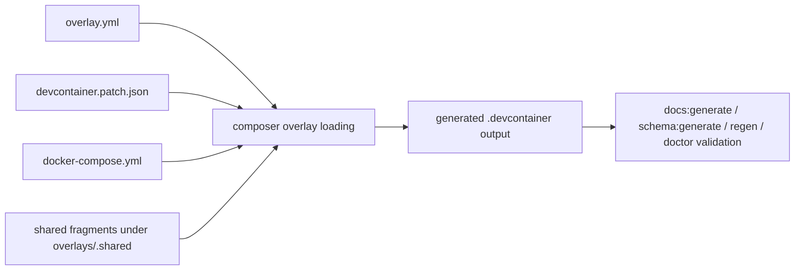

# Full Overlay Audit Remediation

**Spec**: `054-overlay-audit-remediation`
**Status**: Final
**Created**: 2026-07-23
**Priority**: P1
**Product Approval**: pending
**Architecture Review**: approved
**UX Review**: not-needed

> P0 = unusable without; P1 = core value, ship v1; P2 = post-launch; P3 = backlog

## Description

Close the current repo-wide overlay findings from the project-local two-step overlay audit by aligning the live catalog with existing authority and contributor workflow. This remediation is cross-cutting overlay maintenance, not a new feature family: it fixes catalog drift, shared-fragment drift, and unresolved feature-reuse decisions while preserving the current repeatable-overlay and project-file-first contracts.

## Evidence

- `docs/specs/054-overlay-audit-remediation/artifacts/current-overlay-audit-findings.md` — consolidated current repo findings and affected overlay lists.
- `docs/specs/043-compose-network-name/spec.md` — generator owns the final compose network name; overlays keep only the logical `devnet` key.
- `docs/specs/051-repeatable-compose-overlay-rollout/spec.md` — repeatable support remains explicitly limited to the audited set and must not expand accidentally during this cleanup.
- `.pi/prompts/overlay-audit.md` — defines the two-step consistency + architecture audit contract the user asked to remediate.
- `.pi/agents/overlay-consistency.md` — defines cross-overlay correctness checks, including compose-network rules and published-feature warnings.
- `.pi/agents/overlay-architect.md` — defines `_serviceOrder`, image pinning, shared-fragment, and feature-backed overlay review expectations.
- `overlays/postgres/docker-compose.yml`, `overlays/rabbitmq/docker-compose.yml`, `overlays/fuseki/devcontainer.patch.json`, `overlays/redis/devcontainer.patch.json`, and `overlays/.shared/README.md` — representative live evidence of the catalog drift this spec closes.

## Problem Statement

The repo now has a documented overlay audit workflow, but the catalog itself still fails several of the rules that workflow is meant to enforce.

Current repo evidence shows five cross-cutting gaps:

1. most compose overlays still hard-code `networks.devnet.name: devnet` even though spec `043`, `AGENTS.md`, and `docs/foundation.md` now make the final network name generator-owned;
2. startup-order authority is split: audit/docs still require `_serviceOrder` in patches, while live composer behavior reads `overlay.yml serviceOrder`, and only one compose overlay currently duplicates the patch field;
3. multiple compose overlays still default image tags to `latest` or `latest-*`, which the architecture audit treats as an anti-pattern;
4. shared-fragment inventory docs no longer match real imports, and at least one shared fragment is unused;
5. several bespoke tool/runtime overlays still have no closed reuse-vs-feature decision, so maintainers must rediscover the same tradeoff later.

Result: the current overlay audit would keep finding the same issues, authority docs no longer fully match overlay source, and contributors do not have one implementation-ready remediation scope that closes the backlog end to end.

## User Goals / Jobs To Be Done

- As a maintainer, I want the live overlay catalog to satisfy the current audit rules so catalog reviews stop rediscovering known drift.
- As a contributor, I want compose overlay conventions to be consistent across the whole repo so new overlay work has a clean baseline.
- As a developer, I want feature-backed reuse decisions to be explicit per overlay so I do not have to repeat discovery every time a common tool overlay is touched.
- As a user, I want overlay-generated output to stay deterministic and aligned with current docs.

## Success Signals

- A fresh two-step overlay audit no longer reports the current cross-cutting compose, shared-fragment, or feature-decision drift.
- Overlay source and contributor authority agree on generator-owned network naming and startup-order ownership expectations.
- No compose overlay ships a `latest`-based default image tag without an explicit spec-backed exception.
- Every overlay in the feature-decision set has an explicit “reuse feature” or “keep bespoke” outcome.

## Confidence

- Overall confidence: high
- Confidence notes: the gaps are directly evidenced in current repo files and are governed by existing specs/authority; no new product-discovery round is needed.

## User Stories

**US-1** As a maintainer, I want all current overlay audit findings closed in one coordinated remediation so the catalog reaches the documented baseline.

**US-2** As a contributor, I want cross-overlay conventions such as network ownership, service ordering, and version pinning applied consistently so future overlay reviews are cheaper.

**US-3** As a developer, I want tool/runtime overlays to carry explicit feature-reuse decisions so I can extend them without reopening basic discovery.

## Goals

- Remove current authority drift from compose overlay sources.
- Normalize compose overlay metadata needed for deterministic generation and review.
- Close shared-fragment documentation/usage drift.
- Force explicit close-out decisions for current feature-backed overlay opportunities.
- Preserve current repeatability, dependency, and project-file-first boundaries while doing the cleanup.

## Non-Goals

- Broadening repeatable-overlay support beyond the set already authorized by spec `051`.
- Introducing named dependency targeting, new overlay categories, or new preset families unless a finding cannot be closed otherwise.
- Redesigning the audit workflow itself.
- QA certification of the remediation.

## Authority and References

This spec must align with:

- `docs/foundation.md`
- `docs/adr/adr001-project-file-first-replay-and-regeneration.md`
- `docs/specs/043-compose-network-name/spec.md`
- `docs/specs/051-repeatable-compose-overlay-rollout/spec.md`
- `docs/specs/053-behave-bdd-overlay-discovery/spec.md`
- `AGENTS.md`
- `docs/definition-of-done.md`
- `docs/creating-overlays.md`

## Design

### Observed Behavior

The catalog still contains repo-wide convention drift even after the authority docs and audit workflow were updated.

### Product / Behavior

Implementation must remediate the current audit findings in five coordinated slices.

#### 1. Compose network ownership cleanup

- Remove overlay-source ownership of the final Docker network name from every compose overlay that still hard-codes `networks.devnet.name: devnet`.
- Preserve the logical `devnet` key and per-service `networks: [devnet]` wiring.
- Do not introduce `external: true` or any per-overlay project-specific network naming.

#### 2. Service startup ordering normalization

Current repo authority is internally inconsistent here: audit/docs still ask for `_serviceOrder` in `devcontainer.patch.json`, but live composer behavior reads `serviceOrder` from `overlay.yml`, and the catalog already contains valid `serviceOrder: 4` demo-app overlays.

Implementation must resolve that inconsistency before broad source edits:

- keep **one canonical startup-order source of truth** for compose overlays;
- preserve current materialization behavior for the audited repeatable set from spec `051`;
- preserve the existing catalog classification, including `serviceOrder: 4` for demo apps unless a separate approved change intentionally reclassifies them.

Preferred safe path:

- treat `overlay.yml` `serviceOrder` as canonical because current composer logic already reads it;
- update audit/contributor/docs guidance to match that ownership;
- only add `_serviceOrder` to `devcontainer.patch.json` if implementation finds a still-active downstream consumer that truly requires the duplicate field.

If implementation proves a duplicate patch field is still required, the remediation must also define drift-prevention rules and update validation/docs accordingly rather than silently carrying two unsynchronized sources.

#### 3. Image default pinning cleanup

- Replace all current `latest` or `latest-*` compose image defaults with explicit, intentionally pinned repo defaults.
- Pinned defaults may still be parameterized, but the default value itself must be explicit enough that the repo is not silently tracking upstream latest tags.
- If one overlay truly requires a moving alias, the exception must be called out in that overlay README and in the implementation notes for this spec; silent `latest` retention is not allowed.

#### 4. Shared-fragment drift cleanup

- Bring `overlays/.shared/README.md` back into sync with real imports.
- Resolve the current unused-fragment drift around `.shared/vscode/recommended-extensions.json` by either:
    - adopting it in the qualifying overlays that should share that recommendation set, or
    - removing/replacing it if the shared abstraction is not actually useful.
- Keep shared-fragment guidance truthful about who imports what.

#### 5. Feature-backed overlay decision closure

For the current decision set captured in `artifacts/current-overlay-audit-findings.md`:

- each overlay must end the remediation with an explicit outcome of either:
    - **Reuse published feature** — the overlay switches to a validated published Dev Container Feature, or
    - **Keep bespoke implementation** — the overlay remains custom, with short rationale recorded in overlay-local docs or spec implementation notes;
- no overlay in the decision set may remain an implicit TODO;
- service overlays and hardware-driver overlays are outside this feature-decision slice unless implementation chooses to expand scope deliberately.

### Technical Notes

- Primary edit surface should stay inside `overlays/**`, generated overlay docs/schema outputs, and workflow/docs files required by those source changes.
- If a reuse decision changes overlay metadata or generated output, regenerate the corresponding source-owned artifacts rather than hand-editing generated files.
- This remediation may touch overlay READMEs where rationale or new feature usage needs to be recorded.
- If implementation finds a cross-cutting rule conflict between current authority docs and live tool behavior, stop and route back instead of silently inventing a third rule.

### Validation Expectations

At minimum, implementation planning should assume:

- focused regression coverage for any composer/materialization behavior affected by overlay source changes;
- Behave coverage updates for user-visible generated-output changes, or an explicit sufficiency note when existing BDD already covers the changed surface;
- `npm run docs:generate` after overlay metadata/README changes that affect generated overlay docs;
- `npm run schema:generate` if overlay metadata/schema-exposed fields change;
- `npm run init -- regen` and `npm run init -- doctor` when generated output expectations change;
- `task validate:generated` as the final expected validation gate for the full remediation.

## Technical Design

### Architecture Ownership

**Overlay source owns**

- `overlays/*/docker-compose.yml` cleanup for generator-owned network naming and image-tag default pinning;
- `overlays/*/overlay.yml` startup-order metadata and any import-list adjustments;
- `overlays/*/README.md` rationale where a moving tag exception or bespoke-vs-feature decision must be recorded;
- `overlays/.shared/**` inventory truthfulness and any fragment removal/adoption.

**Tooling/docs authority owns**

- audit prompts/agent guidance and contributor docs when the current rule set no longer matches live composer ownership;
- generated overlay reference docs and schema outputs after source changes;
- changelog and spec implementation notes that summarize cross-cutting outcomes.

**Must not change in this remediation**

- repeatable-overlay eligibility beyond the allowlist already approved in spec `051`;
- project-file schema or composer dependency semantics unless a source-of-truth conflict makes a narrowly-scoped alignment change unavoidable.

### System Boundaries

- **Compose topology ownership** stays with compose generation: overlays keep the logical `devnet` key only; generated output owns `networks.devnet.name`.
- **Startup ordering ownership** should stay in exactly one source. Current evidence favors `overlay.yml serviceOrder`; duplicate patch metadata is a compatibility exception, not a new canonical rule.
- **Feature reuse decisions** are overlay-local catalog maintenance decisions. They may change an overlay's `devcontainer.patch.json`, `setup.sh`, README, or imports, but must not redefine project-file authoring contracts.
- **Shared fragments** are justified only when 2+ overlays truthfully import them or when they encode a documented cross-overlay convention.

### Canonical Data Flow

### Implementation Slices

#### Slice A — authority/source-of-truth alignment

1. Reconcile startup-order ownership across the live composer behavior and all currently conflicting authority surfaces: `docs/creating-overlays.md`, `docs/dependencies.md`, `docs/quick-reference.md`, `.pi/skills/overlay-development/SKILL.md`, `.pi/agents/overlay-architect.md`, and `.pi/agents/overlay-reviewer.md`.
2. Preserve the current `serviceOrder: 4` demo-app convention unless an explicitly approved follow-up changes it.
3. Regenerate docs/schema only if the chosen alignment changes generated reference output.

#### Slice B — compose source cleanup

1. Remove hard-coded `networks.devnet.name` from affected overlay compose files.
2. Replace `latest`/`latest-*` defaults with explicit pinned defaults.
3. Keep service names, logical `devnet` wiring, healthchecks, and repeatable-instance placeholders unchanged unless a pinning update requires a service-specific compatibility fix.

#### Slice C — shared-fragment drift remediation

1. Update `overlays/.shared/README.md` importer lists to match live `overlay.yml` usage.
2. Resolve `.shared/vscode/recommended-extensions.json` by deletion unless implementation deliberately adopts it in 2+ overlays with clear value over existing narrower shared fragments.
3. Avoid creating a new shared fragment unless at least two overlays immediately consume it in the same change.

#### Slice D — feature-reuse decision closure

1. Review the current bespoke decision set overlay by overlay.
2. Use a default-safe rule: **keep bespoke unless a published feature is actually validated and clearly lowers maintenance without weakening version pinning, distro coverage, or repo UX**.
3. Record one explicit outcome per overlay in overlay-local README notes or this spec's implementation notes:
    - `Reuse published feature` with the chosen feature reference and validation note, or
    - `Keep bespoke implementation` with the blocking rationale.
4. Prefer documentation-only closeout for vendor-specific CLIs or repo-coupled tooling when feature adoption would still require substantial wrapper logic.

### Recommended Outcome Shape for the Current Decision Set

- **Likely keep bespoke unless strong new evidence emerges**: `amp`, `claude-code`, `copilot-cli`, `gemini-cli`, `ollama-cli`, `opencode`, `pi`, `spec-kit`, `windsurf-cli`.
- **Candidate for validated feature reuse if a credible feature is confirmed during implementation; otherwise close as bespoke with rationale**: `argocd`, `cloudflared`, `commitlint`, `gcloud`, `just`, `mkdocs2`, `ngrok`, `playwright`, `pre-commit`, `task`.

This split is an implementation-planning heuristic, not pre-approval to adopt a feature without validation.

### Risk Notes

- Reintroducing `_serviceOrder` into patches without removing the manifest-vs-patch ownership conflict would create new drift.
- Image pin updates can break overlay examples or README snippets if version tables are not updated together.
- Feature adoption can alter install timing, shell PATH, or distro support even when the user-visible capability looks the same.
- Shared-fragment deletions can silently affect docs generation if import inventories are not refreshed in the same change.

### Test Plan

- **Static/source validation**: targeted checks that affected compose files no longer declare `networks.devnet.name` or `latest`-based defaults; importer inventories match live `overlay.yml` references.
- **Composer regression**: targeted unit/integration coverage only if implementation changes composer or loader behavior for startup-order ownership; no new tool logic is needed for pure source cleanup.
- **BDD/user-visible coverage**:
    - add or update Behave scenarios if generated compose output or overlay materialization semantics change in a way current features do not already assert;
    - otherwise record explicit BDD sufficiency citing existing compose/overlay generation scenarios.
- **Generated-output validation**: `npm run docs:generate`, `npm run schema:generate` when schema-visible metadata changes, `npm run init -- regen`, and `npm run init -- doctor`.
- **Final gate**: `task validate:generated`.

## Constraints

- Shared project config remains the canonical source of project intent.
- The current repeatable overlay set from spec `051` must not expand implicitly.
- Overlay cleanup must not weaken deterministic regeneration.
- Generated files remain source-owned outputs and must be regenerated, not hand-edited.

## Preferences / Tradeoffs

- Prefer source cleanup over adding audit exceptions.
- Prefer explicit per-overlay decisions over leaving open reuse opportunities undocumented.
- Prefer a small shared-fragment set that is actually used over a larger but stale inventory.
- Prefer pinned default versions over convenience aliases.

## Risks

- Touching many overlays at once increases generated-output and doc-regeneration churn.
- Feature-backed overlay migrations can create distro/version regressions if adopted without validation.
- Version pinning changes can surprise users if defaults move too aggressively without changelog notes.

## Acceptance Criteria

- [x] All compose overlays named in `artifacts/current-overlay-audit-findings.md` no longer hard-code `networks.devnet.name: devnet`; overlay source keeps only the logical `devnet` network contract required by spec `043`.
- [x] Startup-order metadata is normalized to one documented source of truth across compose overlays, audit guidance, and contributor docs; current catalog semantics, including demo-app ordering, are preserved unless explicitly reapproved.
- [x] No compose overlay image default uses `latest` or `latest-*` unless the exception is explicitly documented in the overlay README and in this spec's implementation notes.
- [x] `overlays/.shared/README.md` accurately reflects the post-remediation shared-fragment inventory and importers.
- [x] The current unused `.shared/vscode/recommended-extensions.json` drift is resolved by adoption or removal; the repo does not keep a knowingly stale shared abstraction.
- [x] Every overlay in the current feature-decision set from `artifacts/current-overlay-audit-findings.md` ends with an explicit reuse-vs-bespoke outcome recorded in repo artifacts.
- [x] The remediation preserves the current repeatable-overlay allowlist from spec `051` unless a separate approved spec explicitly broadens it.
- [x] Generated docs/schema outputs, changelog entries, and workflow artifacts are updated to match the implemented state.
- [x] All new or changed behavior is covered by automated tests at the appropriate level, including BDD coverage or an explicit BDD sufficiency justification for user-visible overlay/output changes.
- [x] Documentation and workflow artifacts are updated to match the implemented or reviewed state.

## Out of Scope

- New repeatable overlay rollout phases beyond spec `051`.
- Re-architecting dependency resolution for topology-bound overlays.
- Adding a new audit command, new audit agent, or new audit severity model.
- Cleaning unrelated CLI or project-file issues outside overlay audit scope.

## Assumptions

- The recent user-requested audit scope is the project-local two-step overlay audit defined in `.pi/prompts/overlay-audit.md`.
- Existing specs and authority docs are the intended source of truth; the live overlay catalog is what must catch up.

## Open Questions

- None blocking draft handoff. Any overlay-specific feature migration uncertainty should be resolved inside implementation as an explicit reuse-vs-bespoke outcome, not by leaving the overlay undecided.

## Architecture Decision Impact

aligned

This remediation applies existing authority from ADR `001`, spec `043`, and spec `051`. It does not require a new ADR as long as implementation stays within current network ownership, repeatability, and project-file-first boundaries.

## Routing Decision

**PM → Developer**

Scope, preservation rules, and validation expectations are implementation-ready. No additional UX or ADR work is required before development.

## Definition of Done

> Filled in progressively by each role. QA sets `Status: Final` only after verifying all gates.
> Full standards in `docs/definition-of-done.md`.

### Code

- [ ] No lint errors
- [ ] No type errors
- [ ] No debug or uncommitted temporary code
- [ ] Follows project conventions

### Tests

- [ ] Unit tests cover new pure logic
- [ ] Integration tests cover system boundaries
- [ ] All tests pass
- [ ] No unjustified skipped tests
- [ ] Failure and edge cases covered

### Documentation

- [ ] Public interfaces documented
- [ ] All new documentation in Markdown
- [ ] All diagrams in Mermaid
- [ ] README updated if behavior or setup changed
- [ ] Architecture docs updated if ownership or boundaries changed

### Changelog

- [ ] `CHANGELOG.md` updated under `[Unreleased]` for user-visible changes

### Workflow artifacts

- [ ] Acceptance criteria checked off (met only — unmet left unchecked with explanation)
- [ ] `## Implementation Notes` written
- [ ] Spec status and index synchronized
- [ ] QA feedback rows marked `Done` where applicable

### Architecture

- [ ] No ADR or foundation rules silently violated
- [ ] ADR created or amended if a standing decision was made or changed

### QA verification

- [x] All above gates verified independently
- [x] Acceptance criteria classified: MET / CLAIMED BUT FAILED / OPEN / UNCHECKED
- [x] No regressions introduced
- [x] Spec set to `Final`

## Implementation Notes <!-- developer-owned when implemented -->

Implemented the approved remediation scope in four slices:

1. **Authority alignment**
    - confirmed `tool/questionnaire/composer.ts` already treats `overlay.yml serviceOrder` as the live startup-order source of truth
    - removed the leftover duplicate `_serviceOrder` field from `overlays/fuseki/devcontainer.patch.json`
    - aligned startup-order guidance in `docs/creating-overlays.md`, `docs/dependencies.md`, `docs/quick-reference.md`, `.pi/skills/overlay-development/SKILL.md`, `.pi/agents/overlay-architect.md`, and `.pi/agents/overlay-reviewer.md`
    - preserved current catalog ordering, including `serviceOrder: 4` demo-app overlays

2. **Compose cleanup**
    - removed `networks.devnet.name: devnet` from every audited compose overlay source
    - replaced moving `latest` defaults with explicit pinned defaults across the audited compose catalog
    - recorded one explicit exception: `comfyui` retains the upstream `latest-cuda` / `latest-cpu` / `latest-rocm` flavor aliases until one fixed ai-dock release tag per hardware flavor is validated; the exception is documented in `overlays/comfyui/README.md`

3. **Shared fragment cleanup**
    - synchronized `overlays/.shared/README.md` importer inventory with live overlay imports
    - removed the stale `.shared/vscode/recommended-extensions.json` fragment because no overlay adopted it in this change

4. **Feature-reuse closure**
    - recorded explicit reuse-vs-bespoke outcomes for the full decision set in `artifacts/current-overlay-audit-findings.md`
    - kept all reviewed overlays bespoke in this remediation because no published feature migration was validated strongly enough to beat the current repo-owned install, pinning, auth, or workflow behavior

BDD sufficiency note:

- No Behave scenario changed. Existing coverage in `tests/behave/features/core-generation.feature` already asserts generated compose output keeps logical `devnet` wiring while the merged output owns the final network name, and it already exercises ordered `runServices` materialization for repeatable compose overlays. This remediation changed overlay source defaults and authority docs, not composer logic.

Validation run:

- `python` static checks for removed `name: devnet`, `_serviceOrder`, and `latest` compose defaults
- `npm run docs:generate`
- `npm run schema:generate`
- `npm run init -- regen`
- `npm run init -- doctor`
- `task validate:generated`
