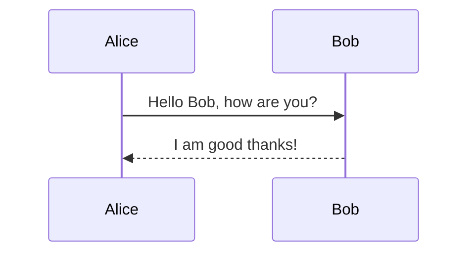

# Full Feature Pandoc Example

This markdown file demonstrates a variety of features supported by Pandoc, including headings, lists, tables, code blocks, images, math, blockquotes, footnotes, Unicode text, emoji, and a Mermaid diagram.

To render this markdown file to PDF with Mermaid diagram support using Pandoc and a Lua filter, run:

```sh
pandoc --lua-filter ~/.pandoc/filters/diagram.lua \
  example.md -o example.pdf
```

---

## Table of Contents

- [Full Feature Pandoc Example](#full-feature-pandoc-example)
    - [Table of Contents](#table-of-contents)
    - [Headings](#headings)
    - [H2 Heading](#h2-heading)
        - [H3 Heading](#h3-heading)
    - [Lists](#lists)
        - [Unordered List](#unordered-list)
        - [Ordered List](#ordered-list)
    - [Tables](#tables)
    - [Code Blocks](#code-blocks)
    - [Images](#images)
    - [Math](#math)
    - [Blockquotes](#blockquotes)
    - [Footnotes](#footnotes)
    - [Unicode and Emoji](#unicode-and-emoji)
    - [Mermaid Diagram](#mermaid-diagram)

---

## Headings

## H2 Heading

### H3 Heading

---

## Lists

### Unordered List

- Item 1
- Item 2
    - Subitem 2.1
    - Subitem 2.2
- Item 3

### Ordered List

1. First
2. Second
3. Third

---

## Tables

| Name    | Age | City     |
| ------- | --- | -------- |
| Alice   | 30  | New York |
| Bob     | 25  | London   |
| Charlie | 35  | Sydney   |

---

## Code Blocks

```python
def hello_world():
    print("Hello, world!")
```

---

## Images


---

## Math

Inline math: $E = mc^2$

Block math:

$$
\int_{a}^{b} x^2 dx = \frac{b^3}{3} - \frac{a^3}{3}
$$

---

## Blockquotes

> This is a blockquote. It can span multiple lines and include **formatting**.

---

## Footnotes

Here is a statement with a footnote.[^1]

[^1]: This is the footnote text.

---

## Unicode and Emoji

This section includes plain Unicode text plus emoji and flags that exercise the LaTeX fallback filter.

- Status icons: ✅ ⚠️ ❌
- Activity emoji: 🎉 🚀 🧪
- Weather emoji: ☀️ 🌧️ ❄️
- Flag emoji: 🇺🇸 🇯🇵 🇧🇷
- Mixed sample: Unicode check 😀

---

## Mermaid Diagram



---

End of example.
