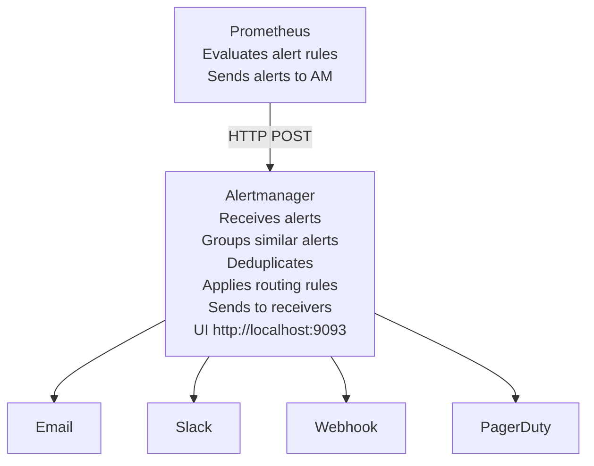

# Alertmanager Overlay

Alert routing, grouping, and notification management for Prometheus alerts.

## Features

- **Prometheus Alertmanager** - Handles alerts from Prometheus server
- **Alert grouping** - Groups similar alerts to reduce noise
- **Alert routing** - Routes alerts to different receivers based on labels
- **Deduplication** - Prevents duplicate alert notifications
- **Silencing** - Temporarily mute specific alerts
- **Inhibition rules** - Suppress alerts based on other active alerts
- **Web UI** - Manage alerts, silences, and receivers

## How It Works

Alertmanager receives alerts from Prometheus, groups them, applies routing rules, and sends notifications to configured receivers (email, Slack, webhook, etc.).

**Architecture:**


**Alert Flow:**
1. **Evaluation:** Prometheus evaluates alert rules every 15 seconds
2. **Firing:** When condition is true, Prometheus sends alert to Alertmanager
3. **Grouping:** Alertmanager groups alerts by labels (alertname, cluster, service)
4. **Routing:** Routes are matched against alert labels
5. **Notification:** Alerts sent to configured receivers
6. **Resolution:** When condition becomes false, resolved notification sent

## Configuration

### Ports

- `9093` - Alertmanager web UI and API

### Environment Variables

The overlay includes a `.env.example` file. Copy it to `.env` and customize:

```bash
cd .devcontainer
cp .env.example .env
```

**Available variables:**
```bash
# Alertmanager version
ALERTMANAGER_VERSION=latest

# Alertmanager port
ALERTMANAGER_PORT=9093
```

### Prometheus Integration

The overlay includes a setup script that automatically configures Prometheus to send alerts to Alertmanager.

**Manual configuration (if needed):**

Edit `.devcontainer/prometheus-prometheus.yml`:

```yaml
# Add to Prometheus config
alerting:
  alertmanagers:
    - static_configs:
        - targets: ['alertmanager:9093']

rule_files:
  - '/etc/prometheus/alert-rules.yml'
```

### Alert Rules

Sample alert rules are provided in `alert-rules.yml`. Copy to your Prometheus overlay and customize:

```yaml
groups:
  - name: my_alerts
    interval: 30s
    rules:
      - alert: HighCPU
        expr: cpu_usage > 80
        for: 5m
        labels:
          severity: warning
        annotations:
          summary: "High CPU on {{ $labels.instance }}"
```

Mount in Prometheus docker-compose.yml:

```yaml
services:
  prometheus:
    volumes:
      - ./alert-rules-alertmanager.yml:/etc/prometheus/alert-rules.yml:ro
```

### Receivers Configuration

Edit `alertmanager.yml` to configure notification channels:

**Email receiver:**
```yaml
receivers:
  - name: 'email'
    email_configs:
      - to: 'team@example.com'
        from: 'alertmanager@example.com'
        smarthost: 'smtp.example.com:587'
        auth_username: 'alertmanager'
        auth_password: 'password'
```

**Slack receiver:**
```yaml
receivers:
  - name: 'slack'
    slack_configs:
      - api_url: 'https://hooks.slack.com/services/XXX'
        channel: '#alerts'
        title: 'Alert: {{ .GroupLabels.alertname }}'
        text: '{{ range .Alerts }}{{ .Annotations.description }}{{ end }}'
```

**Webhook receiver:**
```yaml
receivers:
  - name: 'webhook'
    webhook_configs:
      - url: 'http://my-webhook-server:5001/alerts'
        send_resolved: true
```

## Common Commands

### Accessing Alertmanager UI

Open your browser to: http://localhost:9093

**UI Features:**
- **Alerts:** View active alerts
- **Silences:** Create/manage silences
- **Status:** View configuration and runtime info

### Creating Silences

**Via UI:**
1. Navigate to http://localhost:9093/#/silences
2. Click "New Silence"
3. Add matchers (e.g., `alertname="HighCPU"`)
4. Set duration and comment
5. Click "Create"

**Via API:**
```bash
# Create a silence for 1 hour
curl -X POST http://alertmanager:9093/api/v2/silences \
  -H 'Content-Type: application/json' \
  -d '{
    "matchers": [
      {
        "name": "alertname",
        "value": "HighCPU",
        "isRegex": false
      }
    ],
    "startsAt": "2024-01-15T10:00:00Z",
    "endsAt": "2024-01-15T11:00:00Z",
    "createdBy": "admin",
    "comment": "Planned maintenance"
  }'
```

### Viewing Alerts

**Via UI:**
Navigate to http://localhost:9093/#/alerts

**Via API:**
```bash
# Get all alerts
curl http://alertmanager:9093/api/v2/alerts

# Get alerts with specific label
curl http://alertmanager:9093/api/v2/alerts?filter={severity="critical"}
```

### Testing Alerts

**Trigger a test alert from Prometheus:**
```bash
# Send test alert to Alertmanager
curl -X POST http://prometheus:9090/-/reload

# Or manually POST an alert
curl -X POST http://alertmanager:9093/api/v1/alerts \
  -H 'Content-Type: application/json' \
  -d '[
    {
      "labels": {
        "alertname": "TestAlert",
        "severity": "warning"
      },
      "annotations": {
        "summary": "This is a test alert"
      }
    }
  ]'
```

### Managing Configuration

**Reload configuration without restart:**
```bash
# Send SIGHUP to Alertmanager
docker exec alertmanager killall -HUP alertmanager

# Or use API
curl -X POST http://alertmanager:9093/-/reload
```

**Validate configuration:**
```bash
# Check config in running container
docker exec alertmanager amtool check-config /etc/alertmanager/alertmanager.yml
```

## Use Cases

- **Alert routing** - Send critical alerts to PagerDuty, warnings to Slack
- **Development testing** - Test alert rules and notification channels
- **Alert deduplication** - Prevent alert storms from overwhelming channels
- **Maintenance windows** - Silence alerts during planned maintenance
- **Multi-team notifications** - Route alerts to different teams based on labels

**Integrates well with:**
- Prometheus (required) - Source of alerts
- Grafana (optional) - View alerts in dashboards
- OTel Collector (optional) - Additional metrics sources

## Alert Best Practices

### Writing Alert Rules

**Good alerts are:**
1. **Actionable** - Alert on problems you can fix
2. **Meaningful** - Include context in annotations
3. **Tuned** - Set appropriate thresholds and durations
4. **Tested** - Verify alerts work before depending on them

**Example of good alert:**
```yaml
- alert: HighErrorRate
  expr: rate(http_requests_total{status=~"5.."}[5m]) / rate(http_requests_total[5m]) > 0.05
  for: 5m
  labels:
    severity: critical
    service: "{{ $labels.service }}"
  annotations:
    summary: "High error rate on {{ $labels.service }}"
    description: "{{ $labels.service }} has {{ $value | humanizePercentage }} error rate"
    runbook_url: "https://wiki.example.com/runbooks/high-error-rate"
    dashboard_url: "http://grafana:3000/d/errors?var-service={{ $labels.service }}"
```

### Grouping Strategy

**Group related alerts:**
```yaml
route:
  group_by: ['alertname', 'cluster', 'service']
  group_wait: 10s        # Wait before sending first notification
  group_interval: 5m     # Wait before sending updates
  repeat_interval: 4h    # Wait before resending same alert
```

**Separate critical from warnings:**
```yaml
routes:
  - match:
      severity: critical
    receiver: pagerduty
    group_interval: 1m

  - match:
      severity: warning
    receiver: slack
    group_interval: 10m
```

### Inhibition Rules

**Suppress child alerts when parent is firing:**
```yaml
inhibit_rules:
  # Don't alert on service down if entire cluster is down
  - source_match:
      alertname: 'ClusterDown'
    target_match:
      alertname: 'ServiceDown'
    equal: ['cluster']

  # Don't warn about high latency if service has errors
  - source_match:
      severity: 'critical'
    target_match:
      severity: 'warning'
    equal: ['service']
```

## Troubleshooting

### Issue: Alerts Not Appearing

**Symptoms:**
- Prometheus firing alerts but not in Alertmanager

**Solutions:**
```bash
# Check Prometheus is sending to Alertmanager
curl http://prometheus:9090/api/v1/alertmanagers

# Check Alertmanager received alerts
curl http://alertmanager:9093/api/v2/alerts

# Check Prometheus logs
docker logs prometheus | grep alertmanager

# Check Alertmanager logs
docker logs alertmanager
```

### Issue: Notifications Not Sent

**Symptoms:**
- Alerts in Alertmanager but no notifications received

**Solutions:**
```bash
# Check receiver configuration
curl http://alertmanager:9093/api/v2/status

# Check for silences
curl http://alertmanager:9093/api/v2/silences

# Test receiver manually (for webhook)
curl -X POST http://my-webhook:5001/alerts \
  -H 'Content-Type: application/json' \
  -d '{"alerts": [{"labels": {"test": "true"}}]}'

# Check Alertmanager logs for errors
docker logs alertmanager | grep -i error
```

### Issue: Too Many Notifications

**Symptoms:**
- Getting flooded with alert notifications

**Solutions:**
```yaml
# Increase group_interval in alertmanager.yml
route:
  group_interval: 10m    # Increase from default
  repeat_interval: 12h   # Reduce notification frequency

# Add inhibition rules to suppress related alerts
inhibit_rules:
  - source_match:
      severity: critical
    target_match:
      severity: warning
    equal: ['service']
```

### Issue: Configuration Errors

**Symptoms:**
- Alertmanager fails to start or reload

**Solution:**
```bash
# Validate configuration
docker exec alertmanager amtool check-config /etc/alertmanager/alertmanager.yml

# Check for YAML syntax errors
yamllint .devcontainer/alertmanager-alertmanager.yml
```

## Security Considerations

⚠️ **Development Configuration:** This overlay uses basic configuration suitable for development.

**For production:**
- **Enable TLS** for Alertmanager API
- **Protect secrets** in receiver configs (use environment variables or secret management)
- **Restrict access** to Alertmanager UI (add authentication)
- **Secure webhooks** with HMAC signatures or mutual TLS
- **Rate limit** API endpoints to prevent abuse

**Webhook security example:**
```yaml
receivers:
  - name: 'secure-webhook'
    webhook_configs:
      - url: 'https://webhook:443/alerts'
        http_config:
          tls_config:
            ca_file: /etc/ssl/certs/ca.crt
          basic_auth:
            username: alertmanager
            password_file: /run/secrets/webhook_password
```

## References

- [Official Alertmanager Documentation](https://prometheus.io/docs/alerting/latest/alertmanager/)
- [Alertmanager Configuration](https://prometheus.io/docs/alerting/latest/configuration/)
- [Alert Routing](https://prometheus.io/docs/alerting/latest/alertmanager/#route)
- [Prometheus Alerting Rules](https://prometheus.io/docs/prometheus/latest/configuration/alerting_rules/)
- [amtool CLI](https://github.com/prometheus/alertmanager#amtool)

**Related Overlays:**
- `prometheus` - Required alert source
- `grafana` - Optional visualization of alerts
- `otel-collector` - Optional additional metrics
