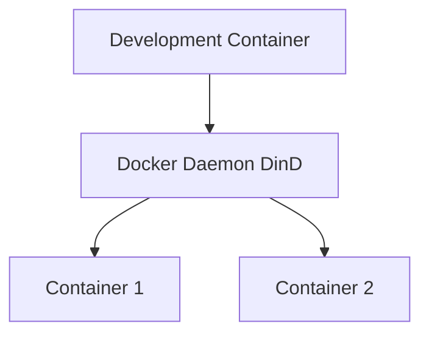

# Docker-in-Docker Overlay

Run a fully isolated Docker daemon inside your development container. This is true Docker-in-Docker (DinD).

## Features

- **Isolated Docker daemon** - Separate Docker environment inside the container
- **Portable** - Works in GitHub Codespaces and remote environments
- **Full Docker support** - Build, run, and manage containers independently
- **Network isolation** - Containers run in their own network namespace
- **Safe for multi-tenant** - No shared Docker daemon with host

## How It Works

This overlay runs a full Docker daemon inside the development container using the official `docker:dind` (Docker-in-Docker) feature from Microsoft. Unlike **docker-sock** which mounts the host's Docker socket, this creates a completely isolated Docker environment.

**Architecture:**



## Use Cases

### Required for These Environments

- **GitHub Codespaces** - No access to host Docker
- **Remote containers** - Cloud-based dev environments
- **Multi-tenant systems** - Shared development servers
- **CI/CD environments** - Isolated build environments

### Development Workflows

- **Container builds** - Build Docker images in isolated environment
- **Testing multi-container apps** - Use docker-compose for integration tests
- **Container experimentation** - Test without affecting host
- **Learning Docker** - Safe sandbox environment

### Security-Sensitive Scenarios

- **Untrusted code** - Run potentially malicious containers safely
- **Shared environments** - Multiple users without host access
- **Production-like isolation** - Closer to production container runtime

## Common Commands

All standard Docker commands work inside the container:

### Building Images

```bash
# Build from Dockerfile
docker build -t myapp:latest .

# Build with build args
docker build --build-arg NODE_VERSION=20 -t myapp .

# Multi-stage build
docker build --target production -t myapp:prod .

# Build with cache from registry
docker build --cache-from myapp:latest -t myapp:latest .
```

### Running Containers

```bash
# Run container
docker run -d -p 8080:80 nginx

# Run with volume mount
docker run -v $(pwd):/app myapp

# Run with environment variables
docker run -e DATABASE_URL=postgres://... myapp

# Run interactively
docker run -it ubuntu bash
```

### Docker Compose

```bash
# Start services
docker-compose up -d

# View logs
docker-compose logs -f

# Stop services
docker-compose down

# Rebuild and restart
docker-compose up -d --build

# Scale services
docker-compose up -d --scale web=3
```

### Image Management

```bash
# List images
docker images

# Tag image
docker tag myapp:latest myapp:v1.0.0

# Push to registry
docker push myapp:latest

# Pull image
docker pull nginx:latest

# Remove image
docker rmi myapp:latest

# Prune unused images
docker image prune -a
```

### Container Management

```bash
# List running containers
docker ps

# List all containers
docker ps -a

# Stop container
docker stop CONTAINER_ID

# Remove container
docker rm CONTAINER_ID

# Execute command in container
docker exec -it CONTAINER_ID bash

# View logs
docker logs CONTAINER_ID

# Follow logs
docker logs -f CONTAINER_ID
```

### Cleanup

```bash
# Remove all stopped containers
docker container prune

# Remove all unused images
docker image prune -a

# Remove all unused volumes
docker volume prune

# Remove everything
docker system prune -a --volumes
```

## Docker-in-Docker vs Docker-outside-of-Docker

| Feature            | Docker-in-Docker (This)  | Docker-outside-of-Docker |
| ------------------ | ------------------------ | ------------------------ |
| **Isolation**      | ✅ Fully isolated        | ❌ Shares host daemon    |
| **Performance**    | ⚠️ Slower (nested)       | ✅ Fast (native)         |
| **Disk Usage**     | ⚠️ Duplicates images     | ✅ Shared image cache    |
| **Portability**    | ✅ Works everywhere      | ❌ Requires host Docker  |
| **Security**       | ✅ Isolated              | ⚠️ Host access           |
| **Codespaces**     | ✅ Supported             | ❌ Not available         |
| **Startup Time**   | ⚠️ Slower (daemon start) | ✅ Instant               |
| **Resource Usage** | ⚠️ Higher overhead       | ✅ Minimal overhead      |

## When to Use Docker-in-Docker

✅ **Use DinD when:**

- Working in GitHub Codespaces or cloud IDEs
- Need complete isolation from host
- Sharing dev environment with untrusted users
- Simulating CI/CD environments
- No access to host Docker daemon
- Security and isolation are priorities

❌ **Use docker-sock instead when:**

- Working on local machine with Docker Desktop
- Need maximum performance
- Building large images frequently
- Want to share images with host
- Resource efficiency is critical

## Configuration

### Storage Driver

The DinD daemon uses `overlay2` storage driver by default. For production-like environments:

```bash
# Check storage driver
docker info | grep "Storage Driver"

# Expected output:
# Storage Driver: overlay2
```

### Registry Authentication

```bash
# Login to Docker Hub
docker login

# Login to private registry
docker login registry.example.com

# Login to GitHub Container Registry
echo $GITHUB_TOKEN | docker login ghcr.io -u USERNAME --password-stdin

# Login to AWS ECR (requires aws-cli overlay)
aws ecr get-login-password --region us-east-1 | \
  docker login --username AWS --password-stdin 123456789012.dkr.ecr.us-east-1.amazonaws.com
```

### Docker Daemon Configuration

The Docker daemon inside the container can be configured via the devcontainer feature settings. Advanced users can modify daemon settings.

## Networking

### Container Networking

Containers created inside DinD use their own network namespace:

```bash
# Create custom network
docker network create mynetwork

# Run containers on network
docker run -d --name db --network mynetwork postgres
docker run -d --name app --network mynetwork myapp

# Containers can communicate by name
# app can connect to db:5432
```

### Port Publishing

```bash
# Publish port from DinD container
docker run -d -p 8080:80 nginx

# Access from dev container
curl http://localhost:8080

# Access from host (requires port forwarding)
# VS Code automatically forwards ports
```

### Accessing Services from Host

When running containers inside DinD, published ports need to be accessible:

1. **VS Code** - Automatically detects and forwards ports
2. **Manual** - Use VS Code port forwarding UI
3. **devcontainer.json** - Pre-configure port forwarding

## Performance Considerations

### Image Caching

DinD has its own image cache. To optimize:

```bash
# Pull base images once
docker pull node:20
docker pull postgres:16
docker pull redis:7

# Use multi-stage builds to reduce size
# Use .dockerignore to exclude files
# Layer Dockerfile commands for optimal caching
```

### Storage Management

DinD storage is ephemeral by default (lost on rebuild):

```bash
# Check disk usage
docker system df

# Clean up regularly
docker system prune -a

# Monitor space
df -h
```

### Resource Limits

The Docker daemon inherits resource limits from the dev container. For resource-intensive builds:

```json
// In devcontainer.json
{
    "hostRequirements": {
        "cpus": 4,
        "memory": "8gb"
    }
}
```

## Building for Multiple Platforms

```bash
# Enable buildx
docker buildx create --use

# Build for multiple architectures
docker buildx build \
  --platform linux/amd64,linux/arm64 \
  -t myapp:latest \
  --push \
  .

# Build for specific platform
docker buildx build \
  --platform linux/amd64 \
  -t myapp:amd64 \
  .
```

## Troubleshooting

### Docker daemon not running

The daemon should start automatically. If not:

```bash
# Check if Docker is available
docker info

# If not available, rebuild container
# VS Code: Cmd+Shift+P → "Dev Containers: Rebuild Container"
```

### Permission denied errors

```bash
# Verify user is in docker group
groups

# Expected: docker group should be listed
# The devcontainer feature handles this automatically
```

### Out of disk space

```bash
# Check disk usage
docker system df

# Clean up
docker system prune -a --volumes

# Remove specific images
docker rmi $(docker images -q -f dangling=true)
```

### Slow build times

```bash
# Use BuildKit for faster builds
export DOCKER_BUILDKIT=1

# Use build cache
docker build --cache-from myapp:latest -t myapp:latest .

# Optimize Dockerfile layer ordering
# Put frequently changing layers last
```

### Cannot connect to containers

```bash
# Verify port publishing
docker ps

# Check port is published (0.0.0.0:8080->80/tcp)
docker port CONTAINER_NAME

# Verify VS Code port forwarding
# Check Ports tab in VS Code
```

### Registry authentication fails

```bash
# Re-login to registry
docker logout
docker login

# Check credentials
cat ~/.docker/config.json
```

## Security Considerations

### Privileged Mode

⚠️ **DinD requires privileged mode to run nested containers**

This is handled by the devcontainer feature but means:

- Container has elevated permissions
- Not recommended for untrusted code execution
- Still safer than docker-sock (no host access)

### Image Security

```bash
# Scan images for vulnerabilities
docker scan myapp:latest

# Use official base images
FROM node:20-alpine  # Better than node:20

# Keep images updated
docker pull node:20-alpine
docker build --no-cache -t myapp .
```

### Secrets Management

⚠️ **Never bake secrets into images**

```bash
# Use build secrets (not in final image)
docker build --secret id=mysecret,src=/path/to/secret .

# Use multi-stage builds
# Secrets only in build stage, not final image

# Use environment variables at runtime
docker run -e API_KEY=$API_KEY myapp
```

## Best Practices

1. **Clean up regularly** - Run `docker system prune` to free space
2. **Use .dockerignore** - Exclude unnecessary files from build context
3. **Multi-stage builds** - Reduce final image size
4. **Layer ordering** - Put frequently changing layers last
5. **Pin versions** - Use specific tags, not `latest`
6. **Scan images** - Check for vulnerabilities
7. **Use BuildKit** - Enable for better caching and performance
8. **Limit privileges** - Run containers as non-root when possible

## Common Workflows

### Local Development with Docker Compose

```bash
# Create docker-compose.yml
cat > docker-compose.yml <<EOF
version: '3.8'
services:
  app:
    build: .
    ports:
      - "3000:3000"
    environment:
      - DATABASE_URL=postgres://db:5432/mydb
    depends_on:
      - db
  db:
    image: postgres:16
    environment:
      - POSTGRES_PASSWORD=password
EOF

# Start services
docker-compose up -d

# View logs
docker-compose logs -f

# Stop services
docker-compose down
```

### Building and Testing

```bash
# Build application
docker build -t myapp:dev .

# Run tests
docker run --rm myapp:dev npm test

# Run application
docker run -p 3000:3000 myapp:dev

# Build production image
docker build --target production -t myapp:prod .
```

## Related Overlays

- **docker-sock** - Conflicts with this overlay (use one or the other)
- **kubectl-helm** - For deploying to Kubernetes
- **nodejs/python/dotnet** - Build containerized applications
- **postgres/redis** - Database services (can run via Docker)

## Additional Resources

- [Docker-in-Docker Official Documentation](https://github.com/devcontainers/features/tree/main/src/docker-in-docker)
- [Docker Documentation](https://docs.docker.com/)
- [Docker Compose Documentation](https://docs.docker.com/compose/)
- [Best practices for writing Dockerfiles](https://docs.docker.com/develop/develop-images/dockerfile_best-practices/)
- [Docker BuildKit](https://docs.docker.com/build/buildkit/)

## Notes

- This overlay **conflicts** with **docker-sock** - only one can be selected
- Works in **all environments** including GitHub Codespaces
- DinD storage is **ephemeral** (reset on container rebuild)
- Daemon starts automatically when container starts
- Performance is slower than docker-sock but more portable
