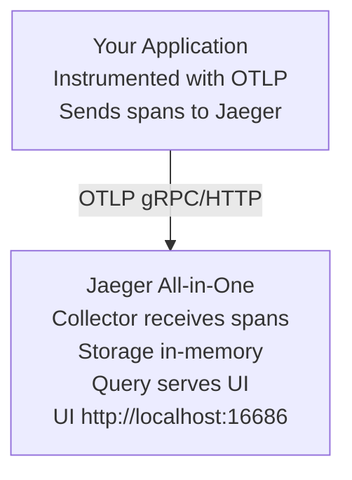

# Jaeger Overlay

Distributed tracing platform for monitoring and troubleshooting microservices-based applications.

## Features

- **Jaeger all-in-one** - Complete tracing solution (collector, query, agent, UI)
- **OpenTelemetry compatible** - OTLP receivers for modern instrumentation
- **In-memory storage** - Fast and simple for development environments
- **Service dependency graph** - Visualize microservice architecture
- **Root cause analysis** - Identify performance bottlenecks
- **W3C Trace Context** - Standard trace propagation across services

## How It Works

Jaeger is an open-source, end-to-end distributed tracing system that helps you monitor and troubleshoot complex distributed systems. It collects timing data (spans) from your services and visualizes how requests flow through your architecture.

**Architecture:**



**What is a Trace?**

- A trace represents a complete request journey through your system
- Each trace contains multiple spans (individual operations)
- Spans track timing, metadata, and parent-child relationships

## Configuration

### Ports

- `16686` - Jaeger UI (web interface)
- `4317` - OTLP gRPC receiver (when used without otel-collector)
- `4318` - OTLP HTTP receiver (when used without otel-collector)

⚠️ **Note:** When using with **otel-collector**, OTLP ports (4317/4318) are not exposed to avoid conflicts. Send telemetry to otel-collector, which forwards to Jaeger.

### Environment Variables

The overlay includes a `.env.example` file. Copy it to `.env` and customize:

```bash
cd .devcontainer
cp .env.example .env
```

**Available variables:**

```bash
# Jaeger version
JAEGER_VERSION=latest

# UI port (default 16686)
JAEGER_UI_PORT=16686

# OTLP ports (only when used standalone)
JAEGER_OTLP_GRPC_PORT=4317
JAEGER_OTLP_HTTP_PORT=4318
```

### Port Configuration

Ports can be changed via `--port-offset`:

```bash
# Offset all ports by 100
container-superposition --port-offset 100

# Jaeger UI will be on 16786 instead of 16686
```

## Accessing Jaeger UI

Once your devcontainer starts, open your browser to:

```
http://localhost:16686
```

### UI Features

**1. Search Traces**

- Filter by service, operation, tags
- Search by trace ID
- Find traces by duration (e.g., slower than 100ms)
- Filter by minimum span count

**2. Trace Details**

- Waterfall view of spans
- Timing breakdown
- Span tags and logs
- Error indicators

**3. System Architecture**

- Service dependency graph (DAG)
- Request flow visualization
- Service call frequency

**4. Compare Traces**

- Side-by-side comparison
- Identify performance differences
- Compare successful vs failed requests

## Application Integration

### Node.js (OpenTelemetry SDK)

Install dependencies:

```bash
npm install @opentelemetry/sdk-node \
            @opentelemetry/auto-instrumentations-node \
            @opentelemetry/exporter-trace-otlp-grpc
```

**Automatic instrumentation (recommended):**

```javascript
// tracing.js
const { NodeSDK } = require('@opentelemetry/sdk-node');
const { getNodeAutoInstrumentations } = require('@opentelemetry/auto-instrumentations-node');
const { OTLPTraceExporter } = require('@opentelemetry/exporter-trace-otlp-grpc');
const { Resource } = require('@opentelemetry/resources');
const { SemanticResourceAttributes } = require('@opentelemetry/semantic-conventions');

const sdk = new NodeSDK({
    resource: new Resource({
        [SemanticResourceAttributes.SERVICE_NAME]: 'my-service',
        [SemanticResourceAttributes.SERVICE_VERSION]: '1.0.0',
        [SemanticResourceAttributes.DEPLOYMENT_ENVIRONMENT]: 'development',
    }),
    traceExporter: new OTLPTraceExporter({
        url: 'http://jaeger:4317', // or http://otel-collector:4317
    }),
    instrumentations: [getNodeAutoInstrumentations()],
});

sdk.start();

process.on('SIGTERM', () => {
    sdk.shutdown().finally(() => process.exit(0));
});
```

**Start your app with tracing:**

```bash
node --require ./tracing.js app.js
```

**Manual instrumentation:**

```javascript
const { trace } = require('@opentelemetry/api');

const tracer = trace.getTracer('my-service', '1.0.0');

async function processOrder(orderId) {
    const span = tracer.startSpan('processOrder', {
        attributes: {
            'order.id': orderId,
            'order.type': 'online',
        },
    });

    try {
        // Your business logic
        const result = await fetchOrder(orderId);
        span.setAttributes({
            'order.total': result.total,
            'order.items': result.items.length,
        });
        return result;
    } catch (error) {
        span.recordException(error);
        span.setStatus({ code: SpanStatusCode.ERROR });
        throw error;
    } finally {
        span.end();
    }
}
```

### Python (OpenTelemetry SDK)

Install dependencies:

```bash
pip install opentelemetry-distro \
            opentelemetry-exporter-otlp-proto-grpc \
            opentelemetry-instrumentation
```

**Automatic instrumentation:**

```python
# tracing.py
from opentelemetry import trace
from opentelemetry.sdk.trace import TracerProvider
from opentelemetry.sdk.trace.export import BatchSpanProcessor
from opentelemetry.exporter.otlp.proto.grpc.trace_exporter import OTLPSpanExporter
from opentelemetry.sdk.resources import Resource, SERVICE_NAME, SERVICE_VERSION

# Configure resource
resource = Resource.create({
    SERVICE_NAME: "my-service",
    SERVICE_VERSION: "1.0.0",
    "deployment.environment": "development",
})

# Set up tracer provider
trace.set_tracer_provider(TracerProvider(resource=resource))

# Configure OTLP exporter
otlp_exporter = OTLPSpanExporter(
    endpoint="http://jaeger:4317",  # or http://otel-collector:4317
    insecure=True,
)

trace.get_tracer_provider().add_span_processor(
    BatchSpanProcessor(otlp_exporter)
)

# Auto-instrument frameworks
from opentelemetry.instrumentation.flask import FlaskInstrumentor
from opentelemetry.instrumentation.requests import RequestsInstrumentor

FlaskInstrumentor().instrument()
RequestsInstrumentor().instrument()
```

**Manual instrumentation:**

```python
from opentelemetry import trace
from opentelemetry.trace import Status, StatusCode

tracer = trace.get_tracer(__name__)

def process_payment(amount, currency):
    with tracer.start_as_current_span("process_payment") as span:
        span.set_attribute("payment.amount", amount)
        span.set_attribute("payment.currency", currency)

        try:
            # Payment processing logic
            result = charge_card(amount, currency)
            span.set_attribute("payment.status", "success")
            span.set_attribute("transaction.id", result.transaction_id)
            return result
        except PaymentError as e:
            span.record_exception(e)
            span.set_status(Status(StatusCode.ERROR, str(e)))
            raise
```

### .NET (OpenTelemetry SDK)

Install packages:

```bash
dotnet add package OpenTelemetry.Exporter.OpenTelemetryProtocol
dotnet add package OpenTelemetry.Extensions.Hosting
dotnet add package OpenTelemetry.Instrumentation.AspNetCore
dotnet add package OpenTelemetry.Instrumentation.Http
```

**ASP.NET Core configuration:**

```csharp
using OpenTelemetry.Resources;
using OpenTelemetry.Trace;

var builder = WebApplication.CreateBuilder(args);

builder.Services.AddOpenTelemetry()
    .ConfigureResource(resource => resource
        .AddService("my-service", serviceVersion: "1.0.0")
        .AddAttributes(new Dictionary<string, object>
        {
            ["deployment.environment"] = "development"
        }))
    .WithTracing(tracing => tracing
        .AddAspNetCoreInstrumentation(options =>
        {
            options.RecordException = true;
        })
        .AddHttpClientInstrumentation()
        .AddOtlpExporter(options =>
        {
            options.Endpoint = new Uri("http://jaeger:4317"); // or http://otel-collector:4317
        }));

var app = builder.Build();
app.Run();
```

**Manual instrumentation:**

```csharp
using System.Diagnostics;
using OpenTelemetry;

var activitySource = new ActivitySource("MyService", "1.0.0");

public async Task<Order> ProcessOrder(string orderId)
{
    using var activity = activitySource.StartActivity("ProcessOrder");

    activity?.SetTag("order.id", orderId);
    activity?.SetTag("order.type", "online");

    try
    {
        var order = await _orderService.GetOrder(orderId);
        activity?.SetTag("order.total", order.Total);
        activity?.SetTag("order.items", order.Items.Count);
        return order;
    }
    catch (Exception ex)
    {
        activity?.RecordException(ex);
        activity?.SetStatus(ActivityStatusCode.Error, ex.Message);
        throw;
    }
}
```

### Go (OpenTelemetry SDK)

Install dependencies:

```bash
go get go.opentelemetry.io/otel
go get go.opentelemetry.io/otel/exporters/otlp/otlptrace/otlptracegrpc
go get go.opentelemetry.io/otel/sdk/trace
go get go.opentelemetry.io/contrib/instrumentation/net/http/otelhttp
```

**Setup tracing:**

```go
package main

import (
    "context"
    "log"

    "go.opentelemetry.io/otel"
    "go.opentelemetry.io/otel/attribute"
    "go.opentelemetry.io/otel/exporters/otlp/otlptrace/otlptracegrpc"
    "go.opentelemetry.io/otel/sdk/resource"
    sdktrace "go.opentelemetry.io/otel/sdk/trace"
    semconv "go.opentelemetry.io/otel/semconv/v1.17.0"
)

func initTracer() func() {
    ctx := context.Background()

    exporter, err := otlptracegrpc.New(ctx,
        otlptracegrpc.WithEndpoint("jaeger:4317"), // or otel-collector:4317
        otlptracegrpc.WithInsecure(),
    )
    if err != nil {
        log.Fatal(err)
    }

    res := resource.NewWithAttributes(
        semconv.SchemaURL,
        semconv.ServiceName("my-service"),
        semconv.ServiceVersion("1.0.0"),
        attribute.String("deployment.environment", "development"),
    )

    tp := sdktrace.NewTracerProvider(
        sdktrace.WithBatcher(exporter),
        sdktrace.WithResource(res),
    )

    otel.SetTracerProvider(tp)

    return func() {
        _ = tp.Shutdown(ctx)
    }
}

func main() {
    cleanup := initTracer()
    defer cleanup()

    // Your application code
}
```

**Manual instrumentation:**

```go
import (
    "go.opentelemetry.io/otel"
    "go.opentelemetry.io/otel/attribute"
    "go.opentelemetry.io/otel/codes"
)

var tracer = otel.Tracer("my-service")

func processPayment(ctx context.Context, amount float64) error {
    ctx, span := tracer.Start(ctx, "processPayment")
    defer span.End()

    span.SetAttributes(
        attribute.Float64("payment.amount", amount),
        attribute.String("payment.currency", "USD"),
    )

    if err := chargeCard(ctx, amount); err != nil {
        span.RecordError(err)
        span.SetStatus(codes.Error, err.Error())
        return err
    }

    span.SetAttributes(attribute.String("payment.status", "success"))
    return nil
}
```

## Querying Traces in the UI

### Search Examples

**Find all traces for a service:**

1. Select service: `my-service`
2. Click "Find Traces"

**Find slow requests:**

1. Select service: `my-service`
2. Set "Min Duration": `500ms`
3. Click "Find Traces"

**Find errors:**

1. Select service: `my-service`
2. Add tag filter: `error=true` or `http.status_code=500`
3. Click "Find Traces"

**Find specific operation:**

1. Select service: `my-service`
2. Select operation: `GET /api/orders`
3. Set time range
4. Click "Find Traces"

**Search by trace ID:**

```
Enter trace ID in search box (hex format):
a1b2c3d4e5f6g7h8i9j0k1l2m3n4o5p6
```

### Understanding Span Tags

**HTTP spans should include:**

```
http.method: GET
http.url: /api/orders/123
http.status_code: 200
http.route: /api/orders/:id
```

**Database spans should include:**

```
db.system: postgresql
db.name: myapp
db.statement: SELECT * FROM orders WHERE id = $1
db.operation: SELECT
```

**RPC spans should include:**

```
rpc.system: grpc
rpc.service: OrderService
rpc.method: GetOrder
net.peer.name: order-service
net.peer.port: 50051
```

## Advanced Features

### Sampling Strategies

**Always sample (development):**

```javascript
// Node.js
const { AlwaysOnSampler } = require('@opentelemetry/sdk-trace-base');

const sdk = new NodeSDK({
    sampler: new AlwaysOnSampler(),
    // ... other config
});
```

**Probabilistic sampling (production):**

```javascript
// Sample 10% of traces
const { TraceIdRatioBasedSampler } = require('@opentelemetry/sdk-trace-base');

const sdk = new NodeSDK({
    sampler: new TraceIdRatioBasedSampler(0.1),
    // ... other config
});
```

**Parent-based sampling:**

```python
from opentelemetry.sdk.trace.sampling import ParentBasedTraceIdRatioBased

sampler = ParentBasedTraceIdRatioBased(0.1)  # 10% sampling
```

### Baggage (Cross-cutting Concerns)

Baggage allows you to propagate key-value pairs across service boundaries:

```javascript
const { propagation, context } = require('@opentelemetry/api');

// Set baggage
const ctx = propagation.setBaggage(
    context.active(),
    propagation.createBaggage({
        'user.id': { value: '12345' },
        'tenant.id': { value: 'acme-corp' },
    })
);

// Read baggage in another service
const baggage = propagation.getBaggage(context.active());
const userId = baggage?.getEntry('user.id')?.value;
```

⚠️ **Warning:** Baggage is propagated with every request. Keep it small!

### Span Events and Logs

Add timestamped events to spans:

```javascript
span.addEvent('cache.hit', {
    'cache.key': 'user:12345',
    'cache.ttl': 300,
});

span.addEvent('retry.attempt', {
    'retry.count': 3,
    'retry.delay': 1000,
});
```

```python
span.add_event("database.query.slow", {
    "query.duration_ms": 2500,
    "query.table": "orders",
})
```

### Span Links

Link related spans that aren't parent-child:

```javascript
const { trace, context } = require('@opentelemetry/api');

// Start a span with link to another trace
const linkedSpan = tracer.startSpan('batch-process', {
    links: [{ context: parentSpanContext }],
});
```

## Best Practices

### Span Naming

**✅ Good:**

- `GET /api/orders` - HTTP endpoint
- `processPayment` - Business operation
- `SELECT orders` - Database operation
- `publishEvent` - Messaging operation

**❌ Bad:**

- `GET /api/orders/123` - Don't include IDs
- `handle_request` - Too generic
- `function_42` - Not descriptive

### Span Attributes

**✅ Do:**

- Use semantic conventions (see [OpenTelemetry docs](https://opentelemetry.io/docs/specs/semconv/))
- Keep cardinality low (no user IDs, timestamps)
- Add context-specific data
- Record error details

**❌ Don't:**

- Include sensitive data (passwords, tokens)
- Add high-cardinality values
- Log entire request/response bodies
- Duplicate data already in span name

### Error Handling

Always record exceptions:

```javascript
try {
    await riskyOperation();
} catch (error) {
    span.recordException(error);
    span.setStatus({ code: SpanStatusCode.ERROR, message: error.message });
    throw error;
}
```

### Service Resource Attributes

Always set these resource attributes:

```javascript
{
  'service.name': 'order-service',
  'service.version': '2.1.0',
  'service.namespace': 'production',
  'deployment.environment': 'production',
  'service.instance.id': process.env.HOSTNAME,
}
```

## Performance Tuning

### Batch Span Processor

Use batch processing for better performance:

```javascript
const { BatchSpanProcessor } = require('@opentelemetry/sdk-trace-base');

const processor = new BatchSpanProcessor(exporter, {
    maxQueueSize: 2048,
    maxExportBatchSize: 512,
    scheduledDelayMillis: 5000,
    exportTimeoutMillis: 30000,
});
```

### Reduce Overhead

1. **Sample appropriately** - Don't trace everything in production
2. **Limit span attributes** - Only add valuable metadata
3. **Use async export** - Never block on span export
4. **Tune batch sizes** - Balance latency vs throughput
5. **Filter noisy spans** - Skip health checks, static assets

## Use Cases

### Microservices Debugging

- Trace requests across multiple services
- Identify slow service calls
- Find cascading failures
- Understand service dependencies

### Performance Optimization

- Find bottlenecks in request flow
- Identify slow database queries
- Compare fast vs slow requests
- Measure third-party API latency

### Error Investigation

- See full context of errors
- Identify error propagation
- Find intermittent failures
- Correlate errors with specific conditions

### Capacity Planning

- Understand traffic patterns
- Identify hot paths
- Measure resource usage
- Predict scaling needs

## Troubleshooting

### No traces appearing

**Check Jaeger is running:**

```bash
docker-compose ps jaeger
docker-compose logs jaeger
```

**Verify OTLP is enabled:**

```bash
docker-compose exec jaeger env | grep COLLECTOR_OTLP_ENABLED
# Should show: COLLECTOR_OTLP_ENABLED=true
```

**Test connectivity:**

```bash
# From dev container
curl -v http://jaeger:4317
# or
curl -v http://otel-collector:4317
```

**Check application configuration:**

```javascript
// Verify exporter endpoint
console.log('OTLP endpoint:', exporter.url);
```

### UI not loading

**Verify port forwarding:**

```bash
curl http://localhost:16686
```

**Check Jaeger health:**

```bash
docker-compose logs jaeger | grep -i error
```

**Access UI directly:**

- Ensure port 16686 is exposed
- Check firewall rules
- Try `http://127.0.0.1:16686`

### Spans missing or incomplete

**Check sampling:**

```javascript
// Ensure sampler is configured correctly
// AlwaysOnSampler for development
```

**Verify span export:**

```bash
# Enable debug logging
OTEL_LOG_LEVEL=debug node app.js
```

**Check batch processor:**

```javascript
// Force flush before shutdown
await sdk.shutdown();
```

### High memory usage

**Reduce sampling rate:**

```javascript
sampler: new TraceIdRatioBasedSampler(0.01), // 1%
```

**Limit span attributes:**

```javascript
// Don't add large payloads
span.setAttributes({
    'http.request.body': requestBody, // ❌ Bad
    'http.request.size': requestBody.length, // ✅ Good
});
```

**Tune batch processor:**

```javascript
maxQueueSize: 1024, // Reduce queue size
scheduledDelayMillis: 2000, // Export more frequently
```

### Performance overhead

**Use async exporters:**

```python
# Batch processor exports asynchronously
from opentelemetry.sdk.trace.export import BatchSpanProcessor
```

**Sample intelligently:**

```javascript
// Sample errors at 100%, success at 10%
class ErrorSampler {
    shouldSample(context, traceId, spanName, spanKind, attributes) {
        if (attributes['http.status_code'] >= 400) {
            return { decision: SamplingDecision.RECORD_AND_SAMPLED };
        }
        return this.baseSampler.shouldSample(context, traceId, spanName, spanKind, attributes);
    }
}
```

**Skip non-critical operations:**

```javascript
// Don't trace health checks
if (req.path === '/health') {
    return next();
}
```

## Related Overlays

- **otel-collector** - Centralized telemetry collection and processing
- **prometheus** - Metrics collection for correlation with traces
- **grafana** - Unified observability dashboards (traces, metrics, logs)
- **loki** - Log aggregation for trace-log correlation
- **nodejs/python/dotnet** - Application frameworks with auto-instrumentation

## Additional Resources

- [Jaeger Documentation](https://www.jaegertracing.io/docs/)
- [OpenTelemetry Tracing Specification](https://opentelemetry.io/docs/specs/otel/trace/)
- [Jaeger Architecture](https://www.jaegertracing.io/docs/latest/architecture/)
- [W3C Trace Context](https://www.w3.org/TR/trace-context/)
- [OpenTelemetry Semantic Conventions](https://opentelemetry.io/docs/specs/semconv/)
- [Distributed Tracing Best Practices](https://opentelemetry.io/docs/concepts/signals/traces/)

## Notes

- This overlay **requires compose stack** (uses docker-compose)
- Jaeger UI runs on port **16686** (configurable with port-offset)
- When used with **otel-collector**, send traces to collector on port 4317
- When used standalone, send directly to Jaeger on port 4317
- In-memory storage is **not persistent** - traces are lost on container restart
- For production, use persistent storage (Elasticsearch, Cassandra, Kafka)
