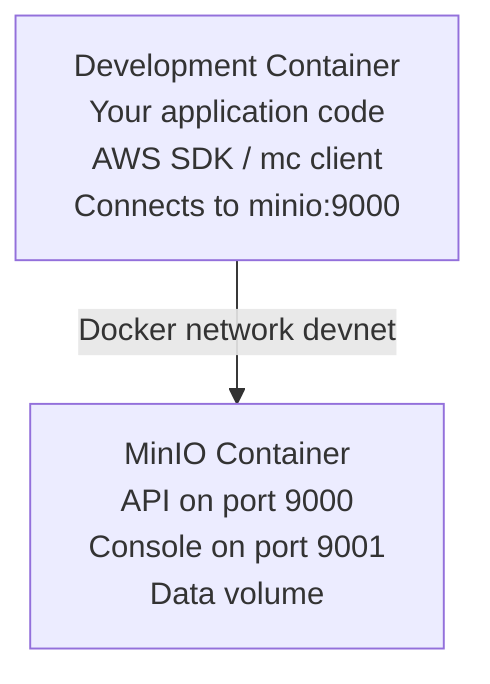

# MinIO Overlay

MinIO S3-compatible object storage for local development and testing of cloud storage applications.

## Features

- **MinIO Server** - High-performance S3-compatible object storage
- **MinIO Console** - Web-based admin interface (port 9001)
- **MinIO Client (mc)** - Command-line tool for bucket/object management
- **S3 API compatibility** - Works with AWS SDK and tools
- **Docker Compose service** - Runs as separate container
- **Persistent storage** - Data survives container restarts
- **Health checks** - Ensures service is ready before use
- **Pre-configured buckets** - Optional default bucket creation

## How It Works

This overlay adds MinIO as a Docker Compose service, providing a local S3-compatible object storage server. The service is accessible from your development container via the hostname `minio`.

**Architecture:**


## Configuration

### Environment Variables

The overlay includes a `.env.example` file. Copy it to `.env` and customize:

```bash
cd .devcontainer
cp .env.example .env
```

**Default values (.env.example):**
```bash
# MinIO Configuration
MINIO_VERSION=latest
MINIO_ROOT_USER=minioadmin
MINIO_ROOT_PASSWORD=minioadmin
MINIO_API_PORT=9000
MINIO_CONSOLE_PORT=9001

# Default bucket to create (optional)
MINIO_DEFAULT_BUCKET=my-bucket
```

⚠️ **SECURITY:** Change default credentials for production use. The `.env` file is git-ignored.

### Port Configuration

Default ports can be changed via the `--port-offset` option when initializing:

```bash
# Offset all ports by 100
container-superposition --port-offset 100

# MinIO API will be on 9100, Console on 9101
```

## Connection Information

### From Development Container

```bash
# S3 API Endpoint: http://minio:9000
# Access Key: minioadmin (or value from .env)
# Secret Key: minioadmin (or value from .env)
# Region: us-east-1 (default, can be any value)

# Environment variables (already set by overlay)
AWS_ACCESS_KEY_ID=minioadmin
AWS_SECRET_ACCESS_KEY=minioadmin
S3_ENDPOINT=http://minio:9000
AWS_REGION=us-east-1
```

### From Host Machine

```bash
# S3 API Endpoint: http://localhost:9000
# Access Key: minioadmin
# Secret Key: minioadmin
# Region: us-east-1
```

### MinIO Console (Web UI)

Access the web interface from your host machine:

```
http://localhost:9001
```

Login with:
- **Username:** minioadmin
- **Password:** minioadmin

## Common Commands

### Using MinIO Client (mc)

```bash
# List configured aliases
mc alias list

# List buckets
mc ls local

# Create bucket
mc mb local/my-bucket

# Remove bucket
mc rb local/my-bucket

# List objects in bucket
mc ls local/my-bucket

# Upload file
mc cp myfile.txt local/my-bucket/

# Download file
mc cp local/my-bucket/myfile.txt ./downloaded.txt

# Remove object
mc rm local/my-bucket/myfile.txt

# Mirror directory to bucket
mc mirror ./mydir local/my-bucket/mydir

# Share object (generate presigned URL)
mc share download local/my-bucket/myfile.txt --expire 24h
```

### Bucket Management

```bash
# Create bucket with versioning
mc mb local/my-bucket
mc version enable local/my-bucket

# Set bucket policy (public read)
mc anonymous set download local/my-bucket

# Set bucket policy (private)
mc anonymous set none local/my-bucket

# View bucket policy
mc anonymous get local/my-bucket

# Set bucket quota
mc quota set local/my-bucket --size 1GB

# Get bucket info
mc stat local/my-bucket
```

### Object Operations

```bash
# Upload with metadata
mc cp --attr "Content-Type=text/html;Cache-Control=max-age=3600" index.html local/my-bucket/

# Copy between buckets
mc cp local/source-bucket/file.txt local/dest-bucket/

# Copy recursively
mc cp --recursive ./mydir/ local/my-bucket/mydir/

# Find objects
mc find local/my-bucket --name "*.jpg"

# Cat object content
mc cat local/my-bucket/file.txt

# Diff between buckets
mc diff local/bucket1 local/bucket2
```

### Container Management

```bash
# Check service status
docker-compose ps

# View MinIO logs
docker-compose logs -f minio

# Restart service
docker-compose restart minio

# Stop service
docker-compose stop minio

# Remove data (WARNING: destroys all data)
docker-compose down -v
```

## Application Integration

### Node.js (AWS SDK v3)

```bash
# Install AWS SDK
npm install @aws-sdk/client-s3
```

```javascript
const { S3Client, PutObjectCommand, GetObjectCommand, ListBucketsCommand } = require('@aws-sdk/client-s3');
const fs = require('fs');

// Configure S3 client for MinIO
const s3Client = new S3Client({
  endpoint: 'http://minio:9000',
  region: 'us-east-1',
  credentials: {
    accessKeyId: 'minioadmin',
    secretAccessKey: 'minioadmin',
  },
  forcePathStyle: true, // Required for MinIO
});

// List buckets
async function listBuckets() {
  const response = await s3Client.send(new ListBucketsCommand({}));
  console.log(response.Buckets);
}

// Upload file
async function uploadFile() {
  const fileContent = fs.readFileSync('myfile.txt');
  await s3Client.send(new PutObjectCommand({
    Bucket: 'my-bucket',
    Key: 'myfile.txt',
    Body: fileContent,
  }));
}

// Download file
async function downloadFile() {
  const response = await s3Client.send(new GetObjectCommand({
    Bucket: 'my-bucket',
    Key: 'myfile.txt',
  }));

  const stream = response.Body;
  const chunks = [];
  for await (const chunk of stream) {
    chunks.push(chunk);
  }
  const fileContent = Buffer.concat(chunks);
  fs.writeFileSync('downloaded.txt', fileContent);
}
```

### Python (boto3)

```bash
# Install boto3
pip install boto3
```

```python
import boto3
from botocore.client import Config

# Configure S3 client for MinIO
s3_client = boto3.client(
    's3',
    endpoint_url='http://minio:9000',
    aws_access_key_id='minioadmin',
    aws_secret_access_key='minioadmin',
    config=Config(signature_version='s3v4'),
    region_name='us-east-1'
)

# List buckets
response = s3_client.list_buckets()
for bucket in response['Buckets']:
    print(bucket['Name'])

# Upload file
s3_client.upload_file('myfile.txt', 'my-bucket', 'myfile.txt')

# Download file
s3_client.download_file('my-bucket', 'myfile.txt', 'downloaded.txt')

# Upload from string
s3_client.put_object(
    Bucket='my-bucket',
    Key='text.txt',
    Body='Hello, MinIO!'.encode('utf-8')
)

# Download to string
response = s3_client.get_object(Bucket='my-bucket', Key='text.txt')
content = response['Body'].read().decode('utf-8')
```

### .NET

```bash
# Install AWS SDK
dotnet add package AWSSDK.S3
```

```csharp
using Amazon.S3;
using Amazon.S3.Model;
using Amazon.Runtime;

var config = new AmazonS3Config
{
    ServiceURL = "http://minio:9000",
    ForcePathStyle = true,
};

var credentials = new BasicAWSCredentials("minioadmin", "minioadmin");
var s3Client = new AmazonS3Client(credentials, config);

// List buckets
var bucketsResponse = await s3Client.ListBucketsAsync();
foreach (var bucket in bucketsResponse.Buckets)
{
    Console.WriteLine(bucket.BucketName);
}

// Upload file
await s3Client.PutObjectAsync(new PutObjectRequest
{
    BucketName = "my-bucket",
    Key = "myfile.txt",
    FilePath = "myfile.txt",
});

// Download file
await s3Client.GetObjectAsync(new GetObjectRequest
{
    BucketName = "my-bucket",
    Key = "myfile.txt",
}, "downloaded.txt");
```

### Go

```bash
# Install MinIO Go SDK
go get github.com/minio/minio-go/v7
```

```go
package main

import (
    "context"
    "log"
    "github.com/minio/minio-go/v7"
    "github.com/minio/minio-go/v7/pkg/credentials"
)

func main() {
    ctx := context.Background()

    // Initialize MinIO client
    minioClient, err := minio.New("minio:9000", &minio.Options{
        Creds:  credentials.NewStaticV4("minioadmin", "minioadmin", ""),
        Secure: false,
    })
    if err != nil {
        log.Fatalln(err)
    }

    // List buckets
    buckets, _ := minioClient.ListBuckets(ctx)
    for _, bucket := range buckets {
        log.Println(bucket.Name)
    }

    // Upload file
    _, err = minioClient.FPutObject(ctx, "my-bucket", "myfile.txt", "myfile.txt", minio.PutObjectOptions{})
    if err != nil {
        log.Fatalln(err)
    }

    // Download file
    err = minioClient.FGetObject(ctx, "my-bucket", "myfile.txt", "downloaded.txt", minio.GetObjectOptions{})
    if err != nil {
        log.Fatalln(err)
    }
}
```

## Use Cases

- **Local S3 development** - Test S3 code without AWS costs
- **File uploads** - Store user-uploaded files (images, documents, media)
- **Backup storage** - Backup databases and application data
- **Static asset hosting** - Serve images, videos, downloads
- **Multi-cloud development** - S3-compatible API works with MinIO, AWS, GCS, etc.
- **CI/CD testing** - Test storage code in pipelines
- **Data lakes** - Store large datasets for analysis
- **Microservices storage** - Shared object storage for distributed apps

**Integrates well with:**
- Node.js, Python, .NET, Go (AWS SDK support)
- AWS CLI (aws-cli overlay) - Use AWS CLI with MinIO
- Any S3-compatible tool or library

## Troubleshooting

### Issue: Cannot connect to MinIO

**Symptoms:**
- Connection refused errors
- Timeout when connecting

**Solution:**
```bash
# Check if service is running
docker-compose ps

# Check MinIO logs
docker-compose logs minio

# Wait for health check to pass
docker-compose ps | grep minio
# Look for "healthy" status

# Test connection
curl http://minio:9000/minio/health/live
```

### Issue: Access Denied

**Symptoms:**
- "Access Denied" error
- Authentication failures

**Solution:**
```bash
# Verify credentials in .env file
cat .devcontainer/.env

# Ensure credentials match in your code
# Access Key: minioadmin
# Secret Key: minioadmin

# Reconfigure mc alias
mc alias set local http://minio:9000 minioadmin minioadmin

# Check bucket policy
mc anonymous get local/my-bucket
```

### Issue: Bucket not found

**Symptoms:**
- "The specified bucket does not exist"

**Solution:**
```bash
# Create bucket
mc mb local/my-bucket

# List existing buckets
mc ls local

# Check if MINIO_DEFAULT_BUCKET was created during setup
mc ls local | grep my-bucket
```

### Issue: MinIO Console not accessible

**Symptoms:**
- Cannot access http://localhost:9001
- Page not loading

**Solution:**
```bash
# Check MinIO logs
docker-compose logs minio

# Verify MinIO is healthy first
docker-compose ps minio

# Restart MinIO
docker-compose restart minio

# Check port forwarding in VS Code
# Dev Containers: Forward Ports... (port 9001)
```

### Issue: Data not persisting

**Symptoms:**
- Buckets/objects lost after container restart

**Solution:**
```bash
# Verify volumes exist
docker volume ls | grep minio

# Check volume mounts in docker-compose.yml
docker-compose config

# Don't use 'docker-compose down -v' unless you want to delete data
# Use 'docker-compose down' or 'docker-compose stop' instead
```

### Issue: Slow performance

**Symptoms:**
- Slow uploads/downloads

**Solution:**
```bash
# MinIO is fast locally - check:
# 1. File size (large files take time)
# 2. Network (should be Docker network, not internet)
# 3. Disk I/O (SSD recommended)

# Use mc stat to check object info
mc stat local/my-bucket/myfile.txt

# Check MinIO metrics
curl http://minio:9000/minio/v2/metrics/cluster
```

## Security Considerations

⚠️ **Development-only defaults:**

- Default credentials (`minioadmin/minioadmin`) are publicly known
- MinIO is exposed on host port (accessible from host machine)
- No TLS/SSL encryption by default

**For production:**

1. **Change credentials:**
   ```bash
   # Use strong passwords
   MINIO_ROOT_USER=<strong-username>
   MINIO_ROOT_PASSWORD=<strong-password>
   ```

2. **Create application-specific users:**
   ```bash
   # Don't use root user for applications
   mc admin user add local myapp <strong-password>
   mc admin policy attach local readwrite --user myapp
   ```

3. **Enable TLS:**
   ```yaml
   # Generate certificates and mount in docker-compose.yml
   # See: https://min.io/docs/minio/linux/operations/network-encryption.html
   ```

4. **Restrict bucket access:**
   ```bash
   # Set private bucket policy
   mc anonymous set none local/my-bucket

   # Use IAM policies for fine-grained access
   mc admin policy create local mypolicy policy.json
   ```

5. **Enable versioning and retention:**
   ```bash
   # Protect against accidental deletion
   mc version enable local/my-bucket
   mc retention set --default GOVERNANCE 30d local/my-bucket
   ```

## Performance Tips

1. **Use multipart uploads** for large files (>5MB)
2. **Enable bucket versioning** for data protection
3. **Set appropriate content types** for better browser handling
4. **Use presigned URLs** for temporary access instead of public buckets
5. **Monitor with MinIO Console** - view metrics, storage usage

## Related Overlays

- **aws-cli** - AWS CLI works with MinIO (configure with `--endpoint-url`)
- **nodejs** - Node.js with AWS SDK
- **python** - Python with boto3
- **dotnet** - .NET with AWSSDK.S3
- **grafana** - Visualize MinIO metrics (Prometheus endpoint available)

## Additional Resources

- [Official MinIO Documentation](https://min.io/docs/minio/linux/index.html)
- [MinIO Client Guide](https://min.io/docs/minio/linux/reference/minio-mc.html)
- [AWS SDK for JavaScript](https://docs.aws.amazon.com/AWSJavaScriptSDK/v3/latest/)
- [boto3 Documentation](https://boto3.amazonaws.com/v1/documentation/api/latest/index.html)
- [S3 API Reference](https://docs.aws.amazon.com/AmazonS3/latest/API/Welcome.html)

## Notes

- MinIO uses the hostname `minio` (the service name) for container-to-container communication
- Data is persisted in a Docker volume (`minio-data`)
- MinIO Console provides web UI for bucket/object management
- **Massive ROI** - Local S3 development comes up constantly in modern applications
- S3-compatible API means code works with AWS, GCS, and other cloud providers
- MinIO Client (mc) is installed automatically during setup
- Use `forcePathStyle: true` in AWS SDK configuration for MinIO compatibility
- Default bucket creation is optional via `MINIO_DEFAULT_BUCKET` environment variable
