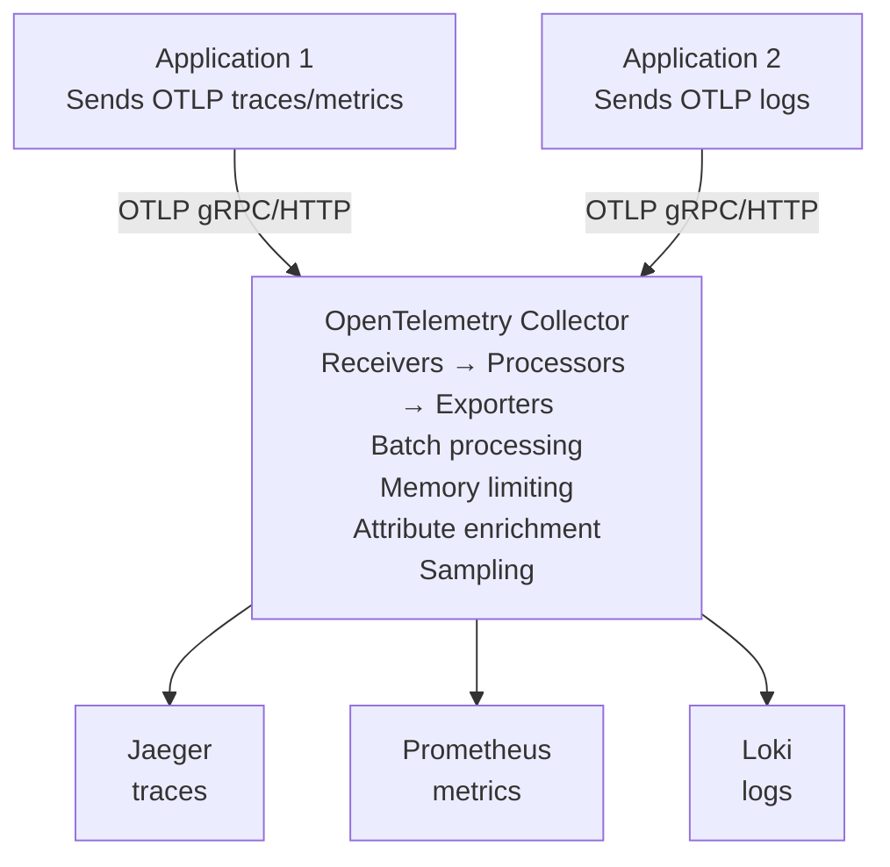

# OpenTelemetry Collector Overlay

Vendor-agnostic telemetry collection agent that receives, processes, and exports traces, metrics, and logs.

## Features

- **OpenTelemetry Collector Contrib** - Extended collector with 200+ components
- **Multiple receivers** - OTLP (gRPC/HTTP), Jaeger, Prometheus, and more
- **Flexible processors** - Batch, filter, transform, sample telemetry
- **Multi-backend export** - Send to Jaeger, Prometheus, Loki simultaneously
- **Pipeline architecture** - Separate processing for traces, metrics, logs
- **Resource detection** - Automatic environment attribute detection
- **Health check endpoint** - Monitor collector status

## How It Works

The OpenTelemetry Collector acts as a centralized agent that receives telemetry from your applications, processes it (batching, filtering, enriching), and exports it to various backends.

**Architecture:**



**Benefits:**

- **Decoupling** - Change backends without modifying application code
- **Centralized processing** - Transform/filter data once, not in every app
- **Reduced overhead** - Offload heavy processing from applications
- **Multi-backend** - Send same data to multiple destinations
- **Protocol translation** - Convert between different telemetry formats

## Configuration

### Ports

- `4317` - OTLP gRPC receiver (primary)
- `4318` - OTLP HTTP receiver
- `8888` - Collector's own metrics (internal health)
- `8889` - Prometheus exporter endpoint (scrape target)
- `13133` - Health check extension

### Environment Variables

The overlay includes a `.env.example` file. Copy it to `.env` and customize:

```bash
cd .devcontainer
cp .env.example .env
```

**Available variables:**

```bash
# Collector version
OTEL_COLLECTOR_VERSION=latest

# Port configuration
OTEL_GRPC_PORT=4317
OTEL_HTTP_PORT=4318
OTEL_METRICS_PORT=8888
OTEL_EXPORTER_PORT=8889
OTEL_HEALTH_PORT=13133
```

### Collector Configuration File

The collector is configured via `otel-collector-config.yaml`:

**Structure:**

```yaml
receivers: # How telemetry enters the collector
    otlp:
        protocols:
            grpc:
            http:

processors: # How telemetry is transformed
    batch:
    memory_limiter:

exporters: # Where telemetry is sent
    otlp/jaeger:
    prometheus:
    loki:

service: # Pipeline definitions
    pipelines:
        traces:
            receivers: [otlp]
            processors: [memory_limiter, batch]
            exporters: [otlp/jaeger]
        metrics:
            receivers: [otlp]
            processors: [memory_limiter, batch]
            exporters: [prometheus]
        logs:
            receivers: [otlp]
            processors: [memory_limiter, batch]
            exporters: [loki]
```

### Port Configuration

Ports can be changed via `--port-offset`:

```bash
# Offset all ports by 100
container-superposition --port-offset 100

# Collector ports become:
# 4417 (gRPC), 4418 (HTTP), 8988 (metrics), 8989 (prometheus), 13233 (health)
```

## Receivers Configuration

### OTLP Receiver (Default)

Receives telemetry in OpenTelemetry Protocol format:

```yaml
receivers:
    otlp:
        protocols:
            grpc:
                endpoint: 0.0.0.0:4317
            http:
                endpoint: 0.0.0.0:4318
                cors:
                    allowed_origins:
                        - http://*
                        - https://*
```

### Jaeger Receiver

Receive traces in Jaeger format:

```yaml
receivers:
    jaeger:
        protocols:
            grpc:
                endpoint: 0.0.0.0:14250
            thrift_http:
                endpoint: 0.0.0.0:14268
            thrift_compact:
                endpoint: 0.0.0.0:6831
```

### Prometheus Receiver

Scrape metrics from Prometheus endpoints:

```yaml
receivers:
    prometheus:
        config:
            scrape_configs:
                - job_name: 'my-app'
                  scrape_interval: 10s
                  static_configs:
                      - targets: ['my-app:8080']
```

### Filelog Receiver

Read logs from files:

```yaml
receivers:
    filelog:
        include:
            - /var/log/myapp/*.log
        start_at: end
        operators:
            - type: json_parser
              timestamp:
                  parse_from: attributes.time
                  layout: '%Y-%m-%d %H:%M:%S'
```

### Hostmetrics Receiver

Collect system metrics:

```yaml
receivers:
    hostmetrics:
        collection_interval: 30s
        scrapers:
            cpu:
            memory:
            disk:
            network:
            filesystem:
```

## Processors Configuration

### Batch Processor (Recommended)

Batches telemetry for efficient export:

```yaml
processors:
    batch:
        timeout: 10s # Send batch every 10s
        send_batch_size: 1024 # Or when 1024 items collected
        send_batch_max_size: 2048 # Hard limit on batch size
```

**Benefits:**

- Reduces network overhead
- Better compression
- More efficient backend writes

### Memory Limiter Processor (Critical)

Prevents OOM by limiting memory usage:

```yaml
processors:
    memory_limiter:
        check_interval: 1s # How often to check memory
        limit_mib: 512 # Hard limit (triggers data drop)
        spike_limit_mib: 128 # Temporary spike allowance
```

**When limit is reached:**

1. Stops accepting new data
2. Flushes existing batches
3. Resumes when memory drops below limit

### Attributes Processor

Add, update, or delete attributes:

```yaml
processors:
    attributes:
        actions:
            - key: environment
              value: development
              action: insert
            - key: sensitive_data
              action: delete
            - key: http.url
              pattern: ^(.*)(\?.*)$
              action: extract
              from_attribute: http.url
```

### Resource Processor

Modify resource attributes:

```yaml
processors:
    resource:
        attributes:
            - key: deployment.environment
              value: development
              action: upsert
            - key: service.namespace
              value: mycompany
              action: insert
```

### Filter Processor

Drop spans/metrics based on conditions:

```yaml
processors:
    filter:
        traces:
            span:
                - 'attributes["http.url"] == "/health"'
                - 'name == "health-check"'
        metrics:
            metric:
                - 'name == "noisy_metric"'
```

### Span Processor

Modify span names and attributes:

```yaml
processors:
    span:
        name:
            from_attributes: ['http.method', 'http.route']
            separator: ' '
        include:
            match_type: regexp
            services: ['my-service']
```

### Tail Sampling Processor

Intelligent sampling based on trace properties:

```yaml
processors:
    tail_sampling:
        decision_wait: 10s
        num_traces: 100
        expected_new_traces_per_sec: 10
        policies:
            - name: errors
              type: status_code
              status_code:
                  status_codes: [ERROR]
            - name: slow-traces
              type: latency
              latency:
                  threshold_ms: 1000
            - name: probabilistic
              type: probabilistic
              probabilistic:
                  sampling_percentage: 10
```

### Transform Processor

Advanced transformations with OTTL:

```yaml
processors:
    transform:
        trace_statements:
            - context: span
              statements:
                  - set(attributes["http.status_class"], "2xx") where attributes["http.status_code"] >= 200 and attributes["http.status_code"] < 300
                  - set(attributes["error"], true) where status.code == STATUS_CODE_ERROR
```

## Exporters Configuration

### OTLP Exporter (Jaeger)

Export traces to Jaeger via OTLP:

```yaml
exporters:
    otlp/jaeger:
        endpoint: jaeger:4317
        tls:
            insecure: true
        sending_queue:
            enabled: true
            num_consumers: 10
            queue_size: 1000
        retry_on_failure:
            enabled: true
            initial_interval: 5s
            max_interval: 30s
            max_elapsed_time: 300s
```

### Prometheus Exporter

Expose metrics for Prometheus to scrape:

```yaml
exporters:
    prometheus:
        endpoint: '0.0.0.0:8889'
        namespace: otelcol
        const_labels:
            environment: development
        send_timestamps: true
        metric_expiration: 5m
```

### Loki Exporter

Export logs to Grafana Loki:

```yaml
exporters:
    loki:
        endpoint: http://loki:3100/loki/api/v1/push
        labels:
            attributes:
                service.name: 'service_name'
                severity: 'severity'
                host.name: 'host_name'
        tenant_id: 'dev'
```

### OTLP HTTP Exporter

Export to OTLP-compatible backends:

```yaml
exporters:
    otlphttp:
        endpoint: https://ingest.example.com
        headers:
            api-key: '${API_KEY}'
        compression: gzip
        timeout: 30s
```

### File Exporter (Debug)

Write telemetry to file:

```yaml
exporters:
    file:
        path: /tmp/otel-output.json
        rotation:
            max_megabytes: 100
            max_days: 3
            max_backups: 3
```

### Debug Exporter

Log telemetry to console (development only):

```yaml
exporters:
    debug:
        verbosity: detailed # or: basic, normal
        sampling_initial: 5
        sampling_thereafter: 200
```

## Pipeline Examples

### Traces Pipeline

```yaml
service:
    pipelines:
        traces:
            receivers: [otlp, jaeger]
            processors:
                - memory_limiter
                - resource
                - batch
                - tail_sampling
            exporters: [otlp/jaeger, debug]
```

### Metrics Pipeline

```yaml
service:
    pipelines:
        metrics:
            receivers: [otlp, prometheus, hostmetrics]
            processors:
                - memory_limiter
                - resource
                - attributes
                - batch
            exporters: [prometheus, debug]
```

### Logs Pipeline

```yaml
service:
    pipelines:
        logs:
            receivers: [otlp, filelog]
            processors:
                - memory_limiter
                - resource
                - attributes
                - batch
            exporters: [loki, debug]
```

### Multi-Signal Pipeline

Process different signals independently:

```yaml
service:
    pipelines:
        # Production traces (sampled)
        traces/prod:
            receivers: [otlp]
            processors: [tail_sampling, batch]
            exporters: [otlp/jaeger]

        # Debug traces (all)
        traces/debug:
            receivers: [otlp]
            processors: [batch]
            exporters: [debug]

        # Application metrics
        metrics/app:
            receivers: [otlp]
            processors: [batch]
            exporters: [prometheus]

        # System metrics
        metrics/system:
            receivers: [hostmetrics]
            processors: [resource, batch]
            exporters: [prometheus]

        # Application logs
        logs/app:
            receivers: [otlp]
            processors: [attributes, batch]
            exporters: [loki]

        # File logs
        logs/files:
            receivers: [filelog]
            processors: [resource, batch]
            exporters: [loki]
```

## Application Integration

### Node.js (All Signals)

Install dependencies:

```bash
npm install @opentelemetry/sdk-node \
            @opentelemetry/auto-instrumentations-node \
            @opentelemetry/exporter-trace-otlp-grpc \
            @opentelemetry/exporter-metrics-otlp-grpc \
            @opentelemetry/exporter-logs-otlp-grpc
```

**Comprehensive setup:**

```javascript
// tracing.js
const { NodeSDK } = require('@opentelemetry/sdk-node');
const { getNodeAutoInstrumentations } = require('@opentelemetry/auto-instrumentations-node');
const { OTLPTraceExporter } = require('@opentelemetry/exporter-trace-otlp-grpc');
const { OTLPMetricExporter } = require('@opentelemetry/exporter-metrics-otlp-grpc');
const { OTLPLogExporter } = require('@opentelemetry/exporter-logs-otlp-grpc');
const { Resource } = require('@opentelemetry/resources');
const { SemanticResourceAttributes } = require('@opentelemetry/semantic-conventions');
const { PeriodicExportingMetricReader } = require('@opentelemetry/sdk-metrics');

const resource = new Resource({
    [SemanticResourceAttributes.SERVICE_NAME]: 'my-service',
    [SemanticResourceAttributes.SERVICE_VERSION]: '1.0.0',
    [SemanticResourceAttributes.DEPLOYMENT_ENVIRONMENT]: 'development',
});

const sdk = new NodeSDK({
    resource,
    traceExporter: new OTLPTraceExporter({
        url: 'http://otel-collector:4317',
    }),
    metricReader: new PeriodicExportingMetricReader({
        exporter: new OTLPMetricExporter({
            url: 'http://otel-collector:4317',
        }),
        exportIntervalMillis: 60000, // Export every minute
    }),
    logRecordProcessor: new BatchLogRecordProcessor(
        new OTLPLogExporter({
            url: 'http://otel-collector:4317',
        })
    ),
    instrumentations: [getNodeAutoInstrumentations()],
});

sdk.start();

process.on('SIGTERM', () => {
    sdk.shutdown().finally(() => process.exit(0));
});
```

### Python (All Signals)

Install dependencies:

```bash
pip install opentelemetry-distro \
            opentelemetry-exporter-otlp-proto-grpc \
            opentelemetry-instrumentation
```

**Comprehensive setup:**

```python
from opentelemetry import trace, metrics, _logs
from opentelemetry.sdk.trace import TracerProvider
from opentelemetry.sdk.metrics import MeterProvider
from opentelemetry.sdk._logs import LoggerProvider
from opentelemetry.sdk.trace.export import BatchSpanProcessor
from opentelemetry.sdk.metrics.export import PeriodicExportingMetricReader
from opentelemetry.sdk._logs.export import BatchLogRecordProcessor
from opentelemetry.exporter.otlp.proto.grpc.trace_exporter import OTLPSpanExporter
from opentelemetry.exporter.otlp.proto.grpc.metric_exporter import OTLPMetricExporter
from opentelemetry.exporter.otlp.proto.grpc._log_exporter import OTLPLogExporter
from opentelemetry.sdk.resources import Resource, SERVICE_NAME, SERVICE_VERSION

# Configure resource
resource = Resource.create({
    SERVICE_NAME: "my-service",
    SERVICE_VERSION: "1.0.0",
    "deployment.environment": "development",
})

# Setup tracing
trace.set_tracer_provider(TracerProvider(resource=resource))
trace.get_tracer_provider().add_span_processor(
    BatchSpanProcessor(OTLPSpanExporter(endpoint="http://otel-collector:4317", insecure=True))
)

# Setup metrics
metrics.set_meter_provider(
    MeterProvider(
        resource=resource,
        metric_readers=[
            PeriodicExportingMetricReader(
                OTLPMetricExporter(endpoint="http://otel-collector:4317", insecure=True),
                export_interval_millis=60000,
            )
        ],
    )
)

# Setup logging
_logs.set_logger_provider(LoggerProvider(resource=resource))
_logs.get_logger_provider().add_log_record_processor(
    BatchLogRecordProcessor(OTLPLogExporter(endpoint="http://otel-collector:4317", insecure=True))
)
```

### .NET (All Signals)

Install packages:

```bash
dotnet add package OpenTelemetry.Exporter.OpenTelemetryProtocol
dotnet add package OpenTelemetry.Extensions.Hosting
dotnet add package OpenTelemetry.Instrumentation.AspNetCore
dotnet add package OpenTelemetry.Instrumentation.Http
```

**ASP.NET Core configuration:**

```csharp
using OpenTelemetry.Logs;
using OpenTelemetry.Metrics;
using OpenTelemetry.Resources;
using OpenTelemetry.Trace;

var builder = WebApplication.CreateBuilder(args);

var resourceBuilder = ResourceBuilder.CreateDefault()
    .AddService("my-service", serviceVersion: "1.0.0")
    .AddAttributes(new Dictionary<string, object>
    {
        ["deployment.environment"] = "development"
    });

// Configure OpenTelemetry
builder.Services.AddOpenTelemetry()
    .ConfigureResource(resource => resource = resourceBuilder)
    .WithTracing(tracing => tracing
        .AddAspNetCoreInstrumentation()
        .AddHttpClientInstrumentation()
        .AddOtlpExporter(options =>
        {
            options.Endpoint = new Uri("http://otel-collector:4317");
        }))
    .WithMetrics(metrics => metrics
        .AddAspNetCoreInstrumentation()
        .AddHttpClientInstrumentation()
        .AddOtlpExporter(options =>
        {
            options.Endpoint = new Uri("http://otel-collector:4317");
        }));

// Configure logging
builder.Logging.AddOpenTelemetry(logging =>
{
    logging.SetResourceBuilder(resourceBuilder);
    logging.AddOtlpExporter(options =>
    {
        options.Endpoint = new Uri("http://otel-collector:4317");
    });
});

var app = builder.Build();
app.Run();
```

### Go (All Signals)

Install dependencies:

```bash
go get go.opentelemetry.io/otel
go get go.opentelemetry.io/otel/exporters/otlp/otlptrace/otlptracegrpc
go get go.opentelemetry.io/otel/exporters/otlp/otlpmetric/otlpmetricgrpc
go get go.opentelemetry.io/otel/exporters/otlp/otlplog/otlploggrpc
```

**Complete setup:**

```go
package main

import (
    "context"
    "log"
    "time"

    "go.opentelemetry.io/otel"
    "go.opentelemetry.io/otel/exporters/otlp/otlptrace/otlptracegrpc"
    "go.opentelemetry.io/otel/exporters/otlp/otlpmetric/otlpmetricgrpc"
    "go.opentelemetry.io/otel/sdk/metric"
    "go.opentelemetry.io/otel/sdk/resource"
    sdktrace "go.opentelemetry.io/otel/sdk/trace"
    semconv "go.opentelemetry.io/otel/semconv/v1.17.0"
)

func initProvider() func() {
    ctx := context.Background()

    res, err := resource.New(ctx,
        resource.WithAttributes(
            semconv.ServiceName("my-service"),
            semconv.ServiceVersion("1.0.0"),
        ),
    )
    if err != nil {
        log.Fatal(err)
    }

    // Setup tracing
    traceExporter, err := otlptracegrpc.New(ctx,
        otlptracegrpc.WithEndpoint("otel-collector:4317"),
        otlptracegrpc.WithInsecure(),
    )
    if err != nil {
        log.Fatal(err)
    }

    tp := sdktrace.NewTracerProvider(
        sdktrace.WithBatcher(traceExporter),
        sdktrace.WithResource(res),
    )
    otel.SetTracerProvider(tp)

    // Setup metrics
    metricExporter, err := otlpmetricgrpc.New(ctx,
        otlpmetricgrpc.WithEndpoint("otel-collector:4317"),
        otlpmetricgrpc.WithInsecure(),
    )
    if err != nil {
        log.Fatal(err)
    }

    mp := metric.NewMeterProvider(
        metric.WithReader(metric.NewPeriodicReader(metricExporter,
            metric.WithInterval(60*time.Second),
        )),
        metric.WithResource(res),
    )
    otel.SetMeterProvider(mp)

    return func() {
        _ = tp.Shutdown(ctx)
        _ = mp.Shutdown(ctx)
    }
}
```

## Sampling Strategies

### Head Sampling (At Collection)

Sample at the receiver before processing:

```yaml
processors:
    probabilistic_sampler:
        hash_seed: 22
        sampling_percentage: 10 # 10% of traces

service:
    pipelines:
        traces:
            processors: [probabilistic_sampler, batch]
```

### Tail Sampling (After Collection)

Make sampling decisions after seeing complete trace:

```yaml
processors:
    tail_sampling:
        decision_wait: 10s
        num_traces: 100
        expected_new_traces_per_sec: 10
        policies:
            # Always sample errors
            - name: error-traces
              type: status_code
              status_code:
                  status_codes: [ERROR]

            # Always sample slow requests
            - name: slow-traces
              type: latency
              latency:
                  threshold_ms: 1000

            # Sample 10% of other traces
            - name: probabilistic-policy
              type: probabilistic
              probabilistic:
                  sampling_percentage: 10

            # Sample by specific attributes
            - name: important-service
              type: string_attribute
              string_attribute:
                  key: service.name
                  values: [critical-service, payment-service]
```

## Batching and Retry Configuration

### Optimal Batch Settings

```yaml
processors:
    batch:
        # Time to wait before sending (whichever comes first)
        timeout: 10s

        # Preferred batch size
        send_batch_size: 1024

        # Maximum batch size
        send_batch_max_size: 2048

exporters:
    otlp/jaeger:
        endpoint: jaeger:4317
        tls:
            insecure: true

        # Queue configuration
        sending_queue:
            enabled: true
            num_consumers: 10 # Concurrent exporters
            queue_size: 5000 # Max items in queue

        # Retry on failure
        retry_on_failure:
            enabled: true
            initial_interval: 5s # First retry after 5s
            max_interval: 30s # Max backoff time
            max_elapsed_time: 300s # Give up after 5 minutes
```

## Best Practices

### Resource Attributes

Always set resource attributes:

```yaml
processors:
    resource:
        attributes:
            - key: deployment.environment
              value: development
              action: upsert
            - key: service.namespace
              value: mycompany
              action: upsert
            - key: cloud.provider
              value: aws
              action: insert
```

### Memory Management

Always use memory_limiter as first processor:

```yaml
processors:
    memory_limiter:
        check_interval: 1s
        limit_mib: 512
        spike_limit_mib: 128

service:
    pipelines:
        traces:
            processors: [memory_limiter, batch, ...] # memory_limiter FIRST
```

### Pipeline Ordering

Correct processor order matters:

```yaml
service:
    pipelines:
        traces:
            processors:
                - memory_limiter # 1. Prevent OOM (always first)
                - resource # 2. Add resource attributes
                - attributes # 3. Add/modify span attributes
                - filter # 4. Drop unwanted spans
                - tail_sampling # 5. Sample traces
                - batch # 6. Batch for export (always last)
```

### Health Checks

Always enable health check extension:

```yaml
extensions:
    health_check:
        endpoint: 0.0.0.0:13133
        check_collector_pipeline:
            enabled: true
            interval: 5s
            exporter_failure_threshold: 5

service:
    extensions: [health_check]
```

**Check health:**

```bash
curl http://localhost:13133
# Returns 200 OK if healthy
```

### Avoid Data Loss

Configure persistent queues for critical data:

```yaml
exporters:
    otlp:
        endpoint: backend:4317
        sending_queue:
            enabled: true
            storage: file_storage/otlp
        retry_on_failure:
            enabled: true

extensions:
    file_storage:
        directory: /var/lib/otelcol/storage
        timeout: 10s

service:
    extensions: [file_storage]
```

## Performance Optimization

### Tune Batch Sizes

```yaml
processors:
    batch:
        # For high throughput
        timeout: 1s
        send_batch_size: 8192
        send_batch_max_size: 16384

        # For low latency
        # timeout: 100ms
        # send_batch_size: 128
        # send_batch_max_size: 256
```

### Increase Concurrency

```yaml
exporters:
    otlp/jaeger:
        endpoint: jaeger:4317
        sending_queue:
            num_consumers: 20 # More concurrent exports
            queue_size: 10000
```

### Use Persistent Queue

```yaml
exporters:
    otlp:
        sending_queue:
            enabled: true
            storage: file_storage

extensions:
    file_storage:
        directory: /var/lib/otelcol
```

### Resource Detection

Auto-detect environment attributes:

```yaml
processors:
    resourcedetection:
        detectors: [env, system, docker]
        timeout: 5s
```

## Troubleshooting

### No telemetry appearing

**Check collector is running:**

```bash
docker-compose ps otel-collector
docker-compose logs otel-collector
```

**Check health endpoint:**

```bash
curl http://localhost:13133
```

**Verify application endpoint:**

```javascript
// Check your app sends to correct URL
console.log('OTLP endpoint:', 'http://otel-collector:4317');
```

**Check pipeline configuration:**

```bash
# Ensure pipelines are defined
docker-compose exec otel-collector cat /etc/otel-collector-config.yaml
```

### Collector crashes or OOM

**Check memory limiter:**

```yaml
processors:
    memory_limiter:
        limit_mib: 1024 # Increase limit
        spike_limit_mib: 256
```

**Reduce batch sizes:**

```yaml
processors:
    batch:
        send_batch_size: 512 # Reduce from 1024
        send_batch_max_size: 1024 # Reduce from 2048
```

**Check memory usage:**

```bash
docker stats otel-collector
```

### Data not reaching backends

**Check exporter configuration:**

```bash
# Verify backend endpoints
docker-compose logs otel-collector | grep -i "exporter"
```

**Test backend connectivity:**

```bash
docker-compose exec otel-collector wget -O- http://jaeger:4317
docker-compose exec otel-collector curl http://prometheus:9090
docker-compose exec otel-collector curl http://loki:3100/ready
```

**Enable debug exporter:**

```yaml
exporters:
    debug:
        verbosity: detailed

service:
    pipelines:
        traces:
            exporters: [otlp/jaeger, debug] # Add debug
```

**Check logs for export errors:**

```bash
docker-compose logs otel-collector | grep -i "error\|failed"
```

### High CPU usage

**Reduce sampling:**

```yaml
processors:
    probabilistic_sampler:
        sampling_percentage: 10 # Sample less
```

**Increase batch timeout:**

```yaml
processors:
    batch:
        timeout: 30s # Batch for longer
```

**Disable expensive processors:**

```yaml
# Comment out tail_sampling if not needed
# processors:
#   tail_sampling: ...
```

### Pipeline backed up

**Increase queue size:**

```yaml
exporters:
    otlp/jaeger:
        sending_queue:
            queue_size: 10000 # Increase from 5000
```

**Add more consumers:**

```yaml
exporters:
    otlp/jaeger:
        sending_queue:
            num_consumers: 20 # Increase from 10
```

**Monitor queue metrics:**

```promql
otelcol_exporter_queue_size
otelcol_exporter_queue_capacity
```

### Configuration errors

**Validate configuration:**

```bash
# Check for YAML syntax errors
docker-compose exec otel-collector \
  otelcol validate --config=/etc/otel-collector-config.yaml
```

**Check logs on startup:**

```bash
docker-compose logs otel-collector | head -50
```

## Use Cases

### Centralized Telemetry Collection

- Collect from multiple applications
- Single point for configuration changes
- Consistent data enrichment
- Unified export to multiple backends

### Protocol Translation

- Receive Jaeger, export to OTLP
- Receive Prometheus, export to Cloud Monitoring
- Convert legacy formats to OpenTelemetry

### Data Processing

- Filter PII/sensitive data
- Add environment/deployment metadata
- Sample high-volume traces
- Aggregate metrics

### Multi-Tenant Environments

- Route telemetry by tenant ID
- Apply different sampling per tenant
- Export to tenant-specific backends

## Related Overlays

- **jaeger** - Distributed tracing backend (receives traces from collector)
- **prometheus** - Metrics backend (scrapes metrics from collector)
- **loki** - Log aggregation backend (receives logs from collector)
- **grafana** - Unified visualization for all three signals
- **nodejs/python/dotnet/go** - Application frameworks instrumented with OpenTelemetry

## Additional Resources

- [OpenTelemetry Collector Documentation](https://opentelemetry.io/docs/collector/)
- [Collector Configuration](https://opentelemetry.io/docs/collector/configuration/)
- [Available Receivers](https://github.com/open-telemetry/opentelemetry-collector-contrib/tree/main/receiver)
- [Available Processors](https://github.com/open-telemetry/opentelemetry-collector-contrib/tree/main/processor)
- [Available Exporters](https://github.com/open-telemetry/opentelemetry-collector-contrib/tree/main/exporter)
- [Performance Best Practices](https://opentelemetry.io/docs/collector/scaling/)
- [Troubleshooting Guide](https://opentelemetry.io/docs/collector/troubleshooting/)

## Notes

- This overlay **requires compose stack** (uses docker-compose)
- Collector receives on ports **4317** (gRPC) and **4318** (HTTP)
- Prometheus scrapes metrics from port **8889**
- Health check available on port **13133**
- Depends on **jaeger**, **prometheus**, and **loki** overlays
- Use hostname **`otel-collector`** from applications
- Configuration file is **`otel-collector-config.yaml`**
- Always use **memory_limiter** processor to prevent OOM
- Always use **batch** processor for performance
