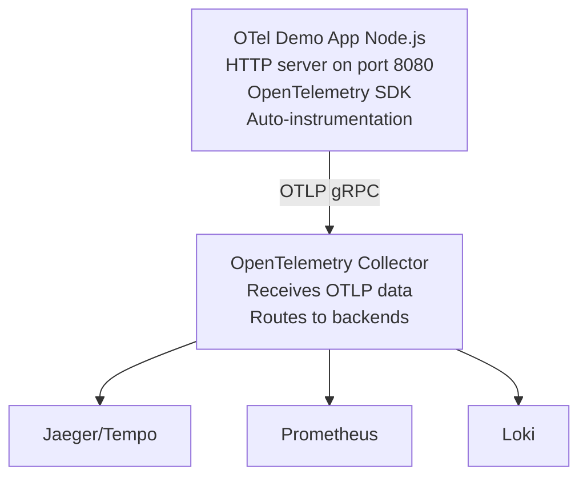

# OpenTelemetry Demo - Node.js

Sample Node.js application fully instrumented with OpenTelemetry to demonstrate distributed tracing, metrics, and logging in the observability stack.

## Features

- **Auto-instrumentation** - Automatic HTTP request tracing
- **Custom metrics** - Request counters, duration histograms, active requests
- **Structured logs** - JSON formatted logs with trace context
- **Multiple endpoints** - Various scenarios (normal, slow, error)
- **OTLP export** - Sends traces and metrics to OpenTelemetry Collector
- **Zero-config** - Works out-of-box with the observability stack

## How It Works

This demo application showcases the three pillars of observability:

**1. Traces (Distributed Tracing):**
- Auto-instrumented HTTP server
- Custom spans for business logic
- Trace context propagation
- Parent-child span relationships

**2. Metrics (Time-Series Data):**
- `http_requests_total` - Counter of all HTTP requests
- `http_request_duration_seconds` - Histogram of request latencies
- `http_requests_active` - Gauge of concurrent requests

**3. Logs (Structured Logging):**
- JSON formatted logs
- Trace ID and span ID correlation
- Log levels (info, warn, error)
- Searchable in Loki

**Architecture:**


## Configuration

### Ports

- `8080` - HTTP API (web interface and endpoints)

### Environment Variables

The service is configured via environment variables in docker-compose:

```bash
# OTLP endpoint (OpenTelemetry Collector)
OTEL_EXPORTER_OTLP_ENDPOINT=http://otel-collector:4317

# Service identification
OTEL_SERVICE_NAME=otel-demo-nodejs
OTEL_RESOURCE_ATTRIBUTES=service.version=1.0.0,deployment.environment=dev
```

### Dependencies

Requires:
- **otel-collector** - Required to receive and route telemetry
- **jaeger** or **tempo** - Recommended for trace visualization
- **prometheus** - Recommended for metrics visualization
- **loki** - Recommended for log aggregation
- **grafana** - Recommended for unified visualization

## Available Endpoints

### GET /

**Home page** with documentation and links to test endpoints.

```bash
curl http://localhost:8080/
```

### GET /api/data

**Returns JSON data** with trace context. Creates child spans for data processing.

```bash
curl http://localhost:8080/api/data
```

**Example response:**
```json
{
  "timestamp": "2024-01-15T10:30:00.000Z",
  "items": [
    { "id": 1, "name": "Item 1", "value": 42.5 },
    { "id": 2, "name": "Item 2", "value": 78.3 },
    { "id": 3, "name": "Item 3", "value": 15.9 }
  ],
  "trace": {
    "traceId": "a1b2c3d4e5f6...",
    "spanId": "123abc..."
  }
}
```

### GET /api/slow

**Simulates slow request** with 2-second delay. Useful for testing latency alerts and p99 metrics.

```bash
curl http://localhost:8080/api/slow
```

### GET /api/error

**Simulates error** returning 500 status. Useful for testing error alerts and exception tracking.

```bash
curl http://localhost:8080/api/error
```

### GET /health

**Health check endpoint** for monitoring.

```bash
curl http://localhost:8080/health
```

## Viewing Observability Data

### Traces in Grafana

1. Open Grafana: http://localhost:3000
2. Go to **Explore**
3. Select **Jaeger** or **Tempo** datasource
4. Search for traces:
   - Service: `otel-demo-nodejs`
   - Operation: `GET /api/data`

**TraceQL query (for Tempo):**
```traceql
{ service.name = "otel-demo-nodejs" }
```

**What you'll see:**
- Request spans with timing
- Parent-child relationships
- HTTP metadata (method, status, URL)
- Custom events and attributes

### Metrics in Grafana

1. Open Grafana: http://localhost:3000
2. Go to **Explore**
3. Select **Prometheus** datasource
4. Query metrics:

**Request rate:**
```promql
rate(http_requests_total{service="otel-demo-nodejs"}[5m])
```

**Request duration (p99):**
```promql
histogram_quantile(0.99,
  rate(http_request_duration_seconds_bucket{service="otel-demo-nodejs"}[5m])
)
```

**Active requests:**
```promql
http_requests_active{service="otel-demo-nodejs"}
```

**Error rate:**
```promql
rate(http_requests_total{service="otel-demo-nodejs", status="500"}[5m])
```

### Logs in Grafana

1. Open Grafana: http://localhost:3000
2. Go to **Explore**
3. Select **Loki** datasource
4. Query logs:

**All logs from service:**
```logql
{service="otel-demo-nodejs"}
```

**Error logs only:**
```logql
{service="otel-demo-nodejs"} | json | level="error"
```

**Logs for specific trace:**
```logql
{service="otel-demo-nodejs"} | json | `trace.id`="a1b2c3d4..."
```

**Logs with rate:**
```logql
rate({service="otel-demo-nodejs"} | json | level="error" [5m])
```

## Use Cases

- **Learning OpenTelemetry** - See instrumentation in action
- **Testing observability stack** - Verify traces, metrics, and logs work
- **Dashboard development** - Real data for creating Grafana dashboards
- **Alert testing** - Generate test data for alert rules
- **Demo purposes** - Show complete observability workflow

## Testing the Complete Stack

**1. Generate traffic:**
```bash
# Normal requests
for i in {1..10}; do curl http://localhost:8080/api/data; done

# Slow requests
for i in {1..5}; do curl http://localhost:8080/api/slow; done

# Error requests
for i in {1..3}; do curl http://localhost:8080/api/error; done
```

**2. View traces:**
- Open Grafana → Explore → Jaeger/Tempo
- Search for `otel-demo-nodejs`
- Click on traces to see spans

**3. View metrics:**
- Open Grafana → Explore → Prometheus
- Query: `rate(http_requests_total[5m])`
- Create dashboard with panels

**4. View logs:**
- Open Grafana → Explore → Loki
- Query: `{service="otel-demo-nodejs"}`
- Filter by trace ID from spans

**5. Correlate data:**
- Click trace ID in logs → jumps to trace
- Click "Logs for this span" in trace → jumps to logs
- View metrics dashboard with trace exemplars

## Customization

### Adding Custom Spans

```javascript
const { trace } = require('@opentelemetry/api');
const tracer = trace.getTracer('my-app');

function myFunction() {
  const span = tracer.startSpan('my_operation');

  try {
    // Your code here
    span.setAttribute('key', 'value');
    span.addEvent('Something happened');
  } finally {
    span.end();
  }
}
```

### Adding Custom Metrics

```javascript
const { metrics } = require('@opentelemetry/api');
const meter = metrics.getMeter('my-app');

const myCounter = meter.createCounter('my_counter', {
  description: 'Counts something',
});

myCounter.add(1, { label: 'value' });
```

### Adding Structured Logs

```javascript
logger.info({
  msg: 'User action',
  userId: '123',
  action: 'login',
  'trace.id': span.spanContext().traceId,
});
```

## Troubleshooting

### Issue: No Traces Appearing

**Symptoms:**
- App running but no traces in Jaeger/Tempo

**Solutions:**
```bash
# Check OTLP endpoint is reachable
docker exec otel-demo-nodejs wget -O- http://otel-collector:4317

# Check otel-collector is running
docker ps | grep otel-collector

# Check app logs for errors
docker logs otel-demo-nodejs

# Verify otel-collector config includes OTLP receiver
docker exec otel-collector cat /etc/otel-collector-config.yaml
```

### Issue: No Metrics Appearing

**Symptoms:**
- Traces work but metrics don't show in Prometheus

**Solutions:**
```bash
# Check otel-collector exports to Prometheus
# Look for prometheusexporter in otel-collector config

# Check Prometheus scrapes otel-collector
curl http://prometheus:9090/api/v1/targets

# Check app exports metrics
docker logs otel-demo-nodejs | grep "metric"
```

### Issue: No Logs in Loki

**Symptoms:**
- App logs to stdout but not in Loki

**Solutions:**
```bash
# Check promtail is running (if using promtail)
docker ps | grep promtail

# Check container logs are available
docker logs otel-demo-nodejs

# Verify log format is JSON
docker logs otel-demo-nodejs | head -1 | jq .

# Check promtail discovers the container
docker logs promtail | grep otel-demo-nodejs
```

## Performance Considerations

**Resource Usage:**
- **CPU:** ~10-20% during load (single-core)
- **Memory:** ~150MB (Node.js + OpenTelemetry SDK)
- **Network:** Minimal (batched OTLP exports)

**For production-like testing:**
- Increase traffic volume with load testing tools
- Adjust export intervals in `tracing.js`
- Configure sampling for high-traffic scenarios

## References

- [OpenTelemetry JavaScript](https://opentelemetry.io/docs/instrumentation/js/)
- [OpenTelemetry SDK for Node.js](https://github.com/open-telemetry/opentelemetry-js)
- [OTLP Exporters](https://opentelemetry.io/docs/reference/specification/protocol/otlp/)
- [Auto-instrumentation](https://opentelemetry.io/docs/instrumentation/js/automatic/)

**Related Overlays:**
- `otel-collector` - Required for receiving telemetry
- `jaeger` or `tempo` - Trace visualization
- `prometheus` - Metrics storage
- `loki` - Log aggregation
- `grafana` - Unified observability UI
- `promtail` - Optional log shipping (auto-discovers containers)
