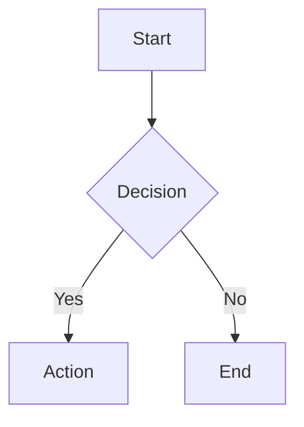

# Pandoc PDF Overlay

Adds a complete Markdown → PDF pipeline to your devcontainer, powered by Pandoc, XeLaTeX, and optional Mermaid diagram rendering.

## Features

- **Pandoc 3.x** — Latest release binary from GitHub (not the outdated apt version)
- **TeX Live / XeLaTeX** — Full Unicode-capable PDF engine (`texlive-xetex`, `texlive-fonts-extra`, `texlive-latex-extra`)
- **Quality fonts** — Carlito (body), JetBrains Mono (code), Noto Sans Symbols 2 (Unicode fallback), and Noto Color Emoji via system packages
    - Uses the `cross-distro-packages` feature with fallback package names for Carlito (`fonts-carlito|fonts-crosextra-carlito`)
- **`diagram.lua`** — Lua filter from [pandoc-ext/diagram](https://github.com/pandoc-ext/diagram) for rendering code-block diagrams
- **`emoji-fallback.lua`** — Built-in Lua filter that rewrites unsupported emoji and flag glyphs to plain-text placeholders for reliable XeLaTeX PDF builds
- **Mermaid CLI (`mmdc`)** — Installed when the `nodejs` overlay is present; skipped gracefully otherwise
- **`~/.pandoc/pandoc.yaml`** — Ready-to-use defaults file (XeLaTeX engine, font settings, table tweaks)
- **VS Code Extensions:** Markdown All in One (`yzhang.markdown-all-in-one`), markdownlint (`DavidAnson.vscode-markdownlint`)

## How It Works

System packages are installed through the `cross-distro-packages` feature, which handles package-manager detection and now supports fallback package names for distro variants. The setup script then downloads the official Pandoc `.deb` from GitHub releases (Pandoc 3.x is required for `diagram.lua`'s `Figure` AST element). Chromium is installed system-wide to serve as Puppeteer's browser for Mermaid headless rendering.

The pipeline:

```text
Markdown
  -> pandoc
    -> diagram.lua (Lua filter, optional)
      -> mmdc (Mermaid CLI, headless Chromium)
    -> XeLaTeX
      -> PDF
```

Font discovery is updated with `fc-cache -fv` after installation so XeLaTeX can locate the apt-installed fonts.

The generated defaults also enable an emoji fallback filter for LaTeX output. The overlay now installs Noto Color Emoji as well, which may improve glyph coverage in some contexts, but the fallback filter remains enabled because XeLaTeX still is not reliable for full emoji and flag rendering. The filter converts unsupported glyphs such as `🇵🇹` to `[PT]` and generic emoji such as `😀` to `[emoji]` before XeLaTeX runs, preventing the `Unicode character ... not set up for use with LaTeX` failure.

The setup script also installs a `/usr/local/bin/pandoc` wrapper that automatically applies `~/.pandoc/pandoc.yaml` unless you explicitly pass `-d` or `--defaults`. That makes plain commands like `pandoc doc.md -o doc.pdf` use the overlay defaults.

## Common Commands

### Basic PDF export

```bash
# Uses the installed wrapper, which applies ~/.pandoc/pandoc.yaml automatically
pandoc document.md -o document.pdf

# Override the output font on the fly
pandoc -d ~/.pandoc/pandoc.yaml -V mainfont="DejaVu Serif" document.md -o document.pdf
```

### PDF with Mermaid diagrams (requires nodejs overlay)

```bash
pandoc --lua-filter ~/.pandoc/filters/diagram.lua \
  document.md -o document.pdf
```

### Inspect installed fonts

```bash
fc-list | grep -i carlito
fc-list | grep -i jetbrains
fc-list | grep -i "noto sans symbols"
```

### Check Pandoc version

```bash
pandoc --version
```

## Mermaid Diagram Usage

Add fenced `mermaid` code blocks to your Markdown:

````markdown

````

Render with the `diagram.lua` filter:

```bash
pandoc -d ~/.pandoc/pandoc.yaml \
  --lua-filter ~/.pandoc/filters/diagram.lua \
  document.md -o document.pdf
```

The filter invokes `mmdc` for each `mermaid` block, producing a PNG that XeLaTeX embeds in the PDF. The Puppeteer configuration at `~/.config/mermaid/puppeteer-config.json` points `mmdc` at the system Chromium with `--no-sandbox`, which is required inside containers.

## Configuration

### Default `~/.pandoc/pandoc.yaml`

The setup script writes a defaults file with proven settings:

```yaml
pdf-engine: xelatex
filters:
    - /home/your-user/.pandoc/filters/emoji-fallback.lua

variables:
    mainfont: 'Carlito'
    monofont: 'JetBrains Mono'
    fallbackfont: 'Noto Sans Symbols 2'
    fontsize: 11pt
    linestretch: 1.15
    geometry:
        - top=16mm
        - bottom=16mm
        - left=14mm
        - right=14mm
    header-includes:
        - |
            \usepackage{etoolbox}
            \setlength{\tabcolsep}{3pt}
            \renewcommand{\arraystretch}{1.05}
            \AtBeginEnvironment{longtable}{\small}
            \AtBeginEnvironment{tabular}{\small}
```

### Per-project override

Create a `pandoc.yaml` in your project directory to override the defaults:

```yaml
# project/pandoc.yaml
pdf-engine: xelatex
variables:
    mainfont: 'DejaVu Serif'
    fontsize: 12pt
toc: true
toc-depth: 3
number-sections: true
filters:
    - /home/your-user/.pandoc/filters/emoji-fallback.lua
    - /home/your-user/.pandoc/filters/diagram.lua
```

Then build with:

```bash
pandoc -d pandoc.yaml document.md -o document.pdf
```

### Enable TOC and section numbering

Uncomment the relevant lines in `~/.pandoc/pandoc.yaml`:

```yaml
toc: true
toc-depth: 3
number-sections: true
```

### Enable Mermaid rendering by default

Uncomment in `~/.pandoc/pandoc.yaml`:

```yaml
filters:
    - /home/your-user/.pandoc/filters/emoji-fallback.lua
    - /home/your-user/.pandoc/filters/diagram.lua
```

## Unicode and Emoji

XeLaTeX handles normal Unicode text well with the bundled fonts. The overlay now also installs Noto Color Emoji, which can help with emoji coverage, but the failure mode in PDF builds is still usually emoji or regional-indicator flags, for example `🇵🇹`, which XeLaTeX may reject before font fallback can help.

The overlay now enables `~/.pandoc/filters/emoji-fallback.lua` by default for LaTeX output. It keeps normal Unicode text intact and rewrites unsupported emoji to plain-text placeholders:

- `🇵🇹 Porto` becomes `[PT] Porto`
- `😀` becomes `[emoji]`

If you want to experiment with more native emoji rendering, keep the installed emoji font and override the default Pandoc/LaTeX settings in a project-local `pandoc.yaml`, but the placeholder filter is still the reliable default for PDF generation.

## Use Cases

- **Architecture documentation** — Architecture Decision Records (ADRs), system design docs
- **API specifications** — OpenAPI-style documentation with code samples
- **Technical reports** — Multi-section documents with tables and diagrams
- **README to PDF** — Convert project READMEs to distributable PDF format

**Integrates well with:**

- `nodejs` overlay — Enables Mermaid CLI for diagram rendering
- `git-helpers` overlay — Commit generated PDFs alongside source Markdown
- `modern-cli-tools` overlay — Use `bat` to preview Markdown, `rg` to search documents

## Troubleshooting

### `xelatex: command not found`

TeX Live was not installed correctly. Re-run the setup script:

```bash
bash .devcontainer/scripts/setup-pandoc.sh
```

### Missing glyph warnings / blank characters in PDF

The font does not include that glyph. For common Unicode symbols, Noto Sans Symbols 2 covers most cases. Verify it is installed:

```bash
fc-list | grep -i "noto sans symbols 2"
```

If not found, rebuild the font cache:

```bash
sudo fc-cache -fv
```

### Wide tables overflow page margins

The `header-includes` in `pandoc.yaml` applies `\small` inside `longtable` and `tabular` environments. For very wide tables, also add `\tiny` or use column width constraints in your Markdown:

```markdown
| Col 1 | Col 2 | Col 3 |
| :---- | :---- | :---- |
| data  | data  | data  |
```

### Mermaid: Chromium crashes or `--no-sandbox` error

The Puppeteer config at `~/.config/mermaid/puppeteer-config.json` must set `--no-sandbox`:

```json
{
    "executablePath": "/usr/bin/chromium",
    "args": ["--no-sandbox", "--disable-setuid-sandbox"]
}
```

Verify the file exists and contains the correct content:

```bash
cat ~/.config/mermaid/puppeteer-config.json
```

### `mmdc` not found

The `nodejs` overlay must be selected to install Mermaid CLI. Check if Node.js is available:

```bash
node --version
npm --version
mmdc --version
```

If Node.js is present but `mmdc` is missing, install it manually:

```bash
npm install -g @mermaid-js/mermaid-cli
```

### Upgrading Pandoc

To upgrade to a newer Pandoc release, update `PANDOC_VERSION` in `setup.sh` and re-run it:

```bash
PANDOC_VERSION=3.7.0  # update as needed
ARCH=$(dpkg --print-architecture)
PANDOC_DEB="pandoc-${PANDOC_VERSION}-1-${ARCH}.deb"
curl -fsSL "https://github.com/jgm/pandoc/releases/download/${PANDOC_VERSION}/${PANDOC_DEB}" \
    -o "/tmp/${PANDOC_DEB}"
sudo dpkg -i "/tmp/${PANDOC_DEB}"
rm "/tmp/${PANDOC_DEB}"
```

## References

- [Pandoc releases](https://github.com/jgm/pandoc/releases)
- [pandoc-ext/diagram Lua filter](https://github.com/pandoc-ext/diagram)
- [Mermaid CLI](https://github.com/mermaid-js/mermaid-cli)
- [Puppeteer in containers](https://pptr.dev/troubleshooting#running-puppeteer-in-docker)
- [TeX Live packages](https://packages.debian.org/search?keywords=texlive)

**Related Overlays:**

- `nodejs` — Required for Mermaid diagram rendering via `mmdc`
- `git-helpers` — Secure Git operations for committing generated docs
- `modern-cli-tools` — Productivity tools for Markdown authoring workflows
