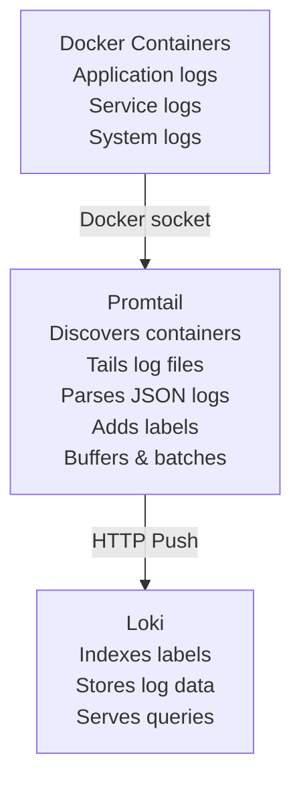

# Promtail Overlay

Log shipping agent that collects container logs and sends them to Loki for centralized log aggregation.

## Features

- **Promtail agent** - Grafana's official log shipping agent
- **Docker auto-discovery** - Automatically discovers and tails all container logs
- **Label extraction** - Extracts service names, container names, and custom labels
- **JSON parsing** - Automatically parses structured logs
- **Zero configuration** - Works out-of-box with minimal setup
- **Loki integration** - Ships logs directly to Loki

## How It Works

Promtail is a log shipping agent designed to collect logs from various sources and send them to Loki. In this overlay, Promtail monitors Docker containers and automatically ships their logs to Loki.

**Architecture:**


**What It Does:**
1. **Discovers Containers:** Uses Docker service discovery to find running containers
2. **Extracts Metadata:** Pulls container name, image, compose service, and project labels
3. **Tails Logs:** Streams logs from `/var/lib/docker/containers/`
4. **Parses Content:** Attempts JSON parsing for structured logs
5. **Ships to Loki:** Sends logs with rich labels to Loki for storage and querying

## Configuration

### Docker Socket Access

Promtail requires access to:
- **Docker socket** (`/var/run/docker.sock`) - For service discovery
- **Container logs** (`/var/lib/docker/containers`) - For reading log files

Both are mounted read-only for security.

### Environment Variables

The overlay includes a `.env.example` file. Copy it to `.env` and customize:

```bash
cd .devcontainer
cp .env.example .env
```

**Available variables:**
```bash
# Promtail version
PROMTAIL_VERSION=latest
```

### Label Extraction

Promtail automatically extracts these labels from containers:

| Label | Source | Example |
|-------|--------|---------|
| `container` | Container name | `my-app-1` |
| `image` | Container image | `node:18-alpine` |
| `service` | Compose service | `api` |
| `project` | Compose project | `my-project` |
| `job` | Fixed value | `docker` |
| `level` | Parsed from JSON | `info`, `error` |

### Customizing Configuration

Edit `promtail-config.yaml` in `.devcontainer/`:

```yaml
# Add custom pipeline stages
pipeline_stages:
  - match:
      selector: '{service="api"}'
      stages:
        - regex:
            expression: '(?P<timestamp>\S+) (?P<level>\S+) (?P<message>.*)'
        - labels:
            level:
```

## Common Commands

### Viewing Logs in Grafana

**Simple queries:**
```logql
# All logs from a specific service
{service="api"}

# Logs from a specific container
{container="my-app-1"}

# Error logs only
{level="error"}

# Logs from a specific image
{image=~"node:.*"}
```

**Advanced queries:**
```logql
# Rate of errors per minute
rate({level="error"}[1m])

# Logs containing specific text
{service="api"} |= "database connection"

# JSON field filtering
{service="api"} | json | userId="12345"

# Count logs by service
sum by(service) (count_over_time({job="docker"}[5m]))
```

### Checking Promtail Status

```bash
# Check if Promtail is running
docker ps | grep promtail

# View Promtail logs
docker logs promtail

# Check Promtail metrics (from inside dev container)
curl http://promtail:9080/metrics

# See which targets are being scraped
curl http://promtail:9080/targets
```

### Testing Log Collection

**Generate test logs:**
```bash
# Run a test container with logs
docker run --rm alpine sh -c "echo 'Test log message'"

# View in Grafana within seconds:
# {container="alpine"} |= "Test log"
```

**Verify logs are reaching Loki:**
```bash
# Check Loki ingestion
curl "http://loki:3100/loki/api/v1/query" \
  --data-urlencode 'query={job="docker"}' \
  --data-urlencode 'limit=10'
```

## Use Cases

- **Centralized logging** - Aggregate logs from all containers in one place
- **Debugging** - Track application behavior across services
- **Monitoring** - Alert on error patterns in logs
- **Audit trails** - Maintain searchable log history
- **Development** - Real-time log streaming during development

**Integrates well with:**
- Loki (required) - Log storage and querying
- Grafana (recommended) - Log visualization and exploration
- Prometheus (optional) - Correlate metrics with logs
- Tempo/Jaeger (optional) - Correlate traces with logs

## Log Format Support

### JSON Logs

**Application logging (Node.js):**
```javascript
const logger = require('pino')();

logger.info({ userId: '123', action: 'login' }, 'User logged in');
// Promtail extracts: level=info, userId=123
```

**Application logging (Python):**
```python
import logging
import json

logger = logging.getLogger(__name__)
logger.info(json.dumps({"userId": "123", "action": "login"}))
```

### Plain Text Logs

**Standard output:**
```bash
echo "2024-01-15 10:30:00 INFO User logged in"
# Promtail ships as-is with container labels
```

### Custom Parsing

Add regex patterns in `promtail-config.yaml`:

```yaml
pipeline_stages:
  - regex:
      expression: '^(?P<timestamp>\S+) (?P<level>\S+) (?P<message>.*)$'
  - labels:
      level:
  - timestamp:
      source: timestamp
      format: '2006-01-02 15:04:05'
```

## Troubleshooting

### Issue: No Logs Appearing

**Symptoms:**
- Promtail running but logs not in Loki

**Solutions:**
```bash
# Check Promtail can access Docker socket
docker exec promtail ls -la /var/run/docker.sock

# Check Promtail is discovering containers
docker logs promtail | grep "discovered targets"

# Verify Loki is reachable
docker exec promtail wget -O- http://loki:3100/ready

# Check Promtail positions file
docker exec promtail cat /tmp/positions.yaml
```

### Issue: "Permission Denied" on Docker Socket

**Symptoms:**
- Promtail logs show permission errors

**Solution:**
```yaml
# Update docker-compose.yml to add Promtail to docker group
services:
  promtail:
    user: "0:0"  # Run as root (development only)
```

⚠️ **Security Note:** Running as root is acceptable for development but not for production.

### Issue: High Memory Usage

**Symptoms:**
- Promtail consuming excessive memory

**Solutions:**
```yaml
# Reduce batch size in promtail-config.yaml
clients:
  - url: http://loki:3100/loki/api/v1/push
    batchwait: 1s
    batchsize: 102400  # Reduce from default 1MB
```

### Issue: Logs Not Parsed as JSON

**Symptoms:**
- JSON logs appear as plain text in Loki

**Solution:**
- Ensure application logs to stdout in JSON format
- Check `pipeline_stages` includes `json` stage
- Some apps need explicit JSON logging configuration

## Security Considerations

⚠️ **Docker Socket Access:** Promtail has read access to the Docker socket, which allows it to discover containers and read logs.

**Risks:**
- Read access to all container logs (may contain sensitive data)
- Docker API access (read-only)

**Mitigation:**
- Mounted as read-only (`:ro`)
- Development environment only
- Filter sensitive fields in pipeline stages:

```yaml
pipeline_stages:
  - replace:
      expression: 'password=\S+'
      replace: 'password=***'
```

## Performance Tuning

**For high-volume logging:**

```yaml
# promtail-config.yaml
clients:
  - url: http://loki:3100/loki/api/v1/push
    batchwait: 500ms    # Batch more frequently
    batchsize: 1048576  # Larger batches
    max_backoff: 5m     # Retry backoff
    max_retries: 10     # Retry attempts
```

**Limit log collection:**

```yaml
# Only collect logs from specific services
scrape_configs:
  - job_name: docker
    docker_sd_configs:
      - host: unix:///var/run/docker.sock
    relabel_configs:
      # Drop logs from monitoring containers
      - source_labels: ['__meta_docker_container_label_com_docker_compose_service']
        regex: '(promtail|loki|prometheus)'
        action: drop
```

## References

- [Official Promtail Documentation](https://grafana.com/docs/loki/latest/clients/promtail/)
- [Promtail Configuration](https://grafana.com/docs/loki/latest/clients/promtail/configuration/)
- [LogQL Query Language](https://grafana.com/docs/loki/latest/logql/)
- [Docker Service Discovery](https://grafana.com/docs/loki/latest/clients/promtail/configuration/#docker_sd_configs)

**Related Overlays:**
- `loki` - Required log storage backend
- `grafana` - Recommended for log visualization
- `prometheus` - Optional for metrics correlation
- `tempo` - Optional for trace-log correlation
