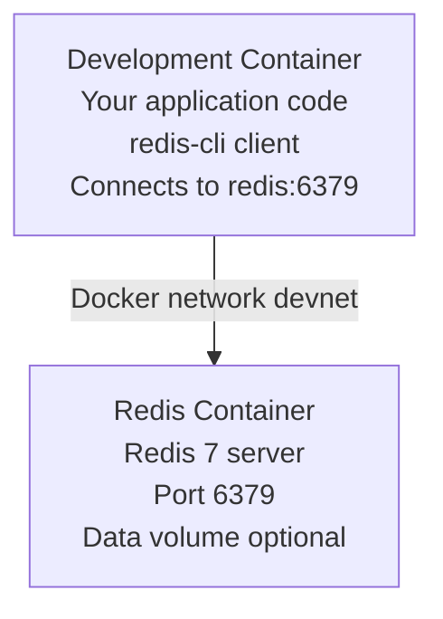

# Redis Overlay

Redis 7 in-memory data store for caching, session management, and real-time applications.

## Features

- **Redis 7** - Latest major version with modern features
- **Pre-configured** - Ready to use with sensible defaults
- **Docker Compose service** - Runs as separate container
- **Persistent storage** - Optional data persistence
- **Redis CLI** - Command-line interface for interaction
- **Environment configuration** - Customizable via `.env` file

## How It Works

This overlay adds a Redis 7 server as a separate Docker Compose service. Redis runs in its own container and is accessible from your development container via the hostname `redis`.

**Architecture:**


## Configuration

### Environment Variables

The overlay includes a `.env.example` file. Copy it to `.env` and customize:

```bash
cd .devcontainer
cp .env.example .env
```

**Default values (.env.example):**
```bash
# Redis Configuration
REDIS_PORT=6379
REDIS_PASSWORD=
```

⚠️ **Note:** Redis runs without password by default for development. Set `REDIS_PASSWORD` for production-like environments.

### Port Configuration

The default port (6379) can be changed via the `--port-offset` option:

```bash
# Offset all ports by 100
container-superposition --port-offset 100

# Redis will be on 6479 instead of 6379
```

## Connection Information

### From Development Container

```bash
# Hostname: redis (Docker Compose service name)
# Port: 6379
# Password: (empty by default, or value from .env)

# Connection string (no password)
redis://redis:6379

# Connection string (with password)
redis://:password@redis:6379
```

### From Host Machine

```bash
# Hostname: localhost
# Port: 6379 (or 6379 + port-offset)
# Password: (empty or value from .env)

# Connection string
redis://localhost:6379
```

## Common Commands

### Using redis-cli

The Redis CLI is pre-installed in your development container.

```bash
# Connect to Redis
redis-cli -h redis

# Connect with password
redis-cli -h redis -a password

# Execute single command
redis-cli -h redis PING

# Execute from stdin
echo "SET mykey myvalue" | redis-cli -h redis

# Execute commands from file
redis-cli -h redis < commands.txt
```

### Basic Operations

```bash
# Test connection
PING
# Response: PONG

# Set key-value
SET mykey "Hello Redis"

# Get value
GET mykey

# Set with expiration (seconds)
SETEX session:123 3600 "user_data"

# Set if not exists
SETNX mykey "value"

# Delete key
DEL mykey

# Check if key exists
EXISTS mykey

# Get key type
TYPE mykey

# Set expiration
EXPIRE mykey 60

# Get time to live
TTL mykey

# Rename key
RENAME oldkey newkey

# Get all keys (⚠️ don't use in production with many keys)
KEYS *

# Scan keys (better for production)
SCAN 0 MATCH user:* COUNT 100
```

### Data Types

#### Strings

```bash
# Set string
SET user:1:name "John Doe"

# Get string
GET user:1:name

# Increment
SET counter 0
INCR counter
INCRBY counter 10

# Append
APPEND user:1:name " Jr."

# Get string length
STRLEN user:1:name

# Multiple set/get
MSET key1 "value1" key2 "value2" key3 "value3"
MGET key1 key2 key3
```

#### Lists

```bash
# Push to list (right)
RPUSH mylist "item1" "item2" "item3"

# Push to list (left)
LPUSH mylist "item0"

# Get range
LRANGE mylist 0 -1

# Pop from list (right)
RPOP mylist

# Pop from list (left)
LPOP mylist

# Get length
LLEN mylist

# Get by index
LINDEX mylist 0

# Trim list
LTRIM mylist 0 99
```

#### Sets

```bash
# Add members
SADD myset "member1" "member2" "member3"

# Get all members
SMEMBERS myset

# Check membership
SISMEMBER myset "member1"

# Remove member
SREM myset "member1"

# Get set size
SCARD myset

# Set operations
SADD set1 "a" "b" "c"
SADD set2 "b" "c" "d"
SINTER set1 set2  # Intersection
SUNION set1 set2  # Union
SDIFF set1 set2   # Difference

# Random member
SRANDMEMBER myset

# Pop random member
SPOP myset
```

#### Sorted Sets

```bash
# Add members with scores
ZADD leaderboard 100 "player1" 200 "player2" 150 "player3"

# Get range by rank
ZRANGE leaderboard 0 -1

# Get range with scores
ZRANGE leaderboard 0 -1 WITHSCORES

# Get range by score
ZRANGEBYSCORE leaderboard 100 200

# Get rank
ZRANK leaderboard "player1"

# Get score
ZSCORE leaderboard "player1"

# Increment score
ZINCRBY leaderboard 50 "player1"

# Remove member
ZREM leaderboard "player1"

# Get size
ZCARD leaderboard

# Count by score range
ZCOUNT leaderboard 100 200
```

#### Hashes

```bash
# Set hash field
HSET user:1 name "John" email "john@example.com" age 30

# Get hash field
HGET user:1 name

# Get all hash fields
HGETALL user:1

# Get multiple fields
HMGET user:1 name email

# Delete field
HDEL user:1 age

# Check field exists
HEXISTS user:1 name

# Get all keys
HKEYS user:1

# Get all values
HVALS user:1

# Get field count
HLEN user:1

# Increment field
HINCRBY user:1 age 1
```

### Advanced Operations

#### Transactions

```bash
# Begin transaction
MULTI

# Queue commands
SET key1 "value1"
SET key2 "value2"
INCR counter

# Execute transaction
EXEC

# Discard transaction
DISCARD
```

#### Pub/Sub

```bash
# Subscribe to channel (in one redis-cli session)
SUBSCRIBE mychannel

# Publish message (in another redis-cli session)
PUBLISH mychannel "Hello subscribers!"

# Pattern subscription
PSUBSCRIBE news:*

# Unsubscribe
UNSUBSCRIBE mychannel
```

#### Pipelining

```bash
# Multiple commands in one request (from shell)
(echo "SET key1 value1"; echo "GET key1"; echo "INCR counter") | redis-cli -h redis
```

### Database Management

```bash
# Select database (0-15 by default)
SELECT 1

# Flush current database
FLUSHDB

# Flush all databases (⚠️ destructive)
FLUSHALL

# Get database size
DBSIZE

# Save to disk (blocking)
SAVE

# Save to disk (non-blocking)
BGSAVE

# Get server info
INFO

# Get specific info section
INFO stats
INFO memory
INFO replication

# Monitor commands in real-time
MONITOR

# Get configuration
CONFIG GET maxmemory
CONFIG GET *

# Set configuration (runtime)
CONFIG SET maxmemory 256mb

# Last save time
LASTSAVE
```

## Application Integration

### Node.js (ioredis)

```bash
npm install ioredis
```

```javascript
const Redis = require('ioredis');

const redis = new Redis({
  host: 'redis',
  port: 6379,
  // password: 'your-password',  // if configured
});

// Set and get
await redis.set('key', 'value');
const value = await redis.get('key');

// Set with expiration
await redis.setex('session:123', 3600, 'user_data');

// Hash operations
await redis.hset('user:1', 'name', 'John', 'email', 'john@example.com');
const user = await redis.hgetall('user:1');

// List operations
await redis.rpush('queue', 'job1', 'job2');
const job = await redis.lpop('queue');

// Pub/Sub
redis.subscribe('notifications', (err, count) => {
  console.log(`Subscribed to ${count} channel(s)`);
});

redis.on('message', (channel, message) => {
  console.log(`Received: ${message} from ${channel}`);
});
```

### Python (redis-py)

```bash
pip install redis
```

```python
import redis

r = redis.Redis(
    host='redis',
    port=6379,
    decode_responses=True,
    # password='your-password',  # if configured
)

# Set and get
r.set('key', 'value')
value = r.get('key')

# Set with expiration
r.setex('session:123', 3600, 'user_data')

# Hash operations
r.hset('user:1', mapping={'name': 'John', 'email': 'john@example.com'})
user = r.hgetall('user:1')

# List operations
r.rpush('queue', 'job1', 'job2')
job = r.lpop('queue')

# Pub/Sub
pubsub = r.pubsub()
pubsub.subscribe('notifications')

for message in pubsub.listen():
    print(f"Received: {message}")
```

### .NET (StackExchange.Redis)

```bash
dotnet add package StackExchange.Redis
```

```csharp
using StackExchange.Redis;

var redis = ConnectionMultiplexer.Connect("redis:6379");
var db = redis.GetDatabase();

// Set and get
await db.StringSetAsync("key", "value");
var value = await db.StringGetAsync("key");

// Set with expiration
await db.StringSetAsync("session:123", "user_data", TimeSpan.FromHours(1));

// Hash operations
await db.HashSetAsync("user:1", new HashEntry[] {
    new HashEntry("name", "John"),
    new HashEntry("email", "john@example.com")
});
var user = await db.HashGetAllAsync("user:1");

// List operations
await db.ListRightPushAsync("queue", "job1");
var job = await db.ListLeftPopAsync("queue");

// Pub/Sub
var subscriber = redis.GetSubscriber();
await subscriber.SubscribeAsync("notifications", (channel, message) => {
    Console.WriteLine($"Received: {message}");
});
```

### Go (go-redis)

```bash
go get github.com/redis/go-redis/v9
```

```go
package main

import (
    "context"
    "github.com/redis/go-redis/v9"
    "time"
)

func main() {
    ctx := context.Background()

    rdb := redis.NewClient(&redis.Options{
        Addr: "redis:6379",
        // Password: "your-password",  // if configured
        DB: 0,
    })

    // Set and get
    rdb.Set(ctx, "key", "value", 0)
    val, _ := rdb.Get(ctx, "key").Result()

    // Set with expiration
    rdb.Set(ctx, "session:123", "user_data", time.Hour)

    // Hash operations
    rdb.HSet(ctx, "user:1", "name", "John", "email", "john@example.com")
    user, _ := rdb.HGetAll(ctx, "user:1").Result()

    // List operations
    rdb.RPush(ctx, "queue", "job1", "job2")
    job, _ := rdb.LPop(ctx, "queue").Result()

    // Pub/Sub
    pubsub := rdb.Subscribe(ctx, "notifications")
    ch := pubsub.Channel()

    for msg := range ch {
        println("Received:", msg.Payload)
    }
}
```

## Use Cases

### Caching
- Page caching
- API response caching
- Database query caching
- Computed result caching

### Session Management
- User session storage
- JWT token storage
- Shopping cart data
- Temporary user data

### Real-time Features
- Live notifications via Pub/Sub
- Real-time analytics
- Message queues
- Chat applications

### Rate Limiting
- API rate limiting
- Login attempt tracking
- Request throttling

### Leaderboards and Counters
- Gaming leaderboards
- Analytics counters
- Social media likes/views
- Real-time statistics

## Persistence Options

### RDB (Redis Database Backup)

Periodic snapshots to disk:

```bash
# Save now
SAVE  # blocking
BGSAVE  # non-blocking

# Configure automatic snapshots
# Add to redis.conf:
save 900 1      # Save after 900 sec if at least 1 key changed
save 300 10     # Save after 300 sec if at least 10 keys changed
save 60 10000   # Save after 60 sec if at least 10000 keys changed
```

### AOF (Append Only File)

Log every write operation:

```bash
# Enable AOF (add to redis.conf)
appendonly yes
appendfilename "appendonly.aof"

# Sync strategy
appendfsync everysec  # Good balance
# appendfsync always  # Slower, safest
# appendfsync no      # Fastest, less safe
```

## Monitoring and Debugging

```bash
# Real-time monitoring
MONITOR

# Get server statistics
INFO stats
INFO memory
INFO cpu
INFO clients

# Slow query log
SLOWLOG GET 10

# Client list
CLIENT LIST

# Memory usage of key
MEMORY USAGE mykey

# Memory stats
MEMORY STATS
```

## Troubleshooting

### Cannot connect to Redis

```bash
# Check if Redis container is running
docker-compose ps

# Check Redis logs
docker-compose logs redis

# Test connection
redis-cli -h redis PING

# Check network connectivity
ping redis
```

### Authentication errors

```bash
# If password is set, use -a flag
redis-cli -h redis -a your-password PING

# Or use AUTH command
redis-cli -h redis
AUTH your-password
PING
```

### Out of memory

```bash
# Check memory usage
redis-cli -h redis INFO memory

# Check maxmemory setting
redis-cli -h redis CONFIG GET maxmemory

# Set maxmemory policy
redis-cli -h redis CONFIG SET maxmemory-policy allkeys-lru
```

### Data not persisting

```bash
# Check if persistence is enabled
redis-cli -h redis CONFIG GET save

# Manually save
redis-cli -h redis BGSAVE

# Check last save time
redis-cli -h redis LASTSAVE
```

## Performance Tuning

### Memory Optimization

```bash
# Set eviction policy
CONFIG SET maxmemory-policy allkeys-lru

# Policies:
# - noeviction: Return error when memory limit reached
# - allkeys-lru: Evict least recently used keys
# - allkeys-lfu: Evict least frequently used keys
# - volatile-lru: Evict LRU keys with expire set
# - volatile-lfu: Evict LFU keys with expire set
# - volatile-ttl: Evict keys with shortest TTL
# - volatile-random: Evict random keys with expire set
# - allkeys-random: Evict random keys
```

### Connection Pooling

Always use connection pooling in production applications to reuse connections and reduce overhead.

## Best Practices

1. **Use appropriate data structures** - Choose the right Redis data type for your use case
2. **Set expiration times** - Use TTL to automatically clean up old data
3. **Use pipelining** - Batch commands for better performance
4. **Avoid KEYS in production** - Use SCAN instead for large datasets
5. **Monitor memory usage** - Set maxmemory and eviction policies
6. **Use connection pooling** - Reuse connections in applications
7. **Enable persistence** - Use RDB or AOF for data durability
8. **Secure with password** - Set REDIS_PASSWORD for production
9. **Use transactions** - Use MULTI/EXEC for atomic operations
10. **Regular backups** - Backup RDB/AOF files regularly

## Security Considerations

1. **Set password** - Configure REDIS_PASSWORD in production
2. **Bind to localhost** - Don't expose Redis to public internet
3. **Use firewall** - Restrict access to trusted IP addresses
4. **Disable dangerous commands** - Rename or disable FLUSHALL, FLUSHDB, CONFIG
5. **Regular updates** - Keep Redis updated for security patches
6. **Use TLS** - Enable TLS encryption for sensitive data

## Related Overlays

- **nodejs** - For Node.js applications with Redis
- **python** - For Python applications (Django, Flask, Celery)
- **dotnet** - For .NET applications with StackExchange.Redis
- **postgres** - Often used together (Redis for cache, PostgreSQL for data)
- **prometheus** - For Redis monitoring with redis_exporter

## Additional Resources

- [Redis Documentation](https://redis.io/docs/)
- [Redis Commands Reference](https://redis.io/commands/)
- [Redis Best Practices](https://redis.io/docs/manual/patterns/)
- [Redis Data Types](https://redis.io/docs/manual/data-types/)
- [Redis Persistence](https://redis.io/docs/manual/persistence/)

## Notes

- This overlay **requires compose stack** (uses docker-compose)
- Redis runs on port **6379** (configurable with port-offset)
- Data persistence is **optional** (configure RDB/AOF as needed)
- Use hostname **`redis`** from development container
- Use **`localhost`** from host machine
