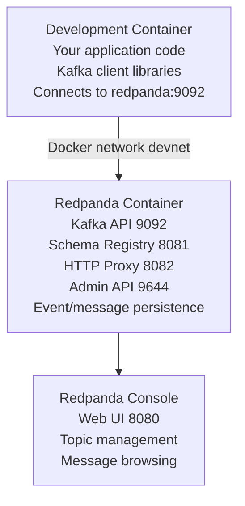

# Redpanda Overlay

Kafka-compatible event streaming platform optimized for local development - lightweight, fast, and no Zookeeper required.

## Features

- **Redpanda** - Kafka-compatible streaming platform (lighter and faster than Apache Kafka)
- **No Zookeeper** - Simpler architecture, easier local development
- **Redpanda Console** - Modern web UI for managing topics, messages, and consumers
- **Kafka API** - 100% compatible with Kafka clients and tools (port 9092)
- **Schema Registry** - Built-in schema management (port 8081)
- **HTTP Proxy** - REST API for producing and consuming (port 8082)
- **Admin API** - Management and monitoring (port 9644)
- **Docker Compose service** - Runs as separate container
- **Environment configuration** - Customizable via `.env` file

## How It Works

This overlay adds Redpanda as a Docker Compose service that provides Kafka-compatible event streaming. Redpanda is designed to be a drop-in replacement for Kafka but optimized for local development with lower resource requirements.

**Architecture:**


## Configuration

### Environment Variables

The overlay includes a `.env.example` file. Copy it to `.env` and customize:

```bash
cd .devcontainer
cp .env.example .env
```

**Default values (.env.example):**
```bash
# Redpanda Configuration
REDPANDA_VERSION=latest
REDPANDA_KAFKA_PORT=9092
REDPANDA_SCHEMA_REGISTRY_PORT=8081
REDPANDA_PROXY_PORT=8082
REDPANDA_ADMIN_PORT=9644

# Redpanda Console Configuration
REDPANDA_CONSOLE_VERSION=latest
REDPANDA_CONSOLE_PORT=8080
```

### Port Configuration

Default ports can be changed via the `--port-offset` option:

```bash
# Offset all ports by 100
container-superposition --port-offset 100

# Redpanda will be on:
# - Kafka API: 9192 (instead of 9092)
# - Console UI: 8180 (instead of 8080)
```

## Connection Information

### From Development Container

**Kafka API:**
```bash
# Hostname: redpanda (Docker Compose service name)
# Port: 9092
# Protocol: Kafka wire protocol

# Bootstrap servers
redpanda:9092
```

**Schema Registry:**
```
http://redpanda:8081
```

**HTTP Proxy:**
```
http://redpanda:8082
```

**Console UI:**
```
http://redpanda-console:8080
```

### From Host Machine

**Kafka API:**
```bash
# Hostname: localhost
# Port: 9092 (or 9092 + port-offset)

# Bootstrap servers
localhost:9092
```

**Console UI:**
```
http://localhost:8080
```

## Common Commands

### Using Redpanda Console UI

The Redpanda Console provides:
- Topic creation and management
- Message browsing and publishing
- Consumer group monitoring
- Schema registry management
- Cluster health monitoring

Access it at: `http://localhost:8080`

### Using rpk CLI (via docker exec)

```bash
# Cluster info
docker exec redpanda rpk cluster info

# Cluster health
docker exec redpanda rpk cluster health

# List topics
docker exec redpanda rpk topic list

# Create a topic
docker exec redpanda rpk topic create my-topic --partitions 3 --replicas 1

# Describe topic
docker exec redpanda rpk topic describe my-topic

# Produce messages
docker exec -it redpanda rpk topic produce my-topic
# Type messages and press Ctrl+D to finish

# Consume messages
docker exec redpanda rpk topic consume my-topic --offset start

# Delete topic
docker exec redpanda rpk topic delete my-topic
```

### Managing Consumer Groups

```bash
# List consumer groups
docker exec redpanda rpk group list

# Describe consumer group
docker exec redpanda rpk group describe my-group

# Delete consumer group
docker exec redpanda rpk group delete my-group
```

### Schema Registry

```bash
# List schemas
curl http://localhost:8081/subjects

# Get schema versions
curl http://localhost:8081/subjects/my-topic-value/versions

# Register schema
curl -X POST http://localhost:8081/subjects/my-topic-value/versions \
  -H 'Content-Type: application/vnd.schemaregistry.v1+json' \
  -d '{"schema": "{\"type\":\"record\",\"name\":\"User\",\"fields\":[{\"name\":\"name\",\"type\":\"string\"}]}"}'
```

## Application Integration

### Node.js Example

Install KafkaJS (Kafka client):
```bash
npm install kafkajs
```

**Producer (producer.js):**
```javascript
const { Kafka } = require('kafkajs');

const kafka = new Kafka({
  clientId: 'my-app',
  brokers: ['redpanda:9092']
});

const producer = kafka.producer();

async function run() {
  await producer.connect();

  await producer.send({
    topic: 'my-topic',
    messages: [
      { key: 'key1', value: 'Hello Redpanda!' },
      { key: 'key2', value: 'Event streaming is awesome' },
    ],
  });

  console.log('Messages sent successfully');
  await producer.disconnect();
}

run().catch(console.error);
```

**Consumer (consumer.js):**
```javascript
const { Kafka } = require('kafkajs');

const kafka = new Kafka({
  clientId: 'my-app',
  brokers: ['redpanda:9092']
});

const consumer = kafka.consumer({ groupId: 'my-group' });

async function run() {
  await consumer.connect();
  await consumer.subscribe({ topic: 'my-topic', fromBeginning: true });

  await consumer.run({
    eachMessage: async ({ topic, partition, message }) => {
      console.log({
        topic,
        partition,
        offset: message.offset,
        key: message.key?.toString(),
        value: message.value?.toString(),
      });
    },
  });
}

run().catch(console.error);
```

### Python Example

Install confluent-kafka (Kafka client):
```bash
pip install confluent-kafka
```

**Producer (producer.py):**
```python
from confluent_kafka import Producer

conf = {
    'bootstrap.servers': 'redpanda:9092',
    'client.id': 'my-app'
}

producer = Producer(conf)

def delivery_report(err, msg):
    if err is not None:
        print(f'Message delivery failed: {err}')
    else:
        print(f'Message delivered to {msg.topic()} [{msg.partition()}]')

# Produce messages
producer.produce('my-topic', key='key1', value='Hello Redpanda!', callback=delivery_report)
producer.produce('my-topic', key='key2', value='Event streaming is awesome', callback=delivery_report)

# Wait for messages to be delivered
producer.flush()
```

**Consumer (consumer.py):**
```python
from confluent_kafka import Consumer

conf = {
    'bootstrap.servers': 'redpanda:9092',
    'group.id': 'my-group',
    'auto.offset.reset': 'earliest'
}

consumer = Consumer(conf)
consumer.subscribe(['my-topic'])

try:
    while True:
        msg = consumer.poll(1.0)

        if msg is None:
            continue
        if msg.error():
            print(f'Consumer error: {msg.error()}')
            continue

        print(f'Received message: {msg.value().decode("utf-8")}')

except KeyboardInterrupt:
    pass
finally:
    consumer.close()
```

### Go Example

Install sarama (Kafka client):
```bash
go get github.com/IBM/sarama
```

**Producer (producer.go):**
```go
package main

import (
    "fmt"
    "log"

    "github.com/IBM/sarama"
)

func main() {
    config := sarama.NewConfig()
    config.Producer.Return.Successes = true

    producer, err := sarama.NewSyncProducer([]string{"redpanda:9092"}, config)
    if err != nil {
        log.Fatal(err)
    }
    defer producer.Close()

    message := &sarama.ProducerMessage{
        Topic: "my-topic",
        Key:   sarama.StringEncoder("key1"),
        Value: sarama.StringEncoder("Hello Redpanda!"),
    }

    partition, offset, err := producer.SendMessage(message)
    if err != nil {
        log.Fatal(err)
    }

    fmt.Printf("Message sent to partition %d at offset %d\n", partition, offset)
}
```

**Consumer (consumer.go):**
```go
package main

import (
    "context"
    "fmt"
    "log"

    "github.com/IBM/sarama"
)

func main() {
    config := sarama.NewConfig()
    config.Consumer.Return.Errors = true

    consumer, err := sarama.NewConsumerGroup([]string{"redpanda:9092"}, "my-group", config)
    if err != nil {
        log.Fatal(err)
    }
    defer consumer.Close()

    handler := ConsumerGroupHandler{}

    ctx := context.Background()
    for {
        if err := consumer.Consume(ctx, []string{"my-topic"}, &handler); err != nil {
            log.Fatal(err)
        }
    }
}

type ConsumerGroupHandler struct{}

func (h ConsumerGroupHandler) Setup(_ sarama.ConsumerGroupSession) error   { return nil }
func (h ConsumerGroupHandler) Cleanup(_ sarama.ConsumerGroupSession) error { return nil }

func (h ConsumerGroupHandler) ConsumeClaim(session sarama.ConsumerGroupSession, claim sarama.ConsumerGroupClaim) error {
    for message := range claim.Messages() {
        fmt.Printf("Message: topic=%s partition=%d offset=%d key=%s value=%s\n",
            message.Topic, message.Partition, message.Offset,
            string(message.Key), string(message.Value))
        session.MarkMessage(message, "")
    }
    return nil
}
```

### .NET Example

Install Confluent.Kafka:
```bash
dotnet add package Confluent.Kafka
```

**Producer (Producer.cs):**
```csharp
using Confluent.Kafka;

var config = new ProducerConfig
{
    BootstrapServers = "redpanda:9092",
    ClientId = "my-app"
};

using var producer = new ProducerBuilder<string, string>(config).Build();

var message = new Message<string, string>
{
    Key = "key1",
    Value = "Hello Redpanda!"
};

var result = await producer.ProduceAsync("my-topic", message);
Console.WriteLine($"Message delivered to {result.TopicPartitionOffset}");
```

**Consumer (Consumer.cs):**
```csharp
using Confluent.Kafka;

var config = new ConsumerConfig
{
    BootstrapServers = "redpanda:9092",
    GroupId = "my-group",
    AutoOffsetReset = AutoOffsetReset.Earliest
};

using var consumer = new ConsumerBuilder<string, string>(config).Build();
consumer.Subscribe("my-topic");

var cts = new CancellationTokenSource();
Console.CancelKeyPress += (_, e) => {
    e.Cancel = true;
    cts.Cancel();
};

try
{
    while (true)
    {
        var result = consumer.Consume(cts.Token);
        Console.WriteLine($"Received: {result.Message.Value}");
    }
}
catch (OperationCanceledException)
{
    consumer.Close();
}
```

## Use Cases

- **Event Streaming** - Real-time event processing and stream processing
- **Log Aggregation** - Centralized logging from multiple services
- **Data Pipelines** - Move data between systems with exactly-once semantics
- **Metrics Collection** - High-throughput metrics streaming
- **Change Data Capture** - Stream database changes to other systems
- **Event Sourcing** - Store and replay application events
- **Message Queuing** - Kafka-compatible messaging (alternative to RabbitMQ)
- **Real-Time Analytics** - Process streaming data in real-time

**Integrates well with:**
- Language overlays (Node.js, Python, Go, .NET, Java) with Kafka clients
- Observability stack (OTEL Collector, Prometheus) for metrics and monitoring
- Microservice architectures requiring event streaming

## Redpanda vs Kafka

| Feature | Redpanda | Apache Kafka |
|---------|----------|--------------|
| **Zookeeper** | ❌ Not required | ✅ Required (adds complexity) |
| **Resource Usage** | ✅ Lower (1-2 GB RAM) | ⚠️ Higher (4+ GB RAM) |
| **Startup Time** | ✅ Fast (~5 seconds) | ⚠️ Slower (~30 seconds) |
| **API Compatibility** | ✅ 100% Kafka compatible | ✅ Native |
| **Management UI** | ✅ Modern Redpanda Console | ⚠️ Requires separate tools |
| **Schema Registry** | ✅ Built-in | ⚠️ Separate service |
| **Production Ready** | ✅ Yes | ✅ Yes |
| **Local Development** | ✅ Optimized | ⚠️ Resource heavy |

**Recommendation:** Use Redpanda for local development, testing, and smaller deployments. It's faster, lighter, and easier to operate than Kafka while maintaining full compatibility.

## Messaging Patterns

### Event Streaming
```
Producer1 → Topic (partitioned) → Consumer Group 1
Producer2 →                     → Consumer Group 2
Producer3 →                     → Consumer Group 3
```
Multiple consumers process events independently with ordering guarantees per partition.

### Event Sourcing
```
Commands → Event Store Topic → Event Handlers
                             → Projections
                             → Snapshots
```
Store all state changes as events for replay and audit trail.

### Change Data Capture
```
Database → CDC Connector → Kafka Topic → Downstream Systems
```
Stream database changes in real-time.

### Stream Processing
```
Input Topic → Stream Processor → Output Topic
              (filter, map,
               aggregate,
               join)
```
Transform and enrich events in real-time.

## Troubleshooting

### Service Not Starting

**Check logs:**
```bash
docker logs redpanda
docker logs redpanda-console
```

**Common issues:**
- Port conflicts (9092, 8080, or other ports in use)
- Insufficient memory (Redpanda needs at least 1 GB)
- Volume permission issues

### Cannot Connect to Redpanda

**Verify service is running:**
```bash
docker ps | grep redpanda
```

**Check health:**
```bash
docker exec redpanda rpk cluster health
```

**Test connectivity:**
```bash
# From dev container
curl http://redpanda:9644/v1/cluster/health_overview
```

### Console UI Not Loading

**Check console logs:**
```bash
docker logs redpanda-console
```

**Verify Redpanda is healthy:**
The console depends on Redpanda being fully started.

**Check port forwarding:**
Ensure port 8080 is forwarded in devcontainer configuration.

### Messages Not Being Consumed

**Check consumer group status:**
```bash
docker exec redpanda rpk group describe my-group
```

**Verify topic exists:**
```bash
docker exec redpanda rpk topic list
```

**Check topic configuration:**
```bash
docker exec redpanda rpk topic describe my-topic
```

### Performance Issues

**Monitor cluster health:**
```bash
docker exec redpanda rpk cluster health
```

**Increase memory allocation:**
Edit `docker-compose.yml` and increase `--memory` flag.

**Check partition distribution:**
```bash
docker exec redpanda rpk topic describe my-topic
```

## Security Considerations

⚠️ **Development Configuration:**
- No authentication enabled by default
- Suitable for local development only
- Do not expose ports publicly

**Production Recommendations:**
- Enable SASL authentication
- Use TLS for encryption
- Configure ACLs for authorization
- Enable audit logging
- Regularly update Redpanda version
- Monitor security advisories

**Enabling Authentication (production):**
Redpanda supports SASL/SCRAM authentication. See [Redpanda Security Documentation](https://docs.redpanda.com/docs/manage/security/) for configuration details.

## Related Overlays

**Alternative Messaging Systems:**
- `rabbitmq` - AMQP message broker (better for task queues and RPC)
- `nats` - Lightweight pub/sub (faster but simpler than Kafka)

**Complementary Overlays:**
- Language overlays - Application development with Kafka clients
- `otel-collector` - Distributed tracing and metrics
- `prometheus` - Metrics collection from Redpanda
- `grafana` - Visualization of streaming metrics

## Additional Resources

- [Official Redpanda Documentation](https://docs.redpanda.com/)
- [Redpanda vs Kafka Comparison](https://redpanda.com/blog/redpanda-vs-apache-kafka)
- [Redpanda Console Documentation](https://docs.redpanda.com/docs/manage/console/)
- [rpk CLI Reference](https://docs.redpanda.com/docs/reference/rpk/)
- [Kafka Compatibility](https://docs.redpanda.com/docs/reference/kafka-api/)

## Notes

- Redpanda is 100% compatible with Kafka clients and tools
- No Zookeeper required - simpler architecture
- Optimized for low latency and high throughput
- Built-in Schema Registry compatible with Confluent Schema Registry
- Supports Kafka transactions and exactly-once semantics
- Default retention is 7 days (configurable per topic)
- Single-node mode suitable for development
- Console UI provides modern, intuitive interface
- Written in C++ for performance (vs Java for Kafka)
- Supports compacted topics for key-value stores
