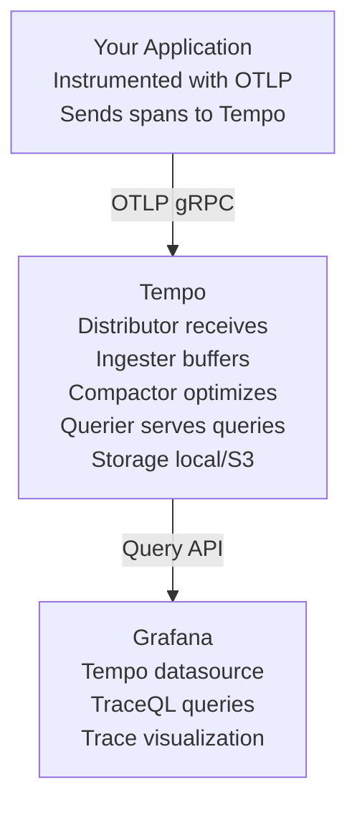

# Tempo Overlay

Modern distributed tracing backend from Grafana Labs - a lightweight alternative to Jaeger.

## Features

- **Grafana Tempo** - Scalable distributed tracing backend
- **OTLP native** - Native OpenTelemetry Protocol support
- **Cost-efficient** - Minimal resource footprint
- **S3-compatible storage** - Works with local filesystem or object storage
- **TraceQL** - Powerful query language for traces
- **Grafana integration** - Seamless integration with Grafana dashboards

## How It Works

Tempo is a high-volume, minimal-dependency distributed tracing backend designed to be cost-effective and easy to operate. Unlike Jaeger, Tempo doesn't require a database - it stores traces directly to object storage.

**Architecture:**



**Key Differences from Jaeger:**

- **Storage:** Tempo uses object storage (S3/local) instead of in-memory/database
- **Resource Usage:** Lower memory footprint, better for high-volume tracing
- **Query Language:** TraceQL instead of UI-based filtering
- **Integration:** Built for Grafana ecosystem

## Configuration

### Ports

- `3200` - Tempo HTTP API and metrics endpoint
- `4317` - OTLP gRPC receiver

### Environment Variables

The overlay includes a `.env.example` file. Copy it to `.env` and customize:

```bash
cd .devcontainer
cp .env.example .env
```

**Available variables:**

```bash
# Tempo version
TEMPO_VERSION=latest

# Tempo ports
TEMPO_HTTP_PORT=3200
TEMPO_OTLP_GRPC_PORT=4317
```

### Port Configuration

Ports can be changed via `--port-offset`:

```bash
# Offset all ports by 100
container-superposition --port-offset 100
# Tempo will be on ports 3300 (HTTP) and 4417 (OTLP)
```

## Common Commands

### Sending Traces

**Using OpenTelemetry Collector:**

```yaml
# otel-collector config
exporters:
    otlp/tempo:
        endpoint: tempo:4317
        tls:
            insecure: true

service:
    pipelines:
        traces:
            exporters: [otlp/tempo]
```

**Direct instrumentation (Node.js example):**

```javascript
const { OTLPTraceExporter } = require('@opentelemetry/exporter-trace-otlp-grpc');

const exporter = new OTLPTraceExporter({
    url: 'grpc://tempo:4317',
});
```

**Direct instrumentation (Python example):**

```python
from opentelemetry.exporter.otlp.proto.grpc.trace_exporter import OTLPSpanExporter

exporter = OTLPSpanExporter(
    endpoint="tempo:4317",
    insecure=True
)
```

### Querying Traces

**Using Grafana:**

1. Open Grafana: http://localhost:3000
2. Navigate to Explore
3. Select "Tempo" datasource
4. Use TraceQL queries:

```traceql
# Find traces for a specific service
{ service.name = "my-service" }

# Find slow traces (> 1 second)
{ duration > 1s }

# Find traces with errors
{ status = error }

# Complex query
{ service.name = "api-gateway" && http.status_code >= 500 }
```

**Using Tempo HTTP API:**

```bash
# Search for recent traces by service name
curl "http://tempo:3200/api/search?tags=service.name%3Dmy-service&limit=10"

# Get specific trace by ID
curl "http://tempo:3200/api/traces/<trace-id>"

# Get trace in Jaeger format
curl "http://tempo:3200/api/traces/<trace-id>?format=jaeger"
```

### Health Checks

```bash
# Check Tempo health
curl http://tempo:3200/ready

# Get Tempo metrics
curl http://tempo:3200/metrics

# Check ingestion rate
curl http://tempo:3200/metrics | grep tempo_ingester_bytes_received_total
```

## Use Cases

- **High-volume tracing** - Handle millions of spans per day
- **Cost-conscious environments** - Minimize infrastructure costs
- **Grafana users** - Native integration with Grafana ecosystem
- **Multi-tenant systems** - Built-in multi-tenancy support
- **Cloud-native apps** - Works seamlessly with Kubernetes and containers

**Integrates well with:**

- OpenTelemetry Collector (trace aggregation)
- Grafana (visualization)
- Prometheus (metrics correlation)
- Loki (logs correlation)

## Benefits vs Jaeger

| Feature                 | Tempo                     | Jaeger               |
| ----------------------- | ------------------------- | -------------------- |
| **Storage**             | Object storage (S3/local) | In-memory/Database   |
| **Memory Usage**        | ✅ Low (streaming)        | ⚠️ Higher (indexing) |
| **Query Speed**         | ⚠️ Slower (scan)          | ✅ Fast (indexed)    |
| **Cost**                | ✅ Low (no index)         | ⚠️ Higher (storage)  |
| **Grafana Integration** | ✅ Native                 | ⚠️ Datasource plugin |
| **TraceQL**             | ✅ Yes                    | ❌ No                |
| **UI**                  | Via Grafana               | ✅ Built-in          |
| **Setup Complexity**    | ✅ Simple                 | ✅ Simple            |

**When to use Tempo:**

- You're already using Grafana
- You need to store large volumes of traces
- You want minimal resource usage
- You prefer TraceQL over UI filtering

**When to use Jaeger:**

- You need fastest query performance
- You want a standalone UI
- You're not using Grafana
- You prefer UI-based trace exploration

## Troubleshooting

### Issue: Traces Not Appearing

**Symptoms:**

- Spans sent but not visible in Grafana

**Solutions:**

```bash
# Check if Tempo is receiving spans
curl http://tempo:3200/metrics | grep tempo_distributor_spans_received_total

# Check Tempo logs
docker logs tempo

# Verify OTLP endpoint connectivity
curl -v http://tempo:4317
```

### Issue: "Context Deadline Exceeded"

**Symptoms:**

- Timeout errors when querying traces

**Solution:**

- Increase query timeout in Grafana datasource settings
- Add time range filters to TraceQL queries

### Issue: High Memory Usage

**Symptoms:**

- Tempo consuming excessive memory

**Solutions:**

```yaml
# Reduce ingester buffer in tempo-config.yaml
ingester:
    max_block_bytes: 500_000 # Reduce from default
    max_block_duration: 2m # Flush more frequently
```

## Security Considerations

⚠️ **Development Only:** This configuration uses local filesystem storage and no authentication.

**For production:**

- Configure S3-compatible storage (MinIO, AWS S3)
- Enable multi-tenancy with authentication
- Use TLS for OTLP receivers
- Configure retention policies

## References

- [Official Tempo Documentation](https://grafana.com/docs/tempo/latest/)
- [Tempo GitHub Repository](https://github.com/grafana/tempo)
- [TraceQL Documentation](https://grafana.com/docs/tempo/latest/traceql/)
- [OpenTelemetry Instrumentation](https://opentelemetry.io/docs/instrumentation/)

**Related Overlays:**

- `jaeger` - Alternative tracing backend with built-in UI
- `otel-collector` - Collect and route telemetry to Tempo
- `grafana` - Visualize traces with TraceQL
- `prometheus` - Correlate metrics with traces
- `loki` - Correlate logs with traces
