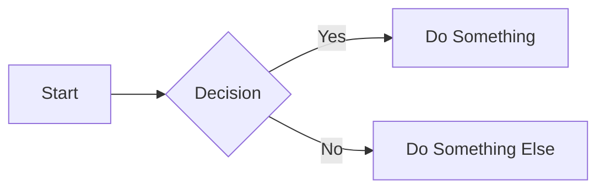

# Python MkDocs Documentation Template

Complete documentation environment with MkDocs, Material theme, and modern documentation tools.

## What's Included

### Base Image
- **Microsoft DevContainer**: `python:1-3.12-bookworm`
- Python 3.12
- pip package manager

### Features (from containers.dev)
- **Git**: Latest version
- **GitHub CLI**: gh command-line tool

### Pre-installed Packages
**MkDocs Core:**
- mkdocs - Static site generator
- mkdocs-material - Modern Material Design theme
- pymdown-extensions - Markdown extensions

**Plugins:**
- mkdocs-minify-plugin - Minify HTML/CSS/JS
- mkdocs-redirects - URL redirects
- mkdocs-git-revision-date-localized-plugin - Show last update dates
- mkdocs-awesome-pages-plugin - Better page organization
- mkdocs-macros-plugin - Jinja2 macros in markdown
- mkdocs-mermaid2-plugin - Diagram support

**Tools:**
- Pygments - Syntax highlighting

### VS Code Extensions
- **Python**: Full Python support
- **Markdown All in One**: Markdown editing tools
- **Markdown Lint**: Markdown linter
- **Markdown Mermaid**: Diagram preview
- **Markdown Preview Enhanced**: Advanced preview
- **YAML**: mkdocs.yml editing

### Ports
- `8000` - MkDocs development server

## Usage

### Copy to Your Project
```bash
cp -r templates/python-mkdocs/.devcontainer /path/to/your/project/
```

### Create New Documentation Site

```bash
# Initialize new MkDocs project
mkdocs new .

# Start development server
mkdocs serve
```

Open http://localhost:8000 to view your documentation.

### Open in VS Code
1. Open your project in VS Code
2. Click "Reopen in Container" when prompted
3. Documentation server starts automatically with live reload

## Project Structure

After running `mkdocs new .`:
```
my-docs/
├── docs/
│   └── index.md          # Homepage
├── mkdocs.yml            # Configuration
└── .devcontainer/        # Dev container config
```

Expanded structure:
```
my-docs/
├── docs/
│   ├── index.md
│   ├── getting-started/
│   │   ├── installation.md
│   │   └── quickstart.md
│   ├── user-guide/
│   │   ├── features.md
│   │   └── configuration.md
│   ├── api/
│   │   └── reference.md
│   └── assets/
│       ├── images/
│       └── stylesheets/
└── mkdocs.yml
```

## Configuration

### Basic `mkdocs.yml`
```yaml
site_name: My Documentation
site_url: https://example.com
nav:
  - Home: index.md
  - Getting Started:
    - Installation: getting-started/installation.md
    - Quickstart: getting-started/quickstart.md
  - User Guide:
    - Features: user-guide/features.md
  - API Reference: api/reference.md
theme:
  name: material
```

### Material Theme Configuration
```yaml
theme:
  name: material
  palette:
    # Light mode
    - scheme: default
      primary: indigo
      accent: indigo
      toggle:
        icon: material/brightness-7
        name: Switch to dark mode
    # Dark mode
    - scheme: slate
      primary: indigo
      accent: indigo
      toggle:
        icon: material/brightness-4
        name: Switch to light mode
  features:
    - navigation.tabs
    - navigation.sections
    - navigation.expand
    - navigation.top
    - search.suggest
    - search.highlight
    - content.code.copy
```

### Plugins Configuration
```yaml
plugins:
  - search
  - minify:
      minify_html: true
  - git-revision-date-localized:
      enable_creation_date: true
  - awesome-pages
  - macros
  - mermaid2
```

## Markdown Features

### Code Blocks with Syntax Highlighting
````markdown
```python
def hello_world():
    print("Hello, World!")
```
````

### Admonitions (Callouts)
```markdown
!!! note "Optional Title"
    This is a note admonition.

!!! warning
    This is a warning.

!!! tip "Pro Tip"
    This is a helpful tip.
```

### Tabs
```markdown
=== "Python"
    ```python
    print("Hello")
    ```

=== "JavaScript"
    ```javascript
    console.log("Hello");
    ```
```

### Mermaid Diagrams
````markdown

````

### Tables
```markdown
| Feature | Supported |
|---------|-----------|
| Tables  | ✅        |
| Images  | ✅        |
| Code    | ✅        |
```

### Task Lists
```markdown
- [x] Write documentation
- [x] Add examples
- [ ] Deploy to production
```

## Common Workflows

### Live Development
```bash
# Start server with live reload
mkdocs serve

# Serve on specific port
mkdocs serve --dev-addr=0.0.0.0:8080
```

Any changes to markdown files are instantly reflected in the browser.

### Building Site
```bash
# Build static site to site/ directory
mkdocs build

# Build with verbose output
mkdocs build --verbose

# Clean build
mkdocs build --clean
```

### Deploying to GitHub Pages
```bash
# Deploy to gh-pages branch
mkdocs gh-deploy

# With custom commit message
mkdocs gh-deploy --message "Update documentation"
```

### Adding New Pages
1. Create markdown file in `docs/`
2. Add to `mkdocs.yml` navigation
3. Content appears automatically

## Customization

### Custom CSS
Create `docs/assets/stylesheets/extra.css`:
```css
:root {
  --md-primary-fg-color: #ff6347;
}
```

Reference in `mkdocs.yml`:
```yaml
extra_css:
  - assets/stylesheets/extra.css
```

### Custom JavaScript
Create `docs/assets/javascripts/extra.js` and reference:
```yaml
extra_javascript:
  - assets/javascripts/extra.js
```

### Macros and Variables
In `mkdocs.yml`:
```yaml
extra:
  version: 2.0.0
  company: My Company
```

In markdown:
```markdown
Current version: {{ version }}
Copyright © {{ company }}
```

## Themes

### Material Theme (Pre-installed)
Modern, responsive, feature-rich theme.

### Other Themes
```bash
pip install mkdocs-bootswatch
```

```yaml
theme:
  name: flatly
```

## Advanced Features

### Search
Built-in search with Material theme:
```yaml
plugins:
  - search:
      lang: en
      separator: '[\s\-\.]+'
```

### Social Cards
Generate preview images:
```yaml
plugins:
  - social:
      cards_layout_options:
        background_color: "#4051b5"
```

### Blog Support
```bash
pip install mkdocs-blog-plugin
```

```yaml
plugins:
  - blog:
      blog_dir: blog
```

### Multi-language
```yaml
plugins:
  - i18n:
      default_language: en
      languages:
        en: English
        es: Español
```

## Best Practices

### Documentation Structure
- **index.md**: Overview and getting started
- **getting-started/**: Installation and quick start
- **user-guide/**: Detailed feature documentation
- **api/**: API reference
- **tutorials/**: Step-by-step guides
- **faq.md**: Frequently asked questions

### Writing Style
- Use clear, concise language
- Include code examples
- Add screenshots/diagrams
- Use admonitions for important info
- Keep URLs stable (use redirects)

### SEO
```yaml
site_description: A detailed description
site_author: Your Name
copyright: Copyright © 2024 Your Name

extra:
  social:
    - icon: fontawesome/brands/github
      link: https://github.com/yourname
    - icon: fontawesome/brands/twitter
      link: https://twitter.com/yourname
```

## Deployment Options

### GitHub Pages
```bash
mkdocs gh-deploy
```

### Netlify
Add `netlify.toml`:
```toml
[build]
  command = "mkdocs build"
  publish = "site"
```

### Read the Docs
Add `.readthedocs.yml`:
```yaml
version: 2
mkdocs:
  configuration: mkdocs.yml
python:
  version: 3.12
  install:
    - requirements: requirements.txt
```

### Docker
```dockerfile
FROM python:3.12-slim
WORKDIR /docs
COPY requirements.txt .
RUN pip install -r requirements.txt
COPY . .
RUN mkdocs build
CMD ["python", "-m", "http.server", "8000", "--directory", "site"]
```

## Tips

### Preview on Mobile
```bash
mkdocs serve --dev-addr=0.0.0.0:8000
```
Access from phone on same network.

### Generate requirements.txt
```bash
pip freeze > requirements.txt
```

### Link Checking
```bash
pip install mkdocs-linkcheck
```

```yaml
plugins:
  - linkcheck
```

## Troubleshooting

### Port Already in Use
```bash
mkdocs serve --dev-addr=0.0.0.0:8001
```

### Build Errors
Check mkdocs.yml syntax:
```bash
mkdocs build --verbose
```

### Missing Dependencies
```bash
pip install -r requirements.txt --force-reinstall
```

## Resources

- [MkDocs Documentation](https://www.mkdocs.org/)
- [Material for MkDocs](https://squidfunk.github.io/mkdocs-material/)
- [PyMdown Extensions](https://facelessuser.github.io/pymdown-extensions/)
- [MkDocs Plugins](https://github.com/mkdocs/mkdocs/wiki/MkDocs-Plugins)
